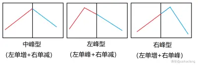

# 线段树进阶

[TOC]

**未更新完**!!!!!!

**线段树板子:**

```c++
#define lc u<<1
#define rc u<<1|1
const int N = 200005;
struct tree{
	int l,r,su,tag;
}tr[N << 2];
void push_up(tree &u,tree l,tree r){
}
void build(int u,int l,int r){
	tr[u] = {l,r,a[l],0};
	if(l==r) return;
	int mid = l+r>>1;
	build(lc,l,mid);
	build(rc,mid+1,r);
	push_up(tr[u],tr[lc],tr[rc]);
}
void calc(int u,int op){
	tree& t = tr[u];
	if(op==1){
        
	}else{
        
	}
}
void push_down(int u){
	if(tr[u].tag == ?) calc(lc,?),calc(rc,?);
	if(tr[u].tag == ?) calc(lc,?),calc(rc,?);
    
	tr[u].tag = 0;
}
void update(int u,int l,int r,int op){
	if(tr[u].l > r || tr[u].r < l) return;
	if(tr[u].l >= l && tr[u].r <= r){
		calc(u,op);
		return;
	}
	push_down(u);
    if(l > tr[lc].r){
		update(rc,l,r,op); 
		push_up(tr[u],tr[lc],tr[rc]);
		return;
	}
	if(r < tr[rc].l){
		update(lc,l,r,op); 
		push_up(tr[u],tr[lc],tr[rc]);
		return;
	}
	update(lc,l,r,op);
	update(rc,l,r,op);
	push_up(tr[u],tr[lc],tr[rc]);
}
//合并查询
T quary(int u,int l,int r){
	if(tr[u].l > r || tr[u].r < l) return {} ;
	if(tr[u].l >= l && tr[u].r <= r){
		return tr[u];
	}
	push_down(u);
	if(l > tr[lc].r) return quary(rc,l,r); //在右半部分
	if(r < tr[rc].l) return quary(lc,l,r); //在左半部分
	T t;
	push_up(t,quary(lc,l,r),quary(rc,l,r));//两个部分各占一点
	return t;
}
```


## 线段树+贪心/线段树+排序

### 例题:

#### 1.洛谷P1607 Fair Shuttle G

**链接:**

[P1607 [USACO09FEB\] Fair Shuttle G - 洛谷 | 计算机科学教育新生态 (luogu.com.cn)](https://www.luogu.com.cn/problem/P1607)

**思路:**

线段覆盖贪心问题,观察对比发现按 r时间顺序排序得到的答案明显更大,维护区间最大值即可,注意要做修改操作,因为中途奶牛上车会影响最大值

**代码:**

```c++
#define lc u<<1
#define rc u<<1|1
const int N = 20005;
struct node
{
	int l,r,w;
	bool operator<(const node &n1)const{
		return r < n1.r;
	}; 
};
struct tree{
	int l,r,mx,add;
}tr[N << 2];
void push_up(int u){
	tr[u].mx = max(tr[lc].mx,tr[rc].mx);
}
void push_down(int u){
	tr[lc].add += tr[u].add;
	tr[rc].add += tr[u].add;
	tr[lc].mx += tr[u].add;
	tr[rc].mx += tr[u].add;
	tr[u].add = 0;
}
void build(int u,int l,int r){
	tr[u] = {l,r,0,0};
	if(l==r) return;
	int mid = l + r >> 1;
	build(lc,l,mid);
	build(rc,mid + 1,r);
}
void update(int u,int l,int r,int v){
	if(tr[u].l > r || tr[u].r < l) return;
	if(tr[u].l >= l && tr[u].r <= r){
		tr[u].mx += v;
		tr[u].add += v;
		return;
	}
	push_down(u);
	update(lc,l,r,v);
	update(rc,l,r,v);
	push_up(u);
}
int quary(int u,int l,int r){
	if(tr[u].l > r || tr[u].r < l) return 0;
	if(tr[u].l >= l && tr[u].r <= r){
		return tr[u].mx;
	}
	push_down(u);
	return max(quary(lc,l,r),quary(rc,l,r));
}
int n,m,c;
vector<node> a;
void solve(){
	cin >> n >> m >> c;
	build(1,1,m + 1);
	for(int i = 1;i<=n;i++){
		int l,r,w;
		cin >> l >> r >> w;
		a.push_back({l,r,w});
	}
	sort(a.begin(),a.end());

	int ans = 0;
	for(int i = 0;i < n;i++){
		int l = a[i].l, r= a[i].r, w = a[i].w; 
		int mx = quary(1,l,r - 1);
		int on = min(c - mx,w);
		ans+=on;
		update(1,l,r - 1,on);
	}
	cout << ans << endl;
}
```

#### 2.洛谷P1937 Barn Allocation G

**链接:**

[P1937 [USACO10MAR\] Barn Allocation G - 洛谷 | 计算机科学教育新生态 (luogu.com.cn)](https://www.luogu.com.cn/problem/P1937)

**思路:**

线段覆盖贪心问题,观察对比发现按 r时间顺序排序得到的答案明显更优,对开始的数组建立线段树,表示当前各个区间的容量最小值,判断1头牛能否加入一个区间,加入则ans++,同时更新区间将区间容量-1;

**代码:**

```c++
#define lc u<<1
#define rc u<<1|1
const int N = 100005;
int a[N];
struct node{
	int l,r;
	bool operator<(const node & n1) const{
		return r < n1.r;
	}
};
struct tree{
	int l,r,mi,add;
}tr[N << 2];
void push_up(int u){
	tr[u].mi = min(tr[lc].mi,tr[rc].mi);
}
void push_down(int u){
	tr[lc].add += tr[u].add;
	tr[rc].add += tr[u].add;
	tr[lc].mi -= tr[u].add;
	tr[rc].mi -= tr[u].add;
	tr[u].add = 0;
}
void build(int u,int l,int r){
	tr[u] = {l,r,0x3f3f3f3f,0};
	if(l==r){
		tr[u] = {l,r,a[l],0};
		return; 
	}
	int mid = l + r >> 1;
	build(lc,l,mid);
	build(rc,mid + 1,r);
	push_up(u);
}
void update(int u,int l,int r,int v){
	if(tr[u].l > r || tr[u].r < l) return;
	if(tr[u].l >= l && tr[u].r <= r){
		tr[u].mi -= v;
		tr[u].add += v;
		return;
	}
	push_down(u);
	update(lc,l,r,v);
	update(rc,l,r,v);
	push_up(u);
}
int quary(int u,int l,int r){
	if(tr[u].l > r || tr[u].r < l) return 0x3f3f3f3f;
	if(tr[u].l >= l && tr[u].r <= r){
		return tr[u].mi;
	}
	push_down(u);
	return min(quary(lc,l,r),quary(rc,l,r));
}
int n,m;
void solve(){
	cin >> n >> m;
	for(int i = 1;i <= n;i++){
		cin >> a[i];
	}
	build(1,1,n);
	vector<node> a;
	for(int i = 1;i<=m;i++){
		int l,r;
		cin >>l >> r;
		a.push_back({l,r});
	}
	sort(a.begin(),a.end());
	int ans = 0;
	for(int i = 0; i < m;i++){
		int l = a[i].l, r = a[i].r;
		int mi = quary(1,l,r);
		if(mi <= 0){
			continue;
		}
		ans++;
		update(1,l,r,1);
	}
	cout << ans << endl;
}
```

#### 3.洛谷P1972 HH的项链

**链接:**

[P1972 [SDOI2009\] HH的项链 - 洛谷 | 计算机科学教育新生态 (luogu.com.cn)](https://www.luogu.com.cn/problem/P1972)

**思路:**

我们将在线询问改为离线,然后对r进行排序,然后顺序遍历数组,如果碰到之前出现过的数,把之前出现的最后一次的下标,单点修改-1,把当前下标+1,对每个r开个桶,然后线段树统计答案即可

**代码:**

```c++
#define lc u<<1
#define rc u<<1|1
const int N = 1000005;
struct node{
	int l,r,id;
	bool operator<(const node & n1) const{
		return r  < n1.r;
	}
};
struct tree{
	int l,r,su;
}tr[N << 2];
void push_up(int u){
	tr[u].su = tr[lc].su+tr[rc].su;
}
void build(int u,int l,int r){
	tr[u] = {l,r,0};
	if(l==r) return;
	int mid = l + r >> 1;
	build(lc,l,mid);
	build(rc,mid + 1,r);
}
void update(int u,int x,int v){
	if(tr[u].l > x || tr[u].r < x) return;
	if(tr[u].l == x && tr[u].r == x){
		tr[u].su += v;
		return;
	}
	update(lc,x,v);
	update(rc,x,v);
	push_up(u);
}
int quary(int u,int l,int r){
	if(tr[u].l > r || tr[u].r < l) return 0;
	if(tr[u].l >= l && tr[u].r <= r){
		return tr[u].su;
	}
	return quary(lc,l,r) + quary(rc,l,r);
}
int n,m;
int a[N],last[N],ans[N];
vector<node> v[N];
vector<node> qs;
void solve(){
	cin >> n;
	build(1,1,n);
	for(int i = 1;i<=n;i++){
		cin >> a[i];
	}
	cin >> m;
	for(int i = 1; i <= m;i++){
		int l,r;
		cin >> l >> r;
		v[r].push_back({l,r,i});
		sort(v[r].begin(),v[r].end());
	}
	for(int i = 1;i<=n;i++){
		if(last[a[i]]){
			update(1,last[a[i]],-1);
		}
		last[a[i]] = i;
		update(1,i,1);
		for(auto &p:v[i]){
			ans[p.id] = quary(1,p.l,p.r);
		}
	}
	for(int i =1;i<=m;i++){
		cout << ans[i] << endl;
	}
}
```


## 线段树+双指针

### 例题:

#### 1.洛谷P1712 区间

**链接:**

[P1712 [NOI2016\] 区间 - 洛谷 | 计算机科学教育新生态 (luogu.com.cn)](https://www.luogu.com.cn/problem/P1712)https://www.luogu.com.cn/problem/P1937)

**思路:**

对每个区间记录下来并且按区间长度排序,进行同向双指针,看数组区间内是否有一段长度(即最大长度,超过m,有就右指针不动,左指针不断右移,不断更新答案最小值)

**代码:**

```c++
#define lc u<<1
#define rc u<<1|1
const int N = 500005;
struct node{
	int l,r,len;
	bool operator<(const node & n1) const{
		return len  < n1.len;
	}
};
struct tree{
	int l,r,ma,add;
}tr[N*2 << 2];
void push_up(int u){
	tr[u].ma = max(tr[lc].ma,tr[rc].ma);
}
void push_down(int u){
	tr[lc].add += tr[u].add;
	tr[rc].add += tr[u].add;
	tr[lc].ma += tr[u].add;
	tr[rc].ma += tr[u].add;
	tr[u].add = 0;
}
void build(int u,int l,int r){
	tr[u] = {l,r,0,0};
	if(l==r) return;
	int mid = l + r >> 1;
	build(lc,l,mid);
	build(rc,mid + 1,r);
	push_up(u);
}
void update(int u,int l,int r,int v){
	if(tr[u].l > r || tr[u].r < l) return;
	if(tr[u].l >= l && tr[u].r <= r){
		tr[u].ma += v;
		tr[u].add += v;
		return;
	}
	push_down(u);
	update(lc,l,r,v);
	update(rc,l,r,v);
	push_up(u);
}
int quary(int u,int l,int r){
	if(tr[u].l > r || tr[u].r < l) return 0;
	if(tr[u].l >= l && tr[u].r <= r){
		return tr[u].ma;
	}
	push_down(u);
	return max(quary(lc,l,r),quary(rc,l,r));
}
int n,m;
void solve(){
	cin >> n >> m;
	vector<node> a;
	vector<int> v;
	for(int i = 1;i<=n;i++){
		int l,r;
		cin >>l >> r;
		a.push_back({l,r,r-l});
		v.push_back(l);
		v.push_back(r);
	}
	sort(v.begin(),v.end());
	v.erase(unique(v.begin(),v.end()),v.end());
	int sz = v.size();
	sort(a.begin(),a.end());
	build(1,1,2*n);
	for(int i = 0;i < n;i++){
		a[i].l = lower_bound(v.begin(),v.end(),a[i].l) - v.begin() + 1;
		a[i].r = lower_bound(v.begin(),v.end(),a[i].r) - v.begin() + 1;
	}
	
	int j = 0;
	int ans = 0x3f3f3f3f;
	for(int i = 0;i < n;i++){
		int l = a[i].l,r = a[i].r;
		update(1,l,r,1);
		while(j <= i && tr[1].ma == m){
			update(1,a[j].l,a[j].r,-1);
			ans=min(ans,a[i].len - a[j].len);
			j++;
		}
	}
	if(ans==0x3f3f3f3f){
		cout << -1 <<endl;
		return;
	}
	cout << ans << endl;
}
```

## 线段树+多个标记维护

### 例题:

#### 1.洛谷P2572 序列操作

**链接:**

[P2572 [SCOI2010\] 序列操作 - 洛谷 | 计算机科学教育新生态 (luogu.com.cn)](https://www.luogu.com.cn/problem/P2572)

**思路:**

维护2个懒标记,和多个普通标记,不只是要加入1的连续,还要加入0的连续,方便反转后的更改

考虑更新lazy,优先级肯定是覆盖操作大,然后才是反转

**代码:**

```c++
#define lc u<<1
#define rc u<<1|1
int a[N];
struct tree{
	int l,r;
	int s0,l0,r0,m0; //0的个数,左最长,右最长,总最长
	int s1,l1,r1,m1; //1的个数,左最长,右最长,总最长
	int len;
	int rev,tag; //rev 0/1是否取反, tag -1无标记/ 0全部为0 / 1全部为1
}tr[N<<2];
void push_up(tree& t,tree p1,tree p2){
	t.s0 = p1.s0 + p2.s0;
	t.l0 = p1.s1 ? p1.l0 : p1.s0 + p2.l0;
	t.r0 = p2.s1 ? p2.r0 : p2.s0 + p1.r0;
	t.m0 = max(p1.r0 + p2.l0,max(p1.m0,p2.m0));

	t.s1 = p1.s1 + p2.s1;
	t.l1 = p1.s0 ? p1.l1 : p1.s1 + p2.l1;
	t.r1 = p2.s0 ? p2.r1 : p2.s1 + p1.r1;
	t.m1 = max(p1.r1 + p2.l1,max(p1.m1,p2.m1));
}
void calc(int u,int op){
	tree& t = tr[u]; 
	if(op==0){
		t.s0 = t.l0 = t.r0 = t.m0 = t.len;
		t.s1 = t.l1 = t.r1 = t.m1 = 0;
		t.tag=0;
		t.rev=0;
	}
	if(op==1){
		t.s0 = t.l0 = t.r0 = t.m0 = 0;
		t.s1 = t.l1 = t.r1 = t.m1 = t.len;
		t.tag=1;
		t.rev=0;
	}
	if(op==2){
		swap(t.s0,t.s1);
		swap(t.l0,t.l1);
		swap(t.r0,t.r1);
		swap(t.m0,t.m1);
		t.rev^=1;
	}
}
void push_down(int u){
	tree& t = tr[u];
	if(t.tag==0) calc(lc,0),calc(rc,0);
	if(t.tag==1) calc(lc,1),calc(rc,1);
	if(t.rev)	calc(lc,2),calc(rc,2);
	t.tag = -1; t.rev = 0;
}
void build(int u,int l,int r){
	int t = a[l];
	//如果是t=0 t^1 = 1; 0 的个数 正好是1,1的个数正好是0,反之也合理
	tr[u] = {l,r,t^1,t^1,t^1,t^1,t,t,t,t,r-l+1,0,-1};
	if(l==r) return;
	int mid = l+r>>1;
	build(lc,l,mid);
	build(rc,mid+1,r);
	push_up(tr[u],tr[lc],tr[rc]);
}
void update(int u,int l,int r,int op){
	if(tr[u].l > r || tr[u].r < l) return;
	if(tr[u].l >= l && tr[u].r <= r){
		calc(u,op);
		return;
	}
	push_down(u);
	update(lc,l,r,op);
	update(rc,l,r,op);
	push_up(tr[u],tr[lc],tr[rc]);
}
tree qy(int u,int l,int r){
	if(tr[u].l > r || tr[u].r < l) return { };
	if(tr[u].l >= l && tr[u].r <= r){
		return tr[u];
	}
	push_down(u);
	tree ne;
	push_up(ne,qy(lc,l,r),qy(rc,l,r));
	return ne;
}
void solve(){
	int n,m;
	cin >> n >> m;
	for(int i = 1;i<=n;i++) cin >>a[i];
	build(1,1,n);
	for(int i = 1;i<=m;i++){
		int op,l,r;
		cin >> op>>l>>r;
		++l,++r;
		if(op<3){
			update(1,l,r,op);
		}else if(op==3){
			tree ne = qy(1,l,r);
			printf("%d\n",ne.s1); 
		}else if(op==4){
			tree ne = qy(1,l,r);
			printf("%d\n",ne.m1); 
		}
	}
}
```

#### 2.区间gcd  + 区间加操作

其实也不是多个标记,这题的思想是对差分数组维护,对一个区间的差分数组进行区间加就是对两个端点操作进行单点修改,最后返回一个差分数组的gcd就是原数组的gcd   

```c++
#include<bits/stdc++.h>
#define ll long long
using namespace std;
const int N = 500006;
int n, m;
ll a[N], b[N], c[N];
struct T {
	int l, r;
	ll ans;
} t[N*4];
 
ll gcd(ll x, ll y) {
	return y ? gcd(y, x % y) : x;
}
 
void build(int p, int l, int r) {
	t[p].l = l;
	t[p].r = r;
	if (l == r) {
		t[p].ans = b[l];
		return;
	}
	int mid = (l + r) >> 1;
	build(p << 1, l, mid);
	build(p << 1 | 1, mid + 1, r);
	t[p].ans = gcd(t[p<<1].ans, t[p<<1|1].ans);
}
 
void change_add(int p, int x, ll v) {
	if (t[p].l == t[p].r) {
		t[p].ans += v;
		return;
	}
	int mid = (t[p].l + t[p].r) >> 1;
	if (x <= mid) change_add(p << 1, x, v);
	else change_add(p << 1 | 1, x, v);
	t[p].ans = gcd(t[p<<1].ans, t[p<<1|1].ans);
}
 
ll ask_t(int p, int l, int r) {
	if (l <= t[p].l && r >= t[p].r) return t[p].ans;
	int mid = (t[p].l + t[p].r) >> 1;
	ll ans = 0;
	if (l <= mid) ans = gcd(ans, ask_t(p << 1, l, r));
	if (r > mid) ans = gcd(ans, ask_t(p << 1 | 1, l, r));
	return abs(ans);
}
 
void add(int x, ll y) {
	while (x <= n) {
		c[x] += y;
		x += x & -x;
	}
}
 
ll ask_c(int x) {
	ll ans = 0;
	while (x) {
		ans += c[x];
		x -= x & -x;
	}
	return ans;
}
 
/// 树状数组 区间修改单点查询->单点修改区间查询
int main() {
	cin >> n >> m;
	b[0] = 0;
	memset(c, 0, sizeof(c));
	for (int i = 1; i <= n; i++) {
		cin >> a[i];
		b[i] = a[i] - a[i-1];
	}
	build(1, 1, n);
	while (m--) {
		char ch;
		cin >> ch;
		int l, r;
		cin >> l >> r;
		if (ch == 'C') {
			ll d;
			cin >> d;
			change_add(1, l, d);
			add(l, d);
			if (r + 1 <= n) {
				change_add(1, r + 1, -d);
				add(r + 1, -d);
			}
		} else cout << gcd(a[l] + ask_c(l), ask_t(1, l + 1, r)) << endl;
	}
	return 0;
}
```


## 线段树+二分

### 例题:

#### 1.洛谷P4344 脑洞治疗仪

**链接:**

[P4344 [SHOI2015\] 脑洞治疗仪 - 洛谷 | 计算机科学教育新生态 (luogu.com.cn)](https://www.luogu.com.cn/problem/P4344)

**思路:**

我们维护最长连续0长度,维护1的个数,然后对于前面要填充的区域,我们二分出一个最小合法区域$[l,x](x为我们二分的右边界)$在最后quary求长度合并时注意代码细节,有注释;

**代码:**

```c++
#define lc u<<1
#define rc u<<1|1
int n,m;
struct tree{
	int l,r,len,s1,l1,r1,m1,tag;
}tr[N<<2];
void push_up(tree &u,tree l,tree r){
	u.s1 = l.s1+r.s1;
	u.l1 = l.s1  ? l.l1 :l.len+r.l1 ;
	u.r1 = r.s1  ? r.r1 :l.r1+r.len ;
	u.m1 = max(max(l.m1,r.m1),l.r1+r.l1);
}
void build(int u,int l,int r){
	tr[u] = {l,r,r-l+1,1,0,0,0,-1};
	if(l==r) return;
	int mid = l+r>>1;
	build(lc,l,mid);
	build(rc,mid+1,r);
	push_up(tr[u],tr[lc],tr[rc]);
}
void calc(int u,int op){
	tree& t = tr[u];
	if(op==1){
		t.s1 = t.len;
		t.l1 = t.r1 = t.m1 = 0;
		t.tag = 1;
	}else{
		t.s1 = 0;
		t.l1 = t.r1 = t.m1 = t.len;
		t.tag = 0;
	}
}
void push_down(int u){
	if(tr[u].tag == 1) calc(lc,1),calc(rc,1);
	if(tr[u].tag == 0) calc(lc,0),calc(rc,0);
	tr[u].tag = -1;
}
//只有两种操作,一种置0,一直置1
void update(int u,int l,int r,int op){
	if(tr[u].l > r || tr[u].r < l) return;
	if(tr[u].l >= l && tr[u].r <= r){
		calc(u,op);
		return;
	}
	push_down(u);
	update(lc,l,r,op);
	update(rc,l,r,op);
	push_up(tr[u],tr[lc],tr[rc]);
}
int q1(int u,int l,int r){
	if(tr[u].l > r || tr[u].r < l) return 0;
	if(tr[u].l >= l && tr[u].r <= r){
		return tr[u].s1;
	}
	push_down(u);
	return q1(lc,l,r)+q1(rc,l,r);
}
int q0(int u,int l,int r){
	if(tr[u].l > r || tr[u].r < l) return 0;
	if(tr[u].l >= l && tr[u].r <= r){
		return tr[u].len - tr[u].s1;
	}
	push_down(u);
	return q0(lc,l,r)+q0(rc,l,r);
}
void work(int l0,int r0,int l1,int r1){
	int x = q1(1,l0,r0);
	update(1,l0,r0,0);
	if(x==0) return;
	int l = l1,r = r1,ans = -1;
	while(l<=r){
		int mid = l+r>>1;
		if(q0(1,l1,mid) <= x){
			l = mid + 1;
			ans = mid;
		}else{
			r = mid - 1;
		}
	}
	if(ans==-1) return;
	update(1,l1,ans,1);
}
tree quary(int u,int l,int r){
	if(tr[u].l > r || tr[u].r < l) return { } ;
	if(tr[u].l >= l && tr[u].r <= r){
		return tr[u];
	}
	push_down(u);
	if(l > tr[lc].r) return quary(rc,l,r); //在右半部分
	if(r < tr[rc].l) return quary(lc,l,r); //在左半部分
	tree t;
	push_up(t,quary(lc,l,r),quary(rc,l,r));//两个部分各占一点
	return t;
}
void solve(){
	cin >> n >> m;
	build(1,1,n);
	while(m--){
		int op,l,r;
		cin >> op >> l >> r;
		if(op==0) update(1,l,r,0);
		if(op==1){
			int l1,r1;
			cin>>l1>>r1;
			work(l,r,l1,r1);
		}
		if(op==2){
			cout << quary(1,l,r).m1 << endl;
		}
	}
}
```

#### 2.洛谷P2824 排序

**链接:**

[P2824 [HEOI2016/TJOI2016\] 排序 - 洛谷 | 计算机科学教育新生态 (luogu.com.cn)](https://www.luogu.com.cn/problem/P2824)

**思路:**

因为是排列,我们想到二分答案,对于一个假定答案x设置>=x的数等于1,小于等于x的数为0,那么构造线段树,可以极快的解决排序,问题然后每次check出来题目要求的idx位置是1那么就左指针右移,为什么?因为x能满足,那么1~x-1都能满足,所以我们区间要去 x+1~r中试图寻找答案

**代码:**

```c++
#define lc u<<1
#define rc u<<1|1
int n,m;
struct qs{
	int op,l,r;
}q[N];
//我们二分一个数字,看操作完是否idx这个位置=1;
int a[N];
struct tree{
	int l,r,su,len,tag;
}tr[N<<2];
void push_up(int u){
	tr[u].su = tr[lc].su + tr[rc].su;
}
void build(int u,int l,int r,int x){
	tr[u] = {l,r,(a[l]>=x),r-l+1,-1};
	if(l==r)return;
	int mid = (l + r) >>1;
	build(lc,l,mid,x);
	build(rc,mid+1,r,x);
	push_up(u);
}
void calc(int u,int op){
	if(op==0){
		tr[u].su = 0;
	}else{
		tr[u].su = tr[u].len;
	}
	tr[u].tag = op;
}
void push_down(int u){
	if(tr[u].tag==0) calc(lc,0),calc(rc,0);
	if(tr[u].tag==1) calc(lc,1),calc(rc,1);
	tr[u].tag = -1;
}
void update(int u,int l,int r,int op){
	if(tr[u].l > r || tr[u].r < l) return;
	if(tr[u].l >= l && tr[u].r <= r){
		calc(u,op);
		return;
	}
	push_down(u);
	update(lc,l,r,op);
	update(rc,l,r,op);
	push_up(u);
}
int q1(int u,int l,int r){
	if(tr[u].l > r || tr[u].r < l) return 0;
	if(tr[u].l>=l&&tr[u].r<=r){
		return tr[u].su;
	}
	push_down(u);
	return q1(lc,l,r) + q1(rc,l,r);
}

int idx;
bool check(int x){
	build(1,1,n,x);
	for(int i = 1;i <= m;i++){
		int op = q[i].op,l = q[i].l,r = q[i].r;
		if(op==1){
			int cnt = r - l + 1;
			int su = q1(1,l,r);
			update(1,l,l + su - 1,1);
			update(1,l + su,r,0);
		}else{
			int cnt = r - l + 1;
			int su = q1(1,l,r);
			update(1,l,r - su,0);
			update(1,r - su + 1,r,1);
		}
	}
	return q1(1,idx,idx)==1;
}
void work(){
	int l = 1,r = n,ans = -1;
	while(l<=r){
		int mid = l + r >> 1;
		if(check(mid)){
			l = mid + 1;
			ans = mid;
		}else{
			r = mid - 1;
		}
	}
	cout << ans << endl;
}
void solve(){
	cin >> n >> m;
	for(int i =1;i<=n;i++) cin >> a[i];
	for(int i = 1;i<=m;i++){
		cin >> q[i].op >> q[i].l >> q[i].r; 
	}
	cin >> idx;
	work();
}
```

## 线段树+数学

### 例题:

#### 1.洛谷P5142 方差

**链接:**

[P5142 区间方差 - 洛谷 | 计算机科学教育新生态 (luogu.com.cn)](https://www.luogu.com.cn/problem/P5142)https://www.luogu.com.cn/problem/P4344)

**思路:**

题意:要求一个区间的方差$\frac{1}{n}\sum_{i=1}^n(a_i - a)^2$ 其中a为区间平均值$a = \frac{1}{n}\sum_{i=1}^{n}a_i$
我们将公式化简 为了方便观看,我们将区间平均值设置为$b$ 
$d = \frac{1}{n}\sum_{i = 1}^n(a_i - b)^2$
   $=\frac{1}{n}\sum_{i = 1}^n(a_i^2 - 2a_ib + b^2)$
   $=\frac{1}{n}(\sum_{i = 1}^na_i^2 - \sum_{i = 1}^n2a_ib +\sum_{i = 1}^n b^2)$
   $=\frac{1}{n}(\sum_{i = 1}^na_i^2 - 2b\sum_{i = 1}^na_i +n b^2)$
   $=\frac{1}{n}(\sum_{i = 1}^na_i^2 - 2bnb +nb^2)$
   $=\frac{1}{n}(\sum_{i = 1}^na_i^2 - 2nb^2 +nb^2)$
   $=\frac{1}{n}(\sum_{i = 1}^na_i^2 - nb^2)$
   $=\frac{1}{n}\sum_{i = 1}^na_i^2 - b^2$

线段树维护区间和和区间平方和即可

**代码:**

```c++
#define lc u<<1
#define rc u<<1|1
const int N = 200005;
const int MOD = 1e9+7;
int n,m;
int b[N];
struct tree{
	int l,r,s1,s2;
}tr[N<<2];
void push_up(int u){
	tr[u].s1 = (tr[lc].s1 + tr[rc].s1)%MOD;
	tr[u].s2 = (tr[lc].s2 + tr[rc].s2)%MOD;
}
void build(int u,int l,int r){
	tr[u] = {l,r,b[l],b[l]*b[l]%MOD};
	if(l==r) return;
	int mid = l+r>>1;
	build(lc,l,mid);
	build(rc,mid+1,r);
	push_up(u);
}
void update(int u,int x,int v){
	if(tr[u].l > x || tr[u].r < x) return;
	if(tr[u].l==x&&tr[u].r==x){
		tr[u].s1 = v;
		tr[u].s2 = (v*v)%MOD;
		return;
	}
	update(lc,x,v);
	update(rc,x,v);
	push_up(u);
}
int q1(int u,int l,int r){
	if(tr[u].l > r || tr[u].r < l) return 0;
	if(tr[u].l>=l&&tr[u].r<=r){
		return tr[u].s1;
	}
	return (q1(lc,l,r) + q1(rc,l,r))%MOD;
}
int q2(int u,int l,int r){
	if(tr[u].l > r || tr[u].r < l) return 0;
	if(tr[u].l>=l&&tr[u].r<=r){
		return tr[u].s2;
	}
	return (q2(lc,l,r) + q2(rc,l,r))%MOD;
}
int ksm(int x,int n){
	int res = 1;
	while(n){
		if(n&1) res = res * x % MOD;
		x = x*x%MOD;
		n>>=1;
	}
	return res;
}
void solve(){
	cin >> n >> m;
	for(int i = 1;i<=n;i++) cin >> b[i];
	build(1,1,n);
	while(m--){
		int op,l,r;
		cin >> op >> l >> r;
		if(op==1){
			update(1,l,r);
		}else{
			int s1 = q1(1,l,r);
			int s2 = q2(1,l,r);
			int len = r-l+1;
			int iv = ksm(len,MOD-2)%MOD;
			s2 = s2*iv%MOD;
			s1 = s1*iv%MOD;
			s1 = (s1*s1)%MOD;
			int res = ((s2 - s1)%MOD + MOD)%MOD;
			cout << res <<endl;  
		}	
	}
}
```

#### 2.洛谷P6327 区间加区间 sin 和

**链接:**

[P6327 区间加区间 sin 和 - 洛谷 | 计算机科学教育新生态 (luogu.com.cn)](https://www.luogu.com.cn/problem/P6327)

**思路:**考虑$sin(a+b) = sina*cosb + cosa*sinb$我们维护一个区间的sin和cos,然后加入一个值的时候,利用原有的sin cos求更新后的,这个公式不止单个元素可用,一个区间$\sum_{i = l}^r sin(a[i])$的a[i]的sin值和设为x ,如果区间都加上一个v 那么也等价于 $sin(x+v) = sinx*cosv + cosx*sinv$
具体证明看自行搜索有很多的,暂且不予给出,放出另一个cos两角和公式$cos(a+b) = cosa*cosb - sina*sinb$
**代码:**

```c++
#define lc u<<1
#define rc u<<1|1
const int N = 200005;
int n,m;
double a[N];
struct tree{
	int l,r;
	double cos,sin;
	int tag;
}tr[N << 2];
void push_up(int u){
	tr[u].sin = tr[lc].sin + tr[rc].sin;
	tr[u].cos = tr[lc].cos + tr[rc].cos;
}
void build(int u,int l,int r){
	tr[u] = {l,r,cos(a[l]),sin(a[l]),0};
	if(l==r) return;
	int mid = l + r >> 1;
	build(lc,l,mid);
	build(rc,mid+1,r);
	push_up(u);
}
void calc(int u,double s1,double c1){
	double sin = tr[u].sin,cos = tr[u].cos;
	double nesin = sin*c1 + cos*s1;
	double necos = cos*c1 - sin*s1;
	tr[u].sin = nesin;
	tr[u].cos = necos;
	
}
void push_down(int u){
	if(tr[u].tag){
		
		calc(lc,sin(tr[u].tag),cos(tr[u].tag)),calc(rc,sin(tr[u].tag),cos(tr[u].tag));
		tr[lc].tag += tr[u].tag;
		tr[rc].tag += tr[u].tag;
	}
	tr[u].tag = 0;
}
void update(int u,int l,int r,int v){
	if(tr[u].r< l || tr[u].l > r) return;
	if(tr[u].l>=l&&tr[u].r<=r){
		calc(u,sin(v),cos(v));
		tr[u].tag+=v;
		return;
	}
	push_down(u);
	update(lc,l,r,v);
	update(rc,l,r,v);
	push_up(u);
}
double query(int u,int l,int r){
	if(tr[u].r< l || tr[u].l > r) return 0.00;
	if(tr[u].l>=l&&tr[u].r<=r){
		return tr[u].sin;
	}
	push_down(u);
	return query(lc,l,r)+query(rc,l,r);
}
void solve(){
	cin >> n;
	for(int i = 1;i<=n;i++) cin >> a[i];
	cin >> m;
	build(1,1,n);
	while(m--){
		int op,l,r;
		int v;
		cin >> op >> l >> r;
		if(op==1){
			cin >> v;
			update(1,l,r,v);
		}else{
			printf("%.1lf\n", query(1,l,r));
		}
	} 
}
```

## 线段树+差分

### 例题:

#### 1.洛谷P2184 贪婪大陆

**链接:**

[P2184 贪婪大陆 - 洛谷 | 计算机科学教育新生态 (luogu.com.cn)](https://www.luogu.com.cn/problem/P2184)

**思路:**

我们线段树维护一个区间左端点数量还有右端点数量,利于差分可知,查询区间[l,r] 答案为 1 ~ r的左端点数量总和减 1 ~ l-1的右端点数量

**代码:**

```c++
#define lc u<<1
#define rc u<<1|1
const int N = 200005;
int n,m;
struct tree{
	int l,r,l1,r1;
}tr[N << 2];
void push_up(int u){
	tr[u].l1 = tr[lc].l1 + tr[rc].l1;
	tr[u].r1 = tr[lc].r1 + tr[rc].r1;
}
void build(int u,int l,int r){
	tr[u] = {l,r,0,0};
	if(l==r) return;
	int mid = l + r >> 1;
	build(lc,l,mid);
	build(rc,mid+1,r);
	push_up(u);
}
void update(int u,int x,int op){
	if(tr[u].l > x || tr[u].r < x) return;
	if(tr[u].l==x&&tr[u].r==x){
		if(op==1){
			tr[u].l1++;
		}else{
			tr[u].r1++;
		}
		return;
	}
	update(lc,x,op);
	update(rc,x,op);
	push_up(u);
}
int ql(int u,int l,int r){
	if(tr[u].l > r || tr[u].r < l) return 0;
	if(tr[u].l >= l && tr[u].r <= r){
		return tr[u].l1;
	}
	return ql(lc,l,r) + ql(rc,l,r);
}
int qr(int u,int l,int r){
	if(tr[u].l > r || tr[u].r < l) return 0;
	if(tr[u].l >= l && tr[u].r <= r){
		return tr[u].r1;
	}
	return qr(lc,l,r) + qr(rc,l,r);
}
void solve(){
	cin >> n >> m;
	build(1,1,n);
	while(m--){
		int op,l,r;
		cin >>op >> l >> r;
		if(op==1){
			update(1,l,1);
			update(1,r,2);
		}else{
			int su = ql(1,1,r);
			int sy = qr(1,1,l - 1);
			cout << su - sy << endl;
		}
	}
}
```

#### 2.洛谷P1438 无聊的数列

**链接:**

[[P1438 无聊的数列 - 洛谷 | 计算机科学教育新生态 (luogu.com.cn)](https://www.luogu.com.cn/problem/P1438)](https://www.luogu.com.cn/problem/P2184)

**思路:**

我们设等差数列首项为 $s$ 公差为 $d$ 那最后一项设为$e  = s + (r - l)*d$;

考虑数列差分序列,因为公差相等,所以加入一个等差数列,原数列差分序列第$l+1到r-1$项都加d,差分数列第$l$项加s,第$r$项-e;

读者可以自行举例证明

最后答案就是 $1到p$的前缀和了

**代码:**

```c++
#define lc u<<1
#define rc u<<1|1
const int N = 200005;
int n,m;
int a[N],d[N];
struct tree{
	int l,r,val,tag;
}tr[N<<2];
void push_up(int u){
	tr[u].val = tr[lc].val + tr[rc].val;
}
void build(int u,int l,int r){
	tr[u] = {l,r,d[l],0};
	if(l==r) return;
	int mid = l+r>>1;
	build(lc,l,mid);
	build(rc,mid+1,r);
	push_up(u);
}
void push_down(int u){
	tr[lc].val += tr[u].tag * (tr[lc].r - tr[lc].l +1);
	tr[rc].val += tr[u].tag * (tr[rc].r - tr[rc].l +1);
	tr[lc].tag += tr[u].tag;
	tr[rc].tag += tr[u].tag;
	tr[u].tag = 0;
}
void update(int u,int l,int r,int val){
	if(tr[u].l > r || tr[u].r < l) return;
	if(tr[u].l >= l && tr[u].r <= r){
		tr[u].val+=(tr[u].r - tr[u].l +1) * val;
		tr[u].tag+=val;
		return;
	}
	push_down(u);
	update(lc,l,r,val);
	update(rc,l,r,val);
	push_up(u);
}
int quary(int u,int l,int r){
	if(tr[u].l > r || tr[u].r < l) return 0;
	if(tr[u].l >= l && tr[u].r <= r){
		return tr[u].val;
	}
	push_down(u);
	return quary(lc,l,r) + quary(rc,l,r);
}
void solve(){
	cin >> n >> m;
	for(int i = 1;i<=n;i++){
		cin >> a[i];
	}
	for(int i = 1;i<=n;i++){
		d[i] = a[i] - a[i - 1];
	}
	build(1,1,n);
	for(int i = 0; i < m;i++){
		int op;
		cin >> op;
		if(op==1){
			int l,r,k,d;
			cin >> l >> r >> k >>d;
			int e = k + d*(r-l);
			update(1,l,l,k);
			update(1,l+1,r,d);
			update(1,r+1,r+1,-e);
		}else{
			int p;
			cin >> p;
			cout << quary(1,1,p) << endl;
		}
	}
}
```

## 线段树+暴力区修

**思路都是一样的,对于难以打标记的运算,直接考虑暴力区修**

### 例题:

#### 1.洛谷P4145 上帝造题的七分钟2

**链接:**

[P4145 上帝造题的七分钟 2 / 花神游历各国 - 洛谷 | 计算机科学教育新生态 (luogu.com.cn)](https://www.luogu.com.cn/problem/P4145)

**思路:**

我们发现一个数字最大为$10^{12}$开方6次就会变成1,线段树维护开方懒标记很难,考虑暴力区间修改,发现,一个点最多修改6次那么所有点最多 6n次,线段树区修改成暴力点修只要 6nlogn即可,可以通过,

线段树维护区间平方和和区间最大值(用来优化)即可

这种暴力思想启发我们,该暴力部分暴力,该维护部分维护

**代码:**

```c++
#define lc u<<1
#define rc u<<1|1
const int N = 200005;
struct tree{
	int l,r,ma,val;
}tr[N << 2];
int n,m;
int a[N];
void push_up(int u){
	tr[u].val = tr[lc].val + tr[rc].val;
	tr[u].ma = max(tr[lc].ma,tr[rc].ma);
}
void build(int u,int l,int r){
	tr[u] = {l,r,a[l],a[l]};
	if(l==r) return;
	int mid = l+r>>1;
	build(lc,l,mid);
	build(rc,mid+1,r);
	push_up(u);
}
void update(int u,int l,int r){
	if(l > tr[u].r || r < tr[u].l) return;
	if(tr[u].ma == 1) return;
	if(tr[u].l==tr[u].r){
		tr[u].val = sqrt(tr[u].val);
		tr[u].ma = tr[u].val; 
		return;
	}
	update(lc,l,r);
	update(rc,l,r);
	push_up(u);
}
int query(int u,int l,int r){
	if(l > tr[u].r || r < tr[u].l) return 0;
	if(tr[u].l>=l&&tr[u].r<=r){
		return tr[u].val;
	}
	return query(lc,l,r)+query(rc,l,r);
}
void solve(){
	cin >> n;
	for(int i = 1;i<=n;i++) cin >> a[i];
	build(1,1,n);
	cin >> m;
	while(m--){
		int op,l,r;
		cin >> op >> l >> r;
		if(l>r) swap(l,r);
		if(op == 0){
			update(1,l,r);
		}else{
			cout << query(1,l,r) <<endl;
		}
	}
}
```

#### 2.CF438D The Child and Sequence

**链接:**

[Problem - D - Codeforces](https://codeforces.com/contest/438/problem/D)

**思路:**

我们对一个数进行取模操作,这个数至少减少2倍,取到很小是个比log还要小的操作,所以完全可以暴力区修,然后用吗判断区间最大数是否小于模数,因为小于模数就不用变化,还是本身

**代码:**

```c++
#define lc u<<1
#define rc u<<1|1
const int N = 200005;
int n,m;
int a[N];
struct tree{
	int l,r,ma,val;
}tr[N << 2];
void push_up(int u){
	tr[u].ma = max(tr[lc].ma,tr[rc].ma);
	tr[u].val = tr[lc].val + tr[rc].val;
}
void build(int u,int l,int r){
	tr[u] = {l,r,a[l],a[l]};
	if(l==r) return;
	int mid = l+r >> 1;
	build(lc,l,mid);
	build(rc,mid+1,r);
	push_up(u);
}
void update1(int u,int l,int r,int x){
	if(tr[u].ma < x) return;
	if(tr[u].l > r || tr[u].r < l) return;
	if(tr[u].l == tr[u].r){
		tr[u].val = tr[u].val%x;
		tr[u].ma = tr[u].val;
		return;
	}
	update1(lc,l,r,x);
	update1(rc,l,r,x);
	push_up(u);
}
void update2(int u,int l,int r,int x){
	if(tr[u].l > r || tr[u].r < l) return;
	if(tr[u].l == tr[u].r){
		tr[u].val = x;
		tr[u].ma = x;
		return;
	}
	update2(lc,l,r,x);
	update2(rc,l,r,x);
	push_up(u);
}
int query(int u,int l,int r){
	if(tr[u].l > r || tr[u].r < l) return 0; 
	if(tr[u].l >= l && tr[u].r <= r){
		return tr[u].val;
	}
	return query(lc,l,r)+query(rc,l,r);
}
void solve(){
	cin >> n >> m;
	for(int i = 1;i<=n;i++) cin >> a[i];
	build(1,1,n);
	while(m--){
		int op;
		int l,r,k,x;
		cin >> op;
		if(op==1){
			cin >> l >> r;
			cout << query(1,l,r) <<endl;		
		}else if(op==2){
			cin >> l >> r >> x;
			update1(1,l,r,x);
		}else{
			int k,x;
			cin >> k >> x;
			update2(1,k,k,x);
		}
	}
}
```

#### 3.CF920F SUM and REPLACE

**链接:**

[Problem - 920F - Codeforces](https://codeforces.com/problemset/problem/920/F)

**思路:**

我们发现一个数变成一个数的约数个数一定是越变越小的,那么在约数个数<=2时候再变已经无意义,可以跳过,

进行更新操作,因为有这个跳过的优化我们可以暴力区修了

**代码:**

```c++

const int P = 1e6+5;
const int N = 300005;
int n,m;
int a[N];
struct tree{
	int l,r,ma,val;
}tr[N << 2];
int d[P];//预处理每个数的约数个数
void push_up(int u){
	tr[u].ma = max(tr[lc].ma,tr[rc].ma);
	tr[u].val = tr[lc].val + tr[rc].val;
}
void build(int u,int l,int r){
	tr[u] = {l,r,a[l],a[l]};
	if(l==r) return;
	int mid = l+r >> 1;
	build(lc,l,mid);
	build(rc,mid+1,r);
	push_up(u);
}
void update(int u,int l,int r){
	if(tr[u].ma <= 2) return;
	if(tr[u].l > r || tr[u].r < l) return;
	if(tr[u].l == tr[u].r){
		tr[u].val = d[tr[u].val];
		tr[u].ma = tr[u].val;
		return;
	}
	update(lc,l,r);
	update(rc,l,r);
	push_up(u);
}
int query(int u,int l,int r){
	if(tr[u].l > r || tr[u].r < l) return 0; 
	if(tr[u].l >= l && tr[u].r <= r){
		return tr[u].val;
	}
	return query(lc,l,r)+query(rc,l,r);
}
void solve(){
	cin >> n >> m;
	for(int i = 1;i<=n;i++) cin >> a[i];
		int cnt = 0;
	for(int i = 1;i<P;i++){
		for(int j = 1;j*i < P;j++){
			d[j*i]++;
			cnt++;
		}
	}
	cout << cnt << endl;
	build(1,1,n);
	while(m--){
		int op;
		int l,r;
		cin >>op >>l>>r;
		if(op==1){
			update(1,l,r);
		}else{
			cout << query(1,l,r) <<endl;
		}
	}
}
```

## 线段树+递归合并

### 例题:

#### 1.洛谷P4198 楼房重建

**链接:**

[[P4198 楼房重建 - 洛谷 | 计算机科学教育新生态 (luogu.com.cn)](https://www.luogu.com.cn/problem/P4198)](https://www.luogu.com.cn/problem/P4145)

**思路:**


为什么不是sum(rc) 可以距离说明 比如说 斜率 3 2两个房子3在左,2在右 在tr[lc].val = 1, tr[rc].val = 1,但是 tr[u].val = 1,所以sum(u) - sum(lc) 才能保证答案正确性

**代码:**

```c++
#define lc u<<1
#define rc u<<1|1
const int N = 200005;
int n,m;
struct tree{
	int l,r,val;
	double ma;
}tr[N << 2];
int dfs(int u,double mal){
	if(tr[u].ma <= mal) return 0;
	if(tr[u].l==tr[u].r) return tr[u].val;
	if(tr[lc].ma > mal){
		return dfs(lc,mal) + tr[u].val - tr[lc].val;
	}else{
		return dfs(rc,mal);
	}
	return 0;
}
void push_up(int u){
	tr[u].ma = max(tr[lc].ma,tr[rc].ma);
	tr[u].val = tr[lc].val + dfs(rc,tr[lc].ma);
}
void build(int u,int l,int r){
	tr[u] = {l,r,0,0};
	if(l==r) return;
	int mid = l+r>>1;
	build(lc,l,mid);
	build(rc,mid+1,r);
}
void update(int u,int x,double v){
	if(tr[u].l > x || tr[u].r < x) return;
	if(tr[u].l==x && tr[u].r==x){
		tr[u].val = 1;
		tr[u].ma = v;
		return;
	}
	update(lc,x,v);
	update(rc,x,v);
	push_up(u);
}
void solve(){
	cin >> n >> m;
	build(1,1,n);
	while(m--){
		int x,y;
		cin >> x >> y;
		double v = y*1.0/x;
		update(1,x,v);
		cout << tr[1].val << endl;
	}
}
```

## 权值线段树+离散化

### 例题:

#### 1.洛谷P1908 逆序对

**链接:**

[P1908 逆序对 - 洛谷 | 计算机科学教育新生态 (luogu.com.cn)](https://www.luogu.com.cn/problem/P1908)

**思路:**

对数组值域进行线段树维护,同时离散化,查询大于当前数的个数,更新自己到线段树中

**代码:**

```c++
#define lc u<<1
#define rc u<<1|1
const int N = 500005;
struct tree{
	int l,r,val;
}tr[N<<2];
void push_up(int u){
	tr[u].val = tr[lc].val + tr[rc].val;
}
void build(int u,int l,int r){
	tr[u] = {l,r,0};
	if(l==r) return;
	int mid = l+r>>1;
	build(lc,l,mid);
	build(rc,mid+1,r);
}
void update(int u,int x){
	if(tr[u].l > x || tr[u].r < x) return;
	if(tr[u].l == x && tr[u].r == x){
		tr[u].val++;
		return;
	}
	update(lc,x);
	update(rc,x);
	push_up(u);
}
int query(int u,int l,int r){
	if(tr[u].l > r || tr[u].r < l) return 0;
	if(tr[u].l >= l && tr[u].r <= r){
		return tr[u].val;
	}
	return query(lc,l,r) + query(rc,l,r);
}
int n;
int a[N];
vector<int> v;
void solve(){
	cin >> n;
	for(int i = 1;i<=n;i++){
		cin >> a[i];
		v.push_back(a[i]);
	}
	sort(v.begin(),v.end());
	v.erase(unique(v.begin(),v.end()),v.end());
	int len = v.size();
	build(1,1,len);
	int ans = 0;
	for(int i = 1;i<=n;i++){
		int id = lower_bound(v.begin(),v.end(),a[i]) - v.begin() + 1;
		update(1,id);
		ans+=query(1,id+1,len);
	}
	cout << ans << endl;
}
```

#### 2.洛谷P3369 普通平衡树

**链接:**

[P3369 【模板】普通平衡树 - 洛谷 | 计算机科学教育新生态 (luogu.com.cn)](https://www.luogu.com.cn/problem/P3369)

**思路:**

权值线段树维护rk 与 num实现排名和数字能互相转换

**代码:**

```c++
#define lc u<<1
#define rc u<<1|1
const int N = 200005;
struct tree{
	int l,r,val;
}tr[N << 2];
void build(int u,int l,int r){
	tr[u] = {l,r,0};
	if(l==r) return;
	int mid = l+r>>1;
	build(lc,l,mid);
	build(rc,mid+1,r);
}
void push_up(int u){
	tr[u].val = tr[lc].val + tr[rc].val;
}
void update(int u,int x,int v){
	if(tr[u].l > x || tr[u].r < x) return;
	if(tr[u].l == x && tr[u].r == x){
		tr[u].val+=v;
		return;
	}
	update(lc,x,v);
	update(rc,x,v);
	push_up(u);
}
int get_rank(int u,int l,int r){
	if(tr[u].l > r || tr[u].r < l) return 0;
	if(tr[u].l >= l && tr[u].r <= r){
		return tr[u].val;
	}
	return get_rank(lc,l,r) + get_rank(rc,l,r);
}
int get_num(int u,int k){
	if(tr[u].l == tr[u].r) return tr[u].l;
	if(tr[lc].val >= k){
		return get_num(lc,k);
	}
	return get_num(rc,k - tr[lc].val);
}
int n;
int a[N],op[N];
vector<int> v;
int get_idx(int x){
	return lower_bound(v.begin(),v.end(),x) - v.begin() + 1;
}
void solve(){
	cin >> n;
	for(int i = 1;i<=n;i++){
		cin >> op[i] >> a[i];
		if(op[i] != 4){
			v.push_back(a[i]);
		}
	}
	sort(v.begin(),v.end());
	v.erase(unique(v.begin(),v.end()),v.end());
	int len = v.size();
	build(1,1,len);
	for(int i = 1;i<=n;i++){
		if(op[i] == 4) cout << v[get_num(1,a[i]) - 1] << endl;
		int id = get_idx(a[i]);
		if(op[i] == 1) update(1,id,1);
		if(op[i] == 2) update(1,id,-1);
		if(op[i] == 3) {
			if(id==1){
				cout << 1 << endl;
				continue;
			}
			cout << get_rank(1,1,id - 1) + 1 << endl;
		}
		if(op[i] == 5){
			int p = get_rank(1,1,id - 1);
			cout << v[get_num(1,p) - 1] << endl;
		}
		if(op[i]==6){
			int p = get_rank(1,1,id) + 1;
			cout << v[get_num(1,p) - 1] << endl;
		}
	}
}
```

## 线段树+动态开点

### 例题:

#### 1.CF915E Physical Education Lessons

**链接:**

[Problem - 915E - Codeforces](https://codeforces.com/problemset/problem/915/E)

**思路:**

考虑到数据范围大,查询范围小,用动态开点,去掉建树过程,边操作边建树,优化空间

**代码:**

```c++
const int N = 300005 * 50;
int n,q;
int sum[N],tag[N],ls[N],rs[N];
int tot,root;
void push_down(int u,int l,int r){
	if(tag[u]==-1) return;
	int mid = l + r >> 1;
	if(!ls[u]) ls[u] = ++tot;
	if(!rs[u]) rs[u] = ++tot;
	tag[ls[u]] = tag[u];
	tag[rs[u]] = tag[u];
	sum[ls[u]] = tag[u] *(mid - l + 1);
	sum[rs[u]] = tag[u] * (r - mid);
	tag[u] = -1;
}
void push_up(int u){
	sum[u] = sum[ls[u]] + sum[rs[u]];
}
void update(int &u,int l,int r,int x,int y,int k){
	if(!u) u = ++tot;
	if(x<=l && r <= y){
		sum[u]=k*(r-l+1);
		tag[u] = k;
		return;
	}
	push_down(u,l,r);
	int mid = l+r>>1;
	if(x<=mid) update(ls[u],l,mid,x,y,k);
	if(y>mid) update(rs[u],mid+1,r,x,y,k);
	push_up(u);
}
void solve(){
	cin >> n >> q;	
	memset(tag,-1,sizeof tag);
	for(int i = 1;i<=q;i++){
		int l,r,op;
		cin >>l >> r >>op;
		if(op==1) update(root,1,n,l,r,1);
		else update(root,1,n,l,r,0);
		cout << n - sum[root] <<endl;
	}
}
```

## 可持久化线段树

### 例题:

#### 1.洛谷P3919 可持久化数组

**链接:**

[[P3919 【模板】可持久化线段树 1（可持久化数组） - 洛谷 | 计算机科学教育新生态 (luogu.com.cn)](https://www.luogu.com.cn/problem/P3919)](https://codeforces.com/problemset/problem/915/E)

**思路:**

建立可持久化线段树要动态开点,单点更新时候要双指针维护历史版本和当前版本的关系,每次更新版本要将root记录下来

**代码:**

```c++
const int N = 1000005;
int ls[N*30],rs[N*30],val[N*30];
int root[N],tot;
int a[N];
int n,m;
void build(int &u,int l,int r){
	u = ++tot;
	if(l==r){
		val[u] = a[l];
		return;
	}
	int mid = l+r>>1;
	build(ls[u],l,mid);
	build(rs[u],mid+1,r);
}
void update(int& u,int v,int l,int r,int x,int k){
	u = ++tot;
	ls[u] = ls[v];
	rs[u] = rs[v];
	val[u] = val[v];
	if(l==r){
		val[u] = k;
		return;
	}
	int mid = l+r>>1;
	if(x <= mid){
		update(ls[u],ls[v],l,mid,x,k);
	}else{
		update(rs[u],rs[v],mid+1,r,x,k);
	}
}
int query(int u,int l,int r,int x){
	if(l==r){
		return val[u];
	}
	int mid = l+r>>1;
	if(x <= mid){
		return query(ls[u],l,mid,x);
	}
	return query(rs[u],mid+1,r,x);
}
void solve(){
	cin >> n >> m;
	for(int i = 1;i <= n;i++){
		cin >> a[i];
	}
	build(root[0],1,n);
	for(int i = 1;i<=m;i++){
		int v,op;
		cin >> v >> op;
		if(op==1){
			int x,k;
			cin >> x >> k;
			update(root[i],root[v],1,n,x,k);
		}else{
			int x;
			cin >> x;
			root[i] = root[v];
			cout << query(root[i],1,n,x) << endl;
		}
	}
}
```

#### 2.洛谷P3834 静态区间第k小

**链接:**

[P3834 【模板】可持久化线段树 2 - 洛谷 | 计算机科学教育新生态 (luogu.com.cn)](https://www.luogu.com.cn/problem/P3834)

**思路:**

可持久化线段树对于 root[r] - root[l - 1] 两个版本树进行前缀和操作就可以知道该区间有多少个值是在区间中加入的,思路很简单(理解主席树和前缀和即可),记得离散化

**代码:**

```c++
const int N = 200005;
int n,m,a[N];
int ls[N * 40],rs[N * 40],val[N * 40];
int root[N],tot;
vector<int> v;
int get_idx(int x){
	return lower_bound(v.begin(),v.end(),x) - v.begin() + 1;
}
void build(int &u,int l,int r){
	u = ++tot;
	if(l==r) return;
	int mid = l+r>>1;
	build(ls[u],l,mid);
	build(rs[u],mid+1,r);
}
void update(int& u,int v,int l,int r,int x){
	u = ++tot;
	ls[u] = ls[v],rs[u] = rs[v],val[u] = val[v] + 1;
	if(l==r) return;
	int mid = l+r>>1;
	if(x <= mid){
		update(ls[u],ls[v],l,mid,x);
	}else{
		update(rs[u],rs[v],mid+1,r,x);
	}
}
int query(int u,int v,int l,int r,int k){
	if(l==r){
		return l;
	}
	int mid = l+r>>1;
	int s = val[ls[u]] - val[ls[v]];
	if(s >= k){
		return query(ls[u],ls[v],l,mid,k);
	}
	return query(rs[u],rs[v],mid + 1,r,k - s);
}
void solve(){
	cin >> n >> m;
	for(int i = 1;i<=n;i++){
		cin >> a[i];
		v.push_back(a[i]);
	}
	sort(v.begin(),v.end());
	v.erase(unique(v.begin(),v.end()),v.end());
	int len = v.size();
	build(root[0],1,len);
	for(int i = 1;i<=n;i++){
		update(root[i],root[i - 1],1,len,get_idx(a[i]));
	}
	while(m--){
		int l,r,k;
		cin >> l >> r >> k;
		cout << v[query(root[r],root[l - 1],1,len,k) - 1] << endl;
	}
}
```

#### 3.洛谷P1383 高级打字机

**链接:**

[P1383 高级打字机 - 洛谷 | 计算机科学教育新生态 (luogu.com.cn)](https://www.luogu.com.cn/problem/P1383)

**思路:**

加入一个新的数的时候我们是对每个位置进行线段树的,所以我们我们要判断左区间是否有空位,如果有就放左边,没有就放右边,查询时候和topk问题一样的方法

**代码:**

```c++
nt ls[N * 40],rs[N * 40],sum[N * 40];
char ch[N * 40];
int root[N],tot,cnt;
void push_up(int u){
	sum[u] = sum[ls[u]] + sum[rs[u]];
}
void update(int &u,int v,int l,int r,char x){
	u = ++tot;
	ls[u] = ls[v],rs[u] = rs[v],sum[u] = sum[v];
	if(l==r){
		ch[u] = x;
		sum[u] = 1;
		return;
	}
	int mid = l + r >> 1;
	if(sum[ls[u]] < mid - l + 1){
		update(ls[u],ls[v],l,mid,x);
	}else{
		update(rs[u],rs[v],mid+1,r,x);
	}
	push_up(u);
}
char query(int u,int l,int r,int k){
	if(l==r){
		return ch[u];
	}
	int mid = l + r >> 1;
	if(k <= sum[ls[u]]){
		return query(ls[u],l,mid,k);
	}
	return query(rs[u],mid+1,r,k - sum[ls[u]]);
}
void solve(){
	int q;
	cin >>q;
	int n;
	n = q;
	while(q--){
		char op;
		cin >> op;
		if(op=='T'){
			char x;
			++cnt;
			cin >> x;
			update(root[cnt],root[cnt - 1],1,n,x); 
		}else if(op=='U'){
			int x;
			++cnt;
			cin >> x;
			root[cnt] = root[cnt - x - 1];
		}else{
			int x;
			cin >> x;
			cout << query(root[cnt],1,n,x) <<endl;
		}
	}
}
```

#### 4.洛谷P1972 HH的项链

**链接:**

[P1972 [SDOI2009\] HH的项链 - 洛谷 | 计算机科学教育新生态 (luogu.com.cn)](https://www.luogu.com.cn/problem/P1972)

**思路:**

对于有last[a[i]]的数进行一次暂时减操作然后在新根进行加操作,具体可看代码,这样就可以实现删旧保新

对于查询,我们只需查询1-r的不同数的个数,然后在查询里面查l在哪个位置即可,当然l如果在左儿子,我们可以分裂左儿子然后加上右儿子的贡献,不然就直接分裂右儿子

**注:此题需要read()输入**

**代码:**

```c++
#define il inline
il int read(){
	int x=0,f=1;char ch=getchar();
	while(ch<'0'||ch>'9'){if(ch=='-')f=-1;ch=getchar();}
	while(ch>='0'&&ch<='9')x=(x<<3)+(x<<1)+(ch^48),ch=getchar();
	return x*f;
}
const int N = 1000005;
int ls[N * 40],rs[N * 40], val[N * 40];
int root[N],tot;
int n,a[N],last[N];
void update(int& u,int v,int l,int r,int p,int k){
	u = ++tot;
	ls[u] = ls[v],rs[u] = rs[v],val[u] = val[v]+k;
	if(l==r) return;
	int mid = l+r>>1;
	if(p <= mid){
		update(ls[u],ls[v],l,mid,p,k);
	}else{
		update(rs[u],rs[v],mid+1,r,p,k);
	}
}
int query(int u,int l,int r,int p){
	if(l==r) return val[u];
	int mid = l+r>>1;
	if(p<=mid){
		return query(ls[u],l,mid,p) + val[rs[u]];
	}
	return query(rs[u],mid + 1,r,p);

}
void solve(){
	cin >> n;
	for(int i = 1;i <= n;i++) a[i] = read();
	for(int i = 1;i<=n;i++){
		if(!last[a[i]]){
			last[a[i]] = i;
			update(root[i],root[i - 1],1,n,i,1);
		}else{
			int rt;
			update(rt,root[i - 1],1,n,last[a[i]],-1);
			update(root[i],rt,1,n,i,1);
			last[a[i]] = i;
		}
	}
	int q;
	q=read();
	while(q--){
		int l,r;
		l=read(),r=read();
		cout << query(root[r],1,n,l) << endl;
	}
}
```

#### 5.洛谷P2464 郁闷的小 J

**链接:**

[P2464 [SDOI2008\] 郁闷的小 J - 洛谷 | 计算机科学教育新生态 (luogu.com.cn)](https://www.luogu.com.cn/problem/P2464)

**思路:**

对每个数动态开点建一个线段树,空间复杂度不会太高,离散化即可,这题其实是动态开点题目,和主席树关系不太大

**代码:**

```c++
const int N = 100005;
int n,m;
int ls[N * 25],rs[N * 25],val[N * 25];
int root[N],tot;
int a[N];
vector<int> v;
int get_idx(int x){
	return lower_bound(v.begin(),v.end(),x) - v.begin() + 1;
}
void update(int &u,int l,int r,int x,int k){
	if(!u) u = ++tot;
	if(l==r){
		val[u]+=k;
		return;
	}
	int mid = l+r>>1;
	if(x <= mid){
		update(ls[u],l,mid,x,k);
	}else{
		update(rs[u],mid+1,r,x,k);
	}
	val[u] = val[ls[u]] + val[rs[u]];
}
int query(int u,int l,int r,int x,int y){
	if(x <=l&&r<=y){
		return val[u];
	}
	int res = 0;
	int mid = l+r>>1;
	if(x <= mid){
		res+=query(ls[u],l,mid,x,y);
	}
	if(y > mid){
		res+=query(rs[u],mid+1,r,x,y);
	}
	return res;
}
struct qs{
	char op;
	int l,r,id;
}q[N];
void solve(){
	cin >> n >> m;
	for(int i = 1;i<=n;i++){
		cin >> a[i];
		v.push_back(a[i]);
	}
	
	for(int i = 1;i<=m;i++){
		char op;
		cin >> op;
		if(op=='Q'){
			int l,r,k;
			cin >> l >> r >> k;
			q[i] = {op,l,r,k};
			v.push_back(k);
		}else{
			int wz,p;
			cin >> wz >> p;
			q[i] = {op,wz,wz,p};
			v.push_back(p);
		}
	}
	sort(v.begin(),v.end());
	v.erase(unique(v.begin(),v.end()),v.end());
	int len = v.size();
	for(int i = 1;i<=n;i++){
		int id = get_idx(a[i]);
		a[i] = id;
		update(root[id],1,n,i,1);
	}
	for(int i = 1;i<=m;i++){
		if(q[i].op == 'Q'){
			int id = get_idx(q[i].id);
			cout << query(root[id],1,n,q[i].l,q[i].r) << endl;
		}else{
			update(root[a[q[i].l]],1,n,q[i].l,-1);
			a[q[i].l] = get_idx(q[i].id);
			update(root[a[q[i].l]],1,n,q[i].l,1);
		}
	}
}
```

#### 5.CF961E Tufurama

**链接:**

[Problem - E - Codeforces](https://codeforces.com/contest/961/problem/E)

**思路:**

题意是:给你一个长度为 $N$ 的数组 $A$ 问$ i < j$ && $ a[i] >= j$  && $a[j] >= i$ 的 $(i , j)$ 有多少对?

变形一下式子,其实就是求 $1 <= i <= min(j - 1,a[j])$ && $a[i] >= j$ 的 个数

我们可以先将每一个$ i $开一个历史版本线段树,然后枚举 $j $搜索$min(j - 1,a[j])$这个版本中有多少个数大于 $ j$ 

**代码:**

```c++
const int N = 200005;
int n;
int a[N];
int ls[N * 50],rs[N * 50],sum[N * 50];
int root[N],tot; 
void modify(int& u,int v,int l,int r,int x){
	u = ++tot;
	ls[u] = ls[v],rs[u] = rs[v],sum[u] = sum[v] + 1;
	if(l==r){
		return;
	}
	int mid = l+r>>1;
	if(x <= mid){
		modify(ls[u],ls[v],l,mid,x);
	}else{
		modify(rs[u],rs[v],mid+1,r,x);
	}
}
int query(int u,int l,int r,int p){
	if(l==r) return sum[u];
	int mid = l+r>>1;
	if(p <= mid) return query(ls[u],l,mid,p) + sum[rs[u]];
	else return query(rs[u],mid + 1,r,p);
}
void solve(){
	cin >> n;
	int ans = 0;
	for(int i = 1;i<=n;i++){
		cin >> a[i];
		modify(root[i],root[i - 1],1,1e9,a[i]);
		if(i>=2){
			int lim = min(a[i],i - 1);
			ans += query(root[lim],1,1e9,i);
		}
	}
	cout << ans <<endl;

}
```

#### 6.P2468 粟粟的书架

**链接:**

[P2468 [SDOI2010\] 粟粟的书架 - 洛谷 | 计算机科学教育新生态 (luogu.com.cn)](https://www.luogu.com.cn/problem/P2468)

**思路:**

- 题目50%数据可以用二维前缀和+二分解决,代码有注释,有条件的二维前缀和
- 另外50%数据可建多个个版本不同值域线段树,用当前版本减历史版本的 右区间值与当前h比较,如果大于那么我们继续查找右区间,否则查找左区间并将右区间贡献加上,查找左区间时候h要-右区间页数,最后到叶子节点要向上取整,而不是直接去叶子节点个数,因为假设我的书20页 有5本,我的h当前是41页 那么我们只需要3本即可,不一定要全部取完
- 此题主席树为什么要先去求右区间的页数? 贪心思想,肯定大页数书优先

**代码:**

```c++
const int N = 500005;
int grid[201][201];
int r,c,m;
int f[201][201][1001],g[201][201][1001];
int get_sum(int r1,int c1,int r2,int c2,int k,int op){
	if(op==0){
		return f[r2][c2][k] - f[r1 - 1][c2][k] - f[r2][c1 - 1][k] + f[r1 - 1][c1 - 1][k];
	}else{
		return g[r2][c2][k] - g[r1 - 1][c2][k] - g[r2][c1 - 1][k] + g[r1 - 1][c1 - 1][k];
	}
}
void work1(){
	int mx = -1e9;
	for(int i = 1;i<=r;i++){
		for(int j = 1;j<=c;j++){
			cin >> grid[i][j];
			mx=max(mx,grid[i][j]);
		}
	}
	for(int k = 1;k<=mx;k++){
		for(int i = 1;i<=r;i++){
			for(int j = 1;j<=c;j++){
				f[i][j][k] = f[i - 1][j][k] + f[i][j - 1][k] - f[i - 1][j - 1][k] + grid[i][j] *(grid[i][j] >= k);
				g[i][j][k] = g[i - 1][j][k] + g[i][j - 1][k] - g[i - 1][j - 1][k] + (grid[i][j] >= k);
			}
		}
	}
	for(int _ = 0; _ < m;_++){
		int r1,c1,r2,c2,h;
		cin >> r1 >> c1 >> r2 >> c2 >> h;
		if(get_sum(r1,c1,r2,c2,1,0) < h){
			cout << "Poor QLW"<< endl;
			continue;
		}
		int l = 1, r = mx, ans = -1;
		while(l<=r){
			int mid = l+r>>1;
			if(get_sum(r1,c1,r2,c2,mid,0) >= h){
				ans = mid;
				l = mid + 1;
			}else{
				r = mid - 1;
			}
		}
        //此步骤用于去重,我们假设ans为20,我们有8个20页的书本,我们发现答案 - h多出来四十页,那我们可以舍去2本
		int res = get_sum(r1,c1,r2,c2,ans,1) - (get_sum(r1,c1,r2,c2,ans,0) - h)/ans;
		cout << res << endl;
	}
}
int siz[N*50],sum[N * 50],ls[N *50],rs[N * 50];
int root[N],tot;
int a[N];
void update(int &u,int v,int l,int r,int x){
	u = ++tot;
	ls[u] = ls[v],rs[u] = rs[v], sum[u] = sum[v] + x,siz[u] = siz[v] + 1;
	if(l==r) return;
	int mid = l+r>>1;
	if(x <= mid){
		update(ls[u],ls[v],l,mid,x);
	}else{
		update(rs[u],rs[v],mid+1,r,x);
	}
}
int query(int u,int v,int l,int r,int h){
	if(l==r) return (h + l - 1)/l;
	int s = sum[rs[u]] - sum[rs[v]];
	//因为能执行到这保证整个区间都是大于h的
	//所以如果右边区间大于h就去右边区间找,不然就得去左区间找h-右区间全部剩下的(保证一定找得到的)
	int mid = l+r>>1;
	if(s >= h){
		return query(rs[u],rs[v],mid+1,r,h);
	}
	return query(ls[u],ls[v],l,mid,h - s) + siz[rs[u]] - siz[rs[v]];
}
void work2(){
	int mx = -1e9;
	for(int i = 1;i<=c;i++){
		cin >> a[i];
		mx = max(mx,a[i]);
	}
	for(int i = 1; i <= c;i++) update(root[i],root[i-1],1,mx,a[i]);
	for(int _ = 0; _ < m;_++){
		int r1,c1,r2,c2,h;
		cin >> r1 >> c1 >> r2 >> c2 >> h;
		if(sum[root[c2]] - sum[root[c1 - 1]] < h){
			cout << "Poor QLW"<< endl;
			continue;
		}
		cout << query(root[c2],root[c1 - 1],1,mx,h) << endl;
	}
}
void solve(){
	cin >> r >> c >> m;
	if(r==1){
		work2();
	}else{
		work1();
	}
}
```

#### 7.P2633 Count on a tree

**链接:**

[P2633 Count on a tree - 洛谷 | 计算机科学教育新生态 (luogu.com.cn)](https://www.luogu.com.cn/problem/P2633)

**思路:**

- 树上问题,先对每个树的节点建一个版本,节点版本依赖于树的父亲版本,开一颗主席树维护各个版本的权值个数,然后利用lca公式 求得区间范围内的topk问题 

- 公式:$sum(u,v) = sum(u) +sum(v) - sum(lca(u,v)) - sum(fa(lca(u,v)))$

  树上前缀和思想,$sum(u)$和$sum(v)$都加了两次$sum(lca(u,v)),$所以要减掉一次,然后再把lca上面的部分再减一次

- 然后我们再询问时,根据这个公式找左子树数的个数,如果个数大于k说明数字在左子树里面,不然在右子树,右子树k得减左子树贡献

**代码:**

```c++
const int N = 100005;
int a[N];
struct LS{
	//离散化
	vector<int> b;
	int len;
	LS() {}
	LS(vector<int> t) {
		b = t;
		sort(b.begin(),b.end());
		b.erase(unique(b.begin(),b.end()),b.end());
		len = b.size();
	}
	int ls_idx(int val){
		return lower_bound(b.begin(),b.end(),val) - b.begin() + 1;
	}
	int ls_val(int idx){
		return b[idx - 1];
	}
};
LS b;
struct edges{
	int v,ne;
}e[N << 1];
int h[N],idx;
void add(int u,int v){
	e[idx] = {v,h[u]};
	h[u] = idx++;
}
int ls[N*30],rs[N*30],sum[N*30];
int rt[N],tot;
void update(int &u,int v,int l,int r,int p){
	u=++tot;
	ls[u] = ls[v],rs[u] = rs[v],sum[u] = sum[v] + 1;
	if(l==r) return;
	int mid = l+r>>1;
	if(p <= mid){
		update(ls[u],ls[v],l,mid,p);
	}else{
		update(rs[u],rs[v],mid+1,r,p);
	}
}
int fa[N],dep[N],top[N],son[N],sz[N];
void dfs1(int u,int f){
	sz[u] = 1;
	dep[u] = dep[f] + 1;
	fa[u] = f;
	update(rt[u],rt[f],1,b.len,b.ls_idx(a[u]));
	for(int i = h[u];~i;i=e[i].ne){
		int v = e[i].v;
		if(v==f) continue;
		dfs1(v,u);
		sz[u]+=sz[v];
		if(sz[son[u]] < sz[v]) son[u] = v;
	}
}
void dfs2(int u,int t){
	top[u] = t;
	if(!son[u]) return;
	dfs2(son[u],t);
	for(int i = h[u];~i;i=e[i].ne){
		int v = e[i].v;
		if(v==son[u]||v==fa[u]) continue;
		dfs2(v,v);
	}
}
int lca(int n1,int n2){
	while(top[n1]!=top[n2]){
		if(dep[top[n1]] < dep[top[n2]]) swap(n1,n2);
		n1 = fa[top[n1]];
	}
	return dep[n1] < dep[n2] ? n1 : n2;
}
int query(int u,int v,int x,int y,int l,int r,int k){
	if(l==r) return l;
	int s = sum[ls[u]] + sum[ls[v]] - sum[ls[x]] - sum[ls[y]];
	int mid = l+r>>1;
	if(k <= s) return query(ls[u],ls[v],ls[x],ls[y],l,mid,k);
	else return query(rs[u],rs[v],rs[x],rs[y],mid+1,r,k - s);

}
void solve(){
	memset(h,-1,sizeof h);
	int n,m;
	cin >> n >> m;
	vector<int> b1;
	for(int i = 1;i <= n;i++){
		cin >> a[i];
		b1.push_back(a[i]);
	}
	b = LS(b1);
	for(int i = 1;i<=n-1;i++){
		int u,v;
		cin >> u >> v;
		add(u,v);
		add(v,u);
	}
	dfs1(1,0);
	dfs2(1,1);
	int last = 0;
	while(m--){
		int u,v,k;
		cin >> u >> v >> k;
		u^=last;
		last = b.ls_val(query(rt[u],rt[v],rt[lca(u,v)],rt[fa[lca(u,v)]],1,b.len,k));
		cout << last << endl;
	}
}
```

## 树链剖分

#### 1.ABC294G Distance Queries on a Tree

**链接:**

[https://atcoder.jp/contests/abc294/tasks/abc294_g](https://www.luogu.com.cn/problem/P2633)

**思路:**

- 先将边权下放到点权,然后树链剖分性质,我们重链的dfn序是连续的
- 统计x到y路径上所有不相干重链的大小,再加上x与y在同一个重链上的距离
- 线段树维护

**代码:**

```c++
#define lc u<<1
#define rc u<<1|1
const int N = 200005;
struct edgse{
	int v,w,ne;
}e[N << 1];
int h[N],idx=1;
PII bq[N];
void add(int u,int v,int w){
	e[++idx] = {v,w,h[u]};
	h[u] = idx;
}
//树链剖分,统计路径上每一条重链的sum然后加起来
int w[N],dfn[N],tot,val[N];
int dis[N],sz[N],son[N],top[N],fa[N];
void dfs1(int u,int f){
	fa[u] = f,sz[u] = 1,dis[u] = dis[f] + 1;
	for(int i = h[u];i;i=e[i].ne){
		int v = e[i].v;
		if(v == f) continue;
		dfs1(v,u);
		sz[u] += sz[v];
		val[v] = e[i].w;
		if(sz[son[u]] < sz[v]) son[u] = v; 
	}
}
void dfs2(int u,int t){
	dfn[u] = ++tot;
	top[u] = t;
	w[tot] = val[u];
	if(!son[u]) return; //叶子才没有重儿子
	dfs2(son[u],t);
	for(int i = h[u];i;i=e[i].ne){
		int v = e[i].v;
		if(v==fa[u] || v==son[u]) continue;
		dfs2(v,v); //轻链做头
	}
}
int n,q;
struct Tree{
	int l,r,w;
}tr[N << 2];
void push_up(int u){
	tr[u].w = tr[lc].w + tr[rc].w;
}
void build(int u,int l,int r){
	tr[u] = {l,r,w[l]};
	if(l==r){
		return;
	}
	int mid=l+r>>1;
	build(lc,l,mid);
	build(rc,mid+1,r);
	push_up(u);
}
void modify(int u,int x,int v){
	if(tr[u].l > x || tr[u].r < x) return;
	if(tr[u].l==x&&tr[u].r==x){
		tr[u].w = v;
		return;
	}
	modify(lc,x,v);
	modify(rc,x,v);
	push_up(u);
}
int query(int u,int l,int r){
	if(tr[u].l > r || tr[u].r < l) return 0;
	if(tr[u].l >= l && tr[u].r <= r){
		return tr[u].w;
	}
	return query(lc,l,r) + query(rc,l,r);
}
int asksum(int x,int y){
	int res = 0;
	//不在一个重链上
	while(top[x] != top[y]){
		if(dis[top[x]] < dis[top[y]]){
			swap(x,y); //每次操作深度深的那个链
		}
		res += query(1,dfn[top[x]],dfn[x]); //因为下放,所以多跳到上一个链是对的
		x = fa[top[x]]; //多跳到上一个链
	}
	if(dis[x] > dis[y]){
		swap(x,y);//上面的是x,下面的是y;
	}
	res += query(1,dfn[x] + 1,dfn[y]); //因为下放所以+1
	return res;
}

void solve(){
	cin >> n;
	for(int i = 1;i <= n - 1;i++){
		int u,v,w;
		cin >> u >> v >> w;
		bq[i] = {u,v};
		add(u,v,w);
		add(v,u,w);
	}
	cin >> q;
	dfs1(1,0);
	dfs2(1,1);
	build(1,1,n);
	while(q--){
		int op;
		int u,v;
		cin >> op >> u >> v;
		if(op==1){
			int x = bq[u].fi,y = bq[u].se;
			if(dis[x] < dis[y]) swap(x,y);
			modify(1,dfn[x],v);
		}else{
			cout << asksum(u,v) << endl;
		}
	}
}
```

## 扫描线

#### 1.模版

传参时右端点向左偏移,计算时右端点向右偏移

```c++
#define lc u<<1
#define rc u<<1|1
const int N = 200005;
struct node{
	int x1,x2,y,val;
	bool operator<(const node& t1)const{
		return t1.y > y;
	}
}a[N << 1]; //两倍的线
int n;
vector<int> x;
int gt(int val){return lower_bound(x.begin(),x.end(),val) - x.begin() + 1;}
struct tree{
	int l,r;
	int cnt,len; //覆盖次数,长度
}tr[N << 4];
void push_up(int u){
	int l = tr[u].l, r = tr[u].r;
	if(tr[u].cnt) tr[u].len = x[r] - x[l-1];//被覆盖那么就是整个区间[l,r+1],但是x是从0开始下标的
	else tr[u].len = tr[lc].len + tr[rc].len;
}
void build(int u,int l,int r){
	tr[u] = {l,r,0,0};
	if(l==r) return;
	int mid = l + r>> 1;
	build(lc,l,mid);
	build(rc,mid+1,r);
}
void modify(int u,int l,int r,int cnt){
	if(tr[u].r < l || tr[u].l > r) return;
	if(tr[u].l >= l && tr[u].r <= r){
		tr[u].cnt+=cnt;
		push_up(u);   //根据cnt的值动态更新区间长度
		return;
	}
	modify(lc,l,r,cnt);
	modify(rc,l,r,cnt);
	push_up(u);
}
void solve(){
	cin >> n;
	for(int i = 1;i <= n;i++){
		int x1,y1,x2,y2;
		cin >> x1 >> y1 >> x2 >> y2;
		a[i] = {x1,x2,y1,1};
		a[i + n] = {x1,x2,y2,-1};
		x.push_back(x1);
		x.push_back(x2);
	}
	sort(x.begin(),x.end());
	n = n*2; //因为矩形两条边所以数组长度*2
	sort(a + 1,a + 1 + n);
	x.erase(unique(x.begin(),x.end()),x.end());
	int sz = x.size();
	build(1,1,sz - 1);
	int res = 0;
	for(int i = 1;i < n;i++){
		int l = gt(a[i].x1);
		int r = gt(a[i].x2) - 1;
		modify(1,l,r,a[i].val);//正或者负贡献
		res += (tr[1].len) * (a[i + 1].y - a[i].y);
	}
	cout << res << endl;
}
```

## 线段树CF题目总结

### 例题:

#### 1.CF1252G Performance Review

**链接:**

[[Problem - 1252G - Codeforces](https://codeforces.com/problemset/problem/1252/G)

**思路:**

我们定义$sum[i]$表示 第i年有多少人能力值小于你
当有负数的人能力值小于你,就代表你被炒鱿鱼了
那么我们还有更改操作,题目中要求$x$年的第$y$个人值改为$z$
我们思考如果这个人原来比你高,现在比你低,那么维护线段树 $x$ 至 $m$ (即最后一年) 都要-1
反之亦然
**注意:我们每年加入的人在sum中更新算在第二年中,因为是先炒鱿鱼再加入人我们要维护的是每次炒鱿鱼后的,也就是说最后一年加入的人没啥用**

**代码:**

```c++
#define lc u<<1
#define rc u<<1|1
const int N = 200005;
int n,m,q;
int a[N],sum[N];
vector<int> b[N];
struct tree{
	int l,r;
	int mi,tag;
}tr[N << 2];
void push_up(int u){
	tr[u].mi = min(tr[lc].mi,tr[rc].mi);
}
void calc(int u,int v){
	tr[u].mi += v;
	tr[u].tag += v;
}
void push_down(int u){
	if(tr[u].tag){
		calc(lc,tr[u].tag);
		calc(rc,tr[u].tag);
		tr[u].tag = 0;
	}
}
void build(int u,int l,int r){
	tr[u] = {l,r,sum[l],0};
	if(l==r) return;
	int mid=l+r>>1;
	build(lc,l,mid);
	build(rc,mid+1,r);
	push_up(u);
}
void update(int u,int l,int r,int v){
	if(tr[u].l > r || tr[u].r < l) return;
	if(tr[u].l >= l && tr[u].r <= r){
		calc(u,v);
		return;
	}
	push_down(u);
	update(lc,l,r,v);
	update(rc,l,r,v);
	push_up(u);
}
void solve(){
	cin >> n >> m >> q;
	for(int i = 1;i<=n;i++){
		cin >> a[i];
		if(a[i] < a[1]){
			sum[0]++;
		}
	}
	int join = 0;
	for(int i = 1;i<=m;i++){
		int x;
		cin >> x;
		sum[i] = sum[i - 1] - x + join;
		join = 0;
		b[i].push_back(inf);
		for(int j = 1;j <= x;j++){
			int t;
			cin >> t;
			b[i].push_back(t);
			if(t < a[1]){
				join++;
			}
		}
	}
	build(1,1,m);
	while(q--){
		int x,y,z;
		cin >> x >> y >> z;
		if(b[x][y] > a[1] && z < a[1]){
			update(1,x + 1,m,1);
		}
		if(b[x][y] < a[1] && z > a[1]){
			update(1,x + 1,m,-1);
		}
		b[x][y] = z;
		if(tr[1].mi < 0){
			cout << 0 <<endl;
		}else{
			cout << 1 << endl;
		}
    }
}
```

#### 2.CF1198B Welfare State

**链接:**

[Problem - 1198B - Codeforces](https://codeforces.com/problemset/problem/1198/B

**思路:**

操作1单点修改

操作2区修

最后单点查询每个位置即可

注意维护标记tag

**代码:**

```c++
#define lc u<<1
#define rc u<<1|1
const int N = 200005;
int n;
int a[N];
struct tree{
	int l,r,tag,val;
}tr[N << 2];
void build(int u,int l,int r){
	tr[u] = {l,r,0,a[l]};
	if(l==r) return;
	int mid = l+r>>1;
	build(lc,l,mid);
	build(rc,mid+1,r);
}
void calc(int u,int v){
	tr[u].val = max(tr[u].val,v);
	tr[u].tag = max(v,tr[u].tag);
}
void push_down(int u){
	if(tr[u].tag){
		calc(lc,tr[u].tag);
		calc(rc,tr[u].tag);
		tr[u].tag = 0;
	}
}
void modify(int u,int p,int x){
	if(tr[u].l > p || tr[u].r < p) return;
	if(tr[u].l==p&&tr[u].r==p){
		tr[u].val = x;
		return;
	}
	push_down(u);
	modify(lc,p,x);
	modify(rc,p,x);
}
void update(int u,int l,int r,int v){
	if(tr[u].l > r || tr[u].r < l) return;
	if(tr[u].l>=l&&tr[u].r<=r){
		calc(u,v);
		return;
	}
	push_down(u);
	update(lc,l,r,v);
	update(rc,l,r,v);
}
int query(int u,int p){
	if(tr[u].l==p&&tr[u].r==p){
		return tr[u].val;
	}
	push_down(u);
	if(tr[lc].r < p){
		return query(rc,p);
	}else{
		return query(lc,p);
	}
} 
void solve(){
	cin >> n;
	for(int i = 1;i <= n;i++) cin >>a[i];
	int q;
	cin >>q;
	build(1,1,n);
	while(q--){
		int op;
		cin >> op;
		if(op==1){
			int p,x;
			cin >> p >> x;
			modify(1,p,x);
		}else{
			int x;
			cin >> x;
			update(1,1,n,x);
		}
	}
	
	for(int i = 1;i<=n;i++){
		cout << query(1,i) << " ";
	}
	cout << endl;
}
```

#### 3.维护区间+斐波那契数列CF446C. DZY Loves Fibonacci Numbers

**链接:**

https://codeforces.com/problemset/problem/446/C

**思路:**

证明公式在链接,这里只讲公式不讲推导

https://www.cnblogs.com/ticmis/p/13210692.html

定义 首项和第二项都是1的斐波那契数列为$f_n$,则有$f_n = \sum_{i = 1}^{n-2}f_i + f_2$

定义 首项和第二项不全为1的斐波那契数列为$h_n$,则有$h_n = \sum_{i = 1}^{n-2}h_i + h_2$

设$h_1 = a,h_2 = b$

公式: $h_n = a * f_{n-2} + b * f_{n-1}$

性质:任意两个广义斐波那契数列对应项相加，新的数列仍是个广义斐波那契数列


题目解决思路,我们只要知道首两项根据上述公式就可以推得全部项,再用求和公式求和即可

**代码:**

```c++
int mod = 1e9 + 9;
int n,q;
int a[N],pre[N],f[N];
int add(int x,int y){
	int p = x + y;
	if(p < 0) return p + mod;
	return p%mod;
}
struct Tree{
	int l,r,len,T1,T2,val; //开头两个节点,可直接作为tag,无需再写tag,val为累加值
}tr[N << 2];
//根据第一项 和 第二项 计算广义斐波那契数列
int calc1(int x,int y,int len){
	if(len==1) return x;
	if(len==2) return y;
	int p = add(x * f[len - 2],y*f[len - 1]%mod);
	return p;
}
//计算总和 fn = sum(1 ~ (n - 2))fi + f2
//sum(1 ~ (n - 2))fi = fn - f2
//sum(1 ~ (n))fi = fn + 2 - f2;
int calc2(int x,int y,int len){
	if(len==1) return x;
	if(len==2) return add(x,y);
	return add(calc1(x,y,len + 2),-y);
}
void push_up(int u){
	tr[u].val = add(tr[lc].val,tr[rc].val);
}
void push_down(int u){
	if(tr[u].T1){
		tr[lc].T1 = add(tr[lc].T1,tr[u].T1);
		tr[lc].T2 = add(tr[lc].T2,tr[u].T2);
		tr[lc].val = add(tr[lc].val,calc2(tr[u].T1,tr[u].T2,tr[lc].len));
		int x = calc1(tr[u].T1,tr[u].T2,tr[lc].len + 1),y = calc1(tr[u].T1,tr[u].T2,tr[lc].len + 2);
		tr[rc].T1=add(tr[rc].T1,x);
		tr[rc].T2 = add(tr[rc].T2,y);
		tr[rc].val = add(tr[rc].val,calc2(x,y,tr[rc].len));
		tr[u].T1 = 0,tr[u].T2 = 0;
	}	
}
void update(int u,int l,int r){
	if(tr[u].l > r || tr[u].r < l) return;
	if(tr[u].l >= l && tr[u].r <= r){
		tr[u].T1 = add(tr[u].T1,f[tr[u].l - l + 1]);
		tr[u].T2 = add(tr[u].T2,f[tr[u].l - l + 2]);
		tr[u].val = add(tr[u].val,calc2(f[tr[u].l - l + 1],f[tr[u].l - l + 2],tr[u].len));
		return;
	}
	push_down(u);
	update(lc,l,r);
	update(rc,l,r);
	push_up(u);
}
int query(int u,int l,int r){
	if(tr[u].l > r || tr[u].r <l) return 0;
	if(l <= tr[u].l && tr[u].r <= r){
		return tr[u].val;
	}
	push_down(u);
	return query(lc,l,r) + query(rc,l,r);
}
void build(int u,int l,int r){
	tr[u] = {l,r,r-l+1,0,0,0};
	if(l==r) return;
	int mid = l + r >> 1;
	build(lc,l,mid);
	build(rc,mid+1,r);
}

void solve(){
	f[1] = 1,f[2] = 1;
	cin >> n >> q;
	for(int i = 3;i <= n + 2;i++) f[i] = add(f[i - 1],f[i - 2]);
	for(int i = 1;i <= n;i++){
		cin >> a[i];
		pre[i] = pre[i - 1] + a[i];
		pre[i]%=mod;
	}
	build(1,1,n);
	for(int i = 1;i <= q;i++){
		int op,l,r;
		cin >> op >> l >> r;
		if(op==1){
			update(1,l,r);
		}else{
			cout << add(add(pre[r],-pre[l-1]),query(1,l,r)) << endl; 
		}
	}
}
```

#### 4.维护区间最长山峰数组CF739C Alyona and towers

**链接:**

https://codeforces.com/problemset/problem/739/C

**思路:**

此题难点是合并:

先不谈如何push_up,先想想山峰由哪两部分组成

分成两部分我们就知道线段树如何合并了

1. 第一部分也是最好想的:左递增,右递减 (这里称为中峰)

2. 第二部分:左山峰,右递减(这里称为左峰)

3. 第三部分:左递增,右山峰(这里称为右峰)

借用洛谷大佬的图片就是如下:



那么我们只要在基础线段树下多加几个变量,根据山峰定义逐步由小推大即可

具体在下面代码

**代码:**

```c++
const int N = 300005;
int n,a[N];
int q;
struct Tree{
	//lans以左端点开始的最长山峰
	//rans以右端点结束的最长山峰
	//down以左端点开始的最长递减子段
	//up以右端点结束的最长递增子段
	//ans 区间最长山峰
	//lval,rval,左端点值,右端点值
	int l,r,len,lans,rans,up,down,ans,tag,lval,rval;
}tr[N << 2];
void push_up(int u){
	tr[u].lval = tr[lc].lval,tr[u].rval = tr[rc].rval;
	tr[u].up = tr[rc].up;
	if(tr[rc].up == tr[rc].len && tr[lc].rval < tr[rc].lval){
		tr[u].up += tr[lc].up;
	}
	tr[u].down = tr[lc].down;
	if(tr[lc].down == tr[lc].len && tr[lc].rval > tr[rc].lval){
		tr[u].down += tr[rc].down;
	}
	tr[u].lans = tr[lc].lans;
	if(tr[lc].up == tr[lc].len){
		if(tr[lc].rval > tr[rc].lval){ //中峰
			tr[u].lans += tr[rc].down;
		}else if(tr[lc].rval < tr[rc].lval){ 
			tr[u].lans += tr[rc].lans; //右峰
		}
	}else if(tr[lc].len==tr[lc].lans && tr[lc].rval > tr[rc].lval){
		tr[u].lans += tr[rc].down; //左峰		
	}

	tr[u].rans = tr[rc].rans;
	if(tr[rc].down == tr[rc].len){
		if(tr[lc].rval < tr[rc].lval){ //中峰
			tr[u].rans += tr[lc].up;
		}else if(tr[lc].rval > tr[rc].lval){ 
			tr[u].rans += tr[lc].rans; //左峰
		}
	}else if(tr[rc].len==tr[rc].rans && tr[lc].rval < tr[rc].lval){
		tr[u].rans += tr[lc].up; //右峰		
	}
	tr[u].ans = max(tr[lc].ans,tr[rc].ans);
	if(tr[lc].rval < tr[rc].lval){ //中锋,右峰
		tr[u].ans = max(tr[u].ans,max(tr[lc].up + tr[rc].down,tr[lc].up + tr[rc].lans));
	}else if(tr[lc].rval > tr[rc].lval){ //中锋,左峰
		tr[u].ans = max(tr[u].ans,max(tr[rc].down + tr[lc].up,tr[lc].rans + tr[rc].down));
	}
}
void build(int u,int l,int r){
	tr[u] = {l,r,r - l + 1,1,1,1,1,1,0,a[l],a[r]};
	if(l==r) return;
	int mid=l+r>>1;
	build(lc,l,mid);
	build(rc,mid + 1,r);
	push_up(u);
}
void push_down(int u){
	int p = tr[u].tag;
	tr[lc].tag+=p,tr[rc].tag+=p;
	tr[lc].lval+=p,tr[lc].rval+=p,tr[rc].lval+=p,tr[rc].rval+=p;
	tr[u].tag=0;
}
void modify(int u,int l,int r,int x){
	if(tr[u].l > r || tr[u].r < l) return;
	if(tr[u].l >= l && tr[u].r <= r){
		tr[u].lval+=x;
		tr[u].rval+=x;
		tr[u].tag+=x;
		return;
	}
	push_down(u);
	modify(lc,l,r,x);
	modify(rc,l,r,x);
	push_up(u);
}
void solve(){
	cin >> n;
	for(int i = 1;i <= n;i++){
		cin >> a[i];
	}
	cin >> q;
	build(1,1,n);
	while(q--){
		int l,r,x;
		cin >> l >> r >> x;
		modify(1,l,r,x);
		cout << tr[1].ans << endl;
	}
}
```

#### 5.线段树维护字符串哈希

```c++
const int P = 13331;
const int N = 1000005;

int n,q;
ULL p[N];
struct Tree{
	int l,r;
	ULL sz,hs;
};
struct TR{
	string s;
	vector<Tree> tr;
	TR(){}
    TR(string s1,int n) {
        s = s1;
        tr.resize((n << 2) + 3);
    }
	void push_up(int u){
		tr[u].sz = tr[lc].sz + tr[rc].sz;
		tr[u].hs = tr[lc].hs + tr[rc].hs * p[tr[lc].sz];
	}
	void build(int u,int l,int r){
		tr[u] = {l,r,1,s[l]};
		if(l==r) return;
		int mid = l + r >> 1;
		build(lc,l,mid);
		build(rc,mid + 1,r);
		push_up(u);
	}
	void modify(int u,int x,int val){
		if(tr[u].l > x || tr[u].r < x) return;
		if(tr[u].l==x&&tr[u].l==tr[u].r){
			tr[u].hs = val;
			return;
		}
		modify(lc,x,val);
		modify(rc,x,val);
		push_up(u);
	}
	Tree query(int u,int l,int r){
		if(tr[u].l >=l && tr[u].r <= r){
			return tr[u];
		}
		int mid = tr[u].l + tr[u].r >> 1;
		if(r<= mid){
			return query(lc,l,r);
		}
		if(l> mid){
			return query(rc,l,r);
		}
		Tree T1 = query(lc,l,r);
		Tree T2 = query(rc,l,r);
		Tree ans = {0,0,T1.sz + T2.sz,T1.hs + T2.hs * p[T1.sz]};
		return ans;
	}
};
string s;
int hs[N];
void solve(){
	cin >> n >> q >> s;
	string s2 = s;
	p[0] = 1;
	for(int i = 1;i <= n;i++) p[i] = p[i - 1]*P; 
	reverse(s2.begin(),s2.end());
	s2 = " " + s2;
	s = " " + s;
	TR T1(s,n),T2(s2,n);
	T1.build(1,1,n),T2.build(1,1,n);
	while(q--){
		int op;
		cin >>op;
		if(op==2){
			int l,r;
			cin >> l >> r;
			if(T1.query(1,l,r).hs == T2.query(1,n-r+1,n-l+1).hs){
				cout << "Yes" << endl;
			}else{
				cout << "No" << endl;
			}
		}else{
			int x;
			char ch;
			cin >> x >> ch;
			T1.modify(1,x,ch);
			T2.modify(1,n-x+1,ch);
		}
	}
}
```

#### 6.离散化+线段树+多个标记+MEX CF817F

**链接:**

https://codeforces.com/problemset/problem/817/F

**思路:**

数据范围很大,但是n很小,考虑离散化,为什么可以离散化,因为我们每次操作都是对块操作,最后答案一定在l或者r上,还有两个特殊值上面,一个是1,一个是r+1;

1是因为整个轴都没有点被覆盖

r+1是因为一个区间正好被覆盖完

然后理清楚标记关系即可

**代码:**

```c++
const int N = 300005;
vt<int> v;
int gt(int x){
	return lower_bound(all(v),x) - v.begin() + 1;
}
int T[N],L[N],R[N];
int n;
struct Tree{
	int l,r,rev,tag,sum; //tag-1无覆盖,1有增加覆盖,2是有删除覆盖
}tr[N << 2];
void push_up(int u){
	tr[u].sum = tr[lc].sum + tr[rc].sum;
}
void build(int u,int l,int r){
	tr[u] = {l,r,0,-1,0};
	if(l==r) return;
	int mid = l + r >> 1;
	build(lc,l,mid);
	build(rc,mid+1,r);
}
//标记如何覆盖:首先父节点有rev标记,那么子节点如果有tag那么子节点tag会翻转,
//不然,子节点的rev就可以直接翻转区间0/1
//区间赋值，之前的反转标记就会失效。区间反转，之前的赋值标记就会取反。
//它们之间没有先后的顺序，只是每次打新标记的时候直接重新赋值另一种标记就好。
void mark(int u,int k){
	if(k==1){
		tr[u].sum = tr[u].r - tr[u].l + 1;
		tr[u].tag=1;
		tr[u].rev = 0;
	}else if(k==2){
		tr[u].sum = 0;
		tr[u].tag=0;
		tr[u].rev = 0;
	}else{
		if(tr[u].tag!=-1){
			tr[u].tag^=1;
		}else{
			tr[u].rev^=1;
		}
		tr[u].sum = (tr[u].r-tr[u].l + 1) - tr[u].sum;
	}
}
void push_down(int u){
	if(tr[u].tag==1){
		mark(lc,1);
		mark(rc,1);
		tr[u].tag = -1;
	}else if(tr[u].tag==0){
		mark(lc,2);
		mark(rc,2);
		tr[u].tag = -1;
	}
	if(tr[u].rev){
		mark(lc,3);
		mark(rc,3);
		tr[u].rev = 0;
	}
}
void update(int u,int l,int r,int k){
	if(tr[u].l > r || tr[u].r < l) return;
	if(tr[u].l>=l&&tr[u].r<=r){
		mark(u,k);
		return;
	}
	push_down(u);
	update(lc,l,r,k);
	update(rc,l,r,k);
	push_up(u);
}
int query(int u){
	if(tr[u].sum == tr[u].r - tr[u].l + 1){
		return 0;
	}
	if(tr[u].l==tr[u].r) return tr[u].l;
	push_down(u);
	int p = query(lc);
	if(p!=0) return p;
	return query(rc);
}
void solve(){
	v.pb(1);
	cin >> n;
	for(int i = 1;i <= n;i++){
		cin >> T[i] >> L[i] >> R[i];
		v.pb(L[i]);
		v.pb(R[i]);
		//为什么r[i] + 1要放上去,因为,可能整个区块被放满导致只放L,R不能找到MEX,所以放了R[i] + 1
		v.pb(R[i] + 1); 	
	}
	sort(all(v));
	v.erase(unique(all(v)),v.end());
	build(1,1,v.size() + 1);
	for(int i = 1;i <= n;i++){
		update(1,gt(L[i]),gt(R[i]),T[i]);
		cout << v[query(1) - 1] << endl;
	}
}
```

