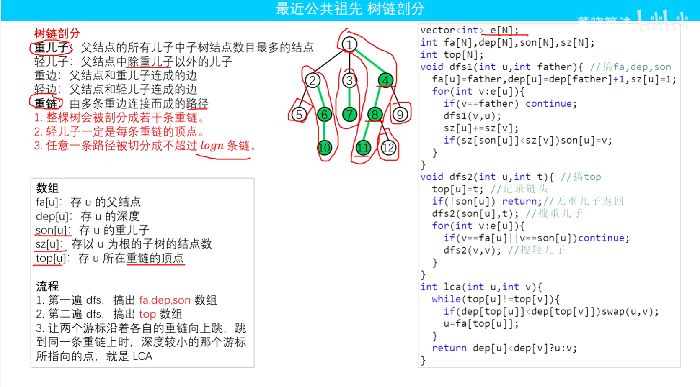
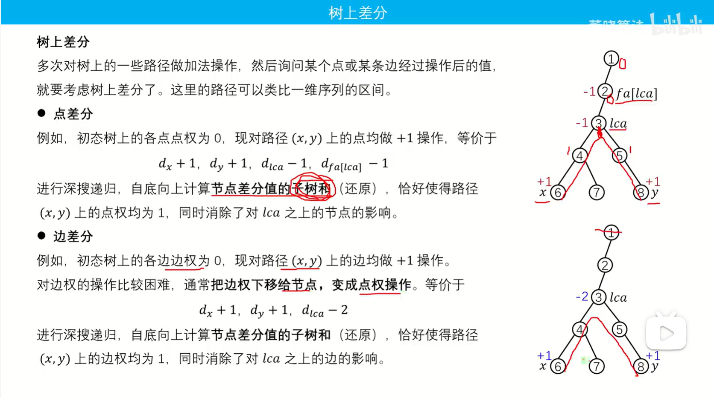
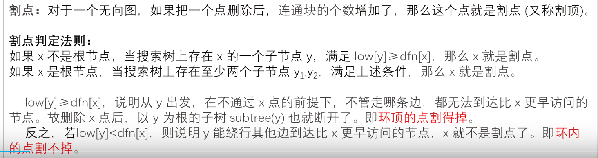
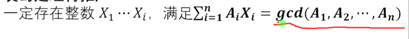
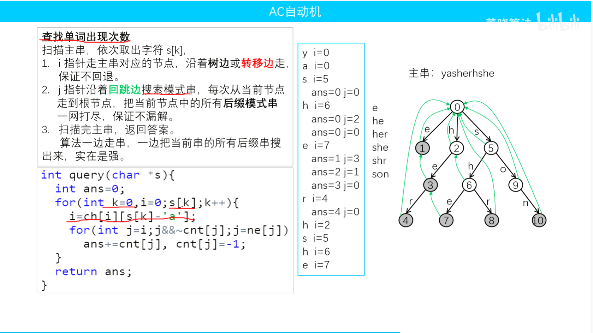

# [算法总结]()

[**特别篇**](#tbp)           		[**基础篇**](#jcp)         		 [**思维技巧篇**](#swjqp)         		**[图论篇](#trp)**         		 [**数据结构篇**](#sjjgp)       

​								[**字符串篇**](#zfcp)               [**博弈篇**](#byp)                  [**组合数学篇**](#zhsxp)

[**本人代码模版**](#brdmmb)                                       [**数论篇**](#srp)                                                     [**比赛总结**](#bszj)

## 小结论&技巧

### 1.数学

**1.哥德巴赫猜想**

​	一个偶数一定能分成两个质数之和

**例题:**CF735D

**2.一种数学的贪心想法**

​	o跳cnt步到x 可以正负跳,那么我们可以先一直往目标方向跳直到跳到或者跳过,跳过我们可以反悔贪心 (y-x)/2这一步我们可以反悔所以如果(y-x)是偶数和跳到该点的步数一样的,奇数就继续跳

**例题:**CF11B

**3.期望前缀性**

如果有n次情况,有一个事件为k 如甩子事件,那么情况共有  k^n - (k-1)^n 种;

若*n*次投掷的点数都在1到*k*内，共有𝑘^n种情况。

若*n*次投掷的点数都在1到k−1内，共有(k-1)^n种情况。

所以发生k就是k^n - (k-1)^n 种;

**4.乘阶性** 

(i+1)个 i ! = (i+1)!;

因为 (i+1)*i! = (i+1)! 

**5.lcm特性**

如果我们有两个整数n和m*(*n*>m*)，它们的最大公约数为k，则k必然n*−*m的约数

相邻的两个数必定互质(差为1），当一个数*n*为奇数时n和n−2必定互质

**6.gcd特性**

gcd(*x*,*y*)=gcd(*x*,*y*−*x*) (*x*<*y*)

推广一下：

gcd⁡(𝑎1,𝑎2,𝑎3,𝑎4,𝑎5,...,𝑎𝑛)

=gcd⁡(𝑎1,𝑎2−𝑎1,𝑎3−𝑎2,𝑎4−𝑎3,𝑎5−𝑎4,...,𝑎𝑛−𝑎𝑛−1)


**7.矩阵切割**

有一块 𝑤×ℎ 的玻璃，每次横着切一刀 (𝐻)或者竖着切一刀 (𝑉) ，没有两次相同的切割，求最大的矩形碎片面积。

**显然，最大矩形碎片面积 == 最大的长 × 最大的宽。因为长宽互不干扰，所以我们分开处理。**


### 2.树上问题

1.如果算树的贡献那么我们就要想每个节点改变对答案的增加与对下数或者上树的影响

2.树上的重心至少1至多2

3.定义 𝑑𝑖𝑠[u] 表示节点 𝑢 到根节点的距离 树上任意两点 u,v 的简单路径和等于 dis[u]+dis[v]−2×dis[lca(u,v)]

可以等价转换为边权值

### 3.图上问题

求一个图 对于没有连边的边进行连边不影响最短路的边的数量,:

设s为起点 t为终点 x为一个点 y为一个点 x与y一开始不相连接

如果x连y不影响最短路那么 dis[s] [x] + dis[y] [t] + 1 <= dis[s] [t] (加一是因为加一条边,边权值为1) 

## <a name ="tbp">**特别篇(动态规划从唯唯诺诺到重拳出击):**</a>

**本章主要积攒各类dp的 模型,以及经验**

### 1.线性DP

#### 求序列位置是否合法

##### CF1741E

**题目大意：给定一个序列 *b*，问序列 b有没有可能是任意一个序列 a通过下列方式得出来的：**

1. **将序列 a 分成若干段**
2. **将每一段的段长插入到该段的左边或者右边**

**比如说 b为112313223**

**可以分成a 1 231 23**

**1 一个字符1 231 三个字符3 两个字符2 23;**

这是一个判断位置合法性的dp

dpi表示 1,i是否合法

设当前位置ai是区间长度的值,可以合法递推

1.若他表示区间左边 则[1,i+ai]合法的充分条件是[1,i-1]合法

2.若它在所表示区间的右边,则[1,i]合法的充分条件是[1,i-ai-1];

两者合法一个即可

**方程:**

**dp[i + a[i]] |= dp[i-1];**

**dp[i] |= dp[i - 1 - a[i]];**

##### CF788A

题目大意:

给你一串数组,让你求一个区间满足以下公式的最大值:


思路:

因为-1,1是根据l待定

前一个是-1 这一个必定是1

前一个是1 这一个必定是-1

所以我们dp可以设置为

dp[n] [2] 表示前i个数+ 或者 -的最大值

类似最长上升序列问题

**方程:**

**我们定义1为- 0为+;**

**预处理p[i] = abs(a[i] - a[i+1]);**

**dp[i] [1] = max(dp[i - 1] [0] + p[i],p[i]);**

**dp[i] [0] = max(dp[i - 1] [1] - p[i],0);**

##### CF192C

**题目大意:**

有一个王朝，他们国王的名字用姓氏的简写来标记每一代。

为了保证王朝的稳定，现在这个王朝的继承人的名字需要满足

继承者名字的第一个字母要和前代名字最后一个字母相同。

然后拼接起来的名字，第一个字母和最后一个字母相同。

现在有一个考古博士，知道了这个王朝国王和亲戚的名字。问你这个王朝所能够得到的最长字符串。
**思路:**

因为最后一个的尾字母等于第一个的首字母,但是我们不知道哪一个字母做这个首和尾

因为一共就26个字母,我们枚举即可

设dp[x] [y] 为 字母x开头 字母y结尾 的最大连接长度

我们获取当前string 的 头设为u 尾设为v

枚举每一个j

如此

**转移方程为: dp[j] [v] = max(dp[j] [v],dp[ j ] [u] + s.size()) ** 有点像最短路的味道

**代码:**

```c++
#include<bits/stdc++.h>
using namespace std;
#define int long long
#define PII pair<int,int>
#define endl "\n"
typedef unsigned long long ULL;
typedef long long ll;
#define rep(i, a, b) for (int i = ll(a); i <= ll(b); ++i)
const int N = 200005;
//不要把题目想的太难

void solve(){
	int n;
	cin >> n;
	int dp[26][26];
	memset(dp,0,sizeof dp);
	int ma = 0;
	for(int i = 0; i < n; i++){
		string s;
		cin >> s;
		int u = s[0] - 'a';
		int v = s[s.size() - 1] - 'a';
		int len = s.size();
		for(int j = 0; j < 26;j++){
			if(dp[j][u] == 0) continue;
			dp[j][v] = max(dp[j][v],dp[j][u] + len);
		}
		dp[u][v] = max(len,dp[u][v]);
	}
	for(int i = 0; i < 26;i++)ma=max(dp[i][i],ma);
	cout <<ma << endl;

}

signed main(){
	std::ios::sync_with_stdio(0);
    std::cin.tie(0);
    std::cout.tie(0);
	int times = 1;
	//cin >> times;
	while(times--){
		solve();
	}
	return 0;
}
```


##### NOIP2012

[[NOIP2012 普及组\] 摆花 - StarryCoding | 踏出编程第一步](https://www.starrycoding.com/problem/80)

```c++
void solve(){
	int n,m;
	cin >> n >> m;
	int a[n+1];
	for(int i = 1; i <= n;i++) cin >> a[i];
	int dp[n + 1][m+1];//dp[i][j]表示到第i盆花为止,选i盆花的组合数
	// dp[i][j] = dp[i-1][j - k];
	memset(dp,0,sizeof dp);
	dp[0][0] = 1;
	for(int i = 1; i <= n; i++){
		for(int j = 0; j <= m;j++){
			for(int k = 0; k <= min(a[i],j); k++){
				dp[i][j] = (dp[i][j] + dp[i-1][j-k]);
			}
		}
	}
	cout << dp[n][m] << endl;

}
```

##### 求最大正方形dp

dp[i] [j] 表示右下角坐标为(i,j)的正方形的最大长度

dp[i] [j] = min(dp[i - 1] [j - 1],dp[i - 1] [ j ],dp[i] [j - 1]);


### 2.字符串类型DP

#### 力扣2262

**题目类型:**字符串+贡献+dp

[2262. 字符串的总引力 - 力扣（LeetCode）](https://leetcode.cn/problems/total-appeal-of-a-string/description/)

字符串的 **引力** 定义为：字符串中 **不同** 字符的数量。

- 例如，`"abbca"` 的引力为 `3` ，因为其中有 `3` 个不同字符 `'a'`、`'b'` 和 `'c'` 。

给你一个字符串 `s` ，返回 **其所有子字符串的总引力** **。**

**子字符串** 定义为：字符串中的一个连续字符序列。

**示例 1：**

```
输入：s = "abbca"
输出：28
解释："abbca" 的子字符串有：
- 长度为 1 的子字符串："a"、"b"、"b"、"c"、"a" 的引力分别为 1、1、1、1、1，总和为 5 。
- 长度为 2 的子字符串："ab"、"bb"、"bc"、"ca" 的引力分别为 2、1、2、2 ，总和为 7 。
- 长度为 3 的子字符串："abb"、"bbc"、"bca" 的引力分别为 2、2、3 ，总和为 7 。
- 长度为 4 的子字符串："abbc"、"bbca" 的引力分别为 3、3 ，总和为 6 。
- 长度为 5 的子字符串："abbca" 的引力为 3 ，总和为 3 。
引力总和为 5 + 7 + 7 + 6 + 3 = 28 。
```

**思考:**

1.将**所有子串**按照其末尾字符的下标分组。

2.考虑两组**相邻**的子串：以 s[i−1] 结尾的子串、以 s[i] 结尾的子串。

3.以 s[i] 结尾的子串，可以看成是以 s[i−1]结尾的子串，在末尾添加上 s[i] 组成。

**上面这一串提示是思考子串统计类问题的通用技巧之一。**

**代码:**

```c++
class Solution {
public:
    long long appealSum(string s) {
        int cnt[26];
        memset(cnt,-1,sizeof cnt);
        int n = s.size();
        long long ans = 0;
        int sum = 0;
        for(int i = 0; i < n;i++){
            sum+=1;
            if(cnt[s[i] - 'a'] == -1){
                sum+=i;
            }else{
                sum+=i-cnt[s[i] - 'a']-1;
            }
            ans+=sum;
            cnt[s[i] - 'a'] = i;
        }
        return ans;
    }
};
```

### 3.数位DP

**什么是数位dp**
数位dp是一种计数用的dp，一般是要统计一个区级[l,r]内满足一些条件的数的个数

所谓数位dp，就是对数位进行dp，也就是个位、十位等

相对于普通的暴力枚举，数位dp快就快在它的记忆化，也就是说后面可能会利用到前面已经计算好的东西，比如我们现在要计算形式为2xxxx的满足某些条件的数字的个数，而这个信息我们可能可以利用计算1xxxx时遗留下来的信息，从而达到一个避免重复计算的效果，因此可以降低时间复杂度

**模版代码:**

```c++
typedef long long ll;
vector<int> a;
ll dp[20][state];   //不同问题数组的维度可能不同，看具体题目的条件
ll dfs(int pos,int state,bool lead,bool limit)  //这里的state可能有多个，看具体题目
{
    if(pos==n)      //n是数组的长度，从高位到地位是0-n-1
        return 1;   //返回值看具体情况
    if(!limint && !lead && dp[pos][state]!=-1)
        return dp[pos][state];
    int up = limit?a[pos]:9;    
    ll ans = 0;
    for(int i=0;i<=up;i++)
    {
        //这里还可能有一些if之类的判断语句
        ans += dfs(pos+1,state(状态转移),lead&&i==0,limit&&i==a[pos])
    }
    if(!limit && !lead)
        dp[pos][state] = ans;
    return ans;
}
ll solve(ll x)
{
    int pos = 0;
    while(x)
    {
        a[pos++] = x%10;
        x /= 10;
    }
    reverse(a.begin(),a.end());
    return dfs(0,state,true,true);
}
```

#### 力扣788

[788. 旋转数字 - 力扣（LeetCode）](https://leetcode.cn/problems/rotated-digits/description/)

```c++
class Solution {
public:
    int rotatedDigits(int n) {
       vector<int> f = {1,1,2,0,0,2,2,0,1,2};
       vector<int> v;
       while(n) v.push_back(n%10),n/=10;
       reverse(v.begin(),v.end());
       int len = v.size();
       int dp[len + 1][2];
       memset(dp,-1,sizeof dp);
       function<int(int,int,int)> dfs = [&](int pos,int state,int limit)->int{
           if(pos==len) return state;
           if(dp[pos][state]!=-1 && !limit) return dp[pos][state];
           int up = limit ? v[pos] : 9;
           int sum = 0;
           for(int i = 0;i <= up;i++){
               if(f[i]==0) continue;
               sum += dfs(pos+1,state || f[i] == 2,limit&&i==v[pos]);
           }
           if(!limit){
               dp[pos][state] = sum;
           }
           return sum;
       };
       return dfs(0,0,1);
    }
};
```

#### 力扣2376

[2376. 统计特殊整数 - 力扣（LeetCode）](https://leetcode.cn/problems/count-special-integers/description/)

```c++
class Solution {
public:
    int countSpecialNumbers(int n) {
        vector<int> v;
        while(n){
            v.push_back(n%10);
            n/=10;
        }
        int len = v.size();
        reverse(v.begin(),v.end());
        int dp[len + 1][1 << 10];
        memset(dp,-1,sizeof dp);
        function<int(int,int,int,int)> dfs = [&](int pos,int mask,int limit,int zero)->int{
            if(pos==len) return zero;
            if(dp[pos][mask] != -1 && zero && !limit) return dp[pos][mask];
            int sum = 0;
            if(!zero){
                sum += dfs(pos+1,mask,false,false);
            }
            int up = limit ? v[pos] : 9;
            for(int i = 1-zero; i <= up; i++){
                if(((mask >> i) & 1) == 0){
                    sum += dfs(pos+1,mask|(1<<i),limit&&v[pos]==i,true);
                }
            }
            if(!limit && zero) dp[pos][mask] = sum;
            return sum;
        };
        return dfs(0,0,1,false);
    }
};
```

#### 力扣1012

[1012. 至少有 1 位重复的数字 - 力扣（LeetCode）](https://leetcode.cn/problems/numbers-with-repeated-digits/)

正难则反,如要求有重复数字的,不如求没有重复数字的最后答案n-dfs();剩下的即是答案

代码:

```c++
class Solution {
public:
    int numDupDigitsAtMostN(int n) {
        vector<int> nums;
        int t = n;
        while(n){
            nums.push_back(n%10);
            n/=10;
        }
        reverse(nums.begin(),nums.end());
        int len = nums.size();
        int dp[len+1][1<<11];
        memset(dp,-1,sizeof dp);
        function<int(int,int,int,int)> dfs = [&](int pos,int mask,int limit,int nzero) ->int{
            if(pos==len) return nzero;
            if(nzero && !limit &&dp[pos][mask]!=-1) return dp[pos][mask];
            int sum = 0;
            int up = limit ? nums[pos] : 9;
            if(!nzero){
                sum += dfs(pos+1,mask,0,0);
            }
            for(int i = 1-nzero; i <= up;i++){
                    if(((mask >> i) & 1)==0) sum += dfs(pos+1,(mask|(1 << i)),limit&&nums[pos]==i,1);
                   
            }
            if(!limit&&nzero) dp[pos][mask] = sum;
            return sum;
        };
        return t - dfs(0,0,1,0);
    }
};
```

#### BD201722

V字形数 非山峰

```c++
#include<bits/stdc++.h> 
using namespace std;
#define int long long
int a[101];
 string s;
 int n;
 int dp[101][11][3];
 const int MOD = 1e9+7;
int dfs(int pos,int pre,int state,int lead,int limit){
    if(pos <= -1) return lead;
    if(lead && !limit && dp[pos][pre][state] != -1) return dp[pos][pre][state];
    int res = 0;
    int up = (limit == 1 ? a[pos] : 9);
    if(lead == 0)  res=(res+ dfs(pos - 1,pre,state,0,0))%MOD;
    for(int i = 1-lead;i <= up;i++){
        if(i > pre){
            res =(res+ dfs(pos - 1,i,1,1,limit && i == up) )%MOD;
        }else if(i == pre){
             res =(res+ dfs(pos - 1,i,state,1,limit && i == up))%MOD;
        }else{
            if(state != 1){
                res =(res+ dfs(pos - 1,i,2,1,limit && i == up))%MOD;
            }
        }
    }
    if(lead && !limit) dp[pos][pre][state] = res;
    return res;
}
void solve(){
   memset(a,0,sizeof a);
    cin >> s;
    n = s.size();
    int len = 0;
    for(int i = n - 1; i >= 0 ;i--){
        a[len++] = s[i] - 48;
    }
    memset(dp,-1,sizeof dp);
    cout << dfs(n - 1,10,2,0,1) << endl;
}
signed main( )
{
    int t;
    cin >> t;
    while(t--) solve();
    return 0;
}
```


### 4.树形DP

#### CF219D

换根dp

[Problem - 219D - Codeforces](https://codeforces.com/problemset/problem/219/D)

**代码:**

```c++
const int N = 200005;
//不要把题目想的太难
int n;
vector<vector<PII>> edge(N);
int f[N];
int dfs(int node,int fa){
	int sum = 0;
	for(auto [k,v]:edge[node]){
		if(k!=fa){
			sum += dfs(k,node) + v;
		}
	}
	f[node] = sum;
	return sum;
}
//换根dp
void dfs1(int node,int fa){
	for(auto [k,v]:edge[node]){
		if(k==fa) continue;
		if(v>0){
			f[k] = f[node] - 1;
		}else{
			f[k] = f[node] +1;
		}
		dfs1(k,node);
	}
}
void solve(){
	memset(f,0x3f,sizeof f);
	cin >> n;
	for(int i = 0; i < n - 1; i++){
		int u,v;
		cin >> u >> v;
		edge[u].push_back({v,0});
		edge[v].push_back({u,1});
	}
	dfs(1,-1);
	dfs1(1,-1);
	int mi = 0x3f3f3f3f;
	 for(int i = 1; i <= n;i++){
	 	mi = min(mi,f[i]);
	}

	cout << mi << endl;	
	for(int i = 1; i <= n;i++){
		if(f[i]==mi) cout << i << " ";
	}
}
```

####  CF1324F

换根DP

```c++
const int N = 200005;
//不要把题目想的太难
int n;
int f[N];
int color[N];
vector<vector<int>> edge(N);
void dfs(int node,int fa){
	f[node] = (color[node] == 1 ? 1:-1);
	for(auto p: edge[node]){
		if(p==fa) continue;
		dfs(p,node);
		if(f[p]>0) f[node] += f[p];
	}
}
void dfs2(int node,int fa){
	for(auto v:edge[node]){
		if(v==fa) continue;
		int a = f[node],b = f[v];
		if(b>0) a-=b;
		if(a>0) b+=a;
		f[v] = b;
		dfs2(v,node);
	}
}
void solve(){
	memset(f,0,sizeof f);
	cin >> n;
	for(int i = 1; i <= n;i++) cin >> color[i];
	for(int i = 1; i < n; i ++){
		int u,v;
		cin >> u >> v;
		edge[u].push_back(v);
		edge[v].push_back(u);
	}
	dfs(1,-1);
	dfs2(1,-1);
	for(int i = 1; i <= n;i++) {
		cout << f[i] << " ";
	}
}
```

#### 力扣834

[834. 树中距离之和 - 力扣（LeetCode）](https://leetcode.cn/problems/sum-of-distances-in-tree/description/)

```c++
class Solution {
public:
    
    vector<int> sumOfDistancesInTree(int n, vector<vector<int>>& edges) {
        vector<vector<int> > edge(n+1);
        for(auto p:edges){
            int u = p[0],v = p[1];
            edge[u].push_back(v);
            edge[v].push_back(u);
        }
        int f[n+1];
        fill(f,f+n,1);
        vector<int> res(n,0);
        function<void(int,int,int)> dfs = [&](int u,int fa,int dep){
            res[0]+=dep;
            for(auto v:edge[u]){
                if(v==fa) continue;
                dfs(v,u,dep+1);
                //cout << v << " " << f[v] << endl;
                f[u]+=f[v];
            }
        };
        dfs(0,-1,0);
        function<void(int,int)> dfs2 = [&](int u,int fa){
            for(auto v:edge[u]){
                if(v==fa) continue;
                res[v] = res[u] +n - 2*f[v];
                dfs2(v,u);
                
            }
        };
        dfs2(0,-1);
        //cout << f[2];
        return res;
    }
};
```

### 5.划分型dp

将序列分成（恰好/至多）*k* 个连续区间，求解与这些区间有关的最优值。

通常定义 dp[i] [j] 为前i个数划分成 j个区间的最优值 

时间复杂度最坏是 n^3 可根据题目 通过演变公式推导优化dp

#### **力扣813**

```c++
class Solution {
public:
    double largestSumOfAverages(vector<int>& nums, int k) {
        int n = nums.size();
        double dp[k+1][n+1];
        memset(dp,0,sizeof dp);
        int pre[n+1];
        memset(pre,0,sizeof pre);
        for(int i = 1;i<=n;i++) pre[i] = pre[i-1]+nums[i-1];
        for(int i = 1; i <= k;i++){
            dp[i][i-1] = -0x3f3f3f3f;
            for(int j = i; j <= n-k+i;j++){
                if(i==1){
                    dp[1][j] = pre[j]*1.0/j;
                    continue;
                }
                for(int l = 1; l <= j; l++){
                    dp[i][j] = max(dp[i][j],dp[i - 1][l - 1] + (pre[j]-pre[l-1])*1.0/(j-l+1));
                }

            }
        }
        return dp[k][n];
    }
};
```

#### 力扣2767

```c++
class Solution {
public:
   
    int minimumBeautifulSubstrings(string s) {
        unordered_set<string> f;
        f.insert("1");
        f.insert("101");
        f.insert("11001");
        f.insert("1111101");
        f.insert("1001110001");
        f.insert("110000110101");//12位
        f.insert("11110100001001");//14位
        int n = s.size();
        s = "&" + s;
        int dp[17][17]; //前i个字母划分成最少个j个数组的最小
        memset(dp,0x3f,sizeof dp);
        for(int i = 1; i <= n;i++){
            dp[i][1] = (f.count(s.substr(1,i)) ? 1: 0x3f3f3f3f);
    
            for(int j = 1; j <= i;j++){
                for(int k = 1; k <= i;k++){
                    dp[i][j] = min(dp[i][j],dp[k - 1][j - 1] + (f.count(s.substr(k,i-k+1)) ? 1: 0x3f3f3f3f));
                    //cout << "i:" <<  i << " j:" << j <<  " k:" << k << " dp[k][j-1]: "<< dp[k][j-1] << " s:" << s.substr(k,i-k+1) << endl;
                }
            }
        }
        int mi = 0x3f3f3f3f;
        for(int i = 1;i<= n;i++){
            mi = min(mi,dp[n][i]);
            //cout << "n:" << n << " i:" << i << " dp[n-1][i]:" << dp[n][i] << endl;
        }
        return mi==0x3f3f3f3f ? -1 : mi;
    }
};
```

#### 力扣1105

```c++
class Solution {
public:
    int minHeightShelves(vector<vector<int>>& books, int shelfWidth) {
        // f[i][j]代表前i个数划分j层的最优解
        // f[i][j] = min(max_h(l,i) + f[l - 1][j - 1],f[i][j]);
        // 并且 符合 sum[i] - sum[l - 1] <= selfwidth
        int n = books.size();
        int pre[n+1];
        memset(pre,0,sizeof pre);
        for(int i = 1; i <= n;i++){
            pre[i] =pre[i-1]+books[i - 1][0];
        }
        int f[n+1][n+1];
        memset(f,0x3f,sizeof f);
        int h = 0;
        int res = 0x3f3f3f3f;
        for(int i = 1;i<=n;i++){
            h = max(h,books[i - 1][1]);
            f[i][1] = (pre[i]<=shelfWidth ? h : 0x3f3f3f3f);
            res = min(res,f[n][1]);
            for(int j = 2; j <= i; j++){
                int th = 0;
                for(int k = i; k >=1;k--){

                    //cout << i << " " << k << " "<< pre[i] - pre[k - 1] << endl;
                    if(pre[i] - pre[k - 1] > shelfWidth) break;
                    
                    th = max(th,books[k-1][1]);
                    f[i][j] = min(f[i][j],f[k - 1][j - 1] + th);
                    //cout << "i:" << i << " j:" << j << " th:" << th << " k:"<<k << " f[k-1][j - 1]:" << f[k - 1][j-1] << endl;
                }
                if(i==n){
                    res = min(res,f[i][j]);
                }
            }
            
        }
        return res;
    }
};
```

#### 力扣2547

```c++
class Solution {
public:
    int minCost(vector<int>& nums, int k) {
        int n= nums.size();
        int a[n+1];
        for(int i = 1; i <= n;i++){
            a[i] = nums[i - 1];
        }
        int dp[n+1]; //前i个位置的最小代价
        memset(dp,0x3f,sizeof dp);
        dp[0] = 0;
        for(int i = 1; i <= n;i++){           
            map<int,int> h;
            int cnt = k;
            for(int j = i;j>=1;j--){
                h[a[j]]++;
                if(h[a[j]]==2) cnt+=2;
                if(h[a[j]]>2) cnt++;
                dp[i] = min(dp[j - 1] + cnt,dp[i]);
            }
        }
        return dp[n];
    }
};
```

### 6.状压DP

#### 小技巧:

**一个很棒的技巧,枚举第一个子集j时候你想枚举 k 另j一直是k的子集,你只需要这么做: **

**for(int k = j; k < mask; k = (k + 1) | j)**

#### 力扣2741

```c++
class Solution {
public:
    int mod = 1e9+7;
    int specialPerm(vector<int>& nums) {
        int n = nums.size();
        int mask = (1<<n) - 1;
        int memo[mask+1][n+1];
        memset(memo,-1,sizeof memo);
        int sum = 0;
        function<int(int,int)> dfs = [&](int mk,int j) ->int{
            int res = 0;
            if(mk == 0) return 1;
            if(memo[mk][j]!=-1) return memo[mk][j];
            for(int i = 0; i < n;i++){
                if((mk >> i)&1){
                    if(nums[i]%nums[j]==0||nums[j]%nums[i]==0){
                        res =(res+ dfs(mk^(1<<i),i))%mod;
                    }
                }
            }
            memo[mk][j] = res;
            return res;
        };
        for(int i = 0; i < n;i++){
            sum = (sum+dfs(mask^(1 << i),i))%mod;
        }
        return sum;
    }
};
```

#### CF1950G

**设置dp[i] [j]为 i这个集合中以j结尾的情况的可否性,很典的一个dp,需牢记**

转移方程 三重循环

dp[i | (1 << j )] [j] |= (dp[i] [k])  (j与k符合条件,且j不在i中,k在i中)

#### 力扣526

给出一个状态压缩思想,枚举位置,可以获取mask有多少个1确定现在位置是第几个,并枚举,可以优化状态压缩

#### **BD202017**

用到该技巧**for(int k = j; k < mask; k = (k + 1) | j)**

```c++
int a[11]; //尾号数量
int dp[11][1 << 11 + 1];
int st[1 << 11 + 1]; //当前子集s下有多少车是限制的
int mask = 1 << 11;
int n;
bool check(int mid){
	//第一天的state
	memset(dp,0x3f,sizeof dp);
	for(int i = 0; i < mask;i++){
		dp[1][i] = n - st[i]; 
	}
	for(int i = 2; i <= 5;i++){
		for(int j = 0; j < mask;j++){
			if(dp[i - 1][j] > mid) continue; //保证这个子集一定是符合要求的 <= mid的
			for(int k = j;k < mask; k = (k + 1) | j){ //优化枚举 保证k为j的子集 做到不重不漏
				int tp = n - st[k ^ j];
				if(tp > mid) continue;
				dp[i][k] = min(dp[i][k],tp);
			}
		}
		bool f = 0;
		for(int j = 0; j < mask;j++){
			
			if(dp[i][j] <= mid){
				f = 1;
				break;
			}
		}
		if(!f) return false;
	}
	return true;
}
void solve(){
	memset(a,0,sizeof a);
	cin >> n;
	for(int i = 0; i < n;i++){
		int t;
		cin >> t;
		a[t%10]++;
	}
	for(int i = 0; i < mask;i++){
		st[i] = 0;
		for(int j = 0; j < 10;j++){
			if((i >> j) & 1){
				st[i] += a[j];
			}
		}
	}
	int l = 0,r = n + 1;
	int ans = 0;
	while(l <= r){
		int mid = l +r >> 1;
		if(check(mid)){
			ans = mid;
			r = mid - 1;
		}else{
			l = mid + 1;
		}
	}
	cout << ans << endl;
}
```

#### CF55B

```c++
int a[4];
char t[3];
void solve(){
	for(int i = 0; i < 4;i++){
		cin >> a[i];
	}
	int n =4;
	int dp[1<<5];
	for(int i = 0; i < 3;i++) cin >> t[i];
	memset(dp,0x3f,sizeof dp);
	int mask = (1<<4);
	for(int i = 0; i < 4;i++){
		dp[1 << i] = a[i];
	}
	for(int i = 1;i < mask;i++){
		int cnt = __builtin_popcount(i);
		if(cnt==4) break;
		int mj=0;
		for(int j = 0; j < 4;j++){
			if(!((i >> j)&1)){
				int p = cnt - 1;
				if(t[p] == '+') dp[i | (1<<j)] = min(dp[i | (1<<j)],dp[i]+a[j]);
				else dp[i | (1<<j)] = min(dp[i | (1<<j)],dp[i]*a[j]);
				if(cnt==2){
					if(t[1] == '+') mj +=a[j]; 
					else{
						if(mj == 0) mj = a[j];
						else mj*=a[j];
					}
				}
			}
		}
		if(cnt == 2){
			if(t[2] == '+') dp[mask - 1] = min(dp[mask - 1],mj + dp[i]);
			if(t[2] == '*') dp[mask - 1] = min(dp[mask - 1],mj * dp[i]);
		}
	}	
	cout << dp[mask - 1] << endl;
}
```


## <a name = "jcp">一 基础篇</a>

### 1.二分查找

**本人使用左开右闭区间**

**时间复杂度 O(log n)**

#### **模版**

**1.最大化**

```c++
int l = 1,r = n - 1;
while(l < r){
    int mid = l+r>>1;
    if(check()) l = mid;
    else r = mid - 1;
}
return mid;
```

**2.最小化**

```c++
void solve(){
	cin >> n >> k;
	int l = 1,r = n;
	while(l < r){
		int mid = (l+r)>>1;
		if(check(mid)) r = mid;
		else l = mid + 1;
		//cout << l << " " << r << endl;
	}
	cout << r;
}
```

最大化和最小化范围

#### 模型

计数型

求和型

是否型


### 2.动态规划


#### 1.背包问题

**背包问题解法：**
**01 背包问题：**
**如果是 01 背包，即数组中的元素不可重复使用，外循环遍历 arrs，内循环遍历 target，且内循环倒序:**

**完全背包问题：**
**（1）如果是完全背包，即数组中的元素可重复使用并且不考虑元素之间顺序，arrs 放在外循环（保证 arrs 按顺序），target在内循环。且内循环正序。 （2）如果组合问题需考虑元素之间的顺序，需将 target 放在外循环，将 arrs 放在内循环，且内循环正序。**

例题:https://leetcode.cn/problems/word-break/solutions/744153/yi-tao-kuang-jia-jie-jue-bei-bao-wen-ti-kchg9/?envType=study-plan-v2&envId=top-interview-150

```
01背包 外循环coin 内循环 倒着target

完全背包 外循环coin 内循环 正着target

或 外循环target 内循环 coin

如果考虑组合 则外coin内target

如果考虑排列 则外target内coin

如果无所谓排列还得组合 比如bool是否可以 最值等问题 用内外哪种都可以
```

##### 例题:

###### 1.小红的子集取反

**题目:**[E-小红的子集取反_牛客周赛 Round 31 (nowcoder.com)](https://ac.nowcoder.com/acm/contest/74362/E)

**题目大意:**小红拿到了一个数组，她准备选择若干元素乘以 -1，使得最终所有元素的和为 0。小红想知道最少需要选择多少个元素？

**思路:**因为最少选多少个,我们要一个最优情况,那么我们就设 dp[i] [j]为 前i个物品到j这个值取或者不取的最优情况 因为数组有负数所以我们要一个偏移量,因为下标不能为负,我们观察到a[i]最多200,n做多200

所以我们在区间 -40000和40000 找一个偏移量,即40000 我们数组就变成了 dp[n +1] [80000];我们下标从1开始 设dp[0] [40000] 为0 因为我们这边的40000已经做了偏移,40000就是原来的0;然后我们取或不取

取就是x变成负数,即j-x ,要判断一下下标越界的情况, 然后 dp[i] [j] = min(dp[i] [j],dp[i - 1] [j - x] + 1);

如果不取我们就从上一个状态转移 dp[i][j] = min(dp[i] [j], dp[i - 1] [j + x]) 

和背包类似,j枚举的是背包大小

**代码:**

```c++
void solve(){
	int n;
	cin >> n;
	int dp[n+2][80008];
	memset(dp, 0x3f, sizeof dp);
	dp[0][40000] = 0;
	for(int i = 1; i <= n; i ++){
		int x;
		cin >> x;
		for(int j = 0; j <= 80000; j++){
			if(j + x <= 80000 && j + x >= 0) dp[i][j] = min(dp[i][j],dp[i - 1][j + x]);
			if(j - x <= 80000 && j - x >= 0) dp[i][j] = min(dp[i][j],dp[i - 1][j - x] + 1);
		}
	}
	if(dp[n][40000] >= 0x3f3f3f3f){
		cout << -1 << endl;
	}else{
		cout << dp[n][40000] <<endl; 
	}
}

```


#### 2.区间dp

[#区间 DP (qq.com)](https://mp.weixin.qq.com/mp/appmsgalbum?__biz=MzU4NDE3MTEyMA==&action=getalbum&album_id=2004942489941606403&scene=173&from_msgid=2247489400&from_itemidx=1&count=3&nolastread=1#wechat_redirect)

宫水三叶讲解 区间DP


#### 3.序列上按结尾位置规划

##### 1.最长递增子序列类问题

##### 2.最长公共子序列问题

dp[i] [j] 代表 s1 [0...i] s2[0...j];

这个初始化很关键,得初始化化两边都为0的情况 和一边为0的情况

```c++
dp[0][0] = 0;
for(int i = 1; i<= n;i++) dp[i][0] = s1[i - 1] + dp[i - 1][0];
for(int j = 1; j <= m;j++) dp[0][j] = s2[j - 1] + dp[0][j - 1];
```

#### 单调队列优化DP


##### **例题:**

###### **LOJ10180**

烽火传递

[#10180. 「一本通 5.5 练习 1」烽火传递 - 题目 - LibreOJ (loj.ac)](https://loj.ac/p/10180)

代码:

```c++
void solve(){
	int n,m;
	cin >> n >> m;
	int a[n + 1];
	for(int i = 1; i <= n; i++) cin >> a[i];
	int dp[n + 1];
	memset(dp,0,sizeof dp);
	deque<int> dq;
	int ans = 0x3f3f3f3f;
	for(int i = 1; i <= n;i++){
		while(!dq.empty() && dp[i - 1] <= dp[dq.back()]) dq.pop_back();
		dq.push_back(i - 1);
		while(dq.front() < i - m) dq.pop_front();
		dp[i] = dp[dq.front()] + a[i];
		if(i > n-m) ans = min(ans,dp[i]); 
	}
	cout << ans << endl;
}
```

###### LOJ10177

[#10177. 「一本通 5.5 例 3」修剪草坪 - 题目 - LibreOJ (loj.ac)](https://loj.ac/p/10177)

**代码:**

```c++
#include<bits/stdc++.h>
using namespace std;
#define int long long
typedef unsigned long long ULL;
typedef long long ll;
const int N = 100005;
void solve(){
	int n,k;
	cin >> n >> k;
	k++;
	deque<int> dq;
	int a[n + 1];
	int dp[n + 1];
	memset(dp,0,sizeof dp);
	int sum = 0;
	int ans = 1e18;
	for(int i = 1; i <= n; i++)  cin >> a[i], sum += a[i];
	for(int i = 1; i <= n; i++){
		while(!dq.empty() && dp[dq.back()] >= dp[i - 1]) dq.pop_back();
		dq.push_back(i - 1);
		while(dq.front() < i - k) dq.pop_front();
		dp[i] = dp[dq.front()] + a[i]; 	
		if(i+k > n){
			ans = min(ans,dp[i]);
		}
	}

	cout << sum - ans << endl;

}

signed main(){
	std::ios::sync_with_stdio(0);
    std::cin.tie(0);
    std::cout.tie(0);
	int times = 1;
	//cin >> times;
	while(times--){
		solve();
	}
	return 0;
}
```

###### LOJ10181

[#10181. 「一本通 5.5 练习 2」绿色通道 - 题目 - LibreOJ (loj.ac)](https://loj.ac/p/10181)

二分+单调队列dp

**代码:**

```c++
const int N = 100005;
int a[N];
int n,t;
bool check(int k){
	deque<int> dq;
	int dp[n + 1];
	memset(dp,0,sizeof dp);
	for(int i = 1; i <= n;i++){
		while(!dq.empty() && dp[i - 1] <= dp[dq.back()]){
			dq.pop_back();
		}
		dq.push_back(i-1);
		while(dq.front() < i - k) dq.pop_front();
		dp[i] = dp[dq.front()] + a[i];
		//cout << dp[i] << " ";
		if(i + k > n){
			if(dp[i] <= t) return true;
		}
	}
	//cout << endl;
	return false;

}
void solve(){
	cin >> n >> t;
	for(int i = 1; i <= n; i++) cin >> a[i];
	int l = 1, r = n;
	int ans = 0;
	while(l<=r){
		int mid = l+r>>1;
		//cout << mid << endl;
		if(check(mid)){
			ans = mid;
			r = mid - 1;
		}else{
			l = mid + 1;
		}
	}
	cout << ans - 1<< endl;
}

```

###### Luogu P1725

[P4742 [Wind Festival\] Running In The Sky - 洛谷 | 计算机科学教育新生态 (luogu.com.cn)](https://www.luogu.com.cn/problem/P4742)

**代码:**

```c++
const int N = 200005;
void solve(){
	int n,l,r;
	cin >> n >> l >> r;
	int a[N];
	for(int i = 0; i <= n; i++){
		cin >> a[i];
	}
	deque<int> dq;
	int dp[N];
	memset(dp,-0x3f,sizeof dp);
	dp[0] = 0;
	int ans = -2e9;
	for(int i = l; i <= n; i++){
		while(!dq.empty() && dp[i - l] >= dp[dq.back()]) dq.pop_back();
		dq.push_back(i - l);
		if(dq.front() < i - r) dq.pop_front();
		if(dq.size() == 0){
			dp[i] = -0x3f;
		}else{
			dp[i] = a[i] + dp[dq.front()];
		}
		
		if(i > n - r){
			ans = max(dp[i],ans);
		}
	}
	cout << ans << endl;
}

```

### 4.二维差分 + 二维前缀和

#### 1.二维前缀和

**代码:**

```c++
int n,m,q;
int grid[N][N];
int pre[N][N];
void solve(){
	cin >> n >> m >> q;
	for(int i = 1; i <= n; i++){
		for(int j = 1; j <= m;j++){
			cin >> grid[i][j];
		}
	}
	for(int i = 1;i <= n;i++){
		for(int j = 1; j <= m; j++){
			pre[i][j] = grid[i][j] + pre[i - 1][j] + pre[i][j - 1] - pre[i-1][j-1]; 
		}
	}
	while(q--){
		int x1,y1,x2,y2;
		cin >> x1 >> y1 >> x2 >> y2;
		int t = pre[x2][y2] - pre[x1 - 1][y2] - pre[x2][y1 - 1] + pre[x1 - 1][y1 - 1];
		cout << t << endl;
	}
}

```

#### 2.二维差分

**代码:**

```c++
int n,m,q;
int grid[N][N];
int pre[N][N];
int d[N][N];
void solve(){
	cin >> n >> m >> q;
	for(int i = 1; i <= n; i++){
		for(int j = 1; j <= m;j++){
			cin >> grid[i][j];
		}
	}
	//先差分
	for(int i =1;i<=n;++i){
		for(int j = 1; j<=m;++j){
			d[i][j] += grid[i][j];
			d[i + 1][j] -= grid[i][j];
			d[i][j+1]-= grid[i][j];
			d[i+1][j+1] += grid[i][j]; 
		}
	}
	//进行修改
	while(q--){
		int x1,y1,x2,y2,v;
		cin >> x1 >> y1 >> x2 >> y2 >> v;
		d[x1][y1] += v;
		d[x1][y2+1]-=v;
		d[x2+1][y1]-=v;
		d[x2+1][y2+1]+=v;
	}
	//还原
	for(int i = 1;i <= n;i++){
		for(int j = 1; j <= m; j++){
			grid[i][j] = grid[i - 1][j] + grid[i][j - 1] - grid[i - 1][j - 1] + d[i][j]; 
			cout << grid[i][j] << " ";
		}
		cout << endl;
	}
}
```

### 5.树链剖分



#### 例题

##### 蓝桥杯14th省赛 

[9.景区导游 - 蓝桥云课 (lanqiao.cn)](https://www.lanqiao.cn/problems/3516/learning/?subject_code=1&group_code=4&match_num=14&match_flow=1&origin=cup)

```c++
#include <bits/stdc++.h>
using namespace std;

const int N = 1e5+7;
int n,k;
vector<vector<pair<int,int>>> e(N);
int fa[N],top[N],son[N],dep[N],sz[N];
int dist[N];
int path[N];
void dfs1(int x,int fa1){
  sz[x] = 1;fa[x] = fa1;dep[x] = dep[fa1]+1;
  for(auto p:e[x]){
    int w = p.second;
    int v = p.first;
    if(v==fa[x]) continue;
    dist[v] = dist[x] + w;
    dfs1(v,x);
    sz[x]+=sz[v];
    if(sz[son[x]] < sz[v]) son[x] = v;
  }
}
void dfs2(int u,int t){
  top[u] = t;
  if(!son[u]) return;
  dfs2(son[u],t);
  for(auto p:e[u]){
    int v = p.first;
    if(v==son[u]||v==fa[u]) continue;
    dfs2(v,v);
  }
}
int lca(int n1,int n2){
  while(top[n1]!=top[n2]){
    if(dep[top[n1]] < dep[top[n2]]) swap(n1,n2);
    n1 = fa[top[n1]];
  }
  return dep[n1] < dep[n2] ? n1 :n2;
}
int js(int n1,int n2){
	if(n1==0||n2==0) return 0;
  return dist[n1]+dist[n2]-2*dist[lca(n1,n2)];
}
void solve(){
  cin >> n >> k;
  for(int i = 0; i < n - 1; i++){
    int u,v,w;
    cin >> u >> v >> w;
    e[u].push_back({v,w});
    e[v].push_back({u,w});
  } 
  dfs1(1,0);
  //cout << 1 <<endl;
  dfs2(1,1);
  int sum = 0;
  
  for(int i = 1; i <= k;i++){
    cin >> path[i];
    sum+=js(path[i],path[i-1]);
  }
  cout << sum << endl;
  for(int i = 1;i<=k;i++){
  	int g = sum - js(path[i],path[i-1]) - js(path[i],path[i+1]) + js(path[i - 1],path[i+1]);
  	cout << g << " ";
  }
}
int main(){
  solve();
}
```

### 6.树上差分

#### 概念与公式:

**边差分:** w[a]++,w[b]++,w[lca(a,b)]-=2; 将边下放到点上

**点差分:**w[a]++,w[b]++,w[lca(a,b)]--,w[fa[lca(a,b)]]--



#### 差分还原

```c++
void calcsum(int u,int fa){
  for(auto v:e[u]){
    if(v==fa) continue;
    calcsum(v,u);
    w[u]+=w[v];
  }
}
```

#### 例题:

##### **1.蓝桥杯14th省赛压轴**

```c++
#include<bits/stdc++.h>
using namespace std;
const int N = 1e5+7;
#define pb push_back

vector<vector<int> > e(N);
long long n,m;
int sz[N],son[N],top[N],fa[N],dep[N];
void dfs1(int u,int fa1){
  fa[u] = fa1,sz[u] = 1,dep[u] = dep[fa1] + 1;
  for(auto v:e[u]){
    if(v==fa1) continue;
    dfs1(v,u);
    sz[u] += sz[v];
    if(sz[son[u]] < sz[v]) son[u] = v;
  }
}
void dfs2(int u,int t){
  top[u] = t;
  if(!son[u]) return;
  dfs2(son[u],t);
  for(auto v:e[u]){
    if(v==fa[u] || v == son[u]) continue;
    dfs2(v,v);
  }
}
int lca(int a,int b){
  while(top[a]!=top[b]){
    if(dep[top[a]] < dep[top[b]]) swap(a,b);
    a = fa[top[a]];
  }
  return dep[a] < dep[b] ? a : b;
}
long long w[N];
map<pair<int,int>,int> h;
void calcsum(int u,int fa){
  for(auto v:e[u]){
    if(v==fa) continue;
    calcsum(v,u);
    w[u]+=w[v];
  }
}

void solve(){
  cin >> n >> m;
  for(int i = 0; i < n - 1; i++){
    int u,v;
    cin >> u >> v;
    e[u].pb(v);
    e[v].pb(u);
    h[{u,v}] = i + 1;
    h[{v,u}] = i + 1;
  }
  dfs1(1,0);
  dfs2(1,1);
  for(int i = 0; i < m;i++){
    int a,b;
    cin >> a >> b;
    w[a]++;
    w[b]++;
    w[lca(a,b)]-=2;
  }
  int ans = -1;
  calcsum(1,0);
  for(int i = 1; i <= n;i++){
    if(w[i]==m){
      ans = max(ans,h[{i,fa[i]}]);
    }
  }
  cout <<ans <<endl;
}
int main(){
  ios::sync_with_stdio(0);cin.tie(0);cout.tie(0);
  solve();
}
```

### 7.二叉树构造

#### 1.后序与中序

```c++
tree* dfs(int is,int ie,int ps,int pe){
    if(is > ie || ps > pe) return NULL;
    int root = pre[pe];
    int ri = h[root];
    tree* node = new tree;
    node->v = root;
    int len = ri - is;
    tree* left =  dfs(is,ri - 1,ps,ps+len-1);
    tree* right = dfs(ri+1,ie,ps+len,pe-1);
    node->l = left;
    node -> r = right;
    return node;
}
```

#### 2.前序与中序

```c++
tree* dfs(int is,int ie,int ps,int pe){
    if(is > ie || ps > pe) return NULL;
    int root = pre[ps];
    int ri = h[root];
    tree* node = new tree;
    node->v = root;
    int len = ri - is;
    tree* left =  dfs(is,ri - 1,ps + 1,ps+len);
    tree* right = dfs(ri+1,ie,ps+len + 1,pe);
    node->l = left;
    node -> r = right;
    return node;
}
```

### 8.logtrick

可以应对 lcm gcd & | 子数组求值问题

三部曲

1.定义ors数组 通常第一维度为 值 用于做logtrick优化 第二位为各种题目限制/或者要求

2.考虑如何做logtrick 通常|与&是等于本身可以做logtrick

3.考虑如何求问题所需值

一般来说带个 位置下标值,维护距离很有用

**配合map使用将简化很多问题**

##### 模版

```c++
vector<int/PII/vector<int>> orz;
//我这里默认数组下标从1开始
for(int i = n;i>=1;i--){
	orz.push_back({0,一些数});
    orz[0] | / & / gcd / lcm = nums[i];
    int k = 0;
    for(int j = 1;j<orz.size();j++){
        orz[j] | / & / gcd / lcm = nums[i];
        if(orz[j] == orz[k]){
            //操作
        }else{
            orz[++k] = orz[j]
        }
    }
    resize(orz,k+1);
    //最后可做统计求值工作
}

```

##### logtrick魔改版

魔改是原地修改算法,会有单调性,可以二分查值

魔改能解决很多问题,但是一些计数与去重需要原版完成

```c++
for(int i = 1; i <= n;i++){
    int x = nums[i];
    //这里可以进行一些操作比如说对单个值取值 还有
    for(int j = i - 1;j >= 1 && ((nums[j] 操作 nums[i]) != nums[j]);j--){
        nums[j] 操作= nums[i];
    }
    然后进行二分或者一些操作
}
```

例题:

力扣

3097.或值至少为 K 的最短子数组 II 1891 
2411.按位或最大的最小子数组长度 1938
3209.子数组按位与值为 K 的数目 2100
3171.找到按位或最接近 K 的子数组
1521.找到最接近目标值的函数值 2384 做法同 3171 题 
898.子数组按位或操作 

### 9.树上启发式合并

[dsu on tree(树上启发式合并) - GsjzTle - 博客园 (cnblogs.com)](https://www.cnblogs.com/GsjzTle/p/14033777.html)

**例题:**

##### CF570D

```c++
const int N = 500005;
struct edges{
    int v,ne;
}e[N<<1];
struct quary{
    int h,id;
};
vector<quary> tb[N];
int h[N],idx = 0;
void add(int u,int v){
    e[idx] = {v,h[u]};
    h[u] = idx++;
}
string s;
int n,q;
int cnt[N][26];
int sz[N],dep[N],son[N];
int flag;
int ans[N];
void dfs(int u,int f,int path){
    sz[u] = 1,dep[u] = path;
    for(int i = h[u];~i;i=e[i].ne){
        int v= e[i].v;
        if(v==f) continue;
        dfs(v,u,path+1);
        sz[u]+=sz[v];
        if(sz[son[u]] < sz[v]){
            son[u] = v;
        }
    }
}
void count(int u,int f,int val){
    cnt[dep[u]][s[u] - 'a']+=val;
    for(int i = h[u];~i;i=e[i].ne){
        int v = e[i].v;
        if(v==flag || v == f) continue;
        count(v,u,val);
    }
}
void dfs2(int u,int f,int keep){
    //遍历轻儿子,算子数,删贡献
    for(int i = h[u];~i;i=e[i].ne){
        int v = e[i].v;
        if(v == f || v == son[u]) continue;
        dfs2(v,u,0);
    }
    if(son[u]){
        dfs2(son[u],u,1);
         flag = son[u];
    }
    count(u,f,1);
    flag = 0;
    for(auto &p:tb[u]){
        int h = p.h;
        int id = p.id;
        int ct = 0;
        for(int i = 0; i < 26;i++){
            if(cnt[h][i]%2==1) ct++;
        }
        if(ct<=1) ans[id] = 1;
    }
    if(!keep){
        count(u,f,-1);
    }
}
void solve(){
    memset(h,-1,sizeof h);
    cin >> n >> q;
    for(int i = 2;i <= n;i++){
        int u;
        cin >> u;
        add(u,i);
        add(i,u);
    }
    cin >> s;
    s=" " + s;
    int id = 0;
    int g = q;
    while(q--){
        int x,y;
        cin >> x >> y;
        tb[x].push_back({y,id++});
    }
    dfs(1,0,1);
    dfs2(1,0,0);
    for(int i = 0;i<g;i++){
        if(!ans[i]){
            cout << "No" << endl;
        }else{
            cout << "Yes" << endl;
        }
    }
}
```

##### CF600E

```c++
const int N = 200005;
struct edges{
    int v,ne;
}e[N<<1];
int h[N],idx = 0;
void add(int u,int v){
    e[idx] = {v,h[u]};
    h[u] = idx++;
}
int n;
int color[N],cnt[N],ans[N];
int fa[N],sz[N],son[N]; //寻找重儿子
int flag;
void dfs(int u,int f){
    sz[u] = 1,fa[u] = f;
    int masz = -1;
    for(int i = h[u];~i;i=e[i].ne){
        int v = e[i].v;
        if(v==f) continue;
        dfs(v,u);
        if(masz < sz[v]){
            masz = sz[v];
            son[u] = v;
        }
        sz[u] += sz[v];
    } 
}
int sum = 0,ma = 0;
void count(int u,int f,int val){
    cnt[color[u]]+=val;
    if(cnt[color[u]] > ma){
        ma = cnt[color[u]];
        sum = color[u];
    }else if(cnt[color[u]] ==ma){
        sum += color[u];
    }
    for(int i = h[u];~i;i=e[i].ne){
        int v = e[i].v;
        if(v==f || v == flag) continue;
        count(v,u,val);
    }
}
void dfs(int u,int f,int keep){
    //算轻儿子,算答案,删贡献
    for(int i = h[u];~i;i=e[i].ne){
        int v = e[i].v;
        if(v==f || v == son[u]) continue;
        dfs(v,u,false);
    }
    //算重儿子贡献,不删

    if(son[u]){
        dfs(son[u],u,true);
        flag = son[u];
    }
    //合并信息
    count(u,f,1);
    flag = 0; //删贡献时下面的重儿子也是删的(因为我本身是轻儿子)
    ans[u] = sum;
    //删贡献,进入下一轮子树
    if(!keep){
        count(u,f,-1);
        sum = 0,ma = 0;
    }
}
void solve(){
    //先建树
    cin >> n;
    memset(h,-1,sizeof h);
    for(int i = 1;i <= n;i++){
        cin >> color[i];
    }
    for(int i = 1;i < n; i++){
        int u,v;
        cin >> u >> v;
        add(u,v);
        add(v,u);
    }
    dfs(1,0);
    dfs(1,0,0);
    for(int i = 1;i<=n;i++){
        cout << ans[i] <<" ";
    }
}
```

##### CF208E

```c++
const int P = 13331;
const int N = 200005;
//建图
struct egdes
{
    int v,ne;
}e[N<<1];
int h[N],idx = 0;
 
void add(int u,int v){
    e[idx] = {v,h[u]};
    h[u] = idx++;
}
int pa[N][36];//处理k级公共祖先
int n;
int fa[N];
void init(){
    for(int i = 0; i < 30;i++){
        for(int x = 1; x <= n;x++){
            int p = pa[x][i];
            if(p>0){
                pa[x][i+1] = pa[p][i];
            }
        }
    }
}
int gtk(int v,int k){
    for(int i = 0; i < 30;i++){
        if(k & (1<<i)){
            v = pa[v][i];
            if(v<=0) continue;
        }
    }
    return v;
}
struct quary{
    int k,id,node;
};
vector<quary> qs[N];//每个节点要算的东西
int sz[N],son[N],dep[N];
int mah = 0;
void dfs(int u,int f,int hi){
    sz[u] = 1,dep[u] = hi;
    mah=max(hi,mah);
    for(int i = h[u];~i;i=e[i].ne){
        int v = e[i].v;
        if(v==f) continue;
        dfs(v,u,hi+1);
        sz[u]+=sz[v];
        if(sz[son[u]] < sz[v]){
            son[u] = v;
        }
    }
}
int cnt[N],flag;
int ans[N];
void count(int u,int f,int val){
    
    cnt[dep[u]]+=val;
    //printf("%d %d %d\n",u,dep[u],cnt[dep[u]]);
    for(int i = h[u];~i;i=e[i].ne){
        int v = e[i].v;
        if(v==f||v == flag) continue;
        count(v,u,val);
    }
}
void dfs2(int u,int f,int keep){
    for(int i = h[u];~i;i=e[i].ne){
        int v = e[i].v;
        if(v==f||v==son[u]) continue;
        dfs2(v,u,0);
    }
    if(son[u]){
        dfs2(son[u],u,1);
        flag = son[u];//falg切记在下面
    }
    
    count(u,f,1);
    flag = 0;
    for(auto &p:qs[u]){
        int id = p.id,k = p.k,node = p.node;
        //printf("%d %d %d %d %d\n",u,node,dep[u],dep[node],cnt[dep[node]]);
        if(cnt[dep[node]]==0) continue;
        ans[id] = cnt[dep[node]] - 1;
    }
 
    if(!keep) count(u,f,-1);
    
 
}
void solve(){
    cin >> n;
    memset(h,-1,sizeof h);
    vector<int> roots;
    for(int i = 1;i<=n;i++) {
        cin>>fa[i];
        
        if(fa[i]==0){
            roots.push_back(i);
            continue;
        }
        pa[i][0] = fa[i];
        add(i,fa[i]);
        add(fa[i],i);
    }
    init();
    int q;
    for(auto &p:roots) dfs(p,0,1);
    cin >> q;
    int id = 0;
    int qq = q;
    while(q--){
        int node,k;
        cin >> node >> k;
        int nr = gtk(node,k);
        if(nr!=0){
            qs[nr].push_back({k,id,node});
        }
        id++;
    }
    for(auto &p:roots){
        dfs2(p,0,0);
    }
    for(int i = 0;i <qq;i++){
        cout << ans[i] << endl;
    }
}
```

##### CF246E

```c++
const int N = 200005;
int n;
struct edges{
    int v,ne;
}e[N];
struct quarys{
    int k,id;
};
vector<quarys> qs[N];
int h[N],idx = 0;
void add(int u,int v){
    e[idx] = {v,h[u]};h[u] = idx++;
}
string name[N];
int dep[N],sz[N],son[N];
void dfs(int u,int f){
    sz[u] = 1,dep[u] = dep[f] + 1;
    for(int i = h[u];~i;i=e[i].ne){
        int v = e[i].v;
        if(v==f) continue;
        dfs(v,u);
        sz[u]+=sz[v];
        if(sz[son[u]] < sz[v]){
            son[u] = v;
        }
    }
}
int flag;

int cnt[N];
int ans[N];
map<pair<int,string>,int> se;
void count(int u,int f,int val){
    if(val!=-1 && !se.count({dep[u],name[u]})){
        cnt[dep[u]]+=val;
    }
    se[{dep[u],name[u]}]+=val;
    if(se[{dep[u],name[u]}]==0){
        se.erase({dep[u],name[u]});
        cnt[dep[u]]--;
    }
    for(int i = h[u];~i;i=e[i].ne){
        int v = e[i].v;
        if(v==f||v==flag) continue;
        count(v,u,val);
    }
}
void dfs2(int u,int f,int keep){
    for(int i = h[u];~i;i=e[i].ne){
        int v = e[i].v;
        if(v==f || v==son[u]) continue;
        dfs2(v,u,0);
    }
    if(son[u]){
        dfs2(son[u],u,1);
        flag = son[u];
    }
    count(u,f,1);
    //se.clear();    
    flag = 0;
    for(auto &p:qs[u]){
        int k = p.k;
        int id = p.id;
        ans[id] = cnt[dep[u] + k];
    }
    if(!keep){
        count(u,f,-1);
    }
}
void solve(){
    cin >> n;
    memset(h,-1,sizeof h);
    vector<int> roots;
    for(int i = 1;i<=n;i++){
        cin >> name[i];
        int fa;
        cin >> fa;
        if(fa==0){
            roots.push_back(i);
            continue;
        }
        add(i,fa);
        add(fa,i);
    }
    int q;
    cin >> q;
    int id = 0;
    while(id<q){
        int node,k;
        cin >> node >> k;
        qs[node].push_back({k,id});
        id++;
    }
    for(auto &p:roots){
        dfs(p,0);
        dfs2(p,0,0);
    }
    for(int i = 0; i < q;i++){
        cout << ans[i] << endl;
    }
}
```

##### CF1009F

```c++
const int N = 1000005;
struct edges
{
    int v,ne;
}e[N << 2];
int n;
int h[N],idx = 0;
void add(int u,int v){
    e[idx] = {v,h[u]};
    h[u] = idx++;
}
int sz[N],dep[N],mdep,son[N];
void dfs(int u,int f){
    sz[u] = 1; dep[u] = dep[f] + 1;
    mdep = max(mdep,dep[u]);
    for(int i = h[u];~i;i=e[i].ne){
        int v=e[i].v;
        if(v==f) continue;
        dfs(v,u);
        sz[u]+=sz[v];
        if(sz[son[u]]<sz[v]) son[u] = v;
    }
}
int flag;
int cnt[N],ans[N];
int ma,id = 0;
void count(int u,int f,int val){
    cnt[dep[u]]+=val;
    if(cnt[dep[u]] > ma){
        ma = cnt[dep[u]];
        id = dep[u];
    }else if(cnt[dep[u]] == ma){
        id = min(id,dep[u]);
    }
    for(int i = h[u];~i;i=e[i].ne){
        int v = e[i].v;
        if(v==flag||v==f)continue;
        count(v,u,val);
    }
}
void dfs2(int u,int f,int keep){
    for(int i = h[u];~i;i=e[i].ne){
        int v = e[i].v;
        if(v==f||v==son[u]) continue;
        dfs2(v,u,0);
    }
    if(son[u]){
        dfs2(son[u],u,1);
        flag = son[u];
    }
    count(u,f,1);
    flag = 0;
   
    ans[u] = max(id - dep[u],0);
    if(!keep){
        count(u,f,-1);
        ma=0;
        id=0;
    }
}
void solve(){
    memset(h,-1,sizeof h);
    cin >> n;
    for(int i =0;i<n-1;i++){
        int u,v;
        cin >> u >> v;
        add(u,v);
        add(v,u);
    }
    dfs(1,0);
    dfs2(1,0,0);
    for(int i = 1;i<=n;i++) cout << ans[i] << endl;
}
```

##### CF375D

```c++
const int N = 100005;
int n,m;
int color[N];
struct edges{
    int v,ne;
}e[N << 2];
int h[N],idx = 0;
struct quars{
    int k,id;
};
int tr[N];
int lb(int x){return x&-x;}
void upd(int k,int val){
    for(int i = k;i < N;i+=lb(i)) tr[i]+=val;
}
int quary(int k){
    int res = 0;
    for(int i = k - 1;i>0;i-=lb(i)){
        res+=tr[i];
    }
    return res;
}
void add(int u,int v){
    e[idx] = {v,h[u]};
    h[u] = idx++;
}
vector<quars> qs[N];
int ans[N];
int sz[N],son[N];
void dfs(int u,int f){
    sz[u] = 1;
    for(int i = h[u];~i;i=e[i].ne){
        int v = e[i].v;
        if(v==f) continue;
        dfs(v,u);
        sz[u]+=sz[v];
        if(sz[son[u]] < sz[v]) son[u] = v;
    }
}
int flag;
int col[N];
int p1 = 0;
void count(int u,int f,int val){
    if(col[color[u]]!=0){
        upd(col[color[u]],-1);
    }else{
        p1++;
    }
    col[color[u]]+=val;
    if(col[color[u]]!=0){
        upd(col[color[u]],1);
    }else{
        p1--;
    }
    for(int i = h[u];~i;i=e[i].ne){
        int v = e[i].v;
        if(v==f||v==flag) continue;
        count(v,u,val);
    }
}
void dfs2(int u,int f,int keep){
    for(int i = h[u];~i;i=e[i].ne){
        int v = e[i].v;
        if(v==f||v==son[u]) continue;
        dfs2(v,u,0);
    }
    if(son[u]){
        dfs2(son[u],u,1);
        flag = son[u];
    }
    count(u,f,1);

    for(auto &p:qs[u]){
        int k = p.k, id = p.id;
        //cout << col[color[2]] << " " << quary(k)<< endl;
        ans[id] = p1 - quary(k);
    }
    flag = 0;
    if(!keep){
        count(u,f,-1);
    }

}
void solve(){
    cin >> n >> m;
    memset(h,-1,sizeof h);
    for(int i = 1;i<=n;i++) cin >> color[i];
    for(int i = 0; i < n - 1;i++){
        int u,v;
        cin >> u >> v;
        add(u,v);
        add(v,u);
    }
    int id = 1;
    while(id <= m){
        int u,k;
        cin >> u >> k;
        qs[u].push_back({k,id});
        id++;
    }
    dfs(1,0);
    dfs2(1,0,0);
    for(int i = 1;i < id;i++){
        cout << ans[i] << endl;
    }

}

```

##### wannafly Day2 E

[E-阔力梯的树_2020 CCPC Wannafly Winter Camp Day2 Div.1&2（重现赛） (nowcoder.com)](https://ac.nowcoder.com/acm/contest/4010/E)

```c++
const int N = 200005;
struct edges{
    int v,ne;
}e[N<<1];
int h[N],idx = 0;
void add(int u,int v){
    e[idx] = {v,h[u]};
    h[u] = idx++;
}

int sz[N],son[N];

void dfs(int u,int f){
    sz[u] = 1;
    for(int i = h[u];~i;i=e[i].ne){
        int v= e[i].v;
        if(v==f) continue;
        dfs(v,u);
        sz[u]+=sz[v];
        if(sz[son[u]] < sz[v]){
            son[u] = v;
        }
    }
}
int flag;
int ans[N];
int su;
set<int> se;
void upd(int u,int f){
    auto it1 = se.upper_bound(u);
    auto it2 = it1,it = it1;
    it2--;
    int de = 0,ad1 = 0,ad2 = 0;
    if(it2 != se.begin() && it != se.end()) de=(*it- *it2);
    su-=de*de;
    if(it2 != se.begin()) ad1 = (u - *it2);
    if(it != se.end()) ad2 = (*it - u);
    su+=ad1*ad1+ad2*ad2;
    se.insert(u);
    for(int i = h[u];~i;i=e[i].ne){
        int v = e[i].v;
        if(v == f || v == flag) continue;
        upd(v,u);
    }
}
void del(int u,int f){
    se.erase(u);
    auto it1 = se.upper_bound(u);
    auto it2 = it1,it = it1;
    it2--;
    int de = 0,ad1 = 0,ad2 = 0;
    if(it2 != se.begin()) ad1 = (u- *it2);
    if(it != se.end()) ad2 = (*it - u);
    su-=ad1*ad1;
    su-=ad2*ad2;
    if(it2 != se.begin() && it != se.end()) de=(*it- *it2);
    su+=de*de;
    for(int i = h[u];~i;i=e[i].ne){
        int v = e[i].v;
        if(v == f || v == flag) continue;
        del(v,u);
    }
}
void dfs2(int u,int f,int keep){
    for(int i = h[u];~i;i=e[i].ne){
        int v = e[i].v;
        if(v == f || v == son[u]) continue;
        dfs2(v,u,0);
    }
    if(son[u]){
        dfs2(son[u],u,1);
        flag = son[u];
    }
    upd(u,f);
    flag = 0;
    ans[u] = su;
    if(!keep){
        del(u,f);
        su = 0;
    }

}
int n;
void solve(){
    memset(h,-1,sizeof h);
    cin >> n;
    se.insert(-100);
    for(int i = 2;i<=n;i++){
        int fa;
        cin >> fa;
        add(fa,i);
        add(i,fa);
    }
    dfs(1,0);
    dfs2(1,0,0);
    for(int i = 1;i<=n;i++) cout << ans[i] << endl;
}

```


##### CCPC长春2022F

[Problem - F - Codeforces](https://codeforces.com/gym/102832/problem/F)

```c++
const int N = 100005;
int n;
int a[N];
struct edges
{
    int v,ne;
}e[N << 2];
int h[N],idx;
void add(int u,int v){
    e[idx] = {v,h[u]};
    h[u] = idx++;
}
int sz[N],son[N];
void dfs(int u,int f){
    sz[u] = 1;
    for(int i = h[u];~i;i=e[i].ne){
        int v = e[i].v;
        if(v==f) continue;
        dfs(v,u);
        sz[u]+=sz[v];
        if(sz[son[u]] < sz[v]){
            son[u] = v;
        }
    }
}
int cnt[1000006][20][2]; //异或值为x的第i位上0/1的个数
int flag;
ll res = 0;
void change(int u,int f,int val){

    for(int i = 0; i <=17;i++){
        if(u&(1<<i)){
            cnt[a[u]][i][1]+=val;
        }else{
            cnt[a[u]][i][0]+=val;
        }
    }
    for(int i = h[u];~i;i=e[i].ne){
        int v = e[i].v;
        if(v==f||v==flag) continue;
        change(v,u,val);
    }

}
void count(int rt,int u,int f){
    if((a[u]^a[rt]) <= 1000000){
        for(int i = 0; i <= 17;i++){
            int p = (u >> i)&1;
            res += cnt[a[u]^a[rt]][i][p^1] * (1<<i);
        }
    }
    
    for(int i = h[u];~i;i=e[i].ne){
        int v = e[i].v;
        if(v==f||v==flag) continue;
        count(rt,v,u);
    }

}
void dfs2(int u,int f,int keep){
    for(int i = h[u];~i;i=e[i].ne){
        int v = e[i].v;
        if(v==f||v==son[u]) continue;
        dfs2(v,u,0);
    }
    if(son[u]){
        dfs2(son[u],u,1);
        flag = son[u];
    }
    for(int i = h[u];~i;i=e[i].ne){
        int v = e[i].v;
        if(v==f||v==flag) continue;
         count(u,v,u);
        change(v,u,1);
    }
    flag = 0;
    for(int i = 0; i <=17;i++){
        if(u&(1<<i)){
            cnt[a[u]][i][1]++;
        }else{
            cnt[a[u]][i][0]++;
        }
    }
    if(!keep){
        change(u,f,-1);
    }
}
void solve(){
    memset(h,-1,sizeof h);
    cin >> n;
    for(int i = 1;i<=n;i++) cin >> a[i];
    for(int j = 0;j<n - 1;j++){
        int u,v;
        cin >> u >> v;
        add(u,v);
        add(v,u);
    }
    dfs(1,0);
    dfs2(1,0,0);
    cout << res;

}
```

##### 牛客练习赛60E

[E-旗鼓相当的对手_牛客练习赛60 (nowcoder.com)](https://ac.nowcoder.com/acm/contest/4853/E)

```c++
struct edges
{
    int v,ne;
}e[N << 1];
int h[N],idx;
void add(int u,int v){
    e[idx] = {v,h[u]};
    h[u] = idx++;
}
int rt[N],ans[N];
int n,k;
int dep[N],son[N],sz[N];
void dfs(int u,int f){
    sz[u] = 1,dep[u] = dep[f] + 1;
    for(int i = h[u];~i;i=e[i].ne){
        int v = e[i].v;
        if(v==f) continue;
        dfs(v,u);
        sz[u]+=sz[v];
        if(sz[son[u]] < sz[v]) son[u] = v;
    }
}
int flag;
int cnt[N];
int zsu[N];
int su = 0;
void count(int u,int f,int rt1){
    if(2*dep[rt1]+k-dep[u] > dep[rt1] && 2*dep[rt1]+k-dep[u] >= 1) su+=zsu[2*dep[rt1]+k-dep[u]]+ cnt[2*dep[rt1]+k-dep[u]]* rt[u];
    for(int i = h[u];~i;i=e[i].ne){
        int v = e[i].v;
        if(v==f||v==flag) continue;
        count(v,u,rt1);
    }
}
void upd(int u,int f,int val){
    cnt[dep[u]]+=val;
    if(val==-1){
        zsu[dep[u]]-=rt[u];
    }else{
        zsu[dep[u]]+=rt[u];
    }
    for(int i = h[u];~i;i=e[i].ne){
        int v = e[i].v;
        if(v==f||v==flag) continue;
        upd(v,u,val);
    }
}
void dfs2(int u,int f,int keep){
    for(int i = h[u];~i;i=e[i].ne){
        int v = e[i].v;
        if(v==f||v==son[u]) continue;
        dfs2(v,u,0);
    }
    if(son[u]){
        dfs2(son[u],u,1);
        flag = son[u];
    }
    for(int i = h[u];~i;i=e[i].ne){
        int v = e[i].v;
        if(v==f||v==flag) continue;
        count(v,u,u);upd(v,u,1);
    }
    flag = 0;
    ans[u] = su;
    su = 0;//每个子数独立计算,即使重儿子也要清零
    cnt[dep[u]]+=1;
    zsu[dep[u]]+=rt[u];
    if(!keep){
        upd(u,f,-1);
    }
}
void solve(){
    memset(h,-1,sizeof h);
    cin >> n >> k;
    for(int i = 1;i<=n;i++) cin >> rt[i];
    for(int i = 0; i < n - 1;i++){
        int u,v;
        cin >> u >> v;
        add(u,v);
        add(v,u);
    }
    dfs(1,0);
    dfs2(1,0,0);
    for(int i = 1;i<=n;i++) cout << ans[i] << " ";
}
```


### 10.树上倍增

https://blog.csdn.net/jj6666djdbbd/article/details/128980621

#### 1.k级祖先

```c++
//预处理

for (int i = 1; i < n; i++)
     pa[i][0] = parent[i];
for (int i = 0; i < 30; i++)
    for (int x = 0; x < n; x++)
        if (int p = pa[x][i]; p != -1)
            pa[x][i + 1] = pa[p][i];
   
```


## <a name = "swjqp">二 思维技巧篇</a>

### 1.逆序对

逆序对是这样定义的：对于给定的一段正整数序列，逆序对就是序列中ai>aj且i<j的有序对。

归并排序求逆序对代码:

```c++
int marge(int p[],int l,int r){
	if(l>=r) return 0;
	int mid = l+r>>1;
	int ans = marge(p,l,mid) + marge(p,mid+1,r);
	int i = l, j = mid + 1,k = 0;
	while(i <= mid && j <= r){
		if(p[i]<=p[j]){
			tmp[k++]=p[i++];
		}else{
			tmp[k++]=p[j++];
			ans+=mid-i+1;
		}
	}
	while(i<=mid){
		tmp[k++] = p[i++];
	}
	while(j<=r){
		tmp[k++]=p[j++];
	}
	for(int i = l,j=0;i<=r;i++,j++){
		p[i] = tmp[j];
	}
	return ans;
}
```


## <a name = "trp">三 图论篇</a>

### 基础模块

#### (1)链式前向星

邻接表声明

```c++
int h[N], e[M], w[M], ne[M], idx; //邻接表 N节点个数，M边个数
 
//其中 
//h[a] 指向a节点起点的邻接表列表的最后一个元素。
//e[idx] 为当前idx编号的边指向的终点节点
//w[idx] 为当前idx编号的边权重
//ne 存储邻接表链表，当前值对应邻接表中下一个的地址，类似于值是指针。
 
//初始化
idx = 0;
memset(h, -1, sizeof h);
 
```

邻接表构建

```c++
void add(int a, int b, int c) { //构建邻接表
    e[idx] = b;
    w[idx] = c;
    ne[idx] = h[a]; 
    h[a] = idx++;  //h[a] 一直指向a邻接表头插法起点，其实是最后一个，指针保留的方式也是向前
}
//
//1. idx一直向前，如果a是第一次出现，则h[a]的值对应ne中位置即是起点。
//2. 插入的方式是类似头插法，每次邻接表中的新元素出现，则插入邻接链表的第一个。也可以这样理解，是每次插到最后，让h[a]指向最后一个元素，遍历的时候倒着向前遍历。
//3. 如果指向下一个为空时，指针值为-1.
```

邻接表遍历

```c++
for(int i = h[vel]; i != -1; i = ne[i]) { 
    //TODO
}
 
//i = ne[i] 模拟链表指针的next操作
//h[vel] 指向vel链表的最后一个，遍历是从后往前的
```

参考资料:

https://zhuanlan.zhihu.com/p/466362219

#### (2)稀疏图与稠密图

**稀疏图和稠密图:**
**这两种图是相对存在的，即如果图中具有很少的边（或弧），此图就称为"稀疏图"；反之，则称此图为"稠密图"。**

### 1.最短路图论


#### (1)Dijkstra

**该算法可以算出从一个顶点到其余各顶点的最短路径，解决的是求无负权边的单源最短路。**

**时间复杂度 O(n^2)**;

```c++
const int N = 501;
int g[N][N];//邻接矩阵
int dist[N]; //从起点到各节点的最短路
bool st[N]; //是否确定已经是最短路;
int n,m; 
int start,end;

int dis() {
	memset(dist,0x3f,sizeof dist);
	dist[1] = 0; //初始化起点到起点距离为0; //1为起点 
	for(int i = 0; i < n;i++){ //for循环,保证每次迭代都能确定一个点的最短距离
		int t = -1;
		for(int j = 1; j <= n; j++){ //找出非确定最短路的 起点到一个点的最短距离的点 
			if(!st[j] && (t==-1||dist[j] < dist[t])){
				t = j;
			}
		} 
		//用当前获取的最短路径跟新其他值 
		for(int j = 1; j <= n;j++){
			dist[j] = min(dist[j],dist[t] + g[t][j]);
		}
		st[t] = true; //起点到t点确定此为最短路 
		
	} 
	if(dist[n] == 0x3f3f3f3f) return -1;//搜索不到 //n为终点;如果终点是e就写e 
	return dist[n]; 
} 


void solve(){
	cin >> n >> m;
	memset(g,0x3f,sizeof g);//初始化邻接矩阵 
	while(m--){
		int x,y,v;
		cin >> x >> y >> v;
		g[x][y] = min(g[x][y],v);
	} 
	cout << dis() << endl;

}
```

**优先队列优化版本**

//记得初始化h为-1!!!!!;

```c++
#include<bits/stdc++.h>
using namespace std;


//邻接表模块 
const int N = 2000005;
const int M = 2000005;
int h[N],e[N],ne[M],w[M],idx;//初始化 子结点 指向节点  上一个节点  权值 节点位置

//a->b权值为val 
void add(int a,int b,int val){
	e[idx] = b;
	w[idx] = val;
	ne[idx] = h[a];
	h[a] = idx++; 
} 

//迪杰斯特拉变量模块
int dist[N]; //所有点到start点的距离 
int st[N];  //存储每个点的最短距离是否确定 
int start; //初始化源点 
int en;  //需要寻找的节点

//打印路径
//int path[N]; 用来保存路径 


int dijkstra(){
	memset(dist,0x3f,sizeof dist); //默认无穷大
    memset(st,0,sizeof st);
	dist[start] = 0; //原点到本身距离为0
	//优先队列 小根堆 
	priority_queue<pair<int,int>,vector<pair<int,int>>,greater<pair<int,int>>> heap; 
	heap.emplace(0,start);//first距离 second节点 
	while(!heap.empty()){
		auto t = heap.top();
		heap.pop();
		int node = t.second, dis = t.first;
		if(st[node]) continue; //之前确定过就没必要再次确定了
		st[node] = 1;
		for(int i = h[node]; i!=-1; i = ne[i]){
			int j = e[i]; //node指向的节点
			if(dist[j] > dis + w[i]){
                //path[j] = node;  路径保存 
				dist[j] = dis + w[i];
				heap.push({dist[j],j}); 
			}
		} 
	}
	if(dist[en] == 0x3f3f3f3f) return -1;
	return dist[en]; 
} 


void solve(){
    int n,m;
    cin >> n >> m;
    memset(h,-1,sizeof h);
    idx = 0;
    for(int i = 0; i < m/2;i++){
        int a,b,v;
        cin >> a >> b >> v;
        add(a,b,v);
        add(b,a,v);
    }
    cin >> start;
    cin >> en;
    
    int g =  dijkstra();
    //路径保存 反向遍历 e -> s存储的 所以要反过来遍历 
//    stack<int> stk;
//    int k = en;
//	while(true){
//		if(k==start) break;
//		st.push(path[k]);
//		k = path[k]; 
//	} 
//	while (!stk.empty()) {
//        cout << stk.top() << "-->";
//        stk.pop();
//    }
//    cout << e << ":";
	cout << g <<endl; 

}


signed main(){
	int times = 1;
	//cin >> times;
	while(times--){
		solve();
	}
	return 0;
}
```

##### 邻接表版本

```c++
const int N = 200005;
//迪杰斯特拉变量模块
int dist[N]; //所有点到start点的距离 
int st[N];  //存储每个点的最短距离是否确定 
int start; //初始化源点 
int en;  //需要寻找的节点

//打印路径
//int path[N]; 用来保存路径 

vector<vector<pair<int,int>>> v(N);
int dijkstra(){
	
	//cout << 1 <<endl;
	memset(dist,0x3f,sizeof dist); //默认无穷大
    memset(st,0,sizeof st);
	dist[start] = 0; //原点到本身距离为0
	//优先队列 小根堆 
	priority_queue<pair<int,int>,vector<pair<int,int>>,greater<pair<int,int>>> heap; 
	heap.emplace(0,start);//first距离 second节点 
	while(!heap.empty()){
		
		auto t = heap.top();
		heap.pop();
		int node = t.second, dis = t.first;
		if(st[node]) continue; //之前确定过就没必要再次确定了
		st[node] = 1;
		for(auto p : v[node]){
			int j = p.first; //node指向的节点
			
			if(dist[j] > dis + p.second){
                //path[j] = node;  路径保存 
				dist[j] = dis + p.second;
				heap.push({dist[j],j}); 
			}
		} 
	}
	if(dist[en] == 0x3f3f3f3f) return -1;
	return dist[en]; 
} 

void solve(){
	int n;
	cin >> n;
	for(int i = 1; i < n; i++){
		int a,b,c;
		cin >> a >> b >>c;
		v[i].push_back({i+1,a});
		v[i].push_back({c,b});		
	}
	start = 1;
	en = n;
	cout << dijkstra();
}
```

参考资料:

http://t.csdnimg.cn/gq3nW //优先队列/朴素 模版

http://t.csdnimg.cn/bJD8S //打印路径

数据结构：图的存储结构之邻接表 - Linux内核库的文章 - 知乎
https://zhuanlan.zhihu.com/p/466362219

例题:

[1631. 最小体力消耗路径 - 力扣（LeetCode）](https://leetcode.cn/problems/path-with-minimum-effort/solutions/2591106/lian-shi-qian-xiang-xing-cun-tu-dijkstra-j6mi/)

##### 变式

Dijkstra 上计数

[1976. 到达目的地的方案数](https://leetcode.cn/problems/number-of-ways-to-arrive-at-destination/)

```c++
class Solution {
public:

    int countPaths(int n, vector<vector<int>>& roads) {
        int mod = 1e9+7;
        vector<vector<pair<int,long long>>> edge(n);
        for(auto p:roads){
            edge[p[0]].push_back({p[1],p[2]});
            edge[p[1]].push_back({p[0],p[2]});
        }
        long long dis[n];
        int vis[n];
        long long cnt[n];//几种最小方式到达i节点
        memset(dis,0x3f,sizeof dis);
        memset(vis,0,sizeof vis);
        memset(cnt,0,sizeof cnt);
        cnt[0] = 1;
        dis[0] = 0;
        priority_queue<pair<long long,int>,vector<pair<long long,int>>,greater<pair<long long,int>>> q;
        q.push({0,0});
        while(!q.empty()){
            auto p = q.top();q.pop();
            long long val = p.first,node = p.second;
            if(vis[node]) continue;
            vis[node] = 1;
            for(auto p:edge[node]){
                long long w = p.second;
                int son = p.first;
                if(dis[son]>w+val){
                    dis[son] = w+val;
                    q.push({dis[son],son});
                    cnt[son] = cnt[node];
                }else if(dis[son] == w+val){
                    cnt[son] = (cnt[son]+cnt[node])%mod;
                }
            }

        }
        return cnt[n-1];
    }
};
```


#### **(2)Floyd**

**可以求带负权边但不带负环图的多源最短路**

**时间复杂度(O^3)**

如果迪杰斯特拉算法基于贪心 那么弗洛伊德算法是一种动态规划思想

```c++
//算法核心代码
//定义一个一个 dist[][]邻接矩阵
for(int k = 0; k < n; k++){ //i -> j 的中间节点 i -> k -> j
    for(int i = 0; i < n; i++){
        for(int j = 0; j < n; j++){
            dist[i][j] = min(dist[i][j],dis[i][k] + dis[k][j]);
        }
    }
}
```

##### 变形

判断两点是否可达

```c++
 for (int k = 0; k < n; ++k) {
    for (int i = 0; i < n; ++ i) {
        for (int j = 0; j < n; ++ j) {
            f[i][j] |= (f[i][k] && f[k][j]);
        }
    }
}
```

##### 例题

[1462. 课程表 IV - 力扣（LeetCode）](https://leetcode.cn/problems/course-schedule-iv/description/)

[851. 喧闹和富有 - 力扣（LeetCode）](https://leetcode.cn/problems/loud-and-rich/description/)

#### (3)Bellman–Ford

**单源最短路可以求带负权图的最短路**

时间复杂度O(NM)

```c++
const int N = 10005;
vector<pair<int,int>> e[N];//邻接表
int dis[N];//距离
int start;//起点
//bool 判断是否有负环 
bool bellman_ford(){
	memset(dis,0x3f,sizeof dis);
	dis[start] = 0;
	bool flag;
	//判断一轮是否有松弛操作 
	for(int i = 1; i <= n; i++){
		flag = false;
		for(int u = 1; u <= n;u++){
			if(dis[u] == 0x3f3f3f3f) continue; 
			for(auto ed:e[u]){
				int v = ed.first,node = ed.second;
				if(dis[node] > dis[u] + v){
					dis[node] = dis[u] + v;
					flag = true;
				}
			}
		}
		if(!flag) break; 
	}
	//如果n轮还有松弛 代表有负环 true; 
	return flag;
	
} 
```

#### (4)SPFA

Bellman_Ford进阶版 是队列优化的Bellman_Ford

时间复杂度不稳定：在最坏情况下，SPFA 算法的时间复杂度可以达到 O ( V E ) O(VE)O(VE)，其中 V VV 和 E EE 分别是图中的顶点数和边数。而在最好情况下，时间复杂度只有 O ( E ) O(E)O(E)。因此，SPFA 算法的时间复杂度是不稳定的。

```c++
const int N = 100005;
int dis[N];
int st[N];//存储当前轮松弛过的 
int cnt[N];
int start; 
int n,m;
vector<pair<int,int>> e[N];
bool spfa(){
	memset(dis,0x3f,sizeof dis);
	memset(st,0,sizeof st);
	queue<int> q;
	q.push(start);
	st[start] = 1;
	dis[start] = 1;
	while(q.size()){
		int u = q.front();q.pop();
		st[u] = 0;//可重新松弛 标记该顶点为未访问，以便在算法中再次对其处理
		for(auto ed:e[u]){
			int w = ed.first;
			int node = ed.second;
			if(dis[node] > dis[u] + w){
				dis[node] = dis[u] + w;
				cnt[node] = cnt[u] + 1;
				if(cnt[node] >= n) return false; //经过的点大于n就是负环
				if(!st[node]){
					st[node] = 1;
					q.push(node);
				}
			}
		} 
	}
	return true;
} 
```

参考链接:

https://blog.csdn.net/MissingPastDay/article/details/130439485

[最短路 - OI Wiki (oi-wiki.org)](https://oi-wiki.org/graph/shortest-path/)

### 2.最小生成树

**克鲁斯卡尔（Kruskal）算法由于只与边有关，则合适求稀少图的最小生成树。而prime算法由于只与端点相关，因此合适求较密图的最小生成树。**

#### (1)Kruskal


##### 代码

```c++
const int N = 100005;
struct edge{
	int u,v,w;//起点 终点 权值
	bool operator<(const edge &t)const{return w < t.w;} 
}e[N];
//fa为并查集 ans为最小生成树的大小 cnt用来判断是否选取了n-1条边 如果没有选到则不联通
int n,m; 
int fa[N],ans,cnt;
int find(int x){
	int root = x;
	while(fa[root]!=-1){
		root = fa[root]; 
	} 
	while(x != root){
		int t = fa[x];
		fa[x] = root;
		x = t; 
	} 
	return root; 
} 
bool kruskal(){
	sort(e,e+m);
	for(int i = 0; i < n;i++) fa[i] = -1;//初始化并查集
	for(int i = 0; i < m;i++){
		int x = find(e[i].u);
		int y = find(e[i].v);
		//如果根不同说明没有联通过 故联通 
		if(x!=y){
			fa[x] = y;
			ans+=e[i].w;
			cnt++; 
		} 
	} 
	return cnt == n-1; 
} 
```

##### 参考资料:

[312 最小生成树 Kruskal 算法_哔哩哔哩_bilibili](https://www.bilibili.com/video/BV1yt4y1H7F9/?spm_id_from=333.999.0.0&vd_source=21eac5088925735ea6d1be13cecd34d8)

[最小生成树 - OI Wiki (oi-wiki.org)](https://oi-wiki.org/graph/mst/)

#### (2)Prim

除了 `Kruskal` 算法以外，普里姆算法（`Prim` 算法）也是常用的最小生成树算法。虽然在效率上差不多。但是贪心的方式和 `Kruskal` 完全不同。prim 算法的核心信仰是：**从已知扩散寻找最小**。它的实现方式和 [`Dijkstra`](https://www.oschina.net/action/GoToLink?url=http%3A%2F%2Fmp.weixin.qq.com%2Fs%3F__biz%3DMzg2MTE1NjA2Mg%3D%3D%26mid%3D2247483971%26idx%3D1%26sn%3D08ae0369734aa67e19287b1679be5ed1%26chksm%3Dce1a25f2f96dace4436194b3ff4333a959f7e400cf2ca8c9c01b0bfc734c4fa3e2309ce9fa78%26scene%3D21%23wechat_redirect)算法相似但稍微有所区别，Dijkstra 是求单源最短路径。而每计算一个点需要对这个点从新更新距离。而 prim 甚至不用更新距离。**直接找已知点的邻边最小加入**即可！

对于具体算法具体步骤，大致为：

1. 寻找图中**任意点**，以它为起点，它的**所有边 V 加入集合 (优先队列)**`q1`, 设置一个 `boolean数组bool[]` 标记该位置已经确定。
2. 从集合 q1 找到**距离最小**的那个边 `v1` 并**判断边另一点 p 是否被标记 (访问)**，如果 `p` 被标记说明已经确定那么跳过，如果未被标 (访问) 记那么标记该点 `p`, 并且**与 p 相连的未知点 (未被标记) 构成的边**加入集合 `q1`，**边 v1 (可以进行计算距离之类，该边构成最小生成树)** .
3. 重复 1，2 直到 q1 为空，构成最小生成树 ！

##### 代码

```c++
int cnt = 0;
const int N = 100005;
int dis[N];
int vis[N];
int ans = 0;
int start = 1;
void prim(){
	memset(dis,0x3f,sizeof dis);
	memset(vis,0,sizeof vis);
	priority_queue<pair<int,int>,vector<pair<int,int>>,greater<pair<int,int>>> q;
	q.push({0,start});
	dis[start] = 0;
	while(!q.empty()){
		if(cnt>=n) break;
		auto p = q.top();q.pop();
		int val = p.first;
		int node = p.second;
		if(vis[node]) continue;
        ++cnt;
		vis[node] = 1;
		ans+=val;
		//cout << ans << endl;
		for(int i = h[node]; i != -1;i = ne[i]){
			int j = e[i];
			int w1 = w[i];
			if(dis[j] > w1){
				dis[j] = w1; //更新的是边的长度
				q.push({dis[j],j});
			} 
		}
	}
}
```


### 3.连通性问题

#### (1)强联通分量

概念

强连通的定义是：有向图 G 强连通是指，G 中任意两个结点连通。

强连通分量（Strongly Connected Components，SCC）的定义是：**极大**的强连通子图。


##### **1.Tarjan**

塔杨算法


时间复杂度O(n+m);

**精髓 入 回 离**

###### 基础**代码**

```c++
const int N = 100005;
int dfn[N],low[N],tot = 0; //时间戳,最小追溯值,编号 
int stk[N],instk[N],top = 0; //栈,是否在栈,编号 
int scc[N],siz[N],cnt = 0; //强联通分量表,每个强联通分量的大小,编号
vector<vector<int>> edge(N); 
int n,m; //点数,边数 
//x为每个节点 
void tarjan(int x){
	//入的操作
	dfn[x]=low[x]=++tot; //编号都统一从1开始
	stk[++top] = x,instk[x] = 1;
	for(int y:edge[x]){
		//如果没有时间戳 就继续走 走到底 走完了往回带值 
		if(!dfn[y]){
			tarjan(y);
			low[x] = min(low[x],low[y]); //更新 
		}else if(instk[y]){                   //如果拥有并且在栈中 说明是祖先节点或同辈节点 跟新low 
			low[x] = min(low[x],dfn[y]); 
		} 
		//还有就是有dfn时间戳 但是不在栈中 不执行操作 程序会\跳过,因为这种情况这个y值是属于了
		//另一个强联通分量,所以不操作就行了,程序会自动回溯; 
	}
	//走回来发现 自己就是最小时间戳,那么就确定scc组是自己以及刚遍历出去的节点; 
	if(dfn[x] == low[x]){
		int y;++cnt; //1编号开始; 
		 while(true){
		 	y = stk[top--];
		 	instk[y] = 0;
		 	scc[y] = cnt;
		 	++siz[cnt];
		 	if(y==x){
		 		break;
			 }
		 }
	} 	 
} 
```

###### **模型**

######  1.缩点


###### 2.割点




**代码**

```c++
const int N = 100005;
vector<int> e[N];
int dfn[N],low[N],tot;
int cut[N],root;
void tarjan(int x){
	dfn[x] = low[x] = ++tot;
	int child = 0;
	for(int y:e[x]){
		if(!dfn[y]){
			tarjan(y);
			low[x] = min(low[y],low[x]);
			if(low[y]>=dfn[x]){
				child++;
				if(x!=root||child>1){
					cut[x] = 1;
				}
			}
		}else{ //已经访问过 
			low[x] = min(low[x],dfn[y]);
		}
	}
}
```

```c++
//遍历点
for(int i = 1; i <= n;i++){
    if(!dfn[i]){
        root = i;
        tarjan(i);
    }
}
```

###### 3.割边


**因为要判断反边所以不能用简单的邻接表表达,应该用链式前向星存图**

**代码**:

```c++
int h[N],e[N],ne[N],idx;
vector<pair<int,int>> bridge;
void add(int a,int b){
	e[idx] = b;
	ne[idx] = h[a];
	h[a] = idx++;
}
int dfn[N],low[N],tot;
void tarjan(int x,int edge){
	dfn[x] = low[x] = ++tot;
	for(int i = h[x]; i != -1; i = ne[i]){
		int y = e[i];
		if(!dfn[y]){
			tarjan(y,i);
			low[x] = min(low[x],low[y]);
			if(dfn[x] < low[y]){
				bridge.push_back({x,y});
			} 
		}else if(i!=(edge^1)){
			low[x] = min(low[x],dfn[y]);
		} 
		
	}
}
```

例题:

CF427C 缩点

洛谷2863

洛谷3387 简单dp+scc缩点

洛谷2812 简单出度入度判断

洛谷3388 割点问题

洛谷1656 隔边问题 

见下 简单出度入度判断

###### **例题**

###### 洛谷2863

[P2863 [USACO06JAN\] The Cow Prom S - 洛谷 | 计算机科学教育新生态 (luogu.com.cn)](https://www.luogu.com.cn/problem/P2863)

代码

```c++
const int N = 100005;
int dfn[N],low[N],tot=0;
int stk[N],instk[N],top=0;
int scc[N],siz[N],cnt=0;
vector<vector<int>> edge(10005); 
void tarjan(int x){
	dfn[x]=low[x]=++tot;
	stk[++top] = x, instk[x] = 1;
	//cout << x <<endl;
	for(auto y:edge[x]){
		if(!dfn[y]){
			tarjan(y);
			low[x] = min(low[x],low[y]);
		}else if(instk[y]){
			low[x] = min(dfn[y],low[x]);
		}
	}
	
	if(dfn[x]==low[x]){
		int y;
		cnt++;
		while(true){
			y = stk[top];
			instk[y] = 0;
			top--;
			
			scc[y] = cnt;
			siz[cnt]++;
			
			if(y==x){
				break;
			}
		}
	}
} 

int gin[N],gout[N];
void solve(){
	
	int n;
	cin >> n;
	for(int i = 1; i <= n;i++){
		int a;
		while(cin>> a,a)
			edge[i].push_back(a);
	}
	
	for(int i = 1; i <= n; i++){
		if(!dfn[i]) tarjan(i);
	}
	for(int i = 1; i <= n;i++){
		for(auto y:edge[i]){
			if(scc[y]!=scc[i]){
				gin[scc[y]]++;
				gout[scc[i]]++; 
			}
		}
	}
	int a = 0, b = 0;
	for(int i = 1; i <= cnt;i++){
		if(!gin[i]) a++;
		if(!gout[i]) b++;
	}
	cout << a << endl;
	if(cnt==1){
		cout << 0 <<endl;
		return;
	}
	cout << max(a,b) << endl;

}
```


###### 洛谷2812

代码

```c++
const int N = 100005;
int dfn[N],low[N],tot = 0; //时间戳,最小追溯值,编号 
int stk[N],instk[N],top = 0; //栈,是否在栈,编号 
int scc[N],siz[N],cnt = 0; //强联通分量表,每个强联通分量的大小,编号
vector<vector<int>> edge(N); 
int n,m; //点数,边数 
//x为每个节点 
void tarjan(int x){
	//入的操作
	dfn[x]=low[x]=++tot; //编号都统一从1开始
	stk[++top] = x,instk[x] = 1;
	for(int y:edge[x]){
		//如果没有时间戳 就继续走 走到底 走完了往回带值 
		if(!dfn[y]){
			tarjan(y);
			low[x] = min(low[x],low[y]); //更新 
		}else if(instk[y]){                   //如果拥有并且在栈中 说明是祖先节点或同辈节点 跟新low 
			low[x] = min(low[x],dfn[y]); 
		} 
		//还有就是有dfn时间戳 但是不在栈中 不执行操作 程序会\跳过,因为这种情况这个y值是属于了
		//另一个强联通分量,所以不操作就行了,程序会自动回溯; 
	}
	//走回来发现 自己就是最小时间戳,那么就确定scc组是自己以及刚遍历出去的节点; 
	if(dfn[x] == low[x]){
		int y;++cnt; //1编号开始; 
		 while(true){
		 	y = stk[top--];
		 	instk[y] = 0;
		 	scc[y] = cnt;
		 	++siz[cnt];
		 	if(y==x){
		 		break;
			 }
		 }
	}  
} 
void solve(){
	cin >> n >> m;
	for(int i = 0; i < m;i++){
		int a,b;
		cin >> a >> b;
		edge[a].push_back(b);
	}
	memset(instk,0,sizeof instk);
	memset(dfn,0,sizeof dfn);
	for(int i = 1; i <= n;i++){ //找每一个未标记节点的scc 
		if(!dfn[i]){
			tarjan(i);
		}
	}
	int res = 0; 
	for(int i = 1; i<= cnt;i++){
		if(siz[i]>1) res++; 
	} 
	cout << res; 
}
```

###### **洛谷3387**

```c++
const int N = 100005;
int dfn[N],low[N],tot=0;
int stk[N],instk[N],top=0;
int siz[N],scc[N],cnt=0;
vector<vector<int>> edge(N);
void Tarjan(int x){
	dfn[x] = low[x] = ++tot;
	stk[++top] = x,instk[x] = 1;
	for(int y:edge[x]){
		if(!dfn[y]){
			Tarjan(y);
			low[x] = min(low[x],low[y]);
		}else if(instk[y]){
			low[x] = min(dfn[y],low[x]);	
		}
	}
	if(dfn[x]==low[x]){
		int y;
		++cnt;
		while(true){
			y = stk[top];
			top--;
			instk[y]=0;
			scc[y] = cnt;
			siz[cnt]++;
			if(y==x) break;
		}
	}
}
void solve(){
	int n,m;
	cin >> n >> m;
	int a[n+1];
	for(int i = 1; i <= n; i++) cin >> a[i];
	for(int i = 0; i <m; i++){
		int u,v;
		cin >> u >> v;
		edge[u].push_back(v);
	}
	for(int i = 1; i <= n;i++){
		if(!dfn[i]) Tarjan(i);
	}
	int value[n+1]={0};
	for(int i = 1;i<=n;i++){
		value[scc[i]]+=a[i];
	}
	vector<set<int>> edge2(cnt+1);
	for(int i = 1; i<=n;i++){
		for(int j:edge[i]){
			if(scc[i]!=scc[j]){
				edge2[scc[i]].insert(scc[j]);
			}
		}
	}
	int res = 0;
	int dp[cnt+1]={0}; //有很多个scc指向一个scc 所以要用一个简单的dp 
	
	for(int i =cnt; i >= 1; i--){ //因为最早的点编号最大 递归特性 
		if(dp[i]==0){
			dp[i] = value[i];
		}
		for(int j:edge2[i]){
			dp[j] = max(dp[j],value[j]+dp[i]);
			
		}
		
	}
	for(int i = 1; i <= cnt;i++)  res = max(dp[i],res);
	cout << res;
}

```

###### 洛谷1656

```c++
int n,m;
int h[N],e[N],ne[N],idx;
vector<pair<int,int>> bridge;
void add(int a,int b){
	e[idx] = b;
	ne[idx] = h[a];
	h[a] = idx++;
}
int dfn[N],low[N],tot;
bool cmp(pair<int,int> a,pair<int,int> b){
	if(a.first==b.first) return a.second < b.second;
	return a.first<b.first;
}
void tarjan(int x,int edge){
	dfn[x] = low[x] = ++tot;
	for(int i = h[x]; i != -1; i = ne[i]){
		int y = e[i];
		if(!dfn[y]){
			tarjan(y,i);
			low[x] = min(low[x],low[y]);
			if(dfn[x] < low[y]){
				bridge.push_back({x,y});
			} 
		}else if(i!=(edge^1)){
			low[x] = min(low[x],dfn[y]);
		} 
		
	}
}

void solve(){
	memset(h,-1,sizeof h);
	cin >> n >> m;
	for(int i = 0; i < m; i++){
		int a,b;
		cin >> a >> b;
		add(a,b);
		add(b,a);
	}
	for(int i = 1; i <= n; i++){
		if(!dfn[i]) tarjan(i,-1);
	}
	sort(bridge.begin(),bridge.end(),cmp);
	for(auto p:bridge){
		cout << p.first << " " << p.second << endl;
	}

}
```


### 4.拓扑排序

**在图论中，拓扑排序是一个有向无环图（DAG）的所有顶点的线性序列。而且该序列必须满足下面两个条件：**

- **每个顶点只能出现一次。 即如果存在一条A到B的路径，那么A节点在B节点前面，那么B节点不能在A节点前面。**
- **只有有向无环图才有拓扑排序，如果不是DAG图的话就没有拓扑排序。**

#### (1)Kahn算法

##### 思想

Kahn的算法的思路其实就是我们上面展示的拓扑排序的实现，我们先使用一个栈保存入度为0的顶点，然后输出栈顶元素并且将和栈顶元素有关的边删除，减少和栈顶元素有关的顶点的入度数量并且把入度减少到0的顶点也入栈。

##### 代码

```c++
int n, m;
vector<int> G[MAXN];
int in[MAXN];  // 存储每个结点的入度

bool toposort() {
  vector<int> L;
  queue<int> S;
  for (int i = 1; i <= n; i++)
    if (in[i] == 0) S.push(i);
  while (!S.empty()) {
    int u = S.front();
    S.pop();
    L.push_back(u);
    for (auto v : G[u]) {
      if (--in[v] == 0) {
        S.push(v);
      }
    }
  }
  if (L.size() == n) {
    for (auto i : L) cout << i << ' ';
    return true;
  } else {
    return false;
  }
}
```

##### 例题 

1.最短工期 //关键路径问题 f[p] = max(f[p],f[fa]+w);

一个项目由若干个任务组成，任务之间有先后依赖顺序。项目经理需要设置一系列里程碑，在每个里程碑节点处检查任务的完成情况，并启动后续的任务。现给定一个项目中各个任务之间的关系，请你计算出这个项目的最早完工时间。

 **输入格式：**

首先第一行给出两个正整数：项目里程碑的数量 *N*（≤100）和任务总数 *M*。这里的里程碑从 0 到 *N*−1 编号。随后 *M* 行，每行给出一项任务的描述，格式为“任务起始里程碑 任务结束里程碑 工作时长”，三个数字均为非负整数，以空格分隔。

 **输出格式：**

如果整个项目的安排是合理可行的，在一行中输出最早完工时间；否则输出"Impossible"。

 **输入样例 1：**

```in
9 12
0 1 6
0 2 4
0 3 5
1 4 1
2 4 1
3 5 2
5 4 0
4 6 9
4 7 7
5 7 4
6 8 2
7 8 4
```
**输出样例 1：**

```out
18
```

**代码**

```c++
const int N = 100005;
int n,m;
vector<pair<int,int>> e[N]; 
int in[N]; //入度 
int ans = 0;
int f[1000];//每个点完成的最短时间
int cnt = 0;
void kahn(){
	memset(f,0,sizeof(f));
	queue<int> q;
	for(int i = 0; i < n; i++){
		if(in[i]==0){
			q.push(i);
		}
	} 
	while(!q.empty()){
		int node = q.front();q.pop();
		cnt++;
		for(auto p:e[node]){
			f[p.first] = max(f[node]+p.second,f[p.first]);//求的是所有点到该点的最大距离,可同时走该路径
            //cout << f[p.first];
			ans = max(f[p.first],ans);
			in[p.first]--;
			if(in[p.first]==0){
				q.push(p.first);
			}
		}
	}
}


void solve(){
	cin >> n >> m;
	memset(in,0,sizeof in);
	for(int i = 0; i < m; i++){
		int a,b,c;
		cin >> a >> b >> c;
		e[a].push_back({b,c});
		in[b]++; 
	}
	kahn();
    if(cnt!=n){
        cout << "Impossible" <<endl;
        return;
    }
	cout << ans;

}
```

**参考资料**

关键路径:[你一定看得懂的关键路径概念 - 知乎 (zhihu.com)](https://zhuanlan.zhihu.com/p/170603727)

[PTA最短工期 详细解释 为什么最短反而是最长？_一个项目由若干个任务组成,任务之间有先后依赖顺序。项目经理需要设置一系列里程-CSDN博客](https://blog.csdn.net/m0_62150955/article/details/127678897)[PTA最短工期 详细解释 为什么最短反而是最长？_一个项目由若干个任务组成,任务之间有先后依赖顺序。项目经理需要设置一系列里程-CSDN博客](https://blog.csdn.net/m0_62150955/article/details/127678897)

2.[851. 喧闹和富有](https://leetcode.cn/problems/loud-and-rich/) //拓扑排序内部做比较

3.[2192. 有向无环图中一个节点的所有祖先](https://leetcode.cn/problems/all-ancestors-of-a-node-in-a-directed-acyclic-graph/) //拓扑排序做可达性优化 当然flyed也可以判断可达性;但是拓扑排序的速度更快

### 5.网络流


#### 1.EK算法


**代码:**

```c++
#include<bits/stdc++.h>
using namespace std;
#define ll long long
const int N = 1e5+7;
//链式前向星用于找反边,记得初始化h数组为-1;
struct edge
{
	int v,w,ne;
} e[N << 1];
int h[N],idx = 0;
void add(int u,int v,int w){
	e[idx] = {v,w,h[u]};
	h[u] = idx++;
}
int n,m,s,t;
int mf[N],pre[N]; //mf表示s-t的流量上线; pre表示i的前驱节点
bool bfs(){
	memset(mf,0,sizeof mf);
	queue<int> q;
	q.push(s);
	mf[s] = 1e9;
	while(q.size()){
		int u = q.front();q.pop();
		for(int i = h[u];~i;i=e[i].ne){
			int w = e[i].w;
			int v = e[i].v;
			if(mf[v]==0 && w){ //可以走且未被访问
				mf[v] = min(mf[u],w);
				pre[v] = i;
				q.push(v);
				if(v==t) return true;
			}
		}
	}
	return false;
}
ll ek(){
	ll flow = 0;
	while(bfs()){
		int v = t;
		while(v!=s){
			int i = pre[v];
			e[i].w -= mf[t];
			e[i ^ 1].w += mf[t];
			v = e[i ^ 1].v;
		}
		flow+=mf[t];
		//cout << flow << endl;
	}

	return flow;
}
int main(){
	cin >> n >> m >> s >> t;
	memset(h,-1,sizeof h);
	for(int i = 0; i < m;i++){
		int u,v,w;
		cin >> u >> v >> w;
		add(u,v,w);
		add(v,u,0);
	}
	cout << ek();
}
```

#### 2.dinic算法


```c++
#include <bits/stdc++.h>
using namespace std;
#define ll long long
const int N = 1e5+7;
struct edge{
	int v,w,ne;
}e[N];
int h[N],idx = 0;
void add(int u,int v,int w){
	e[idx] = {v,w,h[u]};
	h[u] = idx++;
}
int n,m,s,t;
int d[N],cur[N];//深度,当前弧
bool bfs(){
	memset(d,0,sizeof d);
	queue<int> q;
	q.push(s);
	d[s] = 1;
	while(q.size()){
		int u = q.front();q.pop();
		for(int i = h[u];~i;i = e[i].ne){
			int v = e[i].v;
			int w = e[i].w;
			if(d[v]==0 && w){
				d[v] = d[u] + 1;
				q.push(v);
				if(v==t) return true;
			}
		}
	}
	return false;
}
ll dfs(int u,int mf){
	if(u==t) return mf;
	ll sum = 0;
	for(int i = cur[u];~i;i=e[i].ne){
		cur[u] = i;//弧优化
		int v = e[i].v;
		if(d[v]==d[u]+1 && e[i].w){
			ll f = dfs(v,min(mf,e[i].w));
			e[i].w-=f;
			e[i^1].w+=f;
			sum+=f;
			mf-=f;
			if(mf==0) break; //余量优化
		}
	}
	if(sum==0) d[u] = 0; //残枝优化
	return sum;
}
ll dinic(){
	ll flow = 0;
	while(bfs()){
		memcpy(cur,h,sizeof h);
		flow+=dfs(s,1e9);
	}
	return flow;
}
int main(){
	memset(h,-1,sizeof h);
	cin >> n >> m >> s >> t;
	for(int i = 0; i < m;i++){
		int u,v,w;
		cin >> u >> v >> w;
		add(u,v,w);
		add(v,u,0);
	}
	cout << dinic();
}
```

### 6.二分图

#### 1.染色法判图


**原理是染色判断奇环**

**代码:**

```c++
//来自力扣: https://leetcode.cn/problems/is-graph-bipartite/
bool isBipartite(vector<vector<int>>& graph) {
        int n = graph.size();
        int color[n + 1];
        memset(color,0,sizeof color);
        function<bool(int,int)> dfs = [&](int u,int c)->bool{
            color[u] = c;
            for(auto p:graph[u]){
                if(!color[p]){
                    if(dfs(p,3 - c)) return true;
                }else{
                    if(color[p]==c) return true;
                }
            }
            return false;
        };
        bool f;
        for(int i = 0; i < n;i++){
            if(!color[i]){
                if(dfs(i,1)) return false;
            }
        }
        return true;
    }
```

**例题:**

**MT3479赋值**

[码题集OJ-赋值 (matiji.net)](https://www.matiji.net/exam/brushquestion/358/3846/4C6668FEB8CFD6520DE73B365B31D1A4)

```c++
const int N = 300005;
const int MOD = 1e9+7;
//不要把题目想的太难
int col[N];
int n,m,a,b;
vector<int> e[N];
int ksm(int x,int n){
    int ans = 1;
    while(n){
        if(n&1) ans = (ans*x)%MOD;
        x = (x*x)%MOD;
        n>>=1;
    }
    return ans;
}
bool dfs(int u,int c){
	col[u] = c;
	if(col[u] == 1) a++;b++;
	for(auto p: e[u]){
		if(!col[p]){
			if(dfs(p,3-c)) return true;
		}else{
			if(col[p]==c) return true;
		}
	}
	return false;
}
void solve(){
	cin >> n >> m;
	for(int i = 0; i < m;i++){
		int u,v;
		cin >> u >> v;
		e[u].push_back(v);
		e[v].push_back(u);
	}
    int res = 1;
	for(int i = 1;i <= n;i++){ 
        if(!col[i]){
        	a = b = 0;
            if(dfs(i,1)){
                cout << 0 << endl;
                return;
            }
            res =(res*(ksm(2,a)+ksm(2,b-a))%MOD)%MOD;
        }
	}  
    cout << res << endl;

}
```

**时间复杂度: O(n+m)**

#### 2.匈牙利算法


匈牙利算法其实就是在求增广路的算法

**代码**:

```c++
//dfs版
const int N = 1e5 + 7;
vector<int> e[N];
int match[N];
int vis[N];
//给定一个二分图，
//其左部点的个数为n，右部点的个数为m，边数为e，
//求其最大匹配的边数。
bool dfs(int u){
  for(auto p: e[u]){
    if(vis[p]) continue;
    vis[p] = 1;
    if(!match[p] || dfs(match[p])){
      match[p] = u;
      return 1;
    }
  }
  return 0;
}
void solve(){
  int n,m,e1;
  cin >> n >> m >> e1;
  for(int i = 0; i < e1;i++){
    int u,v;
    cin >> u >> v;
    e[u].push_back(v); //只建单向边
  }
  int ans = 0;
  for(int i = 1; i <= n;i++){
    memset(vis,0,sizeof vis);
    if(dfs(i)) ans++;
  }
  cout << ans;
}
```

时间复杂度O(n^3)

#### 3.KM算法

### 7.基环树


##### 例题

###### 洛谷P2607

[P2607 [ZJOI2008\] 骑士 - 洛谷 | 计算机科学教育新生态 (luogu.com.cn)](https://www.luogu.com.cn/problem/P2607)

内向树,找两个环上节点

```c++
const int P = 13331;
const int N = 1000005;
struct nodes
{
    int v,ne;
}e[N];
int h[N],idx = 0;
void add(int u,int v){
    e[idx] = {v,h[u]};
    h[u] = idx++;
}
int n;
int r1,r2;
int dp[N][2];
int vis[N];
void get_ring(int u,int rt){
    for(int i = h[u];~i;i=e[i].ne){
        int v = e[i].v;
        if(v==rt){
            r1 = v;
            r2 = u;
            return;
        }
        if(vis[v]) continue;
        vis[v] = 1;
        get_ring(v,rt);
    }
}
int a[N];
int dfs(int u,int rt){
    dp[u][0] = 0, dp[u][1] = a[u];
    for(int i = h[u];~i;i=e[i].ne){
        int v = e[i].v;
        if(v==rt) continue;
        dfs(v,rt);
        dp[u][0]+=max(dp[v][0],dp[v][1]);
        dp[u][1]+=dp[v][0];
    }
    return dp[u][0]; 
}
void solve(){
    memset(h,-1,sizeof h);
    cin >> n;
    for(int i = 1;i<=n;i++){
        int val,u;
        cin >> val >> u;
        add(u,i);
        a[i] = val;
    }
    int res = 0;
    for(int i = 1;i<=n;i++){
        if(vis[i]) continue;
        r1 = r2 = 0;
        get_ring(i,i);
        if(r1==0&&r2==0) continue;
        res+=max(dfs(r1,r1),dfs(r2,r2));
    }
    cout << res;
}
```


## <a name = "srp">四 数论篇</a>

### 数论性质:

#### **1.同余性**

**如果x mod m == y mod m 那么 |x-y| = 0 mod m;也就是说 如果m是x-y的一个因子 那么x和y模m同余**

**如果x==y 那么一切都同余**

### 1.裴蜀定理(贝祖定理)

#### 概念

一定存在**整数**x,y,满足**ax+by = gcd(a,b)**

扩展1:一定存在**整数**x,y,满足**ax+by = gcd(a,b)*n**

扩展2:




#### 代码:

```c++
int t = a[0];
for(int i = 1; i < n; i++){
    t = __gcd(t,a[i] < 0 ? -a[i]:a[i]); //a[i]代表系数
} 
cout << t <<endl;
```

#### 例题:

洛谷P4549

### 2.快速幂

#### 普通快速幂


##### 代码

```c++
int quickpow(int a,int n,int mod){
    int res = 1;
    while(n){
        if(n & 1) res = (res * a)%mod;
        a = (a * a)%mod;
        n >>= 1;
    }
    return res;
}
```

#### 矩阵快速幂

##### 矩阵乘法


##### 矩阵快速幂


###### 代码

```c++
int n,k;
const int mod = 1e9 + 7;
struct matrix
{
	int c[101][101];
	matrix(){memset(c,0,sizeof c);} //初始化每一个矩阵
} A, res;
matrix operator*(matrix &x, matrix &y){ //重载乘法,使得矩阵可以进行乘法
	matrix t;//临时矩阵
	for(int i = 1; i <= n; i ++){
		for(int j = 1; j <= n; j++){
			for(int k = 1; k <= n; k++){
				t.c[i][j] = (t.c[i][j] + x.c[i][k]*y.c[k][j])%mod;		
			}
		}
	}
	return t;

}
void quickpow_martrix(int k){
	for(int i = 1; i <= n; i++) res.c[i][i] = 1; //初始化res为单位矩阵相当于常数1
												 //任何矩阵乘以单位矩阵都等于本身
	while(k){
		if(k&1) res = res * A;
		A = A*A;
		k >>= 1;
	}

}
```

###### 例题

洛谷P3390

### 3.同余式 乘法逆元 费马小定理


### 4.不定方程 扩展欧几德里


### 5.整除分块


**整除分块代码的模板**:

```c++
//整除分块
for(int l=1,r;l<=n;l=r+1)
{
    r=n/(n/l);//后边(n/l)一定要加括号，是先向下取整后再被n除
    //执行一些操作
}
```

例题 :

18th ZCPC

**F - Fair Distribution**

```c++
void solve(){
	int n,m;
	cin >> n >> m;
	if(m<n){
		cout << n - m << endl;
		return;
	}
	if(m==n) cout << 0 << endl;
	else{
		int ans = 0x3f3f3f3f;
		for(int l = 1,r; l <= n; l=r+1){
			r = (m-1)/((m-1)/l);
			int us = ((m+l-1)/l * l - m + n - l);
			ans = min(us,ans); 
		}
		cout << ans << endl;
	}
	

}
```


### 6.求逆元

##### 1.线性递推

```c++
inv[1] = 1;
for(int i = 2; i <= n; ++i) inv[i] = inv[mod % i] * (mod - mod / i) % mod;
```

##### **2.费马小定理**

```c++
int ksm(int x,int n,int mod){
	int res = 1;
    while(n){
        if(n&1) res = res * x % mod;
        x = x * x%mod;
        n >>= 1;
    }
    return res;
}
int iv(int x){
    return ksm(x,mod - 2,mod);
}
```

##### 3.线性求组合数

```c++
int fac[N],inv[N];
int ksm(int x,int n,int mod){
	int res = 1;
    while(n){
        if(n&1) res = res * x % mod;
        x = x * x%mod;
        n >>= 1;
    }
    return res;
}
int iv(int x){
    return ksm(x,mod - 2,mod);
}
void getfac(){
    fac[0] = inv[0] = 1;
    for(int i = 1; i<N;i++){
        fac[i]=fac[i-1]*i%mod;
         inv[i] = iv(i) * inv[i-1] %mod;
    }
}
int C(int n,int m){
    return fac[n]*inv[n-m]%mod*inv[m]%mod;
}


```


## <a name = "sjjgp">五 数据结构篇</a>

### 1.并查集

#### 模版

```c++
struct DSU {
    vector<int> f, siz;
    DSU() {}
    DSU(int n) {
        init(n);
    }
    
    void init(int n) {
        f.resize(n);
        iota(f.begin(), f.end(), 0);
        siz.assign(n, 1);
    }
    
    int find(int x) {
        while (x != f[x]) {
            x = f[x] = f[f[x]];
        }
        return x;
    }
    
    bool same(int x, int y) {
        return find(x) == find(y);
    }
    
    bool merge(int x, int y) {
        x = find(x);
        y = find(y);
        if (x == y) {
            return false;
        }
        siz[x] += siz[y];
        f[y] = x;
        return true;
    }
    
    int size(int x) {
        return siz[find(x)];
    }
};
```


##### 优化前

```cpp
//并查集的结构定义 
#define N 50001;
int u[N];
//初始化
void init(){
	for(int i = 0; i < N; i++) u[i] = -1; 
} 
//寻找元素x的数d根
int findu(int x){
	while(u[x]>=0){
		x = u[x]; 
	} 
	return x; 
}
//合并(union) 两个根 root2 合并到root1 
void unionu(int root1,int root2){
	if(root1 == root2) return;
	u[root2] = root1; 
} 
```

##### 优化后

```c++
//初始化
void init(){
	for(int i = 0; i < N; i++) u[i] = -1; 
} 
//查找到一次就挂在根节点下面从而优化 
int findu(int x){
	int root = x;
	while(u[root]>=0){
		root = u[root]; 
	} //循环找根
	while(x!=root){
		int t = u[x]; //t指向x的父节点
		u[x] = root;//将x直接挂在根节点下面
		x = t; 
	} 
	return root; 
}
//合并(union) 两个根 root2 合并到root1 
void unionu(int root1,int root2){
	if(root1 == root2) return;
	if(u[root2] > u[root1]){ //root2节点数更少 
		u[root1] += u[root2];
		u[root2] = root1;//小数合并到大树 
	} else{
		u[root2] += u[root1];
		u[root1] = root2; 
	} 
} 
```

##### 合并两个任意节点

```c++
void unionu(int node1,int node2){
	int root1 = findu(node1);
	int root2 = findu(node2);
	if(root1 == root2) return;
	if(u[root2] > u[root1]){ //root2节点数更少 
		u[root1] += u[root2];
		u[root2] = root1;//小数合并到大树 
	} else{
		u[root2] += u[root1];
		u[root1] = root2; 
	} 
} 
```


### 2.ST表

#### 用途


#### 预处理


#### 查询


#### 代码

```c++
const int N = 100005;
int st[N][21];
int n;
int a[N];
void get_st(){
	for(int i = 1; i <= n; i++) st[i][0] = a[i]; //初始化,也可直接输入
	//枚举区间长度 2^j次
	//i是第i个数为起点
	for(int j = 1; j <= 20; j++){
		for(int i = 1; i + (1 << j) - 1 <= n; i++){
			st[i][j] = max(st[i][j - 1],st[i + (1 << (j - 1))][j - 1]);
		}
	}
}
int quary(int l,int r){
	int len = log2(r-l+1);
	return max(st[l][len],st[r - (1 << len) + 1][len]); //注意要加1;
}
void solve(){
	int q;
	cin >> n >> q;
	for(int i = 1; i <= n;i++){
		cin >> a[i];
	}
	get_st();
	while(q--){
		int l,r;
		cin >> l >> r;
		int res = quary(l,r);
		cout << res << endl;
	}
}
```

### 3.01Trie

#### 例题

**CF1847C**

求某段区间的异或最大值

```c++
int ch[N][2];
int idx;
void add(int x){
	int p = 0;
	for(int i = 8; i >= 0; i--){
		int u = x >> i & 1;
		if(!ch[p][u]) ch[p][u] = ++idx;
		p = ch[p][u];
	}
}
int query(int x){
	int res = 0, p = 0;
	for(int i = 8; i >= 0;i--){
		int u = x >> i & 1;
		if(ch[p][u ^ 1]){
			res |= 1 << i;
			p = ch[p][u ^ 1];
		}else if(ch[p][u]){
			p = ch[p][u];
		}
	}
	return res;
}
void solve(){
	int n;
	memset(ch,0,sizeof ch);
	idx = 0;
	cin >> n;
	int pre = 0;
	add(0);
	int ans = 0;
	for(int i = 1; i <= n; i++){
		int t;
		cin >> t;
		pre = pre ^ t;
		ans = max(ans,query(pre));
		add(pre);
	}
	cout << ans << endl;
	

}
signed main(){
	std::ios::sync_with_stdio(0);
    std::cin.tie(0);
    std::cout.tie(0);
	int times = 1;
	cin >> times;
	while(times--){
		solve();
	}
	return 0;
}
```

**BD201404 XOR SUM**

```c++
int ch[N*2][2];
int as[N*2];
int idx = 0;
void add(int x){
	int p = 0;
	for(int i = 31; i >= 0; i--){
		int u = (x >> i) & 1;
		if(!ch[p][u]) ch[p][u] = ++idx;
		p = ch[p][u];
	}
	as[p] = x;
}
int query(int x){
	int res = 0, p = 0;
	for(int i = 31; i >= 0;i--){
		int u = (x >> i) & 1;
		if(ch[p][u ^ 1]){
			res |= (u^1) << i;
			p = ch[p][u ^ 1];
		}else if(ch[p][u]){
            res |= (u) << i;
			p = ch[p][u];
		}
	}
	return res;
}
void solve(){
	for(int i = 0; i < N*2;i++){
		for(int j = 0; j < 2;j++){
			ch[i][j] = 0;
		}
	}
	idx = 0 ;
    memset(as,0,sizeof as);
	int n,m;
	//add(0);
	cin >> n >> m;
	for(int i = 0; i < n;i++){
		int t;
		cin >> t;
		add(t);
	}
	while(m--){
		int t;
		cin >> t;
		cout << query(t) << endl;;
	}
}
```


### 4.线段树

老是犯错,记得子树tag是累加父亲的tag的而不是直接=父亲tag

##### 技巧:

**区间加乘(乘法优先原则):**

设父节点的标记为m和a  子节点标记为mul 和 add;

mul = mul * m;

add = add*m+a

```c++
int n,p;
int a[N];
struct Tree{
	int l,r,mul,add,val;
} tr[N<<2];
void up(int u){
	tr[u].val = (tr[lc].val + tr[rc].val)%p;
}
void build(int u,int l,int r){
	tr[u] = {l,r,1,0,0};
	if(l==r){
		tr[u].val = a[l];
		return;
	}
	int mid = (l + r) >> 1;
	build(lc,l,mid);
	build(rc,mid + 1,r);
	up(u);
}
void calc(int u,int m,int a){
	tr[u].val = (tr[u].val * m + (tr[u].r - tr[u].l + 1) * a)%p;
	tr[u].mul = (tr[u].mul * m)%p;
	tr[u].add = (tr[u].add*m + a)%p;
}
void down(int u){
	calc(lc,tr[u].mul,tr[u].add);
	calc(rc,tr[u].mul,tr[u].add);
	tr[u].add = 0;
	tr[u].mul = 1;
}
void update(int u,int l,int r,int m,int a){
	if(tr[u].r < l || tr[u].l > r) return;
	if(tr[u].l >= l && tr[u].r <= r){
		calc(u,m,a);
		return;
	}
	down(u);
	update(lc,l,r,m,a);
	update(rc,l,r,m,a);
	up(u);
}
int quary(int u,int l,int r){
	if(tr[u].r < l || tr[u].l > r) return 0;
	if(tr[u].l >= l && tr[u].r <= r){
		return tr[u].val;
	}
	down(u);
	return (quary(lc,l,r) + quary(rc,l,r))%p;
}
void solve(){
	cin >> n >> p;
	for(int i = 1; i <= n;i++) cin >> a[i];
	int q;
	cin >> q;
	build(1,1,n);
	while(q--){
		int mod,l,r;
		cin >> mod >> l >> r;
		if(mod == 1){
			int val;
			cin >> val;
			update(1,l,r,val,0);
		}else if(mod == 2){
			int val;
			cin >> val;
			update(1,l,r,1,val);
		}else{
			cout << quary(1,l,r) << endl;
		}
	}
}
```


##### 代码:

```c++
#define lc p<<1
#define rc p<<1|1
int n,w[N];
struct node{
	int l,r,sum,lz;
}tr[N*4]; //至少*4防止越界

void pushup(int p){
	tr[p].sum = tr[lc].sum + tr[rc].sum;
}
void pushdown(int p){
	if(tr[p].lz){ //如果有lazy标记则向下传递
		tr[lc].sum += tr[p].lz*(tr[lc].r - tr[lc].l + 1);//值乘以长度
		tr[rc].sum += tr[p].lz*(tr[rc].r - tr[rc].l + 1);//同理
		tr[lc].lz+=tr[p].lz; //传递lazy标记
		tr[rc].lz+=tr[p].lz;
		tr[p].lz = 0; //清空	
	}
}
void build(int p,int l, int r){
	tr[p] = {l,r,w[l],0};
	if(l==r) return; //是叶子就返回
	int m = l+r>>1;
	build(lc,l,m);
	build(rc,m+1,r);
	pushup(p);//更新完下面节点,返上来传值
}
//将一段区间都操作一个数
void update(int p,int x,int y,int k){
	//p:父节点,x左区间,y右区间,k值
	if(x<=tr[p].l&&tr[p].r <= y){ //区间覆盖
		tr[p].sum+=(tr[p].r-tr[p].l+1)*k;
		tr[p].lz+=k;//先lz 后pushdown;
		return;
	} 
	//未完全覆盖
	int m = tr[p].l+tr[p].r>> 1;
	pushdown(p);//向下传递
	if(x<=m) update(lc,x,y,k);
	if(y>m) update(rc,x,y,k);
	pushup(p);//向上传递
}
int query(int p,int x,int y){
	if(x <= tr[p].l&&tr[p].r <= y){//覆盖则返回
		return tr[p].sum;
	}
	int m = tr[p].l+tr[p].r>> 1;
	pushdown(p); //向下传递
	int sum = 0;
	if(x<=m) sum+=query(lc,x,y);
	if(y>m) sum+=query(rc,x,y);
	return sum;
}
void solve(){
	int n,m;
	cin >> n >> m;
	for(int i = 1; i <= n ; i++){
		cin >> w[i]; //输入一个区间
	}
	build(1,1,n);
	while(m--){
		int mod;
		cin >> mod;
		if(mod == 1){
			int x,y,k;
			cin >> x >> y >> k; //更新 [x,y] 整体+k
			update(1,x,y,k);
		}else{
			int x,y;
			cin >> x >> y;
			cout << query(1,x,y) << endl; //输出
		}
	}
}
```

##### luogu P4588

```c++
#define lc u<<1
#define rc u<<1|1
const int N = 100005;
struct Tree{
	int l,r; //区间左和区间右
	int mul; //区间积
}tr[N*4];
int m;
void pushup(int u){
	tr[u].mul = (tr[lc].mul * tr[rc].mul)%m;
}
void build(int u,int l,int r){
	tr[u]={l,r,1};//对于该题每个节点初始化为1
	if(l==r) return; //叶子返回
	int mid = (l + r) >> 1;
	build(lc,l,mid);
	build(rc,mid+1,r);
	pushup(u);
}
//单点修改
void change(int u,int x,int c){
	if(x==tr[u].l && x== tr[u].r){
		tr[u].mul = c;
		return;
	}
	int mid = (tr[u].l + tr[u].r) >> 1;
	if(x<=mid) change(lc,x,c);
	if(x>mid) change(rc,x,c);
	pushup(u);
}
```

##### CF242E

```c++
#define lc u<<1
#define rc u<<1|1
const int N = 100005;
int n;
int a[N];
struct Tree{
	int l,r,tag;
	int val[22];
}tr[N << 2];
void push_up(int u){
	for(int i = 0; i < 20;i++){
		tr[u].val[i] = tr[lc].val[i] + tr[rc].val[i];
	}
}
void build(int u,int l,int r){
	tr[u].l = l;
	tr[u].r = r;
	tr[u].tag = 0;
	if(l ==r){
		for(int i = 0; i < 20;i++){
			if((a[tr[u].l] >> i) & 1) tr[u].val[i] = 1;
			else tr[u].val[i] = 0;
		}
		return;
	}
	int mid = (l + r) >> 1;
	build(lc,l,mid);
	build(rc,mid + 1,r);
	push_up(u);
}
void down(int u){
	for(int i = 0; i < 20;i++){
		if((tr[u].tag >> i) & 1){
			tr[lc].val[i] = (tr[lc].r - tr[lc].l + 1) - tr[lc].val[i];
			tr[rc].val[i] = (tr[rc].r - tr[rc].l + 1) - tr[rc].val[i];
		}  
	}
	tr[lc].tag ^= tr[u].tag;
	tr[rc].tag ^= tr[u].tag;
	tr[u].tag = 0;
}
void update(int u,int l,int r,int val){
	if(tr[u].r < l || tr[u].l > r) return;
	if(tr[u].l >= l && tr[u].r <= r){
		for(int i =0; i < 20;i++){
			if((val >> i)&1) tr[u].val[i] = (tr[u].r - tr[u].l + 1) - tr[u].val[i];
		}
		tr[u].tag ^= val;
		return; 
	}
	down(u);
	update(lc,l,r,val);
	update(rc,l,r,val);
	push_up(u);
}
int quary(int u,int l,int r){
	if(tr[u].l > r || tr[u].r < l) return 0;
	if(tr[u].r <= r && tr[u].l >= l){
		int res = 0;
		int p = 1;
		for(int i = 0 ;i < 20;i++){
			res+=pow(2,i)*tr[u].val[i];
		}
		return res;
	}
	down(u);
	return quary(lc,l,r) + quary(rc,l,r);
}
void solve(){
	cin >> n;
	for(int i = 1; i <= n;i++) cin >> a[i]; 
	int q;
	cin >> q;
	for(int i = 0; i < N;i++) memset(tr[i].val,0,sizeof tr[i].val);
	build(1,1,n);
	
	while(q--){
		int op,l,r;
		cin >> op >> l >> r;
		if(op == 1){
			cout << quary(1,l,r) <<endl;
		}else{
			int x;
			cin >> x;
			update(1,l,r,x);
		}
	}
}
```

##### **CF460C**

###### 二分+线段树

```c++
#define lc u<<1
#define rc u<<1|1
const int N = 100005;
struct Tree{
	int val,l,r,tag;
}tr[N<<2];
void up(int u){
	tr[u].val = tr[lc].val + tr[rc].val;
}
void build(int u,int l,int r){
	tr[u] = {0,l,r,0};
	if(l==r) return;
	int mid = (l+r )>> 1;
	build(lc,l,mid);
	build(rc,mid+1,r);
}
void down(int u){
	tr[lc].tag += tr[u].tag;
	tr[rc].tag += tr[u].tag;
	tr[lc].val += (tr[lc].r - tr[lc].l +1) * tr[u].tag;
	tr[rc].val += (tr[rc].r - tr[rc].l +1) * tr[u].tag;
	tr[u].tag = 0;
}
void update(int u,int l,int r,int val){
	if(tr[u].l >r || tr[u].r < l) return;
	if(tr[u].l >= l && tr[u].r <= r){
		tr[u].val += (tr[u].r - tr[u].l + 1) * val;
		tr[u].tag += val;
		return;
	}
	down(u);
	update(lc,l,r,val);
	update(rc,l,r,val);
	up(u);
}
//查询x点加过几次
int quary(int u,int x){
	if(tr[u].l > x || tr[u].r < x) return -1;
	if(tr[u].l==x && tr[u].r==x){
		return tr[u].val;
	}
	down(u);
	int k = quary(lc,x);
	if(k != -1) return k;
	return quary(rc,x);
}
int n,m,w;
int a[N];
bool check(int x){
	build(1,1,n);
	int cnt = 0;
	for(int i = 1; i <= n;i++){
		if(a[i] >= x) continue;
		int ad = quary(1,i);
		//debug(ad);
		if(a[i] + ad >= x) continue;
		int c = x - (a[i] + ad);
		update(1,i,i+w - 1,c);
		cnt+=c;
		if(cnt > m) return false;
	}
	return true;
}
void solve(){
	cin >> n >> m >> w;
	//build(1,1,n);
	for(int i = 1; i <= n;i++) cin >> a[i];
	int l = 0, r = 1e13,ans = 0;
	while(l <= r){
		int mid = (l + r) >> 1;
		if(check(mid)){
			l = mid + 1;
			ans = mid;
		}else{
			r = mid - 1;
		}
	}
	cout << ans;
}
```

##### luoguP1471

```
//维护平均值,方差等于 所有平方和 +(平均数^2 *区间长度) - (sum)*平均数*2
//1+25+16+4+9 = (55 + 45 - 90) * 1/5;
//我们只要求区间和即可
//还要求平方和
//su(pf) = su(pf) + 2*sum * k + k^2*(区间长)
int n;
double a[N];
struct Tree{
	int l,r;
	double add,val,pf;
} tr[N<<2];
void calc(int u,double val){
	tr[u].pf += 2.0*tr[u].val*val + val*val*(tr[u].r - tr[u].l + 1);
	tr[u].val += (val) * (tr[u].r - tr[u].l + 1);	
}
void up(int u){
	tr[u].val = tr[lc].val+tr[rc].val;
	tr[u].pf = tr[lc].pf + tr[rc].pf;
}
void build(int u,int l,int r){
	tr[u] = {l,r,0.00,0.00,0.00};
	if(l==r){
		calc(u,a[l]);
		return;
	}
	int mid = (l + r) >> 1;
	build(lc,l,mid);
	build(rc,mid+1,r);
	up(u);
}
void down(int u){
	calc(lc,tr[u].add);
	calc(rc,tr[u].add);
	tr[lc].add += tr[u].add;
	tr[rc].add += tr[u].add;
	tr[u].add = 0;
}
void update(int u,int l,int r,double val){
	if(tr[u].l > r || tr[u].r < l) return;
	if(tr[u].l >= l && tr[u].r <= r){
		calc(u,val);
		tr[u].add += val;
		return;
	}
	down(u);
	update(lc,l,r,val);
	update(rc,l,r,val);
	up(u);
}
pair<double,double> quary(int u,int l,int r){
	if(tr[u].l > r || tr[u].r < l) return {0.00,0.00};
	if(tr[u].l >= l && tr[u].r <= r){
		return {tr[u].val,tr[u].pf};
	}
	down(u);
	auto p1 = quary(lc,l,r);
	auto p2 = quary(rc,l,r);
	return {p1.first+p2.first,p1.second+p2.second};
}	

void solve(){
	cin >> n;
	int q;
	cin >> q;
	for(int i = 1; i <= n;i++) cin >> a[i];
	build(1,1,n);
	while(q--){
		int op,l,r;
		cin >>op>>l>>r;
		if(op==1){
			double val;
			cin >> val;
			update(1,l,r,val);
		}else if(op==2){
			double t = quary(1,l,r).first/(r-l+1);
			printf("%.4lf\n",t);
		}else{
			auto p = quary(1,l,r);
			double pf = p.second;
			double su = p.first;
			double pj = su*1.0/(r-l+1);
			double res = (pf + (pj * pj * (r-l + 1)) - (su*pj*2))/(r-l+1);
			printf("%.4lf\n",res);
		}
	}
	

}
```


### 5.树状数组 + 离散化

#### 离散化

离线,在线概念:

离线->先存操作(询问),后面再执行;

在线->一次询问,一次完成;

**用法,概念:**如果数的范围很大比如说1e9数组装不下,但是询问和操作的实际数很小比如说询问+操作加起来实际上操作的数 < 1e7大概,就可以离散化,将空间(排序去重)整合到一个ls数组,然后通过二分,找到原来大下标的映射值->小下标,然后开个数组,将这个数组作为映射数组,每个大下标通过LS的二分找到新数组对应的映射值,然后在新数组进行新的操作

**例题:**

[我的很长，你算一下 - StarryCoding | 踏出编程第一步](https://www.starrycoding.com/problem/63)

```c++
const int N = 300005;
//不要把题目想的太难
vector<int> LS;//离散化
vector<pair<int,int>> add(N);//修改	
vector<pair<int,int>> qs(N);//询问
int a[N],pre[N];//每一个的值
int getidx(int x){
	//[1,ls.size()];
	return lower_bound(LS.begin(),LS.end(),x) - LS.begin() + 1;
}
void solve(){
	int n,q;
	cin >> n >> q;

	for(int i = 1; i <= n; i++){
		int t,v;
		cin >> t >> v; //单点修改 a[t] += v
		add[i] = {t,v};
		LS.push_back(t);
	}
	for(int i = 1; i <= q;i++){
		int x,y;
		cin >> x >> y;
		qs[i] = {x,y};
		LS.push_back(x);
		LS.push_back(y);
	}
	//排序去重
	sort(LS.begin(),LS.end());
	LS.erase(unique(LS.begin(),LS.end()),LS.end());
	for(int i = 1; i <= n;i++){
		int idx,w;
		idx = getidx(add[i].first);
		w = add[i].second;
		a[idx] += w;
	}
	for(int i = 1; i <= LS.size();i++){ //注意这里是LS.size();
		pre[i] = pre[i - 1] + a[i];
	}
	for(int i = 1; i <= q;i++){
		int l = getidx(qs[i].first), r = getidx(qs[i].second);
		cout << pre[r] - pre[l - 1] << endl;
	}
}
```

#### **树状数组**

**技巧**

碰到不带修改的询问,**树状数组加离线**可能会巧妙解决

**概念理解:**

对于**普通数组**而言，**单点修改**的[时间复杂度](https://so.csdn.net/so/search?q=时间复杂度&spm=1001.2101.3001.7020)是**O(1)**，但**区间求和**的复杂度是**O(n)**
对于**前缀和**而言，**区间求和**的复杂度是**O(1)**，但**单点修改**的时间复杂度是**O(n)**

而树状数组是折中,可以将单点修改和区间查询都控制住**O(logn)**中

他的核心是lowbit,通过lowbit实现log级别的查询与单点修改

**树状数组应该长以下样子(绿):**


##### 单点修改

**例题**

[【模板】树状数组（单点修改） - StarryCoding | 踏出编程第一步](https://www.starrycoding.com/problem/40)

单点+值

```c++
const int N = 200005;
//不要把题目想的太难
int a[N], t[N];
int n,q;
//lowbit
int lb(int x){return x&-x;}
void update(int k,int x){
	for(int i = k; i <= n; i+=lb(i)) t[i]+=x; //注意是lb(i)
}
int quary(int k){
	int res =0 ;
	for(int i = k; i > 0; i -= lb(i)) res+=t[i];
	return res;
}
void solve(){
	
	cin >> n >> q;
	for(int i = 1; i <= n; i++) cin >> a[i];
	for(int i = 1; i <= n ; i++){
		update(i,a[i]);
	}
	while(q--){
		int op;
		cin >> op;
		if(op==1){
			int k,v; cin >> k >> v;
			update(k,v);
		}else{
			int l,r; cin >> l >> r;
			cout << quary(r) - quary(l - 1) << endl;
		}
	}
}
```

##### 区间修改

(单点修改也可用区间修改的板子,把点l,r看成k,k+1即可)

单点修改

```
//比如说修改k->k+v
update(k,v);
update(k+1,-v);
```

单点查询

```
//比如说查k
//quary(k) - quary(k - 1)即可
```

**例题:**

[树状数组（区间修改） - StarryCoding | 踏出编程第一步](https://www.starrycoding.com/problem/41)

```c++
const int N = 200005;
//不要把题目想的太难
int a[N], td[N], tdi[N];
int n,q;
//lowbit
int lb(int x){return x&-x;}
void update(int k,int x){
	for(int i = k; i <= n; i+=lb(i)) td[i]+=x, tdi[i] += k * x;
}
int quary(int k){
	int res =0 ;
	for(int i = k; i > 0; i -= lb(i)) res+= (k+1)*td[i] - tdi[i];
	return res;
}
void solve(){
	
	cin >> n >> q;
	for(int i = 1; i <= n; i++) cin >> a[i];
	for(int i = 1; i <= n ; i++){
		update(i,a[i]);
		update(i+1,-a[i]);
	}
	while(q--){
		int op;
		cin >> op;
		if(op==1){
			int l,r,v; cin >> l >> r >> v;
			update(l,v);
			update(r+1,-v);
		}else{
			int l,r; cin >> l >> r;
			cout << quary(r) - quary(l - 1) << endl;
		}
	}
}
```

##### 技巧

我们对A*,*B*数组都经过这样离散化后，设离散化后的数组为a*,*b*，新建一个数组𝑙并令𝑙[𝑎[𝑖]]=𝑏[𝑖]这样操作后我们会发现𝑙[𝑖]表示的是𝐴*中i*这个位置的数在B中的位置。

##### 例题

###### **1.求逆序对个数**

[求逆序对个数 - StarryCoding | 踏出编程第一步](https://www.starrycoding.com/problem/31)

```c++
int n;
int a[N],t[N];
vector<int> LS;
int getidx(int x){
	return lower_bound(LS.begin(),LS.end(),x) - LS.begin() + 1;
}
int lb(int x){return x&-x;};
void update(int k,int v){
	for(int i = k; i <= LS.size(); i+=lb(i)){
		t[i]+=v;
	}
}
ll quary(int k){
	int res = 0;
	for(int i = k; i > 0; i-=lb(i)){
		res += t[i];
	}
	return res;
}

void solve(){
	cin >> n;
	for(int i = 1; i <= n; i++) {
		cin >> a[i];
		LS.push_back(a[i]);
	}
	sort(LS.begin(),LS.end());
	LS.erase(unique(LS.begin(),LS.end()), LS.end());
	ll cnt = 0;
	for(int i = 1; i <= n; i++){
		cnt += quary(LS.size()) - quary(getidx(a[i]));
		update(getidx(a[i]),1);
	}
	cout <<cnt <<endl;

}

```

###### 2.LIS

[300. 最长递增子序列 - 力扣（LeetCode）](https://leetcode.cn/problems/longest-increasing-subsequence/)

```c++
class Solution {
public:
    static const int N = 1e4;
    vector<int> LS;
    int t[N]; //a作为离散化后的数组
    int getidx(int x){
        return lower_bound(LS.begin(),LS.end(),x) - LS.begin() + 1; 
    }
    int lb(int x){return x&-x;}
    void update(int k,int v){
        for(int i = k; i <= LS.size(); i+=lb(i)){
            t[i] = max(t[i],v);
        }
    }
    int quary(int k){
        int res = 0;
        for(int i = k; i >= 1; i-=lb(i)) res=max(res,t[i]);
        return res;
    }
    int lengthOfLIS(vector<int>& nums) {
        int n = nums.size();
        for(int i = 0; i < n;i++){
            LS.push_back(nums[i]);
        }
        sort(LS.begin(),LS.end());
        LS.erase(unique(LS.begin(),LS.end()),LS.end());
        int ma = 0;
        for(int i = 0; i < nums.size();i++){
            int idx = getidx(nums[i]);
            int res = quary(idx - 1) + 1;
            update(idx,res);
            ma = max(ma,res);
        }
        return ma;

    }
};
```

###### CF629D

[Problem - 629D - Codeforces](https://codeforces.com/problemset/problem/629/D)

```c++
#include<bits/stdc++.h>
using namespace std;
#define int long long
#define PII pair<int,int>
#define endl "\n"
typedef unsigned long long ULL;
typedef long long ll;
const int N = 200005;
const double PI = acos(-1.0);
//不要把题目想的太难
int t[N];
int f[N];
int n;
int lb(int x){return x&-x;}
void update(int k,int v){
	for(int i = k; i <= n; i+= lb(i)) t[i] = max(t[i],v);
}
int quary(int k){
	int res = 0;
	for(int i = k; i > 0; i-= lb(i)){
		res = max(res,t[i]);
	}
	return res;
}
struct cake
{
	int v,id;
	bool operator<(const cake &c1)const{
		if(c1.v == v) return id > c1.id;
		return v < c1.v;
	}
}c[N];

void solve(){
	
	cin >> n;
	for(int i = 1; i <= n;i++){
		int r,h;
		cin >> r >> h; 
		c[i] = {r*r*h,i};
	}
	sort(c + 1, c + 1 + n);
	int ma = 0;
	for(int i = 1; i <= n; i++){
		f[i] = quary(c[i].id - 1) + c[i].v;
		update(c[i].id,f[i]);
		ma = max(f[i],ma);
	}
	double res = ma*PI;
	printf("%.9lf\n",res);

}

signed main(){
	std::ios::sync_with_stdio(0);
    std::cin.tie(0);
    std::cout.tie(0);
	int times = 1;
	//cin >> times;
	while(times--){
		solve();
	}
	return 0;
}
```

###### MC0349

[码题集OJ-区间数据处理 (matiji.net)](https://www.matiji.net/exam/brushquestion/49/4497/C2CBD34082148550EF198C50D10DBDC7)

巧妙离线+树状数组

```c++
const int P = 13331;
const int N = 1000005;
struct qn
{
    int l,r,x,no;
};
struct nums{
    int val,no;
};
int tr[N];
int lb(int x){return x&-x;}
void add(int k){
    for(int i = k; i < N;i+=lb(i)){
        tr[i]++;
    }
}
int quary(int k){
    int res = 0;
    for(int i = k;i > 0;i-=lb(i)) res+=tr[i];
    return res;
}
void solve(){
    vector<qn> qs;
    vector<nums> a;
    int n,m;
    cin >> n >> m;
    int t;
    for(int i = 1; i <= n;i++){
        cin >> t;
        a.push_back({t,i});
    }
    vector<int> res(m + 1);
    sort(a.begin(),a.end(),[&](nums &x,nums & y){return x.val > y.val;});
    for(int i = 1;i<=m;i++){
        int l,r;
        cin >> l >> r >> t;
        qs.push_back({l,r,t,i});
    }
    sort(qs.begin(),qs.end(),[&](qn &a,qn & b){return a.x > b.x;});
    int id = 0;
    for(int i = 0;i < m;i++){
        while(id < n && a[id].val >= qs[i].x){
            add(a[id].no);
            id++;
        }
        int v = quary(qs[i].r) - quary(qs[i].l - 1);
        res[qs[i].no] = v;
    }
    for(int i = 1;i<=m;i++){
        cout << res[i] <<endl;
    }
}
```


### 6.二叉搜索树

**建树:**

```c++
const int N = 1003;
int tree[N<<2], a[N];
int n, m;
unordered_map<int, int> Map;

void Build()
{
    tree[1] = a[1];
    Map[a[1]] = 1;
    for (int i = 2; i <= n; i++)
    {
        int idx = 1;
        while (tree[idx] != -10001)
        {
            if (a[i] > tree[idx])
                idx = rson;
            else
                idx = lson;
        }
        tree[idx] = a[i];
        Map[a[i]] = idx;
    }
}
```

或者:

**结构体实现,改代码实现寻找最后两层的节点数量,以及先序遍历**

```c++
typedef struct tree{
	int v;
	struct tree *l;
	struct tree *r;
	//tree(int x): v(x),l(NULL),r(NULL) {}
};
int maxd = 0;
void build(tree* &node,int v,int d){
	//cout << maxd << endl;
	if(node==NULL){
		//cout << 1<< endl;
		node = new tree;
		node->v = v;
		node->l=node->r=NULL;
		maxd = max(maxd,d);
	}else if(v>node->v) build(node->r,v,d+1);
	else if(v<=node->v) build(node->l,v,d+1);
}
int ans = 0;
void aorder(tree* node,int d){
	//cout << 1 << endl;
	if(node==NULL) return;
	if(d>=maxd-1) ans++;
	aorder(node->l,d+1);
	aorder(node->r,d+1); 
}
```

### 7.分块

将一个长度为你的区间分成 (n/sqrt(n)) 上取整个块 复杂度 根号n*logn

**例题:**

**1.P2801 教主的魔法**

[P2801 教主的魔法 - 洛谷 | 计算机科学教育新生态 (luogu.com.cn)](https://www.luogu.com.cn/problem/P2801)

```c++
int a[N];
int e[N];//排序的副本
int be[N],L[N],R[N];
int tag[N];//累加值
void solve(){
	//初始化块工作
	int n,q;
	cin >> n >> q;
	for(int i = 1; i <= n;i++) cin >> a[i];
	int block = sqrt(n);//块长;
	int tot = (n + block - 1)/block;//多少个块,上取整,最后一块可以不到block
	auto cg = [&](int k){
		for(int i = L[k];i <= R[k];i++) e[i] = a[i];
		sort(e + L[k],e + R[k] + 1);
	};//维护k这个块的数据,这里是维护值的顺序
	for(int i = 1;i <= tot;i++){
		L[i] = (i-1)*block + 1;
		R[i] = min(i*block,n);
		for(int j = L[i]; j <= R[i];j++) be[j] = i;
		cg(i); //初始化每一个块
	}
	//开始查询
	while(q--){
		char mod;
		int x,y,v;
		cin >> mod >> x >> y >>v;
		if(mod == 'M'){
			if(be[x]==be[y]){
				for(int i =x; i <= y;i++) a[i] += v;
				cg(be[x]);
			}else{
				for(int i = x; i<= R[be[x]];i++){
					a[i]+=v;
				}
				for(int i = L[be[y]]; i<= y;i++){
					a[i]+=v;
				}
				cg(be[x]);
				cg(be[y]);
				for(int i = be[x] + 1; i <= be[y] - 1;i++){
					tag[i]+=v;
				}
			}
		}else{
			int ans = 0;
			if(be[x]==be[y]){
				for(int i = x;i<=y;i++) if(a[i] + tag[be[i]]>= v) ans++;
			}else{
				for(int i = x; i<= R[be[x]];i++){
					if(a[i] + tag[be[i]]>= v) ans++;
				}
				for(int i = L[be[y]]; i<= y;i++){
					if(a[i] + tag[be[i]] >= v) ans++;
				}
				for(int i = be[x] + 1;i <= be[y] - 1;i++){
					ans += e+R[i] - lower_bound(e+L[i],e+R[i]+1,v-tag[i]) + 1;
				}
			}
			cout << ans <<endl;
		}
	}
}
```

**2.CF551E**

```c++
pair<int,int> a[N];
pair<int,int> e[N];
int be[N],l[N],r[N];
int tag[N];
int tot,block;
int n,q;

int quary(int v){
	int p1,p2,ans1=-1,ans2=-1;
	for(int i = 1; i <= tot;i++){
		int g = v- tag[i];
		p1 = lower_bound(e+l[i],e+r[i]+1,make_pair(g,0ll)) - e;
		if(p1!=r[i]+1&&e[p1].first==g){
			ans1=e[p1].second;
			break;
		}
	}
	for(int i = tot; i >= 1;i--){
		int g = v- tag[i];
		p2 = upper_bound(e+l[i],e+r[i]+1,make_pair(g,n+1ll)) - e - 1;
		if(p2>=0&&e[p2].first==g){
			ans2=e[p2].second;
			break;
		}
	}
	if(ans1==-1||ans2==-1) return -1;
	return ans2 - ans1;
}

void solve(){
	memset(tag,0,sizeof tag);
	cin >> n >> q;
	block = sqrt(n);
	tot = (n + block - 1)/block;
	for(int i = 1; i <= n;i++){
		int t;
		cin >> t;
		a[i] = make_pair(t,i);
	}
	auto cg = [&](int k){
		for(int i = l[k]; i <= r[k];i++){
			e[i] = a[i];
		}
		sort(e + l[k],e+ r[k] +1);
	};
	for(int i = 1 ;i <= tot;i++){
		l[i] = (i-1)*block+1; r[i] = min(n,i*block);
		for(int j = l[i];j<=r[i];j++){
			be[j] = i;
		}
		cg(i);
	}
	while(q--){
		int op;
		cin >> op;
		if(op==1){
			int x,y,v;
			cin >> x >> y >> v;
			if(be[x]==be[y]){
				for(int i = l[be[x]]; i <= r[be[x]];i++) {
					if(a[i].second >= x && a[i].second <= y) a[i].first += v;
				}
				cg(be[x]);
				
			}else{
				for(int i = l[be[x]]; i <= r[be[x]];i++){
					if(a[i].second >= x && a[i].second <= y)  a[i].first += v;
				}
				cg(be[x]);

				for(int i = l[be[y]]; i <= r[be[y]];i++){
					if(a[i].second >= x && a[i].second <= y)  a[i].first += v;
				}
				
				cg(be[y]);
				for(int i = be[x] + 1; i <= be[y] - 1;i++){
					tag[i]+=v;
				}
			}
			
		}else{
			int y;
			cin >> y;
			int t = quary(y);
			cout << t << endl;
		}
	}
}
```

#### 分块求top问题

```c++
int e[N];
int l[N],r[N],be[N];
int tag[N];
int block,tot;
//o(根号n) 动态求topk问题
void insert(int x){
	tag[be[x]]++;
	e[x]++;
}
//将数字装桶,暴力每个桶,发现经过一个桶后发现符合条件,暴力改块
int quary(int c){
	int res = 0;
	for(int i = 1; i <= tot;i++){
		res+=tag[i];
		if(res >= c){
			int g = res - tag[i];
			for(int j = l[i];j<=r[i];j++){
				g+=e[j];
				if(g>=c){
					return j;
				}
			}
		}
	}
	return -1;
}
```

### 8.莫队

#### 1.莫队离线(不带修改)

P2709 小B的询问

板子

```c++
#include<bits/stdc++.h>
using namespace std;
#define debug(a) cout << "debug : " << (#a) << " = " << a << endl
#define int long long
#define lc u<<1
#define rc u<<1|1
#define PII pair<int,int>
#define endl "\n"
#define il inline
typedef unsigned long long ULL;
typedef long long ll;
il int read(){
	int x=0,f=1;char ch=getchar();
	while(ch<'0'||ch>'9'){if(ch=='-')f=-1;ch=getchar();}
	while(ch>='0'&&ch<='9')x=(x<<3)+(x<<1)+(ch^48),ch=getchar();
	return x*f;
}
#define rep(i, a, b) for (int i = ll(a); i <= ll(b); ++i)
const int N = 5e4+7;
int block;
struct mdb{
	int l,r,id;
} md[N];
int n,m,k;
int cnt[N],a[N],ans[N];
bool cmp(mdb m1,mdb m2){
	if(m1.l /block !=m2.l/block){
		return m1.l /block < m2.l/block;
	}
	if(m1.l/block&1){
		return m1.r > m2.r;
	}
	return m1.r < m2.r;
}
int res = 0;
void add(int id){
	//if(a[id]>k) return;
	res-=cnt[a[id]]*cnt[a[id]];
	cnt[a[id]]++;
	res+=cnt[a[id]]*cnt[a[id]];
}
void del(int id){
	//if(a[id]>k) return;
	res-=cnt[a[id]]*cnt[a[id]];
	cnt[a[id]]--;
	res+=cnt[a[id]]*cnt[a[id]];
}

void solve(){
	cin >> n >> m >> k;
	block = sqrt(n);
	for(int i = 1; i <= n;i++){
		cin >> a[i];
	}
	for(int i = 1; i <= m;i++){
		cin >>md[i].l >> md[i].r;
		md[i].id = i;
	}
	sort(md+1,md+1+m,cmp);
	int l = 1, r= 0;
	for(int i = 1; i <= m;i++){
		while(l > md[i].l) add(--l);
		while(l < md[i].l) del(l++);
		while(r > md[i].r) del(r--);
		while(r < md[i].r) add(++r);
		ans[md[i].id] = res;
	}
	for(int i = 1; i <= m;i++){
		cout << ans[i] << endl;
	}
}

signed main(){
	std::ios::sync_with_stdio(0);
    std::cin.tie(0);
    std::cout.tie(0);
	int times = 1;
	//cin >> times;
	while(times--){
		solve();
	}
	return 0;
}
```

离散化+莫队

```c++
#include<bits/stdc++.h>
using namespace std;
#define debug(a) cout << "debug : " << (#a) << " = " << a << endl
//#define int long long
#define lc u<<1
#define rc u<<1|1
#define PII pair<int,int>
#define endl "\n"
typedef unsigned long long ULL;
typedef long long ll;
#define rep(i, a, b) for (int i = ll(a); i <= ll(b); ++i)
const int N = 1e6+6;
int n,m;
int a[N],pos[N],ans[N];
vector<int> b;
struct Q {
	int l, r, id;
}q[N];
bool cmp(Q q1, Q q2){
	if(pos[q1.l] != pos[q2.l]){
		return pos[q1.l] < pos[q2.l];
	}
    if(pos[q1.l]&1) return q1.r > q2.r;
	return q1.r < q2.r;
}
int h1[N];
int res = 0;
void add(int id){
	int x = a[id]; //h1表里记录的是每个数字偏移后的下标
	h1[x]++; 
	if(h1[x]>1) res^=b[x]; //根据下标拿真实值
		
}
void del(int id){
	int x = a[id];
    h1[x]--;
    if(h1[x]>0) res^=b[x];
}

void solve(){
	cin >> n >> m;
	int block = sqrt(n);
	for(int i = 1; i <= n;i++){
		cin >> a[i];
		b.push_back(a[i]);
	}
	sort(b.begin(),b.end());
	b.erase(unique(b.begin(),b.end()),b.end());
	for(int i = 1;i<=n;i++){
		a[i] = lower_bound(b.begin(),b.end(),a[i]) - b.begin();
	}
	for(int i = 1; i <= m;++i){
		cin >> q[i].l >> q[i].r;
		pos[i] = (i+block-1)/block;
		q[i].id = i;
	}
	sort(q+1,q+1+m,cmp);
	int l = 1,r = 0;
	for(int i = 1; i <= m;i++){
		while(q[i].l < l) add(--l);
		while(q[i].l > l) del(l++);
		while(q[i].r > r) add(++r);
		while(q[i].r < r) del(r--);
		ans[q[i].id] =res;
	}
	for(int i = 1; i <= m;i++){
		cout << ans[i] << endl;
	}
}

signed main(){
	std::ios::sync_with_stdio(0);
    std::cin.tie(0);
    std::cout.tie(0);
	int times = 1;
	//cin >> times;
	while(times--){
		solve();
	}
	return 0;
}
```

### 9.平衡树

##### 模版:

```c++
int root,idx;
struct node
{
    int s[2];//s[0]代表左儿子，s[1]代表右儿子
    int p;//节点的父亲
    int v;//节点的权值
    int size;//以该点为根的子树大小
    int cnt;//该权值的数目
    void init(int p1, int v1) //节点初始化
    {
        p = p1;
        v = v1;
        size = cnt = 1;
    }
}tr[N];
void pushup(int x)//旋转之后需要重新计算子树大小
{
    tr[x].size = tr[tr[x].s[0]].size+tr[tr[x].s[1]].size+tr[x].cnt;//加俩儿子大小和与自己大小相同的个数
}
void rotate(int x)//旋转子树
{
    int y = tr[x].p, z = tr[y].p;//y为x节点的父亲，z为y节点的父亲
    int k = tr[y].s[1] == x;//判断x为y的左儿子还是右儿子
    tr[y].s[k] = tr[x].s[1^k];//y的左/右儿子替换为x的右/左儿子
    tr[tr[x].s[1^k]].p = y;//x的右/左儿子替换为y
    tr[x].s[k^1] = y;//x和y父子交换左换右，右换左
    tr[y].p = x;//y的父亲变为x
    tr[z].s[tr[z].s[1] == y] = x;//z的左/右儿子变为x
    tr[x].p = z;//x的父亲变为z
    pushup(x), pushup(y);//更新x和y的子树大小
}
void splay(int x,int k)//将x节点转到k位置下面
{
    //k == 0时，将x节点转到根节点
    while(tr[x].p != k)
    {
        int y = tr[x].p, z = tr[y].p;
        //如果y是根直接旋转，否则需要再转
        if (z != k)
        {
            //判断x,y,z的形状是直线型还是折线型
            if ((tr[y].s[0] == x)^(tr[z].s[0] == y))//折线型转x
                rotate(x);
            else//直线型转y
                rotate(y);
        }
        rotate(x);
        // cout << "====" << endl;
    }
 
    if (k == 0) root = x;
}
void find(int v)//查找权值为v的值，并将其转为根节点
{
    int x = root;
    while (tr[x].s[v>tr[x].v]&&v != tr[x].v)//存在这个节点，相同返回，否则根据大小判断转到左/右儿子
    {
        x = tr[x].s[v>tr[x].v];
    }
    splay(x,0);
}
int get_pre(int v)//求v的前驱
{
    find(v);
    int x = root;
    if (tr[x].v < v) return x;//不存在v，而且根权值小于v，此时根节点为前驱直接返回
    x = tr[x].s[0];
    while (tr[x].s[1]) x = tr[x].s[1];
    splay(x, 0);
    return x;
}
int get_suc(int v)//求v的后继
{
    find(v);
    int x = root;
    if (tr[x].v > v) return x;//不存在v，而且根权值大于v，此时根节点为后驱直接返回
    x = tr[x].s[1];
    while (tr[x].s[0]) x = tr[x].s[0];
    splay(x, 0);
    return x;
}
void del(int v)//将v删除
{
    int pre = get_pre(v);
    int suc = get_suc(v);
    splay(pre,0), splay(suc,pre);//将v转为叶子节点方便删除
    int del = tr[suc].s[0];
    if (tr[del].cnt > 1)//如果个数不止一个删去一个
        tr[del].cnt--, splay(del,0);
    else//否则直接删去
        tr[suc].s[0] = 0, splay(suc,0);
}
int get_rank(int v)//查找v的排名
{
    find(v);
    return tr[tr[root].s[0]].size;
}
int get_val(int k)//查询排名为k的树
{
    int x = root;
    while(1)
    {
        int y = tr[x].s[0];
        if (tr[y].size+tr[x].cnt < k)//左子树加根个数小于k，证明第k个数在右子树
        {
            k -= tr[y].size+tr[x].cnt;
            x = tr[x].s[1];
        }
        else//如果左子树个数大于k，在左子树，否则在当前根上；
        {
            if (tr[y].size >= k) x = tr[x].s[0];
            else break;
        }
    }
    splay(x,0);
    return tr[x].v;
}
void insert(int v) //插入大小为v的节点
{
    int x = root, p = 0;
    while (x&&tr[x].v != v)//找应该插入的位置
    {
        p = x;
        x = tr[x].s[v>tr[x].v];
    }
    if (x) tr[x].cnt++;//如果存在个数加1
    else
    {
        x = ++idx;
        tr[p].s[v>tr[p].v] = x;
        tr[x].init(p,v);
    }
    splay(x,0);
}
```

****

##### **用法:**

记得插入 -inf 与 inf 两个虚拟头节点

##### 模版二:

```c++
int n,m;
struct node
{
    int s[2],p,v;
    int rev,same,size,sum,ms,ls,rs;
    //翻转标记,相同标记,子树大小,区间和,最大子段和,最大前缀和,最大后缀和
    void init(int _v,int _p) //预处理
    {
        s[0] = s[1] = 0,p = _p,v = _v;
        rev = same = 0;
        size = 1,sum = ms =v;
        ls = rs = max(v,0ll);
    }
}tr[N];
int root;
int nodes[N],tt;//垃圾回收数组,tt为其大小
int w[N];
void pushup(int x) //向上传递
{
    auto &u = tr[x],&l = tr[u.s[0]],&r = tr[u.s[1]];
    u.size = l.size + r.size + 1;
    u.sum = l.sum + r.sum + u.v;
    u.ls = max(l.ls,l.sum + u.v + r.ls);
    u.rs = max(r.rs,r.sum + u.v + l.rs);
    u.ms = max(max(l.ms,r.ms),l.rs + u.v + r.ls);//处理各个数据
}
void pushdown(int x) //向下传递
{
    auto &u = tr[x],&l = tr[u.s[0]], &r = tr[u.s[1]];
    if(u.same) //若有相同标记,则翻转标记就并不需要
    {
        u.same = u.rev = 0;
        if(u.s[0])  l.same = 1,l.v = u.v,l.sum = l.v * l.size; 
        if(u.s[1])  r.same = 1,r.v = u.v,r.sum = r.v * r.size;
        if(u.v > 0)
        {
            if(u.s[0])  l.ms = l.ls = l.rs = l.sum;
            if(u.s[1])  r.ms = r.ls = r.rs = r.sum;
        }else
        {
            //左右子树数据处理
            if(u.s[0])  l.ms = l.v,l.ls = l.rs = 0;
            if(u.s[1])  r.ms = r.v,r.ls = r.rs = 0;
        }
    }else
    if(u.rev)
    {
        //翻转
        u.rev = 0,l.rev ^= 1,r.rev ^= 1;
        swap(l.ls,l.rs),swap(r.ls,r.rs);
        swap(l.s[0],l.s[1]),swap(r.s[0],r.s[1]);
    }
}
void rotate(int x)
{
    //向上旋转
    int y = tr[x].p,z = tr[y].p;
    int k = tr[y].s[1] == x;
    tr[z].s[tr[z].s[1] == y] = x,tr[x].p = z;
    tr[y].s[k] = tr[x].s[k ^ 1],tr[tr[x].s[k ^ 1]].p = y;
    tr[x].s[k ^ 1] = y,tr[y].p = x;
    pushup(y),pushup(x);
}
void splay(int x,int k)
{
    while (tr[x].p != k)
    {
        int y = tr[x].p, z = tr[y].p;
        if (z != k)
            if ((tr[y].s[1] == x) ^ (tr[z].s[1] == y)) rotate(x);
            else rotate(y);
        rotate(x);
    }
    if (!k) root = x;
}
//伸展
int get_k(int k) //查询第k个数
{
    int u = root;
    while (u)
    {
        pushdown(u);
        if (tr[tr[u].s[0]].size >= k) u = tr[u].s[0];
        else if (tr[tr[u].s[0]].size + 1 == k) return u;
        else k -= tr[tr[u].s[0]].size + 1, u = tr[u].s[1];
    }
}
int build(int l,int r,int p) //建造子树
{
    int mid = l + r >> 1;
    int u = nodes[tt -- ];
    tr[u].init(w[mid], p);
    if (l < mid) tr[u].s[0] = build(l, mid - 1, u);
    if (mid < r) tr[u].s[1] = build(mid + 1, r, u);
    pushup(u);
    return u;
}
void del(int u) //delete 操作
{
    if(tr[u].s[0])  del(tr[u].s[0]);
    if(tr[u].s[1])  del(tr[u].s[1]);
    nodes[ ++ tt] = u; //垃圾回收
}
//在posi位置插入一个序列
void insert(int posi,int tot){
    //将值传入w
    for(int i = 0;i <tot;i++) cin >> w[i];
     int l = get_k(posi + 1), r = get_k(posi + 2);
    splay(l, 0), splay(r, l);
    int u = build(0, tot - 1, r);
    tr[r].s[0] = u;
    pushup(r), pushup(l);
}
//在posi位置后连续tot个位置
void delt(int posi,int tot){
    int l = get_k(posi), r = get_k(posi + tot + 1);
        splay(l, 0), splay(r, l);
        del(tr[r].s[0]);
        tr[r].s[0] = 0;
        pushup(r), pushup(l);

}
void makesame(int posi,int tot,int c){
    int l = get_k(posi), r = get_k(posi + tot + 1);
        splay(l, 0), splay(r, l);
        auto& son = tr[tr[r].s[0]];
        son.same = 1, son.v = c, son.sum = c * son.size;
        if (c > 0) son.ms = son.ls = son.rs = son.sum;
        else son.ms = c, son.ls = son.rs = 0;
        pushup(r), pushup(l);
}
void reverse(int posi,int tot){
    int l = get_k(posi), r = get_k(posi + tot + 1);
    splay(l, 0), splay(r, l);
    auto& son = tr[tr[r].s[0]];
    son.rev ^= 1;
    swap(son.ls, son.rs);
    swap(son.s[0], son.s[1]);
    pushup(r), pushup(l);
}
int get_sum(int posi,int tot){
    int l = get_k(posi), r = get_k(posi + tot + 1);
    splay(l, 0), splay(r, l);
    return tr[tr[r].s[0]].sum;
}
int max_sum(){
    return tr[root].ms;
}
```


```c++
#include"bits/stdc++.h"
using namespace std;
const int N = 500010,INF = 1e9;
#define inl inline
#define reg register
//#define ll long long
int n,m;
struct node
{
    int s[2],p,v;
    int rev,same,size,sum,ms,ls,rs;
    //翻转标记,相同标记,子树大小,区间和,最大子段和,最大前缀和,最大后缀和
    void init(int _v,int _p) //预处理
    {
        s[0] = s[1] = 0,p = _p,v = _v;
        rev = same = 0;
        size = 1,sum = ms =v;
        ls = rs = max(v,0);
    }
}tr[N];
int root;
int nodes[N],tt;//垃圾回收数组,tt为其大小
int w[N];
void pushup(int x) //向上传递
{
    auto &u = tr[x],&l = tr[u.s[0]],&r = tr[u.s[1]];
    u.size = l.size + r.size + 1;
    u.sum = l.sum + r.sum + u.v;
    u.ls = max(l.ls,l.sum + u.v + r.ls);
    u.rs = max(r.rs,r.sum + u.v + l.rs);
    u.ms = max(max(l.ms,r.ms),l.rs + u.v + r.ls);
　　//处理各个数据
}
void pushdown(int x) //向下传递
{
    auto &u = tr[x],&l = tr[u.s[0]], &r = tr[u.s[1]];
    if(u.same) //若有相同标记,则翻转标记就并不需要
    {
        u.same = u.rev = 0;
        if(u.s[0])  l.same = 1,l.v = u.v,l.sum = l.v * l.size; 
        if(u.s[1])  r.same = 1,r.v = u.v,r.sum = r.v * r.size;
　　　　　
        if(u.v > 0)
        {
            if(u.s[0])  l.ms = l.ls = l.rs = l.sum;
            if(u.s[1])  r.ms = r.ls = r.rs = r.sum;
        }else
        {
            if(u.s[0])  l.ms = l.v,l.ls = l.rs = 0;
            if(u.s[1])  r.ms = r.v,r.ls = r.rs = 0;
        }
　　　　　//左右子树数据处理
    }else
    if(u.rev)
    {
        u.rev = 0,l.rev ^= 1,r.rev ^= 1;
        swap(l.ls,l.rs),swap(r.ls,r.rs);
        swap(l.s[0],l.s[1]),swap(r.s[0],r.s[1]);
　　　　　//翻转
    }
}
void rotate(int x)
{
    int y = tr[x].p,z = tr[y].p;
    int k = tr[y].s[1] == x;
    tr[z].s[tr[z].s[1] == y] = x,tr[x].p = z;
    tr[y].s[k] = tr[x].s[k ^ 1],tr[tr[x].s[k ^ 1]].p = y;
    tr[x].s[k ^ 1] = y,tr[y].p = x;
    pushup(y),pushup(x);
　　//向上旋转
}
void splay(int x,int k)
{
    while (tr[x].p != k)
    {
        int y = tr[x].p, z = tr[y].p;
        if (z != k)
            if ((tr[y].s[1] == x) ^ (tr[z].s[1] == y)) rotate(x);
            else rotate(y);
        rotate(x);
    }
    if (!k) root = x;
}
//伸展
int get_k(int k) //查询第k个数
{
    int u = root;
    while (u)
    {
        pushdown(u);
        if (tr[tr[u].s[0]].size >= k) u = tr[u].s[0];
        else if (tr[tr[u].s[0]].size + 1 == k) return u;
        else k -= tr[tr[u].s[0]].size + 1, u = tr[u].s[1];
    }
}
int build(int l,int r,int p) //建造子树
{
    int mid = l + r >> 1;
    int u = nodes[tt -- ];
    tr[u].init(w[mid], p);
    if (l < mid) tr[u].s[0] = build(l, mid - 1, u);
    if (mid < r) tr[u].s[1] = build(mid + 1, r, u);
    pushup(u);
    return u;
}
void dfs(int u) //delete 操作
{
    if(tr[u].s[0])  dfs(tr[u].s[0]);
    if(tr[u].s[1])  dfs(tr[u].s[1]);
    nodes[ ++ tt] = u; //垃圾回收
　　
}
int main(void)
{
    for(int i = 1;i < N;i ++) nodes[ ++ tt] = i;
    //nit [1,n] -> 垃圾回收站
    scanf("%d%d",&n,&m);
    tr[0].ms = -INF;
    w[0] = w[n+1] = -INF;
    for(int i = 1;i <= n;i ++)  scanf("%d",&w[i]);
    root = build(0,n + 1,0);
    char op[20];
 
    while (m -- )
    {
 
        scanf("%s", op);
        if (!strcmp(op, "INSERT"))
        {
            int posi, tot;
            scanf("%d%d", &posi, &tot);
            for (int i = 0; i < tot; i ++ ) scanf("%d", &w[i]);
            int l = get_k(posi + 1), r = get_k(posi + 2);
            splay(l, 0), splay(r, l);
            int u = build(0, tot - 1, r);
            tr[r].s[0] = u;
            pushup(r), pushup(l);
        }
        else if (!strcmp(op, "DELETE"))
        {
            int posi, tot;
            scanf("%d%d", &posi, &tot);
            int l = get_k(posi), r = get_k(posi + tot + 1);
            splay(l, 0), splay(r, l);
            dfs(tr[r].s[0]);
            tr[r].s[0] = 0;
            pushup(r), pushup(l);
        }
        else if (!strcmp(op, "MAKE-SAME"))
        {
            int posi, tot, c;
            scanf("%d%d%d", &posi, &tot, &c);
            int l = get_k(posi), r = get_k(posi + tot + 1);
            splay(l, 0), splay(r, l);
            auto& son = tr[tr[r].s[0]];
            son.same = 1, son.v = c, son.sum = c * son.size;
            if (c > 0) son.ms = son.ls = son.rs = son.sum;
            else son.ms = c, son.ls = son.rs = 0;
            pushup(r), pushup(l);
        }
        else if (!strcmp(op, "REVERSE"))
        {
            int posi, tot;
            scanf("%d%d", &posi, &tot);
            int l = get_k(posi), r = get_k(posi + tot + 1);
            splay(l, 0), splay(r, l);
            auto& son = tr[tr[r].s[0]];
            son.rev ^= 1;
            swap(son.ls, son.rs);
            swap(son.s[0], son.s[1]);
            pushup(r), pushup(l);
        }
        else if (!strcmp(op, "GET-SUM"))
        {
            int posi, tot;
            scanf("%d%d", &posi, &tot);
            int l = get_k(posi), r = get_k(posi + tot + 1);
            splay(l, 0), splay(r, l);
            printf("%d\n", tr[tr[r].s[0]].sum);
        }
        else printf("%d\n", tr[root].ms); //MAX-SUM
    }
 
    return 0;
}
/*
输入样例 1
9 8 
2 -6 3 5 1 -5 -3 6 3 
GET-SUM 5 4
MAX-SUM
INSERT 8 3 -5 7 2
DELETE 12 1
MAKE-SAME 3 3 2
REVERSE 3 6
GET-SUM 5 4
MAX-SUM
*/
```


## <a name = "zfcp">六 字符串篇</a>

### 1.最小表示法

**最小表示法用来寻找循环同构字符串的最小字典序,其时间复杂度O(N)比暴力循环更优**

#### 步骤

**1.破环成链**

​	**将字符串扩展两倍 及new_s = s + s;**

**2.初始化 比较下标 i,j; 比较长度 k;**

​	**一般 i = 0; j = 1;k = 0;**

**3.比较**

​	**如果 new_s[i + k] == new_s[j + k] 则k++;**

​	**如果 new_s[i + k] > new_s[j + k] 则 i = i + k + 1;即i --- i+k 区间一定比j大,即被淘汰**

​	**如果 new_s[i + k] < new_s[j  + k] 则 j = j + k + 1 与上面同理**

​	**如果i==j 我们设置j++;**

**4.循环结束 找到最小下标 即min(i,j);**

#### 代码如下

```c++
void solve(){
    string s;
    cin >> s;
    int n = s.size();
    string new_s = s + s;
    int i = 0,j = 1, k = 0;
    while(i < n && j < n && k < n) {
        if(new_s[j + k] == new_s[i + k]) k++;
        else{
            if(new_s[j+k] < new_s[i+k]) i = i + k + 1;
            else if(new_s[j+k] > new_s[i+k]) j = j + k + 1;
            if(i == j) j++;
            k = 0;
        }
        
    }
    string res = new_s.substr(min(i,j),n);
}
```

### 2.预处理回文数

```c++
vector<int> pal;

auto init = [] {
    // 严格按顺序从小到大生成所有回文数（不用字符串转换）
    for (int base = 1; base <= 10000; base *= 10) {
        // 生成奇数长度回文数
        for (int i = base; i < base * 10; i++) {
            int x = i;
            for (int t = i / 10; t; t /= 10) {
                x = x * 10 + t % 10;
            }
            pal.push_back(x);
        }
        // 生成偶数长度回文数
        if (base <= 1000) {
            for (int i = base; i < base * 10; i++) {
                int x = i;
                for (int t = i; t; t /= 10) {
                    x = x * 10 + t % 10;
                }
                pal.push_back(x);
            }
        }
    }
    pal.push_back(1000000001); // 哨兵，防止下面代码中的 i 下标越界
    return 0;
}();
```


### 3.字符串哈希


是一个类似于前缀和的思想


#### 代码模版

加哨兵的字符串hash

```c++
typedef unsigned long long ULL;
//注意在原有的s前面加一个哨兵"&"


const int P = 131;//取一个质数; 
const int N = 100005;//字符串长度 
ULL p1[N],h[N];//p1[i] = P^i,P的i次方,h[i]为s[0-i]的hash值 
int n;
//初始化 
void init(){
	p1[0] = 1;
	h[0] = 0;
	for(int i = 1; i <= n;i++){
		p1[i] = p1[i - 1]*P;
		h[i] = h[i - 1]*P+s[i];
	}
}

ULL get(int l,int r){
	return h[r] - h[l-1]*p1[r - l + 1]; 
}
//判断两个字符串是否相同 
bool substr(int l1,int r1,int l2,int r2){
	 return get(l1,r1) == get(l2,r2); 
} 
```

原字符串hash

```c++
const int P = 131;//取一个质数; 
const int N = 100005;//字符串长度 
ULL p1[N],h[N];//p1[i] = P^i,P的i次方,h[i]为s[0-i]的hash值 
int n;
string s;
//初始化 
void init(){
	p1[0] = 1;
	h[0] = s[0];
	for(int i = 1; i <= n;i++){
		p1[i] = p1[i - 1]*P;
		h[i] = h[i - 1]*P+s[i - 1];
	}
}

ULL get(int l,int r){
	return h[r] - h[l]*p1[r - l + 1]; 
}
//判断两个字符串是否相同 
bool substr(int l1,int r1,int l2,int r2){
	 return get(l1,r1) == get(l2,r2); 
} 
void solve(){
	int m;
	cin >> m;
	set<ULL>se;
	for(int i = 0; i < m; i++){
		cin >> s;
		n = s.size();
		//s = "&" + s;
		init();
		se.insert(h[n]);
	}
	cout << se.size();

}
```

### 4.字典树

**概念：字典树（TrieTree），是一种[树形结构](https://so.csdn.net/so/search?q=树形结构&spm=1001.2101.3001.7020)，典型应用是用于统计，排序和保存大量的字符串（但不仅限于字符串,如01字典树）。主要思想是利用字符串的公共前缀来节约存储空间。很好地利用了串的公共前缀，节约了存储空间。字典树主要包含两种操作，插入和查找。**

#### 代码

```c++
const int N = 100005;
int son[N][26],cnt[N],idx; //都初始化为0; 
void insert(string s){
	int p = 0; //从0开始 即根 
	for(int i = 0; i < s.size(); i++){
		int ed = s[i] - 'a'; //选择存放位置 
		if(son[p][ed] == 0) son[p][ed] = ++idx;//如果存放位置不存在开辟一个位置为++idx  注意idx初始为0所以++idx是1从1开始分配 
		p = son[p][ed]; //p往下走向树或者链表一样; 
	}
	cnt[p]++; //把这个节点标记为红色 即有字符在这里结束 
}
int find(string s){
	int p = 0;
	for(int i = 0; i < s.size();i++){
		int x = s[i] - 'a';
		if(son[p][x] == 0) return 0;//没有该字符串;
		p = son[p][x]; 
	}
	return cnt[p];//该字符串的出现次数 
} 
//find的递归写法 可利于搜索
bool find2(string s,int index,int p){
	if(index==s.size()) return cnt[p]>=1;
	int ed = s[i] - 'a';
	if(son[p][ed]==0) return false;
	find(s,index+1,son[p][ed]);
	return false;
}
```

#### 例题

##### (1)力扣208

 [208. 实现 Trie (前缀树) - 力扣（LeetCode）](https://leetcode.cn/problems/implement-trie-prefix-tree/description/?utm_source=LCUS&utm_medium=ip_redirect&utm_campaign=transfer2china)

代码

```c++
class Trie {
public:
    static const int N = 100005;
    int son[N][26];
    int cnt[N];
    int idx = 0;
    Trie() {
        memset(son,0,sizeof son);
        memset(cnt,0,sizeof cnt);
    }
    
    void insert(string word) {
        int p = 0;
        for(int i = 0; i < word.size();i++){
            int ed = word[i] - 'a';
            if(son[p][ed] == 0) son[p][ed] = ++idx;
            p = son[p][ed];
        }
        cnt[p]++;
    }
    //是否有单词
    bool search(string word) {
        int p = 0;
        for(int i = 0; i < word.size(); i++){
            int ed = word[i] - 'a';
            if(son[p][ed]==0) return false;
            p = son[p][ed];
        }
        return cnt[p]>0;
    }
    //是否存在前缀
    bool startsWith(string prefix) {
         int p = 0;
        for(int i = 0; i < prefix.size(); i++){
            int ed = prefix[i] - 'a';
            if(son[p][ed]==0) return false;
            p = son[p][ed];
        }
        return true;
    }
};
```

##### (2)力扣820

[820. 单词的压缩编码 - 力扣（LeetCode）](https://leetcode.cn/problems/short-encoding-of-words/description/)

```c++
class Solution {
public:
    static const int N = 10005;
    int son[N][26],cnt[N],idx = 0;
    int ans = 0;
    void insert(string s){
        int p = 0;
        bool flag = false;
        for(int i = 0; i < s.size();i++){
            int ed= s[i] - 'a';
            if(son[p][ed]==0){
                son[p][ed] = ++idx;
                flag = true;
            }
            p = son[p][ed];
        }
        if(flag){
            ans+=1+s.size();
        }
    }
    static bool cmp(string s1,string s2){
        return s1.size() > s2.size();
    }
    int minimumLengthEncoding(vector<string>& words) {
        memset(son,0,sizeof son);
        memset(cnt,0,sizeof cnt);
        sort(words.begin(),words.end(),cmp);
        for(int i = 0; i < words.size();i++){
            reverse(words[i].begin(),words[i].end());
            insert(words[i]);
        }
        return ans;
    }
};
```

##### (3)力扣211

[211. 添加与搜索单词 - 数据结构设计](https://leetcode.cn/problems/design-add-and-search-words-data-structure/)

```c++
class WordDictionary {
public:
    static const int N = 10005;
    int son[N][26],cnt[N],idx;
    WordDictionary() {
        memset(son,0,sizeof son);
        memset(cnt,0,sizeof cnt);
        idx = 0;
    }
    
    void addWord(string word) {
        int p = 0;
        for(int i = 0; i < word.size();i++){
            int ed = word[i] - 'a';
            if(son[p][ed]==0) son[p][ed] = ++idx;
            p = son[p][ed];
        }
        cnt[p]++;
    }
    bool dfs(string word,int index,int p){
        if(index == word.size()){
            return cnt[p]>=1;
        }
        char x = word[index];
        if(x >= 'a' && x <= 'z'){
            int ed = x - 'a';
            if(son[p][ed] && dfs(word,index+1,son[p][ed])){
                return true;
            }
        }
        if(x == '.'){
            for(int i = 0; i <26; i++){
                int u = i;
                if(son[p][u]&&dfs(word,index+1,son[p][u])) return true;
            }
        }
        return false;
    }
    bool search(string word) {
        return dfs(word,0,0);
    }
};
```

##### (4)力扣472

##### "难 重点 多理解"

[472. 连接词](https://leetcode.cn/problems/concatenated-words/)

```c++
class Solution {
public:
    static const int N = 200005;
    int son[N][26],cnt[N],idx,vis[N];
    void insert(string& s){
        int p = 0;
        for(int i = 0; i <s.size();i++){
            int ed = s[i] - 'a';
            if(son[p][ed] == 0) son[p][ed] = ++idx;
            p = son[p][ed];
        }
        cnt[p]++;
    }

    bool find(string& s,int index){
        if(index>=s.size()){
            return true;
        }
        if(vis[index]) return false;
        vis[index] = 1;
        int p = 0;
        for(int i = index; i <s.size();i++){
            int ed = s[i] - 'a';
            if(son[p][ed]==0) return false;
            p = son[p][ed];
            if(cnt[p]){
                if(find(s,i+1)){ //判断后面的词行不行 加起来能否凑出一个整的单词
                    return true;
                }
            }
        }
        return false;
    }

    
    vector<string> findAllConcatenatedWordsInADict(vector<string>& words) {
        memset(son,0,sizeof son);
        memset(cnt,0,sizeof cnt);
        idx = 0;
        vector<string> res;
        sort(words.begin(),words.end(),[](string& s1,string& s2){
            return s1.size() < s2.size();
        });
        for(string &s:words){
            memset(vis,0,sizeof vis);
            if(find(s,0)){
                res.push_back(s);
            }else{
                insert(s);
            }
        }
        return res;
        

    }
};
```

##### (5)力扣648

[648. 单词替换](https://leetcode.cn/problems/replace-words/)

```c++
class Solution {
public:
    static const int N = 100005;
    int son[N][26],cnt[N],idx;
    void insert(string s){
        int p = 0;
        for(int i = 0; i < s.size();i++){
            int ed = s[i] - 'a';
            if(son[p][ed] == 0) son[p][ed] = ++idx;
            p = son[p][ed];
        }
        cnt[p]++;
    }

    string s1;
    bool find(string s){
        int p = 0;
        for(int i = 0; i < s.size(); i++){
            int ed = s[i] - 'a';
            if(son[p][ed]==0) return false;
            s1+=s[i];
            p = son[p][ed];
            if(cnt[p]){
                return true;
            }
        }
        return false;
    }

    string replaceWords(vector<string>& dictionary, string sentence) {
        vector<string> strs;
        memset(son,0,sizeof son);
        memset(cnt,0,sizeof cnt);
        idx = 0;
        int n = sentence.size();
        string s;
        for(int i =0; i < n;i++){
            if(sentence[i]==' '){
                strs.push_back(s);
                s="";
            }else{
                s+=sentence[i];
            }
        }
        if(sentence[n-1]!=' '){
            strs.push_back(s);
        }
        for(int i = 0; i < dictionary.size();i++){
            insert(dictionary[i]);
        }
        vector<string> res;
        for(int i = 0; i < strs.size();i++){
            s1="";
            if(find(strs[i])){
                res.push_back(s1);
            }else{
                res.push_back(strs[i]);
            }
        }
        string ans = "";
        for(int i = 0; i < res.size() - 1; i++){
            ans+=res[i]+" ";
        }
        ans+=res[res.size()-1];
        return ans;

    }
};
```

### 5.KMP


#### 概念


#### 代码

```c++
const int N = 100005;
int n,m;
string s, target;
int ne[N];
void get(){
	ne[1] = 0; //当长度为 1最长公共前后缀为0;
	int j = 0; //j是预判指针,进可攻(进就直接+1)退可守 退就j=ne[j]; 因为我们都是用j+1去试探 
	for(int i = 2; i <= m;i++){ //i从2开始 
		while(j &&target[j + 1]!=target[i]) j = ne[j];
		 if(target[j+1] == target[i]) j++;
		 ne[i] = j; 
	} 
}
void solve(){
	cin >> s >> target;
	n = s.size();
	m = target.size();
	s = "*"+s; //加个哨兵使编号从1开始 
	target = "*"+target;
	get();
	int j = 0; 
	for(int i = 1; i <= n; i++){
		while(j && s[i] != target[j+1]) j = ne[j];
		if(s[i] == target[j+1]) j++;
		if(j==m) cout << i - j + 1 << endl; //打印全部匹配的下标 
	} 
	for(int i = 1; i <= m; i++) cout << ne[i] <<" "; //打印ne数组 
}
```

**例题:**

[Problem - 126B - Codeforces](https://codeforces.com/problemset/problem/126/B)

### 6.扩展KMP(Z函数)

#### 概念


#### 代码

##### 1.s与s自身 即z函数如何求

```c++
void get_z(string s){
	int n = s.size();
	s = "*"+s;//加个哨兵
	z[1] = n;
	for(int i = 2,l,r = 0; i <= n; i++){
		if(i<=r) z[i] = min(r - i + 1, z[i - l + 1]);
		while(s[1+z[i]]==s[i+z[i]]) z[i]++;
		if(i+z[i]-1>r) l = i, r = i+z[i]-1; 
	} 
}
```


##### 2.s与t 求t的每一个i对应s的lcp(需要依赖之前的z函数)

```c++
void get_p(string s,string t){
	int n = s.size();
	int m = t.size();
	s = "*"+s; //加个哨兵
	t = "*"+t;
	for(int i = 1,l,r=0; i <= m; i++){ //要从1开始了,因为无法预知 z[1] == m; 
		if(i<=r) p1[i] = min(z[i - l + 1],r - i + 1);//注意这边是z不是p,因为对应的是s的前缀即s对应的z
		while(1+p1[i] <= n && i + p1[i] <= m && s[1+p1[i]] == t[i+p1[i]]) p1[i]++;
		if(i+p1[i]-1>r) l = i,r = i+p1[i] - 1;
	} 

```

#### 例题

[3031. 将单词恢复初始状态所需的最短时间 II - 力扣（LeetCode）](https://leetcode.cn/problems/minimum-time-to-revert-word-to-initial-state-ii/description/)

题目大意:

```
给你一个下标从 0 开始的字符串 word 和一个整数 k 。

在每一秒，你必须执行以下操作：

移除 word 的前 k 个字符。
在 word 的末尾添加 k 个任意字符。
注意 添加的字符不必和移除的字符相同。但是，必须在每一秒钟都执行 两种 操作。

返回将 word 恢复到其 初始 状态所需的 最短 时间（该时间必须大于零）。

 

示例 1：

输入：word = "abacaba", k = 3
输出：2
解释：
第 1 秒，移除 word 的前缀 "aba"，并在末尾添加 "bac" 。因此，word 变为 "cababac"。
第 2 秒，移除 word 的前缀 "cab"，并在末尾添加 "aba" 。因此，word 变为 "abacaba" 并恢复到始状态。
可以证明，2 秒是 word 恢复到其初始状态所需的最短时间。
示例 2：

输入：word = "abacaba", k = 4
输出：1
解释：
第 1 秒，移除 word 的前缀 "abac"，并在末尾添加 "caba" 。因此，word 变为 "abacaba" 并恢复到初始状态。
可以证明，1 秒是 word 恢复到其初始状态所需的最短时间。
示例 3：

输入：word = "abcbabcd", k = 2
输出：4
解释：
每一秒，我们都移除 word 的前 2 个字符，并在 word 末尾添加相同的字符。
4 秒后，word 变为 "abcbabcd" 并恢复到初始状态。
可以证明，4 秒是 word 恢复到其初始状态所需的最短时间。
提示：
1 <= word.length <= 105 
1 <= k <= word.length
word仅由小写英文字母组成。
```

代码:

```c++
class Solution {
public:
    int minimumTimeToInitialState(string word, int k) {
        int z[100010];
        memset(z,0,sizeof z);
        function<void(void)> get_z = [&](){
            string s = "*" + word;
            z[1] = s.size() - 1;
            for(int i = 2, l, r= 0; i <= s.size();i++){
                if(i <= r) z[i] = min(r - i + 1, z[i - l + 1]);
                while(s[1 + z[i]] == s[i + z[i]]) z[i]++;
                if(i+z[i]-1 > r) r = i + z[i] -1, l = i;
            }
        };
        get_z();
        int mi = (word.size() + k - 1)/k;
        int cnt = 1;
        for(int i = k; i < word.size(); i+=k){
            if(z[i + 1] + i >= word.size()){
                mi = min(cnt,mi);
            }
            cnt++;
        }
        return mi;
    }
};
```


###  7.Manacher(马拉车)

马拉车算法 可以在O(n)的时间内求出一个字符串中的最长回文串,我们可以求出最长回文半径


#### 1.概念


#### 2.算法流程


#### 3.代码

```c++
int ma = 0;
void get_d(string s){
	//改造串
	string n_s = "&"; //加入头哨兵,方便比较
	for(int i = 0 ; i < s.size(); i++){
		n_s+='#';
		n_s+=s[i];
	} 
	n_s+="#%";//末尾也得有占位符,哨兵
	int n = n_s.size() - 1; //最后一个哨兵不要
	vector<int> d(n+1,0); //开动态数组防止出错 
	d[1] = 1; 
	for(int i = 2,l,r = 1; i <= n; i++){
		if(i <= r) d[i] = min(r - i + 1, d[r - i + l]); //判断是否在盒子内 
		while(n_s[i + d[i]] == n_s[i-d[i]]) d[i]++; //暴力回文串长度 
		if(i+d[i]-1>r) l = i - d[i] + 1, r = i+  d[i] - 1; //更新边界,+1 -1 是去掉中间那个位置本身 
		ma = max(d[i],ma); //获取最长长度 最后最长回文串的长度就是ma-1; 
	} 
	 
}
```

#### 4.例题

##### [Problem - 4513 (hdu.edu.cn)](https://acm.hdu.edu.cn/showproblem.php?pid=4513)

代码

```c++
int get_d(vector<int> v){
	int ma = 0;
	vector<int> nv;
	nv.push_back(-111);
	for(int i = 0; i < v.size();i++){
		nv.push_back(0);
		nv.push_back(v[i]);
	} 
	nv.push_back(0);
	nv.push_back(-999);
	int n = nv.size()-1;
	vector<int> d(n+1,1);
	d[1] = 1;
	for(int i = 2, l,r = 1; i <= n; i++){
		if(i <= r) d[i] = min(d[l + r - i], r - i + 1);
		while(nv[i + d[i]] == nv[i - d[i]] && (!nv[i - d[i]] || nv[i - d[i]] <= nv[i - d[i] + 2])) d[i]++;
		if(i + d[i] - 1 > r) r = i+d[i] - 1, l = i-d[i]+1;
		ma = max(ma,d[i]);
	}
	return ma;
	
}

void solve(){
	int n;
	cin >> n;
	vector<int> v(n,0);
	for(int i = 0; i < n; i++) cin >> v[i];
	
	 cout << get_d(v) - 1<<endl;

}
```

##### [B-小A的回文串_牛客小白月赛13 (nowcoder.com)](https://ac.nowcoder.com/acm/contest/549/B)

代码:

```c++
int ma = 0;
int d[200000];
void manacher(string s){
    memset(d,0,sizeof d);
	string ns = "&";
	for(int i = 0; i < s.size(); i++){
		ns+="#";
		ns+=s[i];
	}
	ns+="#*";
	d[1] = 1;
	int n = ns.size() - 1;
	for(int i = 2,l,r = 1; i <= n; i++){
		if(i <= r) d[i] = min(r - i + 1,d[r - i + l]);
		while(ns[i + d[i]] == ns[i - d[i]]) d[i]++;
		if(i + d[i] - 1 > r) r = i+d[i]-1,l =i-d[i]+1;
		ma = max(d[i],ma); 
	}
	 
} 
void solve(){
	string s;
	cin >> s;
    manacher(s);
	for(int i = 0; i < s.size(); i++){
        string b ;
        for(int j = 1;j < s.size();j++) b += s[j] ;
        b += s[0] ;
        s = b;
		manacher(s);
	}
	cout << ma - 1;
}

```

### 8.AC自动机

#### 1.概念


#### 2.算法流程

建ac自动机


查询



#### 3.代码

```c++
const int N = 2000005;

int ch[N][26];
int cnt[N];
int tot; 
//字典树 
void insert(string s){
	int p = 0;//0为根
	for(int i = 0; i < s.size(); i++){
		int ed = s[i] - 'a';
		if(!ch[p][ed]) ch[p][ed] = ++tot;
		p = ch[p][ed];
	}
	cnt[p]++;
}
int ne[N];
void bulid(){
	//建ac自动机 
	queue<int> q;
	for(int i = 0; i < 26; i++){
		if(ch[0][i]) q.push(ch[0][i]);
	} 
	while(!q.empty()){
		int u = q.front();q.pop();
		for(int i = 0; i < 26; i++){
			int v = ch[u][i];
			if(v) ne[v] = ch[ne[u]][i],q.push(v);
			else ch[u][i] = ch[ne[u]][i];
		}
	}
}
int query(string s){
	//查询 
	int ans = 0;
	for(int k = 0, p = 0; k < s.size();k++){
		p = ch[p][s[k] - 'a'];
		for(int j = p; j&&~cnt[j];j=ne[j]){
			ans+=cnt[j],cnt[j] = -1;
		}
	}
	return ans;
}
void solve(){
	int n;
	cin >> n;
	for(int i = 0; i < n; i++){
		string s2;
		cin >> s2;
		insert(s2);
	}
	string s;
	cin >> s;
	bulid();
	cout << query(s);

}
```

#### 4.时间复杂度

​	O(26n + m)

### 9.后缀数组


模版

```c++
int wa[N],wb[N],wv[N],wss[N],rak[N],height[N],cal[N],n,sa[N];
char s[N];
int cmp(int *r,int a,int b,int l)
{return r[a]==r[b]&&r[a+l]==r[b+l];}
void da(int *r,int *sa,int n,int M) {
     int i,j,p,*x=wa,*y=wb,*t;
     for(i=0;i<M;i++) wss[i]=0;
     for(i=0;i<n;i++) wss[x[i]=r[i]]++;
     for(i=1;i<M;i++) wss[i]+=wss[i-1];
     for(i=n-1;i>=0;i--) sa[--wss[x[i]]]=i;
     for(j=1,p=1;p<n;j*=2,M=p) {
        for(p=0,i=n-j;i<n;i++) y[p++]=i;
        for(i=0;i<n;i++) if(sa[i]>=j) y[p++]=sa[i]-j;
        for(i=0;i<n;i++) wv[i]=x[y[i]];
        for(i=0;i<M;i++) wss[i]=0;
        for(i=0;i<n;i++) wss[wv[i]]++;
        for(i=1;i<M;i++) wss[i]+=wss[i-1];
        for(i=n-1;i>=0;i--) sa[--wss[wv[i]]]=y[i];
        for(t=x,x=y,y=t,p=1,x[sa[0]]=0,i=1;i<n;i++)
        x[sa[i]]=cmp(y,sa[i-1],sa[i],j)?p-1:p++;
     }
     return;
}
void calheight(int *r,int *sa,int n) {
     int i,j,k=0;
     for(i=1;i<=n;i++) rak[sa[i]]=i;
     for(i=0;i<n;height[rak[i++]]=k)
     for(k?k--:0,j=sa[rak[i]-1];r[i+k]==r[j+k];k++);
     for(int i=n;i;i--)rak[i]=rak[i-1],sa[i]++;
}
```

使用方法

```c++
for(int i=1;i<=n;i++) cal[i]=s[i];
cal[n+1]=0;
da(cal+1,sa,n+1,200);
calheight(cal+1,sa,n);
```

样板

```c++
string s;
cin >> s;
int n = s.size();
s = " " + s;
int pos = n +1;
for(int i = n;i >= 1;i--){
    if(s[i] == pp){
        pos = i;
    }
    nex[i] = pos;
}
for(int i = 1;i<=n;i++) cal[i] = s[i];
cal[n + 1] = 0;
da(cal + 1,sa,n+1,150);
calheight(cal+1,sa,n);
```


## <a name = "byp">七 博弈篇</a>

**能到达必败态的状态是必胜态，只能到达必胜态的状态是必败态**

### 1.NIM博弈


## <a name = "zhsxp">八 组合数学</a>

### 1.组合数

**公式1:**C(n,m) = C(n - 1,m) + C(n - 1,m - 1);

**代码:**

```c++
int c[2001][2001];
int mod = 1e9+7;
void get_c(){
	for(int i = 0; i < 2001; i++) c[i][0] = 1;
	for(int i = 1; i < 2001; i++){
		for(int j = 1;j <= i;j++){
			c[i][j] = (c[i - 1][j] + c[i-1][j-1])%mod; //数大的时候要mod
		}
	}
}
```

**公式2:**C(n,m) = n!/(n-m)!*m!

### 2.错排

错排公式:$d[i] = (i - 1)(d[i - 1] + dp[i - 2])$

$d[1] = 0,d[2] = 1$

## <a name = "brdmmb">九 本人常用代码模版</a>

```c++
#include<bits/stdc++.h>
using namespace std;
#define BUFF ios::sync_with_stdio(false); cin.tie(0); cout.tie(0);
#define int long long
typedef unsigned long long ULL;
typedef long long ll;
int p[1222222]; //筛选素数
void as(){
	p[0] = p[1] = p[2] = p[3] = 0;
	for(int i = 2; i <= (1e6+10);i++){
		if(p[i] == 0){
			for(int j = i*2;j<=1e6+10;j+=i){
				p[j]++;
			}
		}
	}
}
ll powerMod(ll x, ll n, ll mod){ //快速幂
    ll ans = 1;
    while (n > 0){
        if  (n & 1)
            ans = (ans * x) % mod;
        x = (x * x) % mod;
        n >>= 1;
    }
    return ans;
}
const int N = 100005;


void solve(){


}


signed main(){
	BUFF;
	int times = 1;
	//cin >> times;
	while(times--){
		solve();
	}
	return 0;
}

```

## <a name = "bszj">十.比赛总结</a>

### 1.2024年2月

#### 1.ioi

天梯赛时间太紧,从l2开始要先挑好做的,不然后面时间来不及,导致会做的没做出,实在有时间可以冲冲l3,天梯赛量太大,有些bug导致题面没拿满分,应该先跳过,而不是浪费时间死找,应该跳过,然后最后去找bug,多开题而不是多找bug.天梯赛,细节扣的挺多的,写的时候就应该注意细节

#### **2.oi**

写oi心里没底,我是全写一遍暴力,最后再回头再去优化代码,把能拿的分拿了,找对签到题,模拟必须得拿满分,难题dfs,中等题先dfs,后在优化,多开题多dfs 回过头来优化,oi写到了个树,以为是换根dp,其实有时候变化一下思路就行,不能思维定式

### 1.2024年4月

#### 1.省赛

败在了数学与没看数据范围,还有跟榜出现问题

省赛问题很多 总结了一下主要分为三点

1.榜可能是歪的,有一道思维一道dfs一道bfs没开,签完到,就在看一道二分图了,做出的人多的题不一定是能做的,有可能榜是歪的,虽然有点小概率,以后还是要注意,一道题没有思路,就换题开,要自信一点,别人没开可能是没看题不一定是题太难

2.签到题翻车,主要是没看数据量,明明是n^2 两个for嵌套简简单单的问题,却去做sort的nlogn解法,被name重复搞了一波,数据量2000完全暴力,不能太紧张,脑子晕了,导致签到签半天,

3.数学弱,看到数学的三角形找规律公式题,我这方面训练的少,导致有点弱,不能帮队友解决m,导致m最后没有做出来,别的题也没有开出来,二分图没学确实可惜,那时候选择先搞各种dp再学二分图,二分图那题意思都翻译出来了,但是没有理解怎么做.

总结 提高数学能力,二分图网络流学起来,还有看数据量行事,就算榜上的题有些题没人开,但也要看,不要**无脑**跟榜

还有提高队友熟悉度,还是多讨论!!!

#### 2.天梯赛

天梯赛总体打的还行,被设备卡了开局半个小时,花了两个半小时拿了214分,或许时间多一点能拿银,下次知道啦,校园网比热点稳定,热点一直断,校园网后面开了就没断过.

有一些细节还是没有注意,l1被扣了两分,要是注意一下细节或许能拿银吧,

天梯赛打的还行,没啥总结的,总的来说多刷题保持在团体金牌线210分即可

#### 3.蓝桥杯

很难啊,一如既往的不会期望,期望那题填空题直接摆烂,其他能暴力的暴力,字典树迪杰斯特拉并查集三题写的很完美,其他基本上在暴力骗分,

**问题体现:**很多板子不熟,好久没写字典树了,考试的时候几乎是手推手花字典树,及其艰难,字典树那题虽然10分但我做了2个小时,做前面的题直接汗流浃背了,还是板子不熟练,今年竟然还考虑线段树好像,听群友说,我线段树写的不太行,基本上只会板子,这也是我的问题之一.

**要提升的:**各个板子不能依赖cv,要记得怎么写,还有概率数学期望学起来,动态规划学起来.

### 1.2024年六月

```
百度之星第一场
dp没做出来,没开滚动数组,知道是dp但是后面去记忆化搜,结果一直wa一直mle,赛时紧张,没有思考全面,空间不够应该考虑滚动数组,一个很简单的dp就是暴力想,没做出来很遗憾
逆元题没有头绪,没想到是算贡献,其实不难,应该多试试的有些题
```

```
百度之星第二场
第一题看着很简单一眼差分,取中位数的时候居然忘记排序,导致wa了
第二题还是因为紧张,没有好好考虑细节,样例过了就一直交,然后一直wa,52分钟做出来的,但是wa了9发,以后策略还得是少wa多想,不能太着急
```

