# 好东西

__builtin_popcount() 二进制位统计1的个数

iota 让数组自增 比如说 itoa(a,a+3,0)    那么就会 a[0] = 0 a[1] = 1 a[2] = 2;

stable_sort 相同数字不会改变原有顺序

x - y,y - x<= x^y <= x +y

# 图论

## 1.dij

```c++
const int N = 200005;
//迪杰斯特拉变量模块
int dist[N]; //所有点到start点的距离 
int st[N];  //存储每个点的最短距离是否确定 
int start; //初始化源点 
int en;  //需要寻找的节点

//打印路径
//int path[N]; 用来保存路径 

vector<vector<pair<int,int>>> v(N);
int dijkstra(){
	
	//cout << 1 <<endl;
	memset(dist,0x3f,sizeof dist); //默认无穷大
    memset(st,0,sizeof st);
	dist[start] = 0; //原点到本身距离为0
	//优先队列 小根堆 
	priority_queue<pair<int,int>,vector<pair<int,int>>,greater<pair<int,int>>> heap; 
	heap.emplace(0,start);//first距离 second节点 
	while(!heap.empty()){
		
		auto t = heap.top();
		heap.pop();
		int node = t.second, dis = t.first;
		if(st[node]) continue; //之前确定过就没必要再次确定了
		st[node] = 1;
		for(auto p : v[node]){
			int j = p.first; //node指向的节点
			
			if(dist[j] > dis + p.second){
                //path[j] = node;  路径保存 
				dist[j] = dis + p.second;
				heap.push({dist[j],j}); 
			}
		} 
	}
	if(dist[en] == 0x3f3f3f3f) return -1;
	return dist[en]; 
} 

void solve(){
	int n;
	cin >> n;
	for(int i = 1; i < n; i++){
		int a,b,c;
		cin >> a >> b >>c;
		v[i].push_back({i+1,a});
		v[i].push_back({c,b});		
	}
	start = 1;
	en = n;
	cout << dijkstra();
}
```

## 2.tarjan

```c++
const int N = 100005;
int dfn[N],low[N],tot = 0; //时间戳,最小追溯值,编号 
int stk[N],instk[N],top = 0; //栈,是否在栈,编号 
int scc[N],siz[N],cnt = 0; //强联通分量表,每个强联通分量的大小,编号
vector<vector<int>> edge(N); 
int n,m; //点数,边数 
//x为每个节点 
void tarjan(int x){
	//入的操作
	dfn[x]=low[x]=++tot; //编号都统一从1开始
	stk[++top] = x,instk[x] = 1;
	for(int y:edge[x]){
		//如果没有时间戳 就继续走 走到底 走完了往回带值 
		if(!dfn[y]){
			tarjan(y);
			low[x] = min(low[x],low[y]); //更新 
		}else if(instk[y]){                   //如果拥有并且在栈中 说明是祖先节点或同辈节点 跟新low 
			low[x] = min(low[x],dfn[y]); 
		} 
		//还有就是有dfn时间戳 但是不在栈中 不执行操作 程序会\跳过,因为这种情况这个y值是属于了
		//另一个强联通分量,所以不操作就行了,程序会自动回溯; 
	}
	//走回来发现 自己就是最小时间戳,那么就确定scc组是自己以及刚遍历出去的节点; 
	if(dfn[x] == low[x]){
		int y;++cnt; //1编号开始; 
		 while(true){
		 	y = stk[top--];
		 	instk[y] = 0;
		 	scc[y] = cnt;
		 	++siz[cnt];
		 	if(y==x){
		 		break;
			 }
		 }
	} 	 
} 
```

## 3.多路增广Dinic

```c++
int n,m,s,t;
int h[N],idx = 1;
struct edges{
	int v,c,ne;
}e[N * 2];
void ad(int u,int v,int c){
	e[++idx] = {v,c,h[u]};
	h[u] = idx;
}
void add(int u,int v,int c){
	ad(u,v,c);
	ad(v,u,0);
}
int d[N],cur[N];
bool bfs(){
	memset(d,0,sizeof d);
	queue<int> q;
	d[s] = 1;
	q.push(s);
	cur[s] = h[s];
	while(q.size()){
		int u = q.front();q.pop();
		for(int i = h[u];i;i=e[i].ne){
			int v = e[i].v;
			if(!d[v] && e[i].c){
				cur[v] = h[v];
				d[v] = d[u] + 1;
                if(v == t) return true;
				q.push(v);
			}
		}
	}
	return false;
}
int dfs(int u,int mf){
	if(u==t) return mf;
	int su = 0;
	for(int i = cur[u];i;i=e[i].ne){
		int v = e[i].v;
		cur[u] = i;
		if(d[v] == d[u] + 1 && e[i].c){
			int f = dfs(v,min(e[i].c,mf));
			mf -= f;
			su+=f;
			e[i].c-=f;
			e[i^1].c+=f;
			if(mf == 0) break;
		}
	}
	if(su==0) d[u] = -1;
	return su;
}
int dinic(){
	int mxflow = 0;
	while(bfs()){
		mxflow += dfs(s,1e10);
	}
	return mxflow;
}
void solve(){
	cin >> n >> m >> s >>  t;
	for(int i =1 ;i <= m;i++){
		int u,v,c;
		cin >> u >> v >> c;
		add(u,v,c);
		add(v,u,0);
	}
	cout << dinic() << endl;
}
```

## 4.EK+费用流

```c++
const int N = 5005;
const int M = 5e4 + 7;
int n,m,s,t;
struct edge{
	int v,c,w,ne; //加入一维w为边权单位价值 
}e[M << 4];
int h[N << 1],idx = 1;
void ad(int u,int v,int c,int w){
	e[++idx] = {v,c,w,h[u]};
	h[u] = idx;
}
void add(int u,int v,int c,int w){
	ad(u,v,c,w);
	ad(v,u,0,-w); //退费,走错了没关系,我退你钱,售后服务贼好
}
int pre[N],d[N],mf[N],vis[N];
bool SPFA(){
	memset(d,0x3f,sizeof d);
	memset(mf,0,sizeof mf);
	queue<int> q;
	q.push(s);
	d[s] = 0,mf[s] = 1e9,vis[s] = 1;
	while(q.size()){
		int u = q.front();q.pop();
		vis[u] = 0;
		for(int i = h[u];i;i=e[i].ne){
			int v = e[i].v;
			int w = e[i].w;
			if(d[v] > d[u] + w && e[i].c){
				d[v] = d[u] + w;
				mf[v] =min(mf[u],e[i].c);
				pre[v] = i;
				if(!vis[v]){
					q.push(v);vis[v] = 1;
				}
			}
		}
	}
	return mf[t] > 0;
}
pair<int,int> EK(){
	int MF = 0;
	int cost = 0;
	while(SPFA()){
		int v = t;
		while(v!=s){
			int i = pre[v];
			e[i].c -= mf[t];
			e[i^1].c += mf[t];
			v = e[i ^ 1].v;
		}
		MF += mf[t];
		cost += mf[t]*d[t]; //单位流量*总费用
	}
	return make_pair(MF,cost);
}
void solve(){
	cin >> n >> m >> s >> t;
	for(int i = 1;i <= m;i++){
		int u,v,c,w;
		cin >> u >> v >> c >> w;
		add(u,v,c,w);
	}
	pair<int,int> p = EK();
	cout << p.fi << " " << p.se << endl;
}

```

## **5.匈牙利算法**

```c++
//dfs版
const int N = 1e5 + 7;
vector<int> e[N];
int match[N];
int vis[N];
//给定一个二分图，
//其左部点的个数为n，右部点的个数为m，边数为e，
//求其最大匹配的边数。
bool dfs(int u){
  for(auto p: e[u]){
    if(vis[p]) continue;
    vis[p] = 1;
    if(!match[p] || dfs(match[p])){
      match[p] = u;
      return 1;
    }
  }
  return 0;
}
void solve(){
  int n,m,e1;
  cin >> n >> m >> e1;
  for(int i = 0; i < e1;i++){
    int u,v;
    cin >> u >> v;
    e[u].push_back(v); //只建单向边
  }
  int ans = 0;
  for(int i = 1; i <= n;i++){
    memset(vis,0,sizeof vis);
    if(dfs(i)) ans++;
  }
  cout << ans;
}
```

## 6.KM最大权匹配

```c++
#include<cstdio>
#include<cstring>
#include<algorithm>
using namespace std;
#define IL inline 
typedef long long LL;

const int N = 400 + 3;
const int INF = 0x3f3f3f3f;

struct Kuhn_Munkers {
	int n;
	int W[N][N];
	int Lx[N],Ly[N];
	int left[N];
	int slack[N];
	int pre[N];
	bool T[N];
	IL void init(int n) {
		this->n = n;
		for(int i=1;i<=n;i++) fill(W[i],W[i]+1+n,INF);
	}
	IL void bfs(int u) {
		fill(slack,slack+1+n,INF);
		fill(pre,pre+1+n,0);
		int x,y=0,yy=0,a;
		left[y] = u;
		for(;;) {
			x = left[y]; a = INF, T[y] = true;
			for(int i=1;i<=n;i++) if(!T[i]){
				if(slack[i] > Lx[x]+Ly[i]-W[x][i]) {
					slack[i] = Lx[x] + Ly[i] - W[x][i];
					pre[i] = y;
				}
				if(slack[i] < a) a = slack[i],yy = i;
			}
			for(int i=0;i<=n;i++) {
				if(T[i]) { Lx[left[i]] -= a; Ly[i] += a;}
				else slack[i] -= a;
			}
			y = yy;
			if(!left[y]) break;
		}
		while(y) left[y] = left[pre[y]], y = pre[y];
	}
	IL int KM() {
		fill(Lx,Lx+1+n,0);
		fill(Ly,Ly+1+n,0);
		fill(left,left+1+n,0);
		for(int i=1;i<=n;i++) {
			fill(T,T+1+n,false);
			bfs(i);
		}
		int ans = 0LL;
		for(int j=1;j<=n;j++) ans += W[left[j]][j];
		return ans;
	}
}solver;


int n;
int p[N];
LL a[N],b[N],c[N];

int main() {
	scanf("%d",&n); solver.init(n);
	for(int i=1;i<=n;i++) scanf("%lld",&a[i]);
	for(int i=1;i<=n;i++) scanf("%d",&p[i]);
	for(int i=1;i<=n;i++) scanf("%lld",&b[i]);
	for(int i=1;i<=n;i++) scanf("%lld",&c[i]);
	for(int i=1;i<=n;i++) {
		for(int j=1;j<=n;j++) {
			int v = 0;
			for(int k=1;k<=n;k++) if(b[i]+c[j] > a[k]) v += p[k];
			solver.W[i][j] = v;
		}
	}
	printf("%d\n",solver.KM());
	return 0;
}

```

## 7.K短路 Astar+dij

```c++
const int N = 1005;
int n,m;
struct egdes
{
	int w,v,ne;
}e[200005];
int s,t,k;
int h[N],rh[N],idx = 1;
void add(int h[],int u,int v,int w){
	egdes pp = {w,v,h[u]};
	e[++idx] = pp;
	h[u]=idx;
}
int g[N];
struct node{
	int val,id,d;
	bool operator<(const node& n1)const{
		return val > n1.val;
	}
};
int st[N];
void dij(){
	memset(g,0x3f,sizeof g);
	g[t] = 0;
	priority_queue<node> hp;
	node t1 = {0,t,0};
	hp.push(t1);
	while(hp.size()){
		node p = hp.top();hp.pop();
		int val = p.val,u = p.id;
		if(st[u]) continue;
		st[u] = 1;
		for(int i = rh[u];i;i=e[i].ne){
			int v = e[i].v;
			if(g[u] + e[i].w < g[v]){
				g[v] = g[u] + e[i].w;
				node t1 = {g[v],v,0};
				hp.push(t1);
			}
		}
	}
}
int Ammmmm(){
	memset(st,0,sizeof st);
	priority_queue<node> hp;
	node t1 = {g[s],s,0};
	hp.push(t1);
	while(hp.size()){
		node p = hp.top();hp.pop();
		int val = p.val,u = p.id,d = p.d;
		st[u]++;
		if(st[t] == k) return d;
		for(int i = h[u];i;i = e[i].ne){
			int v = e[i].v;
			if(st[v] >= k) continue;
			node t1 = {d + e[i].w + g[v],v,d + e[i].w};
			hp.push(t1);
		} 
	}
	return -1;
}
void solve(){
	cin >> n >> m;
	for(int i = 1;i <= m;i++){
		int u,v,w;
		cin >> u >> v >> w;
		add(h,u,v,w);
		add(rh,v,u,w); //跑反图
	}
	cin >> s >> t >> k;
	dij();
	if(s==t) k++;
	cout << Ammmmm() << endl;
}
```

## 8.次短路 SPFA

```c++
const int N = 200005;
int n,m,s,t;
struct egdes
{
	int w,v,ne;
}e[N << 1];
int h[N],idx = 1;
void add(int u,int v,int w){
	egdes pp = {w,v,h[u]};
	e[++idx] = pp;
	h[u]=idx;
}
int dis[N][2],vis[N];
void spfa(){
	queue<int> q;
	memset(dis,0x3f,sizeof dis);
	dis[s][0] = 0;
	vis[s] = 1;
	q.push(s);
	while(q.size()){
		int u = q.front();q.pop();
		vis[u] = 0;
		for(int i = h[u];i;i=e[i].ne){
			int v = e[i].v;
			if(dis[u][0] + e[i].w < dis[v][0]){
				dis[v][1] = dis[v][0];
				dis[v][0] = dis[u][0] + e[i].w;
				if(!vis[v]) q.push(v),vis[v] = 1;
			}
			if(dis[u][0] + e[i].w > dis[v][0] && dis[u][0] + e[i].w < dis[v][1]){
				dis[v][1] = dis[u][0] + e[i].w;
				if(!vis[v]) q.push(v),vis[v] = 1;
			}
			if(dis[u][1] + e[i].w < dis[v][1]){
				dis[v][1] = dis[u][1] + e[i].w;
				if(!vis[v]) q.push(v),vis[v] = 1;
			}
		}
	}
}
void solve(){
	cin >> n >> m;
	s = n, t = 1;
	for(int i = 1;i <= m;i++){
		int u,v,w;
		cin >> u >> v >> w;
		add(u,v,w);
		add(v,u,w);
	}
	spfa();
	cout << dis[t][1] << endl;
}	

```

## 9.最短次短路+输出方案数dij

```c++
const int N = 10000 + 7;
int n,m,s,t;
struct edges{
	int v,w,ne;
}e[N << 1];
int h[N],idx = 1;
void add(int u,int v,int w){
	edges p = {v,w,h[u]};
	e[++idx] = p;
	h[u] = idx;
}
struct nb{
	int val,u,id;
	bool operator<(const nb &t1)const{
		return t1.val < val;
	}
};
int dis[N],dis2[N],st[N][2],cnt[N][2];
void dij(){
	for(int i = 1;i <= n;i++) dis[i] = inf,dis2[i] = inf,st[i][1] = st[i][0] = 0,cnt[i][1] = 0,cnt[i][0] = 0;
	priority_queue<nb> q;
	dis[s] = 0;
	cnt[s][0] = 1;
	nb t = {0,s,0};
	q.push(t);
	while(q.size()){
		nb p = q.top();q.pop();
		int u = p.u,id = p.id,val;
		if(id==0){
			val = dis[u];
		}else{
			val = dis2[u];
		}
		if(st[u][id]) continue;
		st[u][id] = 1;
		for(int i = h[u];i;i=e[i].ne){
			int v = e[i].v;
			int w = e[i].w;
			if(!st[v][0] && dis[v] > val + w){
				dis2[v] = dis[v];
				cnt[v][1] = cnt[v][0];
				nb t = {dis2[v],v,1};
				q.push(t);

				dis[v] = val + w;
				cnt[v][0] = cnt[u][id];
				nb t2 = {dis[v],v,0};
				q.push(t2);
			}else if(dis[v] == val + w){
				cnt[v][0] += cnt[u][id];
			}else if(!st[v][1] && dis2[v] > val + w && dis[v] < val + w){
				dis2[v] = val + w;
				cnt[v][1] = cnt[u][id];
				nb t = {dis2[v],v,1};
				q.push(t);
			}else if(dis2[v] == val + w){
				cnt[v][1] += cnt[u][id];
			}
		}
	}
}
void solve(){
	idx = 1;
	memset(st,0,sizeof st);
	memset(h,0,sizeof h);
	memset(cnt,0,sizeof cnt);
	cin >> n >> m;
	for(int i = 1;i <= n;i++) h[i] = 0;
	for(int i = 1;i <= m;i++){
		int u,v,w;
		cin >> u >> v >> w;
		add(u,v,w);
	}
	cin >> s >> t;
	dij();
	//cout << dis[t] << " " << dis2[t] << endl;
	//cout << cnt[t][0] << " " << cnt[t][1] <<endl;
	if(dis[t] + 1 == dis2[t]){
		int su = cnt[t][0] + cnt[t][1];
		cout << su << endl;
	}else{
		cout << cnt[t][0] << endl;
	}
	
}
```

## 10.矩阵快速幂求指定边数最短路

```c++
const int N = 200005;
int sz;
int idx = 0;
struct matrix
{
	int a[300][300];
	matrix operator * (const matrix &x)const{
		matrix c;
		memset(c.a,0x3f,sizeof c.a);
		for(int k = 1;k <= idx;k++){
			for(int i = 1;i <= idx;i++){
				for(int j = 1;j <= idx;j++){
					c.a[i][j] = min(c.a[i][j],a[i][k] + a[k][j]);
				}
			}
		}
		return c;
	}

};
matrix ksm(matrix x,int n){
	n--;
	matrix res = x;
	while(n){
		if(n&1) res = res * x;
		x = x*x;
		n >>= 1;
	}
	return res;
}
int n,t,s,e;
int h[10000];

void solve(){
	matrix g;
	memset(g.a,0x3f,sizeof g.a);
	cin >> n >> t >> s >> e;
	for(int i = 0;i < t;i++){
		int w,u,v;
		cin >> w>> u >> v;
		if(!h[u]) h[u]= ++idx;
		if(!h[v]) h[v]= ++idx;
		g.a[h[u]][h[v]] = g.a[h[v]][h[u]]=w;
	}
	s = h[s],e = h[e];
	cout << s << " " << e << endl;
		
	
	matrix res = ksm(g,n);
	cout << res.a[s][e] << endl;
}

```

## 11.指定顶点度数生成树

```c++
const int N = 55;
struct node{
	int v,w;
	bool operator<(const node&t)const{
		return w > t.w;
	}
};
map<string,int> mp;
int n,k;
int g[N][N]; //邻接矩阵存图
//每个节点组号,每个点对于生成树的前驱,对于park节点最近的每组节点编号,prim的距离数组
int col[N],pre[N],fst[N],dis[N],tb[N]; 
int mx[N];//当前点连接的生成树最大边

int Prim(int u,int id){
	priority_queue<node>q;
	dis[u]=0;
	node t1 = {u,0};
	q.push(t1);
	int ans = 0;
	while(!q.empty()){
		node p = q.top();q.pop();
		int u = p.v;
		if(col[u]) continue;
		col[u] = id;
		ans += dis[u];
		for(int i = 1;i <= n;i++){
			if(!col[i] && g[u][i]!=0 && dis[i] > g[u][i]){
				pre[i] = u;
				dis[i] = g[u][i];
				node t1 = {i,dis[i]};
				q.push(t1);
			}
		}
	}
	return ans;
}
//找最大前驱边
void update(int cur,int last,int maxside){
	mx[cur] = maxside > g[cur][last] ? maxside : g[cur][last];
	for(int i = 1;i <= n;i++){
		//因为是生成树,只要不往回走就不会死循环
		if(i!=last && g[cur][i]!=0 &&(pre[cur]==i || pre[i]==cur)){
		 //因为是生成树,可能前驱顺序相反,所以有绝对序就看一会进入节点,另last!=i防止走重复节点
			update(i,cur,mx[cur]);
		}
	}
}
void work(){
	for(int i = 0;i <= n;i++){
		dis[i] = 0x3f3f3f3f;
		col[i] = pre[i] = fst[i] = 0;
	}
	int res = 0, cnt = 0; //cnt个最小生成树的答案,cnt个除去park节点的连通块
	for(int i = 1;i <= n;i++){
		if(!col[i]) res+=Prim(i,++cnt);
	}
	for(int i = 1;i <= n;i++){ //找与park最近的每个生成树森林的最近点操作
		int id = col[i];
		if(g[0][i]!=0 && (!fst[id] || g[fst[id]][0] > g[i][0])){
			fst[id] = i;
		}
	}
	for(int i = 1;i <= cnt;i++){
		res+=g[0][fst[i]]; //加入边并且删掉该边,就相当于绑定了park和各森林的边,这条边是最小的不能动
		g[0][fst[i]] = g[fst[i]][0] = 0;
		update(fst[i],0,0);// 找该森林最大边
	}
	//然后我们可以取找 k - cnt个边来试图更新最小生成树
	//设d为mx[i] - g[0][i],我们的res不断减掉d,最大化d
	//如果g[0][i] >= mx[i] 则不可更新
	k = k - cnt;
	while(k--){
		int tp = 0;
		for(int i = 1;i <= n;i++){
			if(g[0][i]!=0 && (tp==0 || mx[tp] - g[0][tp] < mx[i] - g[0][i])){
				tp = i;
			}
		}
		if(mx[tp] <= g[tp][0]) break;
		res=res-mx[tp]+g[tp][0];
		g[0][tp] = g[tp][0] = 0;
		//难理解,建议画图理解配合update理解
		int p = 0;
		for(int i = tp;pre[i]!=0;i=pre[i]){
			if(p==0||g[p][pre[p]] < g[i][pre[i]]){
				p = i;
			}
		}
		pre[p] = 0;//删除最大边
		update(tp,0,0);
	}
	 printf("Total miles driven: %d\n",res);
}
//输入,字符串映射建图
void solve(){
	string s1,s2;
	int m;
	cin >> m;
	memset(g,0,sizeof g);
	mp["Park"] = 0;//默认park节点为0,方便处理
	for(int i = 1;i <= m;i++){
		int w;
		cin >> s1 >> s2 >> w;
		if(!mp.count(s1)){
			mp[s1] = ++n;
		}
		if(!mp.count(s2)){
			mp[s2] = ++n;
		}
		int u = mp[s1],v = mp[s2];
		if(!g[u][v] || g[u][v] > w){
			g[u][v] = g[v][u] = w;
		}
	}
	cin >> k;
	work();
}
signed main(){
	int times = 1;
	//cin >> times;
	while(times--){
		solve();
	}
	return 0;
}
```

## 12.克鲁斯卡尔重构树

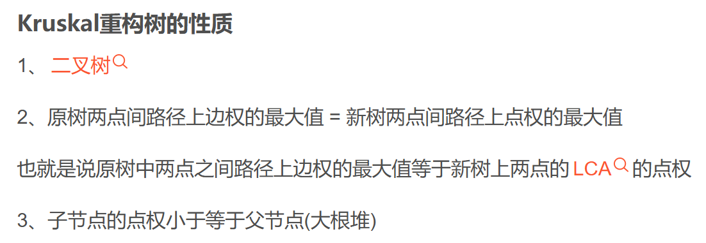

```c++
const int N = 200005;
int n,m;
struct nodes{
	int u,v,w;
	bool operator<(const nodes& t1)const{
		return w < t1.w;
	}
};
struct edges{
	int v,w,ne;
}e[N << 1];
int h[N],idx = 1;
void add(int u,int v,int w){
	e[++idx] = {v,w,h[u]};
	h[u] = idx;
}
//克鲁斯卡尔重构树部分
vt<nodes> a;
int f[N << 1],val[N << 1];
int fd(int x){
	if(f[x]!=x) f[x] = fd(f[x]);
	return f[x];
}
void ex(){
	int cnt = n;
	for(int i = 1;i <= 2 * n;i++) f[i] = i;
	sort(all(a));
	for(int i = 0;i < m;i++){
		int u = fd(a[i].u),v = fd(a[i].v);
		if(u == v) continue;
		cnt++;
		f[u] = cnt,f[v] = cnt; //两个连通块生成一个新的节点,权值为w
		val[cnt] = a[i].w;
		add(cnt,u,0);
		add(cnt,v,0);
		add(u,cnt,0);
		add(v,cnt,0);
		if(cnt == 2 * n - 1) break;
	}
}
//树链剖分求lca部分
int son[N],dep[N],sz[N],fa[N],top[N];
void dfs(int u,int f){
	fa[u] = f;
	sz[u] = 1;
	dep[u] = dep[f] + 1;
	for(int i = h[u];i;i=e[i].ne){
		int v = e[i].v;
		if(v == f) continue;
		dfs(v,u);
		sz[u] += sz[v];
		if(sz[v] > sz[son[u]]) son[u] = v;
	}
}
void dfs2(int u,int t){
	top[u] = t;
	if(!son[u]) return;
	dfs2(son[u],t);
	for(int i = h[u];i;i=e[i].ne){
		int v = e[i].v;
		if(v==fa[u] || v == son[u]) continue;
		dfs2(v,v);
	}
}
int lca(int x,int y){
	while(top[x]!=top[y]){
		if(dep[top[x]] < dep[top[y]]) swap(y,x); //深度更深的进行操作,默认x深度更深
		x = fa[top[x]];
	}
	return dep[x] < dep[y] ? x : y;
}
void solve(){
	cin >> n >> m;

	for(int i = 1;i <= m;i++){
		int u,v,w;
		cin >> u >> v >> w;
		a.pb({u,v,w});
	}
	ex();
	for(int i = 1;i <= 2 * n - 1;i++){
		if(dep[fd(i)] == 0){
			dfs(fd(i),0);
			dfs2(fd(i),fd(i));
		}
	}
	int q;
	cin >> q;
	while(q--){
		int u,v;
		cin >> u >> v;
		if(fd(u)==fd(v)){
			cout << val[lca(u,v)] << endl;
		}else{
			cout << "impossible" << endl;
		}

	}
}
```


## 13.0/1规划

**$$\frac{\sum_{i = 1}^{k}a_i}{\sum_{i = 1}^{k}b_i}$$**

是01规划,问题

如果要求最大值

我们可以枚举ans

使得

**$$\frac{\sum_{i = 1}^{k}a_i}{\sum_{i = 1}^{k}b_i}>=ans$$**

由各种证明能得出满足

$\sum_{i = 1}^{k}(a_i - b_i*ans) >= 0$

才能check true

对于k个事物都要满足

(有时候我们只需要二分这个 ans， 计算出每件物品的 a−b×ans，然后排个序，贪心取前 W 个加起来，看看最后的值是否 <=0 ，然后就可以根据结果移动左右边界了。)

# 数论

## 1.整除分块

```c++
//整除分块
for(int l=1,r;l<=n;l=r+1)
{
    r=n/(n/l);//后边(n/l)一定要加括号，是先向下取整后再被n除
    //执行一些操作
}
```

## 2.求逆元

### 1.线性递推

```c++
inv[1] = 1;
for(int i = 2; i <= n; ++i) inv[i] = inv[mod % i] * (mod - mod / i) % mod;
```

### **2.费马小定理**

```c++
int ksm(int x,int n,int mod)
{
	int res = 1;
    while(n){
        if(n&1) res = res * x % mod;
        x = x * x%mod;
        n >>= 1;
    }
    return res;
}
int iv(int x){
    return ksm(x,mod - 2,mod);
}
```

### 3.线性求组合数

```c++
int fac[N],inv[N];
int ksm(int x,int n,int mod){
	int res = 1;
    while(n){
        if(n&1) res = res * x % mod;
        x = x * x%mod;
        n >>= 1;
    }
    return res;
}
int iv(int x){
    return ksm(x,mod - 2,mod);
}
void getfac(){
    fac[0] = inv[0] = 1;
    for(int i = 1; i<N;i++){
        fac[i]=fac[i-1]*i%mod;
         inv[i] = iv(i) * inv[i-1] %mod;
    }
}
int C(int n,int m){
    return fac[n]*inv[n-m]%mod*inv[m]%mod;
}


```

## 3.矩阵模版

```c++
#include <iostream>
#include <cstring>
using namespace std;
template <int row, int col>
struct Matrix
{
    int r, c;
    long long ele[row][col];
    Matrix() { throw "Please set row and column!"; }
    Matrix(int a, int b) : r(a), c(b) { memset(ele, 0, sizeof(ele)); }
    Matrix(int a) : r(a), c(a) {memset(ele, 0, sizeof(ele));for(int i = 0;i < a;i++)ele[i][i] = 1;}
    long long &operator()(int a, int b) { return ele[a][b]; }
    Matrix &operator+=(Matrix oth) { return *this = *this + oth; }
    Matrix &operator-=(Matrix oth) { return *this = *this - oth; }
    Matrix &operator*=(Matrix oth) { return *this = *this * oth; }
};
template <int m, int n>
Matrix<m, n> operator+(Matrix<m, n> m1, Matrix<m, n> m2)
{
    Matrix<m, n> ret;
    for (int i = 0; i < m1.r; i++)
        for (int j = 0; j < m1.c; j++)
            ret(i, j) = m1(i, j) + m2(i, j);
    return ret;
}
template <int m, int n>
Matrix<m, n> operator-(Matrix<m, n> m1, Matrix<m, n> m2)
{
    Matrix<m, n> ret;
    for (int i = 0; i < m1.r; i++)
        for (int j = 0; j < m1.c; j++)
            ret(i, j) = m1(i, j) + m2(i, j);
    return ret;
}
template <int m, int n, int p>
Matrix<m, p> operator*(Matrix<m, n> m1, Matrix<n, p> m2) //普通乘法
{
    Matrix<m, p> ret(m1.r, m2.c);
    for (int i = 0; i < m1.r; i++)
        for (int k = 0; k < m1.c; k++)
            for (int j = 0; j < m2.c; j++)
                ret(i, j) += m1(i, k) * m2(k, j);
    return ret;
}
template <int m, int n>
Matrix<m, n> operator^(Matrix<m, n> mat, long long k) //快速幂
{
    Matrix<m, n> ans = mat;
    for (k--; k; mat *= mat, k >>= 1)
        if (k & 1)
            ans *= mat;
    return ans;
}
template <int m, int n, int p>
Matrix<m, p> mulmod(Matrix<m, n>& m1, Matrix<n, p>& m2, int mod) //乘加取模
{
    Matrix<m, p> ret(m1.r, m2.c);
    for (int i = 0; i < m1.r; i++)
        for (int k = 0; k < m1.c; k++)
            for (int j = 0; j < m2.c; j++)
                ret(i, j) = (ret(i, j) + m1(i, k) * m2(k, j) % mod) % mod;
    return ret;
}
int qadd(int a,int b,int p)
{
    int res = 0;
    while(b)
    {
        if(b & 1) res = (res + a) % p;
        a = (a + a) % p;
        b >>= 1;
    }
    return res;
}
template <int m, int n, int p>
Matrix<m, p> slowmulmod(Matrix<m, n>& m1, Matrix<n, p>& m2, int mod) //龟速乘加取模,防止爆long long
{
    Matrix<m, p> ret(m1.r, m2.c);
    for (int i = 0; i < m1.r; i++)
        for (int k = 0; k < m1.c; k++)
            for (int j = 0; j < m2.c; j++)
                ret(i, j) = (ret(i, j) + qadd(m1(i, k),m2(k, j),mod) % mod) % mod;
    return ret;
}
template <int m, int n>
Matrix<m, n> qpowmod(Matrix<m, n>& mat, long long k, int mod) //快速幂取模
{
    Matrix<m, n> ans(mat.r);
    for (int p = k; p; mat = mulmod(mat, mat, mod), p >>= 1)
        if (p & 1)
            ans = mulmod(ans, mat, mod);
    return ans;
}
template <int m, int n>
ostream &operator<<(ostream &os, Matrix<m, n> &mat)
{
    for (int i = 0; i < mat.r; i++)
    {
        for (int j = 0; j < mat.c; j++)
            os << mat(i, j) << ' ';
        os << endl;
    }
    return os;
}
template <int m, int n>
istream &operator>>(istream &is, Matrix<m, n> &mat)
{
    for (int i = 0; i < mat.r; i++)
        for (int j = 0; j < mat.c; j++)
            is >> mat(i, j);
    return is;
}
const int maxn = 105;
int main()
{
    int n;
    long long k;
    const int p = 1e9 + 7;
    cin >> n >> k;
    Matrix<maxn, maxn> mat(n, n);
    cin >> mat;
    auto tmp = qpowmod(mat, k, p);
    cout << tmp;
    return 0;
}
```

## 4.gcd性质

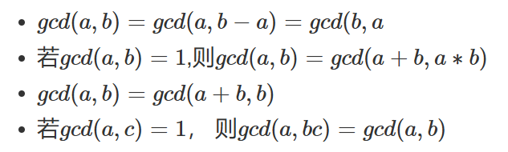

## 5.性质:

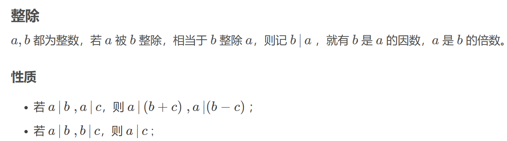

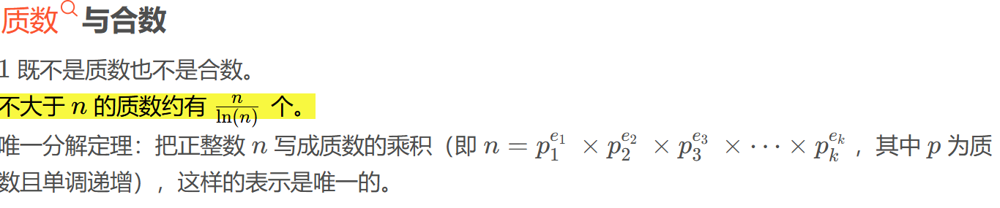

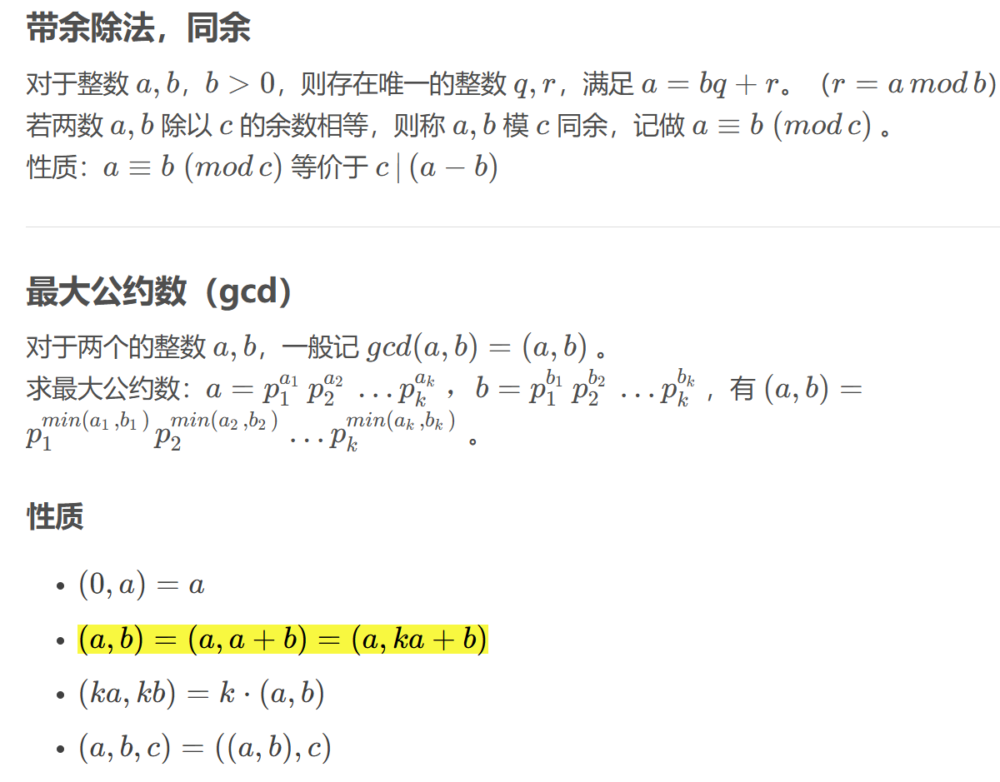

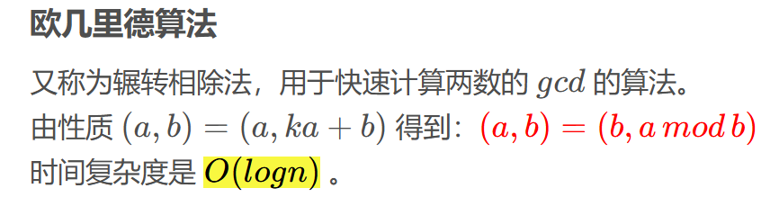

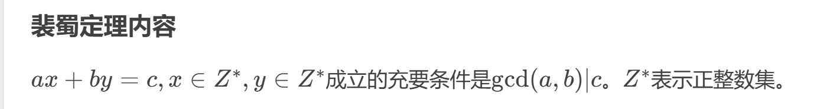

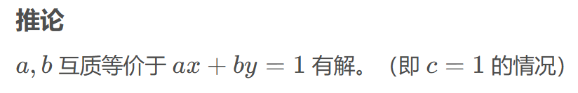

## 6.欧拉筛求欧拉函数


```c++
int primes[N], cnt;  // primes[]存储所有素数
int euler[N];        // 存储每个数的欧拉函数
bool st[N];         // st[x]存储x是否被筛掉
 
 
void get_eulers(int n)
{
    euler[1] = 1;//初始化
    for (int i = 2; i <= n; i ++ )
    {
        if (!st[i])
        {
            primes[cnt ++ ] = i;
            euler[i] = i - 1;//如果i是质数，那么1~i-1都与它互质
        }
        for (int j = 0; j<cnt&&i*primes[j] <= n; j ++ )
        {
            int t = primes[j] * i;
            st[t] = true;
            if (i % primes[j] == 0)//primes[j]是i的最小质因数也是t的最小质因数
            {
                euler[t] = euler[i] * primes[j]; //因为i有prim[j],我的t只比i多prm[j],其余不变,只需乘以prmj即可
                break;
            }//当i%primes[j]!=0时,primes[j]不是i的质因数,但却是t的最小质因数
            euler[t] = euler[i] * (primes[j] - 1);
            //由euler[t]=euler[i]/primes[j]*(primes[j] - 1)*primes[j]化简得↑
            //因为t比i多prm[j],但是i不可以整除prmj,t可以,那么t比i多一个 prm[j]/prm[j-1]
        }
    }
}
```

## 7.线性基

线性基只要能彻底理解它的三大性质，就可以用到做题上了

1. 原序列里面的任意一个数都可以由线性基里面的一些数异或得到
2. 线性基里面的任意一些数异或起来都不能得到 0
3. 线性基里面的数的个数唯一，并且在保持性质一的前提下，数的个数是最少的

```c++
struct Lb{
	int lb[61];
	int rank; //多少个线性基,线性基的大小
	void clear(){
		rank = 0;
		for(int i = 0;i <= 60;i++) lb[i] = 0;
	} 
	bool insert(int x){
		for(int i = 60;i>=0;i--){
			if(x>>i&1){
				if(lb[i]==0){
					lb[i]=x;
					rank++;
					return 1; //插入成功
				}
				x^=lb[i];
			}
		}
		return false;
	}
}b[N];
```

```c++
//插入,查找
const int N = 1e6 + 7;
int b[62];
void ins(int x){
	for(int i=32;i>=0;i--){
		if(x&(1ll<<i)){
			if(!b[i]){
				b[i]=x;
				return;
			}
			x^=b[i];
		}
	}
}
int find(int x){
	for(int i=32;i>=0;i--){
		if(x&(1ll<<i)){
			if(!b[i])
				return 0;
			x^=b[i];
		}
	}
	return 1;
}

//当两个线性基需要合并时，直接将一个线性基暴力的插入另一个线性基即可。
LL d1[60+5],d2[60+5];//合并前的两个线性基
LL d[60+5];//合并后的线性基
void Union(){
    memcpy(d,d1,sizeof(d1));
    for(int i=0;i<=60;i++){
        if(d2[i])
            add(d2[i]);
    }
}
//最大值
LL queryMax() {
    LL res=0;
    for(int i=60; i>=0; i--)
        if((res^d[i])>res)
            res^=d[i];
    return res;
}
//最小值
LL d[60+5];//线性基
LL queryMin(){
    for(int i=0; i<=60; i++)
        if(d[i])
            return d[i];
    return 0;
}
```

```c++
//第k小
LL d[60+5];//线性基
LL p[60+5];//改造后的线性基
int cnt;
void rebuild() {//改造线性基
    for(int i=60; i>=0; i--)
        for(int j=i-1; j>=0; j--)
            if(d[i]&(1LL<<j))
                d[i]^=d[j];
    for(int i=0; i<=60; i++)
        if(d[i])
            p[cnt++]=d[i];
}
LL queryKth(LL k){//查询第k小的值，若要查k大，将k换为n-k+1即可
    int res=0;
    if(k>=(1LL<<cnt))
        return -1;
    for(int i=60; i>=0; i--)
        if(k&(1LL<<i))
            res^=p[i];
    return res;
}
```

高斯消元法

```c++
int n,k;
int d[N];
void gauss(){ //高斯消元法
  for(int i=63;i>=0;i--){
    // 把当前第i位是1的数换上去
    for(int j=k;j<n;j++)
      if(d[j]>>i&1){swap(d[j],d[k]); break;}
    // 当前第i位所有向量都是0
    if((d[k]>>i&1)==0) continue;
    // 把其他数的第i位全部消为0
    for(int j=0;j<n;j++)
      if(j!=k&&(d[j]>>i&1)) d[j]^=d[k];
    // 基的个数+1
    k++; if(k==n) break;
  }

```

## 8.约数和定理

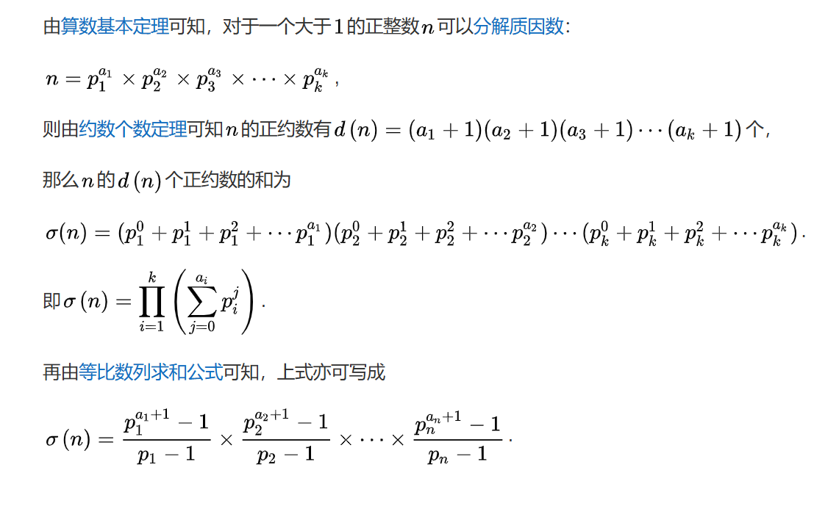

# 数据结构

## 1.并查集

```c++
/初始化
void init(){
	for(int i = 0; i < N; i++) u[i] = -1; 
} 
//查找到一次就挂在根节点下面从而优化 
int findu(int x){
	int root = x;
	while(u[root]>=0){
		root = u[root]; 
	} //循环找根
	while(x!=root){
		int t = u[x]; //t指向x的父节点
		u[x] = root;//将x直接挂在根节点下面
		x = t; 
	} 
	return root; 
}
//合并(union) 两个根 root2 合并到root1 
void unionu(int root1,int root2){
	if(root1 == root2) return;
	if(u[root2] > u[root1]){ //root2节点数更少 
		u[root1] += u[root2];
		u[root2] = root1;//小数合并到大树 
	} else{
		u[root2] += u[root1];
		u[root1] = root2; 
	} 
} 
```

带权并查集

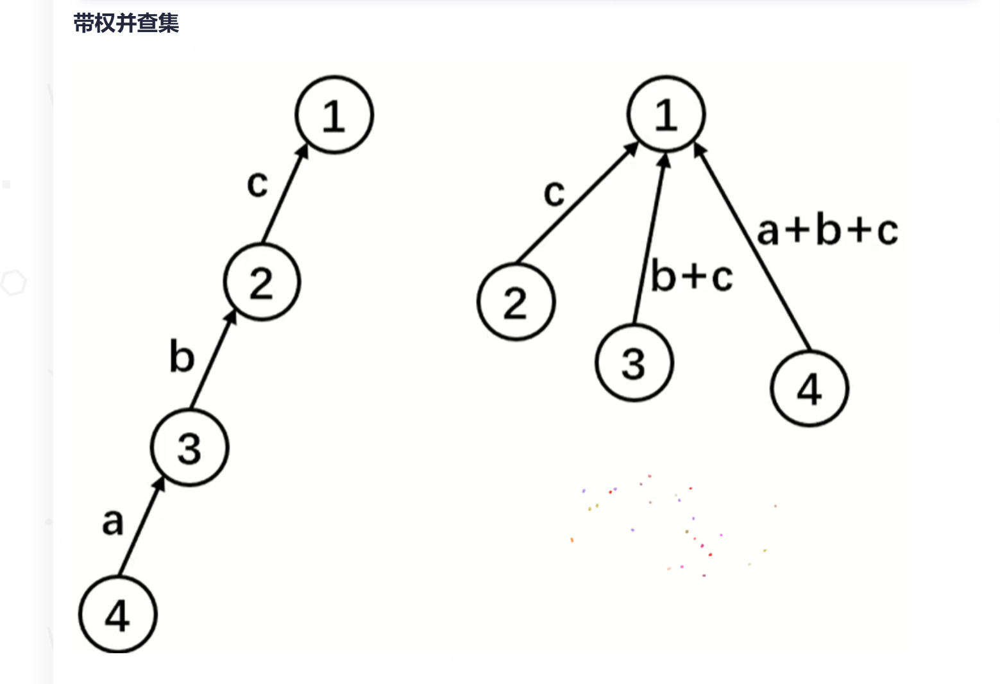

```c++
//食物链例题
const int N = 200005;
int f[N],d[N];
int n,m;
int fd(int x){
	if(x!=f[x]){
		int t = f[x];
		f[x] = fd(f[x]);
		d[x] += d[t];
	} 
	return f[x];
}
int calc(int x,int y){
	return ((x-y)%3 + 3)%3;
}
void merge(int x,int y,int v){
	int px = fd(x),py = fd(y);
	f[px] = py;
	d[px] = d[y] - d[x] + v;
}
void solve(){
	cin >> n >> m;
	iota(f,f+n+1,0);
	int cnt = 0;
	while(m--){
		int u,v,op;
		cin >> op >> u >> v;
		if(u>n||v>n){
			cnt++;
			continue;
		}
		if(op==1){
			if(fd(u)==fd(v) && calc(d[u],d[v]) != 0){
				cnt++;
				continue;
			}
			//d[v] = d[u] + d[fd(u)]
			//d[fd[u]] = d[v] - d[u]
			if(fd(u)!=fd(v)) merge(u,v,0);
		}else{
			if(fd(u)==fd(v) && calc(d[u],d[v]) != 1){
				cnt++;
				continue;
			}
			//d[v] = d[u] - 1  + d[fd(u)]
			//d[fd[u]] = d[v] - d[u] + 1
			if(fd(u)!=fd(v)) merge(u,v,1);
		}
	}
	cout << cnt << endl;
}
```

## 2.01trie

```c++
int ch[N][2];
int idx;
void add(int x){
	int p = 0;
	for(int i = 8; i >= 0; i--){
		int u = x >> i & 1;
		if(!ch[p][u]) ch[p][u] = ++idx;
		p = ch[p][u];
	}
}
int query(int x){
	int res = 0, p = 0;
	for(int i = 8; i >= 0;i--){
		int u = x >> i & 1;
		if(ch[p][u ^ 1]){
			res |= 1 << i;
			p = ch[p][u ^ 1];
		}else if(ch[p][u]){
			p = ch[p][u];
		}
	}
	return res;
}
void solve(){
	int n;
	memset(ch,0,sizeof ch);
	idx = 0;
	cin >> n;
	int pre = 0;
	add(0);
	int ans = 0;
	for(int i = 1; i <= n; i++){
		int t;
		cin >> t;
		pre = pre ^ t;
		ans = max(ans,query(pre));
		add(pre);
	}
	cout << ans << endl;

}
signed main(){
	std::ios::sync_with_stdio(0);
    std::cin.tie(0);
    std::cout.tie(0);
	int times = 1;
	cin >> times;
	while(times--){
		solve();
	}
	return 0;
}
```

## 3.线段树

```c++
#define lc u<<1
#define rc u<<1|1
int n,p;
int a[N];
struct Tree{
	int l,r,mul,add,val;
} tr[N<<2];
void up(int u){
	tr[u].val = (tr[lc].val + tr[rc].val)%p;
}
void build(int u,int l,int r){
	tr[u] = {l,r,1,0,0};
	if(l==r){
		tr[u].val = a[l];
		return;
	}
	int mid = (l + r) >> 1;
	build(lc,l,mid);
	build(rc,mid + 1,r);
	up(u);
}
void calc(int u,int m,int a){
	tr[u].val = (tr[u].val * m + (tr[u].r - tr[u].l + 1) * a)%p;
	tr[u].mul = (tr[u].mul * m)%p;
	tr[u].add = (tr[u].add*m + a)%p;
}
void down(int u){
	calc(lc,tr[u].mul,tr[u].add);
	calc(rc,tr[u].mul,tr[u].add);
	tr[u].add = 0;
	tr[u].mul = 1;
}
void update(int u,int l,int r,int m,int a){
	if(tr[u].r < l || tr[u].l > r) return;
	if(tr[u].l >= l && tr[u].r <= r){
		calc(u,m,a);
		return;
	}
	down(u);
	update(lc,l,r,m,a);
	update(rc,l,r,m,a);
	up(u);
}
int quary(int u,int l,int r){
	if(tr[u].r < l || tr[u].l > r) return 0;
	if(tr[u].l >= l && tr[u].r <= r){
		return tr[u].val;
	}
	down(u);
	return (quary(lc,l,r) + quary(rc,l,r))%p;
}
void solve(){
	cin >> n >> p;
	for(int i = 1; i <= n;i++) cin >> a[i];
	int q;
	cin >> q;
	build(1,1,n);
	while(q--){
		int mod,l,r;
		cin >> mod >> l >> r;
		if(mod == 1){
			int val;
			cin >> val;
			update(1,l,r,val,0);
		}else if(mod == 2){
			int val;
			cin >> val;
			update(1,l,r,1,val);
		}else{
			cout << quary(1,l,r) << endl;
		}
	}
}
```

## 4.线段树2

区间加乘(乘法优先)

```c++
int n,p;
int a[N];
struct Tree{
	int l,r,mul,add,val;
} tr[N<<2];
void up(int u){
	tr[u].val = (tr[lc].val + tr[rc].val)%p;
}
void build(int u,int l,int r){
	tr[u] = {l,r,1,0,0};
	if(l==r){
		tr[u].val = a[l];
		return;
	}
	int mid = (l + r) >> 1;
	build(lc,l,mid);
	build(rc,mid + 1,r);
	up(u);
}
void calc(int u,int m,int a){
	tr[u].val = (tr[u].val * m + (tr[u].r - tr[u].l + 1) * a)%p;
	tr[u].mul = (tr[u].mul * m)%p;
	tr[u].add = (tr[u].add*m + a)%p;
}
void down(int u){
	calc(lc,tr[u].mul,tr[u].add);
	calc(rc,tr[u].mul,tr[u].add);
	tr[u].add = 0;
	tr[u].mul = 1;
}
void update(int u,int l,int r,int m,int a){
	if(tr[u].r < l || tr[u].l > r) return;
	if(tr[u].l >= l && tr[u].r <= r){
		calc(u,m,a);
		return;
	}
	down(u);
	update(lc,l,r,m,a);
	update(rc,l,r,m,a);
	up(u);
}
int quary(int u,int l,int r){
	if(tr[u].r < l || tr[u].l > r) return 0;
	if(tr[u].l >= l && tr[u].r <= r){
		return tr[u].val;
	}
	down(u);
	return (quary(lc,l,r) + quary(rc,l,r))%p;
}
void solve(){
	cin >> n >> p;
	for(int i = 1; i <= n;i++) cin >> a[i];
	int q;
	cin >> q;
	build(1,1,n);
	while(q--){
		int mod,l,r;
		cin >> mod >> l >> r;
		if(mod == 1){
			int val;
			cin >> val;
			update(1,l,r,val,0);
		}else if(mod == 2){
			int val;
			cin >> val;
			update(1,l,r,1,val);
		}else{
			cout << quary(1,l,r) << endl;
		}
	}
}
```

## 5.树状数组

### 离散化

```c++
const int N = 300005;
//不要把题目想的太难
vector<int> LS;//离散化
vector<pair<int,int>> add(N);//修改	
vector<pair<int,int>> qs(N);//询问
int a[N],pre[N];//每一个的值
int getidx(int x){
	//[1,ls.size()];
	return lower_bound(LS.begin(),LS.end(),x) - LS.begin() + 1;
}
void solve(){
	int n,q;
	cin >> n >> q;

	for(int i = 1; i <= n; i++){
		int t,v;
		cin >> t >> v; //单点修改 a[t] += v
		add[i] = {t,v};
		LS.push_back(t);
	}
	for(int i = 1; i <= q;i++){
		int x,y;
		cin >> x >> y;
		qs[i] = {x,y};
		LS.push_back(x);
		LS.push_back(y);
	}
	//排序去重
	sort(LS.begin(),LS.end());
	LS.erase(unique(LS.begin(),LS.end()),LS.end());
	for(int i = 1; i <= n;i++){
		int idx,w;
		idx = getidx(add[i].first);
		w = add[i].second;
		a[idx] += w;
	}
	for(int i = 1; i <= LS.size();i++){ //注意这里是LS.size();
		pre[i] = pre[i - 1] + a[i];
	}
	for(int i = 1; i <= q;i++){
		int l = getidx(qs[i].first), r = getidx(qs[i].second);
		cout << pre[r] - pre[l - 1] << endl;
	}
}
```

### 树状数组模版

```c++
const int N = 200005;
//不要把题目想的太难
int a[N], t[N];
int n,q;
//lowbit
int lb(int x){return x&-x;}
void update(int k,int x){
	for(int i = k; i <= n; i+=lb(i)) t[i]+=x; //注意是lb(i)
}
int quary(int k){
	int res =0 ;
	for(int i = k; i > 0; i -= lb(i)) res+=t[i];
	return res;
}
void solve(){
	
	cin >> n >> q;
	for(int i = 1; i <= n; i++) cin >> a[i];
	for(int i = 1; i <= n ; i++){
		update(i,a[i]);
	}
	while(q--){
		int op;
		cin >> op;
		if(op==1){
			int k,v; cin >> k >> v;
			update(k,v);
		}else{
			int l,r; cin >> l >> r;
			cout << quary(r) - quary(l - 1) << endl;
		}
	}
}
```

## 6.分块

```c++
int a[N];
int e[N];//排序的副本
int be[N],L[N],R[N];
int tag[N];//累加值
void solve(){
	//初始化块工作
	int n,q;
	cin >> n >> q;
	for(int i = 1; i <= n;i++) cin >> a[i];
	int block = sqrt(n);//块长;
	int tot = (n + block - 1)/block;//多少个块,上取整,最后一块可以不到block
	auto cg = [&](int k){
		for(int i = L[k];i <= R[k];i++) e[i] = a[i];
		sort(e + L[k],e + R[k] + 1);
	};//维护k这个块的数据,这里是维护值的顺序
	for(int i = 1;i <= tot;i++){
		L[i] = (i-1)*block + 1;
		R[i] = min(i*block,n);
		for(int j = L[i]; j <= R[i];j++) be[j] = i;
		cg(i); //初始化每一个块
	}
	//开始查询
	while(q--){
		char mod;
		int x,y,v;
		cin >> mod >> x >> y >>v;
		if(mod == 'M'){
			if(be[x]==be[y]){
				for(int i =x; i <= y;i++) a[i] += v;
				cg(be[x]);
			}else{
				for(int i = x; i<= R[be[x]];i++){
					a[i]+=v;
				}
				for(int i = L[be[y]]; i<= y;i++){
					a[i]+=v;
				}
				cg(be[x]);
				cg(be[y]);
				for(int i = be[x] + 1; i <= be[y] - 1;i++){
					tag[i]+=v;
				}
			}
		}else{
			int ans = 0;
			if(be[x]==be[y]){
				for(int i = x;i<=y;i++) if(a[i] + tag[be[i]]>= v) ans++;
			}else{
				for(int i = x; i<= R[be[x]];i++){
					if(a[i] + tag[be[i]]>= v) ans++;
				}
				for(int i = L[be[y]]; i<= y;i++){
					if(a[i] + tag[be[i]] >= v) ans++;
				}
				for(int i = be[x] + 1;i <= be[y] - 1;i++){
					ans += e+R[i] - lower_bound(e+L[i],e+R[i]+1,v-tag[i]) + 1;
				}
			}
			cout << ans <<endl;
		}
	}
}
```

### 分块求topk

```c++
int e[N];
int l[N],r[N],be[N];
int tag[N];
int block,tot;
//o(根号n) 动态求topk问题
void insert(int x){
	tag[be[x]]++;
	e[x]++;
}
//将数字装桶,暴力每个桶,发现经过一个桶后发现符合条件,暴力改块
int quary(int c){
	int res = 0;
	for(int i = 1; i <= tot;i++){
		res+=tag[i];
		if(res >= c){
			int g = res - tag[i];
			for(int j = l[i];j<=r[i];j++){
				g+=e[j];
				if(g>=c){
					return j;
				}
			}
		}
	}
	return -1;
}
```

## 7.莫队

```c++
#include<bits/stdc++.h>
using namespace std;
#define debug(a) cout << "debug : " << (#a) << " = " << a << endl
#define int long long
#define lc u<<1
#define rc u<<1|1
#define PII pair<int,int>
#define endl "\n"
#define il inline
typedef unsigned long long ULL;
typedef long long ll;
il int read(){
	int x=0,f=1;char ch=getchar();
	while(ch<'0'||ch>'9'){if(ch=='-')f=-1;ch=getchar();}
	while(ch>='0'&&ch<='9')x=(x<<3)+(x<<1)+(ch^48),ch=getchar();
	return x*f;
}
#define rep(i, a, b) for (int i = ll(a); i <= ll(b); ++i)
const int N = 5e4+7;
int block;
struct mdb{
	int l,r,id;
} md[N];
int n,m,k;
int cnt[N],a[N],ans[N];
bool cmp(mdb m1,mdb m2){
	if(m1.l /block !=m2.l/block){
		return m1.l /block < m2.l/block;
	}
	if(m1.l/block&1){
		return m1.r > m2.r;
	}
	return m1.r < m2.r;
}
int res = 0;
void add(int id){
	//if(a[id]>k) return;
	res-=cnt[a[id]]*cnt[a[id]];
	cnt[a[id]]++;
	res+=cnt[a[id]]*cnt[a[id]];
}
void del(int id){
	//if(a[id]>k) return;
	res-=cnt[a[id]]*cnt[a[id]];
	cnt[a[id]]--;
	res+=cnt[a[id]]*cnt[a[id]];
}

void solve(){
	cin >> n >> m >> k;
	block = sqrt(n);
	for(int i = 1; i <= n;i++){
		cin >> a[i];
	}
	for(int i = 1; i <= m;i++){
		cin >>md[i].l >> md[i].r;
		md[i].id = i;
	}
	sort(md+1,md+1+m,cmp);
	int l = 1, r= 0;
	for(int i = 1; i <= m;i++){
		while(l > md[i].l) add(--l);
		while(l < md[i].l) del(l++);
		while(r > md[i].r) del(r--);
		while(r < md[i].r) add(++r);
		ans[md[i].id] = res;
	}
	for(int i = 1; i <= m;i++){
		cout << ans[i] << endl;
	}
}

signed main(){
	std::ios::sync_with_stdio(0);
    std::cin.tie(0);
    std::cout.tie(0);
	int times = 1;
	//cin >> times;
	while(times--){
		solve();
	}
	return 0;
}
```

## 8.虚树

```c++
struct edges{
	int v,ne;
}e[N << 1];
int h[N],idx = 0;
void add(int u,int v){
	e[idx] = {v,h[u]};
	h[u] = idx++;
}
int fa[N],son[N],sz[N],top[N],dep[N],dfn[N],tot = 0;
//lca
void dfs1(int u,int f){
	fa[u] = f;
	sz[u] = 1;
	dfn[u] = ++tot;
	dep[u] = dep[f] + 1;
	for(int i = h[u];~i;i=e[i].ne){
		int v = e[i].v;
		if(v==f) continue;
		dfs1(v,u);
		sz[u]+=sz[v];
		if(sz[son[u]] < sz[v]) son[u] = v;
	}
} 
void dfs2(int u,int t){
	top[u] = t;
	if(!son[u]) return;
	dfs2(son[u],t);
	for(int i = h[u];~i;i=e[i].ne){
		int v = e[i].v;
		if(v==son[u]||v==fa[u]) continue;
		dfs2(v,v);
	}
}	
int lca(int a,int b){
	while(top[a]!=top[b]){
		if(dep[top[a]] < dep[top[b]]) swap(a,b);
		a = fa[top[a]];
	}
	return dep[a] < dep[b] ? a : b;
}
bool cmp(int a,int b){
	return dfn[a] < dfn[b];
}
int a[N],k;
int stk[N],tp;

void build(){
	sort(a + 1,a + k + 1,cmp);
	idx = 0;//请空上次的边

	stk[tp = 1] = 1; //根入栈
	if(a[1]!=1) stk[++tp] = a[1];
	for(int i = 2;i <= k;i++){
		int l = lca(stk[tp],a[i]);
		while(tp > 1 && dep[stk[tp - 1]] >= dep[l]){
			add(stk[tp - 1],stk[tp]),tp--;
		}
		if(l!=stk[tp]) add(l,stk[tp]),stk[tp] = l;
		stk[++tp] = a[i];
	}
	while(tp) add(stk[tp - 1],stk[tp]),tp--;
}
```

## 9.扫描线

```c++
#define lc u<<1
#define rc u<<1|1
const int N = 200005;
struct node{
	int x1,x2,y,val;
	bool operator<(const node& t1)const{
		return t1.y > y;
	}
}a[N << 1]; //两倍的线
int n;
vector<int> x;
int gt(int val){return lower_bound(x.begin(),x.end(),val) - x.begin() + 1;}
struct tree{
	int l,r;
	int cnt,len; //覆盖次数,长度
}tr[N << 4];
void push_up(int u){
	int l = tr[u].l, r = tr[u].r;
	if(tr[u].cnt) tr[u].len = x[r] - x[l-1];//被覆盖那么就是整个区间[l,r+1],但是x是从0开始下标的
	else tr[u].len = tr[lc].len + tr[rc].len;
}
void build(int u,int l,int r){
	tr[u] = {l,r,0,0};
	if(l==r) return;
	int mid = l + r>> 1;
	build(lc,l,mid);
	build(rc,mid+1,r);
}
void modify(int u,int l,int r,int cnt){
	if(tr[u].r < l || tr[u].l > r) return;
	if(tr[u].l >= l && tr[u].r <= r){
		tr[u].cnt+=cnt;
		push_up(u);   //根据cnt的值动态更新区间长度
		return;
	}
	modify(lc,l,r,cnt);
	modify(rc,l,r,cnt);
	push_up(u);
}
void solve(){
	cin >> n;
	for(int i = 1;i <= n;i++){
		int x1,y1,x2,y2;
		cin >> x1 >> y1 >> x2 >> y2;
		a[i] = {x1,x2,y1,1};
		a[i + n] = {x1,x2,y2,-1};
		x.push_back(x1);
		x.push_back(x2);
	}
	sort(x.begin(),x.end());
	n = n*2; //因为矩形两条边所以数组长度*2
	sort(a + 1,a + 1 + n);
	x.erase(unique(x.begin(),x.end()),x.end());
	int sz = x.size();
	build(1,1,sz - 1);
	int res = 0;
	for(int i = 1;i < n;i++){
		int l = gt(a[i].x1);
		int r = gt(a[i].x2) - 1;
		modify(1,l,r,a[i].val);//正或者负贡献
		res += (tr[1].len) * (a[i + 1].y - a[i].y);
	}
	cout << res << endl;
}
```

## 10.cdq分治

```c++
const int N = 200005;
int tr[N];
void add(int k,int val){
	for(int i = k;i < N;i+=(i&-i)) tr[i]+=val;
}
int query(int k){
	int res = 0;
	for(int i = k;i > 0;i-=(i&-i)) res+=tr[i];
	return res;
}
struct node{
	int x,y,z,cnt,num;//cnt为相同个数,num为答案;
}a[N],b[N];
bool cmp(node a,node b){
	if(a.x!=b.x) return a.x < b.x;
	if(a.y!=b.y) return a.y < b.y;
	return a.z < b.z;
}
bool cmp2(node a,node b){
	if(a.y==b.y) return a.z < b.z;
	return a.y < b.y;
}
int n,k;
int m = 0;
void cdq(int l,int r){
	if(l==r) return;
	int mid = l+r>>1;
	cdq(l,mid),cdq(mid+1,r);
	sort(b + l,b + mid + 1,cmp2);
	sort(b + mid + 1,b + r + 1,cmp2);
	int i = l,j = mid + 1;
	for(;j<=r;j++){
		while(i <= mid && b[i].y <= b[j].y){
			add(b[i].z,b[i].cnt);
			i++;			
		}
		b[j].num += query(b[j].z);
	}
	for(int j = l;j < i;j++) add(b[j].z,-b[j].cnt); //还原
}
int ans[N];
void solve(){
	cin >> n >> k;
	for(int i = 1; i<=n;i++){
		cin >> a[i].x >> a[i].y >> a[i].z;
	}
	sort(a + 1, a + n + 1,cmp);
	int len = 0;//查重
	for(int i = 1;i <= n;i++){
		len++;
		if(a[i].x!=a[i + 1].x || a[i].y != a[i + 1].y || a[i].z!=a[i + 1].z){
			a[i].cnt = len;
			b[++m] = a[i];
			len=0;
		}
	}
	cdq(1,m);
	for(int i = 1;i <= m;i++){
		ans[b[i].num + b[i].cnt - 1] += b[i].cnt;
	}
	for(int i = 0; i < n;i++){
		cout << ans[i] << endl;
	}
}
```

## 11.主席树

可持久化数组

```c++
const int N = 1000005;
int ls[N*30],rs[N*30],val[N*30];
int root[N],tot;
int a[N];
int n,m;
void build(int &u,int l,int r){
	u = ++tot;
	if(l==r){
		val[u] = a[l];
		return;
	}
	int mid = l+r>>1;
	build(ls[u],l,mid);
	build(rs[u],mid+1,r);
}
void update(int& u,int v,int l,int r,int x,int k){
	u = ++tot;
	ls[u] = ls[v];
	rs[u] = rs[v];
	val[u] = val[v];
	if(l==r){
		val[u] = k;
		return;
	}
	int mid = l+r>>1;
	if(x <= mid){
		update(ls[u],ls[v],l,mid,x,k);
	}else{
		update(rs[u],rs[v],mid+1,r,x,k);
	}
}
int query(int u,int l,int r,int x){
	if(l==r){
		return val[u];
	}
	int mid = l+r>>1;
	if(x <= mid){
		return query(ls[u],l,mid,x);
	}
	return query(rs[u],mid+1,r,x);
}
void solve(){
	cin >> n >> m;
	for(int i = 1;i <= n;i++){
		cin >> a[i];
	}
	build(root[0],1,n);
	for(int i = 1;i<=m;i++){
		int v,op;
		cin >> v >> op;
		if(op==1){
			int x,k;
			cin >> x >> k;
			update(root[i],root[v],1,n,x,k);
		}else{
			int x;
			cin >> x;
			root[i] = root[v];
			cout << query(root[i],1,n,x) << endl;
		}
	}
}
```

静态区间第k小

```c++
const int N = 200005;
int n,m,a[N];
int ls[N * 40],rs[N * 40],val[N * 40];
int root[N],tot;
vector<int> v;
int get_idx(int x){
	return lower_bound(v.begin(),v.end(),x) - v.begin() + 1;
}
void build(int &u,int l,int r){
	u = ++tot;
	if(l==r) return;
	int mid = l+r>>1;
	build(ls[u],l,mid);
	build(rs[u],mid+1,r);
}
void update(int& u,int v,int l,int r,int x){
	u = ++tot;
	ls[u] = ls[v],rs[u] = rs[v],val[u] = val[v] + 1;
	if(l==r) return;
	int mid = l+r>>1;
	if(x <= mid){
		update(ls[u],ls[v],l,mid,x);
	}else{
		update(rs[u],rs[v],mid+1,r,x);
	}
}
int query(int u,int v,int l,int r,int k){
	if(l==r){
		return l;
	}
	int mid = l+r>>1;
	int s = val[ls[u]] - val[ls[v]];
	if(s >= k){
		return query(ls[u],ls[v],l,mid,k);
	}
	return query(rs[u],rs[v],mid + 1,r,k - s);
}
void solve(){
	cin >> n >> m;
	for(int i = 1;i<=n;i++){
		cin >> a[i];
		v.push_back(a[i]);
	}
	sort(v.begin(),v.end());
	v.erase(unique(v.begin(),v.end()),v.end());
	int len = v.size();
	build(root[0],1,len);
	for(int i = 1;i<=n;i++){
		update(root[i],root[i - 1],1,len,get_idx(a[i]));
	}
	while(m--){
		int l,r,k;
		cin >> l >> r >> k;
		cout << v[query(root[r],root[l - 1],1,len,k) - 1] << endl;
	}
}
```

## 12.树上启发式合并

```c++
const int N = 500005;
struct edges{
    int v,ne;
}e[N<<1];
struct quary{
    int h,id;
};
vector<quary> tb[N];
int h[N],idx = 0;
void add(int u,int v){
    e[idx] = {v,h[u]};
    h[u] = idx++;
}
string s;
int n,q;
int cnt[N][26];
int sz[N],dep[N],son[N];
int flag;
int ans[N];
void dfs(int u,int f,int path){
    sz[u] = 1,dep[u] = path;
    for(int i = h[u];~i;i=e[i].ne){
        int v= e[i].v;
        if(v==f) continue;
        dfs(v,u,path+1);
        sz[u]+=sz[v];
        if(sz[son[u]] < sz[v]){
            son[u] = v;
        }
    }
}
void count(int u,int f,int val){
    cnt[dep[u]][s[u] - 'a']+=val;
    for(int i = h[u];~i;i=e[i].ne){
        int v = e[i].v;
        if(v==flag || v == f) continue;
        count(v,u,val);
    }
}
void dfs2(int u,int f,int keep){
    //遍历轻儿子,算子数,删贡献
    for(int i = h[u];~i;i=e[i].ne){
        int v = e[i].v;
        if(v == f || v == son[u]) continue;
        dfs2(v,u,0);
    }
    if(son[u]){
        dfs2(son[u],u,1);
         flag = son[u];
    }
    count(u,f,1);
    flag = 0;
    for(auto &p:tb[u]){
        int h = p.h;
        int id = p.id;
        int ct = 0;
        for(int i = 0; i < 26;i++){
            if(cnt[h][i]%2==1) ct++;
        }
        if(ct<=1) ans[id] = 1;
    }
    if(!keep){
        count(u,f,-1);
    }
}
void solve(){
    memset(h,-1,sizeof h);
    cin >> n >> q;
    for(int i = 2;i <= n;i++){
        int u;
        cin >> u;
        add(u,i);
        add(i,u);
    }
    cin >> s;
    s=" " + s;
    int id = 0;
    int g = q;
    while(q--){
        int x,y;
        cin >> x >> y;
        tb[x].push_back({y,id++});
    }
    dfs(1,0,1);
    dfs2(1,0,0);
    for(int i = 0;i<g;i++){
        if(!ans[i]){
            cout << "No" << endl;
        }else{
            cout << "Yes" << endl;
        }
    }
}
```

## 13.01trie

求某段区间的异或最大值

```c++
int ch[N][2];
int idx;
void add(int x){
	int p = 0;
	for(int i = 8; i >= 0; i--){
		int u = x >> i & 1;
		if(!ch[p][u]) ch[p][u] = ++idx;
		p = ch[p][u];
	}
}
int query(int x){
	int res = 0, p = 0;
	for(int i = 8; i >= 0;i--){
		int u = x >> i & 1;
		if(ch[p][u ^ 1]){
			res |= 1 << i;
			p = ch[p][u ^ 1];
		}else if(ch[p][u]){
			p = ch[p][u];
		}
	}
	return res;
}
void solve(){
	int n;
	memset(ch,0,sizeof ch);
	idx = 0;
	cin >> n;
	int pre = 0;
	add(0);
	int ans = 0;
	for(int i = 1; i <= n; i++){
		int t;
		cin >> t;
		pre = pre ^ t;
		ans = max(ans,query(pre));
		add(pre);
	}
	cout << ans << endl;
	

}
signed main(){
	std::ios::sync_with_stdio(0);
    std::cin.tie(0);
    std::cout.tie(0);
	int times = 1;
	cin >> times;
	while(times--){
		solve();
	}
	return 0;
}
```

递归版本开了1e5个因数的01trie,并且带最大条件限制

```c++
const int N = 100005;
int root[N],tr[N * 200][2],mi[N * 200],tot,val[N * 200]; //根,叶子,该节点下最小值,编号,最后原来值的大小
void add(int &u,int x,int d){
		if(!u) u = ++tot,mi[u] = inf;
		mi[u] = min(mi[u],x);
		if(d<0){
			val[u] = x;
			return;
		}
		add(tr[u][(x >> d) & 1],x,d - 1);
}
int query(int u,int x,int d,int k){
	if(!u) return -1;
	if(d < 0){
		return val[u];
	}
	int t0 = tr[u][0],t1 = tr[u][1];
	if(!t0 || mi[t0] > k) return query(t1,x,d - 1,k);
	if(!t1 || mi[t1] > k) return query(t0,x,d - 1,k);
	return query(tr[u][1 ^ ((x >> d) & 1)],x,d - 1,k); 
}
vt<int> v[N];
void solve(){
	for(int i = 1;i < N;i++){
		for(int j = i;j < N;j+=i){
			v[j].pb(i);
		}
	}
	int q;
	cin >> q;
	while(q--){
		int op;
		cin >> op;
		if(op == 1){
			int x;
			cin >> x;
			for(auto p:v[x]){
				add(root[p],x,16);
			}
		}else{
			int x,k,s;
			cin >> x >> k >> s;
			if(x%k || s - x < 0){
				cout << -1 << endl;
				continue;
			}
			cout << query(root[k],x,16,s - x) << endl;
		}
	}
}
```


## 14.树哈希

```c++
const int N = 5000005;
int prm[10000007]; //5e5的数据得开2e7才行
int n;
void getprm(){
	for(int i = 2;i<1e7;i++){
		if(prm[i]==0) prm[++prm[0]] = i;
		for(int j = 1;j <= prm[0] && prm[j]*i < 1e7;j++){
			prm[i*prm[j]] = -1;
			if(i%prm[j]==0) break;
		}
	}
}
set<int> se;
struct edges{
	int v,ne;
}e[N << 1];
int h[N],idx = 1;
void add(int u,int v){
	e[++idx] = {v,h[u]},h[u] = idx;
}
int hs[N],sz[N];
void dfs(int u,int f){
	sz[u] = hs[u] = 1;
	for(int i = h[u];i;i=e[i].ne){
		int v = e[i].v;
		if(v==f) continue;
		dfs(v,u);
		sz[u] += sz[v];
		hs[u] += hs[v] * prm[sz[v]];
	}
}
//换根
void dfs2(int u,int f){

	for(int i = h[u];i;i=e[i].ne){
		int v = e[i].v;
		if(v==f) continue;
		int vx = hs[u] - hs[v] * prm[sz[v]];
		hs[v] += vx * prm[n - sz[v]];
		dfs2(v,u);
	}
}
int du[N];
void solve(){
	cin >> n;
	getprm();
	for(int i = 1;i < n;i++){
		int u,v;
		cin >> u >> v;
		add(u,v);
		add(v,u);
	}
	dfs(1,0),dfs2(1,0);//算出第一棵树每个点为根的hash值
	set<int> se;
	for(int i = 1;i <= n;i++) se.insert(hs[i]); //保存下来
	memset(h,0,sizeof h);
	idx = 1;
	memset(hs,0,sizeof hs);
	memset(sz,0,sizeof sz);
	n++;
	for(int i = 1;i < n;i++){
		int u,v;
		cin >> u >> v;
		add(u,v);
		add(v,u);
		du[u]++,du[v]++;
	}
	dfs(1,0),dfs2(1,0);//算出第二棵树每个点为根的hash值
	for(int i = 1;i <= n;i++){
		//找叶子,度数为1
		if(du[i]==1){
			int j = e[h[i]].v;
			//以父节点当根,不能是别的当根,因为别的会被prm影响,只有父亲中该节点hash值为2
			if(se.count(hs[j] - 2)){
			 	cout << i << endl;
			 	return;
			}

		}
	}
}
```

## 15.树分治

```c++
const int N = 200005;
int n,m;
int has[20000001];
struct edges
{
	int v,w,ne;
}e[N << 1];
int h[N],idx = 1;
int ans[N],qs[N];
void add(int u,int v,int w){
	e[++idx] = {v,w,h[u]};
	h[u]=idx;
}
int root,nsz; //当前根,当前子树大小
int sz[N],use[N],mx[N];
int cnt,d[N]; //记录其他子树的长度
int dis[N];
//找重心
void getroot(int u,int f){
	sz[u] = 1;
	mx[u] = 0;
	for(int i = h[u];i;i=e[i].ne){
		int v= e[i].v;
		if(v==f || use[v]) continue;
		getroot(v,u);
		mx[u]=max(mx[u],sz[v]);
		sz[u]+=sz[v];
	}
	mx[u]=max(mx[u],nsz - sz[u]);
	if(mx[u] < mx[root]) root = u;
}
void getdis(int u,int f){
	d[++cnt] = dis[u];
	for(int i = h[u];i;i=e[i].ne){
		int v = e[i].v;
		if(v==f || use[v]) continue;
		dis[v] = dis[u] + e[i].w;
		getdis(v,u);
	}
}
void calc(int u){
	has[0] = 1;
	vector<int> del;
	for(int i = h[u];i;i=e[i].ne){
		int v = e[i].v;
		if(use[v]) continue;
		cnt = 0;
		dis[v] = e[i].w;
		getdis(v,u);
		for(int j = 1;j <= cnt;j++){
			for(int k = 1;k <= m;k++){
				if(qs[k] >= d[j]){
					ans[k] |= has[qs[k] - d[j]];
				}
			}
		}
		for(int j = 1;j <= cnt;j++){
			if(d[j] <= 1e7){
				has[d[j]] = 1;
				del.push_back(d[j]);
			}
		}
	}
	for(auto &p:del) has[p] = 0;
}
void dfz(int u){
	calc(u);
	//删上层节点
	use[u] = 1;
	for(int i = h[u];i;i=e[i].ne){
		int v = e[i].v;
		if(!use[v]){
			root = 0;
			mx[0] = nsz = sz[v];

			getroot(v,0),getroot(root,0);
			dfz(root);
		}
	}
}
void solve(){
	cin >> n >> m;
	for(int i = 1;i < n;i++){
		int u,v,w;
		cin >> u >> v >> w;
		add(u,v,w);
		add(v,u,w);
	}
	for(int i = 1;i <= m;i++){
		cin >> qs[i];
	}
	mx[0] = n;
	nsz = n;
	getroot(1,0),getroot(root,0);
	dfz(root);
	for(int i = 1;i <= m;i++){
		if(ans[i]){
			cout << "AYE" <<endl;
		}else{
			cout << "NAY" << endl;
		}
	}
}
```

## 16.树上倍增

https://blog.csdn.net/jj6666djdbbd/article/details/128980621

pa为x的2的i次的祖先

```c++
//预处理
for (int i = 1; i < n; i++)
     pa[i][0] = parent[i];
for (int i = 0; i < 30; i++)
    for (int x = 0; x < n; x++)
        if (int p = pa[x][i]; p != -1)
            pa[x][i + 1] = pa[p][i];
   
```

## 17.树链剖分

单点修改,与查询x与y之间距离的代码

```c++
#define lc u<<1
#define rc u<<1|1
const int N = 200005;
struct edgse{
	int v,w,ne;
}e[N << 1];
int h[N],idx=1;
PII bq[N];
void add(int u,int v,int w){
	e[++idx] = {v,w,h[u]};
	h[u] = idx;
}
//树链剖分,统计路径上每一条重链的sum然后加起来
int w[N],dfn[N],tot,val[N];
int dis[N],sz[N],son[N],top[N],fa[N];
void dfs1(int u,int f){
	fa[u] = f,sz[u] = 1,dis[u] = dis[f] + 1;
	for(int i = h[u];i;i=e[i].ne){
		int v = e[i].v;
		if(v == f) continue;
		dfs1(v,u);
		sz[u] += sz[v];
		val[v] = e[i].w;
		if(sz[son[u]] < sz[v]) son[u] = v; 
	}
}
void dfs2(int u,int t){
	dfn[u] = ++tot;
	top[u] = t;
	w[tot] = val[u];
	if(!son[u]) return; //叶子才没有重儿子
	dfs2(son[u],t);
	for(int i = h[u];i;i=e[i].ne){
		int v = e[i].v;
		if(v==fa[u] || v==son[u]) continue;
		dfs2(v,v); //轻链做头
	}
}
int n,q;
struct Tree{
	int l,r,w;
}tr[N << 2];
void push_up(int u){
	tr[u].w = tr[lc].w + tr[rc].w;
}
void build(int u,int l,int r){
	tr[u] = {l,r,w[l]};
	if(l==r){
		return;
	}
	int mid=l+r>>1;
	build(lc,l,mid);
	build(rc,mid+1,r);
	push_up(u);
}
void modify(int u,int x,int v){
	if(tr[u].l > x || tr[u].r < x) return;
	if(tr[u].l==x&&tr[u].r==x){
		tr[u].w = v;
		return;
	}
	modify(lc,x,v);
	modify(rc,x,v);
	push_up(u);
}
int query(int u,int l,int r){
	if(tr[u].l > r || tr[u].r < l) return 0;
	if(tr[u].l >= l && tr[u].r <= r){
		return tr[u].w;
	}
	return query(lc,l,r) + query(rc,l,r);
}
int asksum(int x,int y){
	int res = 0;
	//不在一个重链上
	while(top[x] != top[y]){
		if(dis[top[x]] < dis[top[y]]){
			swap(x,y); //每次操作深度深的那个链
		}
		res += query(1,dfn[top[x]],dfn[x]); //因为下放,所以多跳到上一个链是对的
		x = fa[top[x]]; //多跳到上一个链
	}
	if(dis[x] > dis[y]){
		swap(x,y);//上面的是x,下面的是y;
	}
	res += query(1,dfn[x] + 1,dfn[y]); //因为下放所以+1
	return res;
}

void solve(){
	cin >> n;
	for(int i = 1;i <= n - 1;i++){
		int u,v,w;
		cin >> u >> v >> w;
		bq[i] = {u,v};
		add(u,v,w);
		add(v,u,w);
	}
	cin >> q;
	dfs1(1,0);
	dfs2(1,1);
	build(1,1,n);
	while(q--){
		int op;
		int u,v;
		cin >> op >> u >> v;
		if(op==1){
			int x = bq[u].fi,y = bq[u].se;
			if(dis[x] < dis[y]) swap(x,y);
			modify(1,dfn[x],v);
		}else{
			cout << asksum(u,v) << endl;
		}
	}
}
```

## 18.FHQTreap

按值分裂

```c++
mt19937 rnd(114514);
const int infi = 0x3f3f3f3f;
const int N = 100005;
struct FHQ{
	int ls,rs,key,sz,val;
}fhq[N];
int root,T1,T2,T3,idx;
int add(int v){
	fhq[++idx] = {0,0,(int)rnd(),1,v};
	return idx;
}
void push_up(int u){
	fhq[u].sz = fhq[fhq[u].ls].sz + fhq[fhq[u].rs].sz + 1;	
}
//按值分裂,把<=v 与 >v分成两部分
void split(int u,int v,int &x,int &y){
	if(!u){
		x=y=0;
		return;
	}
	if(fhq[u].val > v){
		y = u;
		split(fhq[u].ls,v,x,fhq[u].ls);
	}else{
		x = u;
		split(fhq[u].rs,v,fhq[u].rs,y);
	}
	push_up(u);
}
int merge(int x,int y){
	if(!x||!y) return x+y;
	if(fhq[x].key > fhq[y].key){
		fhq[x].rs = merge(fhq[x].rs,y);
		push_up(x);
		return x;
	}else{
		fhq[y].ls = merge(x,fhq[y].ls);
		push_up(y);
		return y;
	}
}
void insert(int v){
	split(root,v,T1,T2);
	root = merge(merge(T1,add(v)),T2);
}
void erase(int v){
	split(root,v,T1,T2);
	split(T1,v - 1,T1,T3);
	T3 = merge(fhq[T3].ls,fhq[T3].rs);
	root = merge(merge(T1,T3),T2);
}

int get_rank(int v){
	split(root,v - 1,T1,T2);
	int res = fhq[T1].sz + 1;
	root = merge(T1,T2);
	return res;
}

int get_kth(int k){
	int u = root;
	while(u){
		int tp = fhq[fhq[u].ls].sz + 1;
		if(tp == k){
			break;
		}
		if(tp > k){
			u = fhq[u].ls;
		}else{
			u = fhq[u].rs;
			k-= tp;
		}
	}
	return fhq[u].val;
}
int find_pre(int u,int v){
	if(u==0) return -infi;
	if(fhq[u].val < v){
		int res = find_pre(fhq[u].rs,v);
		return res == -infi ? fhq[u].val : res; 
	}else{
		return find_pre(fhq[u].ls,v);
	}
}
int find_suf(int u,int v){
	if(u==0) return infi;
	if(fhq[u].val > v){
		int res = find_suf(fhq[u].ls,v);
		return res == infi ? fhq[u].val : res; 
	}else{
		return find_suf(fhq[u].rs,v);
	}
}
void solve(){
	int n;
	cin >> n;
	while(n--){
		int op,x;
		cin >> op >> x;
		if(op==1) insert(x);
		if(op==2) erase(x);
		if(op==3) cout << get_rank(x) <<endl;
		if(op==4) cout << get_kth(x) << endl;
		if(op==5) cout << find_pre(root,x) << endl;
		if(op==6) cout << find_suf(root,x) << endl;
	}
}
```

按排名分裂:

```c++
mt19937_64 rnd(time(0));
const int N = 1000005;
struct FHQ
{
	int ls,rs,key,val,sz;
}fhq[N];
int root,T1,T2,T3,idx;
int add(int v){
	fhq[++idx] = {0,0,rnd(),v,1};
	return idx;
}
void push_up(int u){
	fhq[u].sz = fhq[fhq[u].ls].sz + fhq[fhq[u].rs].sz + 1;
}
void split_rank(int u,int k,int &x,int &y){
	if(u==0){
		x=y=0;
		return;
	}
	int temp = fhq[fhq[u].ls].sz + 1;
	if(k==temp){
		x = u,y = fhq[u].rs;
		fhq[u].rs = 0; 
	}else if(k < temp){
		y = u;
		split_rank(fhq[u].ls,k,x,fhq[u].ls);
	}else{
		x = u;
		split_rank(fhq[u].rs,k - temp,fhq[u].rs,y);
	}
	push_up(u);
}
int merge(int x,int y){
	if(!x || !y) return x+y;
	if(fhq[x].key > fhq[y].key){
		fhq[x].rs = merge(fhq[x].rs,y);
		push_up(x);
		return x;
	}else{
		fhq[y].ls = merge(x,fhq[y].ls);
		push_up(y);
		return y;
	}
}
void solve(){
	int n;
	cin >> n;
	for(int i = 1;i <= n;i++){
		root = merge(root,add(i));
	}
	for(int i = 1;i <= n;i++){
		int x;
		cin >> x;
		x%=fhq[root].sz;
		split_rank(root,x,T1,T2);
		split_rank(T2,1,T2,T3);
		root = merge(T3,T1);//删除一张后倒着合并,比如说1234 2 那么就是 3412删3,那么就是412
		cout << fhq[T2].val << endl;
	}
}
```

**65颗平衡树维护字符串加删除一段字符,其他字符下标自然向前移动,树状数组倍增求原来位置,原来位置就是执行操作后的第k小位置**

```c++
mt19937_64 rnd(time(0));
const int N = 200005;
int n,m;
struct Fenwick{
	vector<int> tr;
	int sz;
	void init(int n){
		tr.resize(n + 1);
		sz = n;
	}
	Fenwick(){}
	Fenwick(int n){
		init(n);
	}
	void add(int k,int val){
		for(int i = k;i <= sz;i+=(i&-i)){
			tr[i]+=val;
		}
	}
	int query(int k){
		int res = 0;
		for(int i = k;i > 0;i-=(i&-i)){
			res+=tr[i];
		}
		return res;
	}
	int ask_sum(int l,int r){
		return query(r) - query(l - 1);
	}
	int kth(int k){
		int l=0,tot=0,x,y;
		for(int i=20;i>=0;--i)
		{
			x=l+(1<<i);
			if(x>n)continue;
			y=tot+tr[x];
			if(y<k)l=x,tot=y;
		}
		return l+1;
	}
};
Fenwick fk(N - 2);
struct FHQ{
	int ls,rs,key,val;
}fhq[65][N];
int root[65],T1,T2,T3,idx[65];
void split(int u,int v,int &x,int &y,int op){
	if(!u){
		x=y=0;
		return;
	}
	if(fhq[op][u].val > v){
		y = u;
		split(fhq[op][u].ls,v,x,fhq[op][u].ls,op);
	}else{
		x = u;
		split(fhq[op][u].rs,v,fhq[op][u].rs,y,op);
	}
}
int merge(int x,int y,int op){
	if(x==0||y==0) return x + y;
	if(fhq[op][x].key > fhq[op][y].key){
		fhq[op][x].rs = merge(fhq[op][x].rs,y,op);
		return x;
	}else{
		fhq[op][y].ls = merge(x,fhq[op][y].ls,op);
		return y;
	}
}
int add(int v,int op){
	fhq[op][++idx[op]] = {0,0,rnd(),v};
	return idx[op];
}
void insert(int v,int op){
	split(root[op],v,T1,T2,op);
	root[op] = merge(merge(T1,add(v,op),op),T2,op);
}
int ans[N];
void ptr(int u,int op){
	if(!u) return;
	ans[fhq[op][u].val] = op;
	ptr(fhq[op][u].ls,op);
	ptr(fhq[op][u].rs,op);
}
void del(int op,int u){
	if(u==0) return;
	if(fhq[op][u].ls!=0) del(op,fhq[op][u].ls);
	fk.add(fhq[op][u].val,-1);
	if(fhq[op][u].rs!=0) del(op,fhq[op][u].rs);
}
void erase(int l,int r,int op){
	split(root[op],l - 1,T1,T2,op);
	split(T2,r,T2,T3,op);
	root[op] = merge(T1,T3,op);
	del(op,T2);
}

string s;
map<char,int> mp;
map<int,char> f;
int tot;

void solve(){
	for(char i = 'a';i<='z';i++) mp[i] = ++tot,f[tot] = i;
	for(char i = 'A';i<='Z';i++) mp[i] = ++tot,f[tot] = i;
	for(char i = '0';i<='9';i++) mp[i] = ++tot,f[tot] = i;
	cin >> n >> m;
	cin >> s;
	s = " " + s;
	
	for(int i = 1;i <= n;i++){
		insert(i,mp[s[i]]);
		fk.add(i,1);
	}
	
	for(int i = 1;i <= m;i++){
		int l,r;
		char ch;
		cin >> l  >> r >> ch;
		l = fk.kth(l),r = fk.kth(r);
		erase(l,r,mp[ch]);
		//cout << l << " " << r << " "<< t << endl;
	}
	for(int i = 1;i <= tot;i++){
		ptr(root[i],i);
	}
	for(int i = 1;i <= n;i++){
		if(!ans[i]) continue;
		cout << f[ans[i]]<<"";
	}
}
```

#### **FHQ维护区间字符串哈希,支持**区间翻转,去年交换

```c++
string s1,s2;
ULL p[N],h2[N];//p1[i] = P^i,P的i次方,h[i]为s[0-i]的hash值 
int n;
//初始化 
void init(){
	p[0] = 1;
	h2[0] = 0;
	for(int i = 1; i <= n;i++){
		p[i] = p[i - 1]*P;
		h2[i] = h2[i-1]*P + s2[i];
	}
}
struct FHQ{
	int ls,rs,key,sz;
	ULL val,tval,rval;
	int tag;
}fhq[N];
int root,T1,T2,T3,idx;
int add(int v){
	fhq[++idx] = {0,0,(int)rnd(),1,v,v,v,0};
	return idx;
}
void push_up(int u){
	fhq[u].sz = fhq[fhq[u].ls].sz + fhq[fhq[u].rs].sz + 1;	
	fhq[u].val = fhq[fhq[u].ls].val * p[(fhq[fhq[u].rs].sz + 1)] +fhq[u].tval*p[fhq[fhq[u].rs].sz]  +fhq[fhq[u].rs].val;
	fhq[u].rval = fhq[fhq[u].ls].rval  +fhq[u].tval*p[fhq[fhq[u].ls].sz]  +fhq[fhq[u].rs].rval* p[(fhq[fhq[u].ls].sz + 1)];
}
void push_down(int u){
	if(fhq[u].tag){
		fhq[fhq[u].ls].tag^=1;
		fhq[fhq[u].rs].tag^=1;
		swap(fhq[fhq[u].ls].val,fhq[fhq[u].ls].rval);
		swap(fhq[fhq[u].rs].val,fhq[fhq[u].rs].rval);
		swap(fhq[u].ls,fhq[u].rs);
		fhq[u].tag = 0;
	}
}
void split(int u,int k,int &x,int &y){
	if(u==0){
		x=y=0;
		return;
	}
	push_down(u);
	int temp = fhq[fhq[u].ls].sz + 1;
	if(k==temp){
		x = u,y = fhq[u].rs;
		fhq[u].rs = 0; 
	}else if(k < temp){
		y = u;
		split(fhq[u].ls,k,x,fhq[u].ls);
	}else{
		x = u;
		split(fhq[u].rs,k - temp,fhq[u].rs,y);
	}
	push_up(u);
}
int merge(int x,int y){
	if(!x || !y) return x+y;

	if(fhq[x].key > fhq[y].key){
		push_down(x);
		fhq[x].rs = merge(fhq[x].rs,y);
		push_up(x);
		return x;
	}else{
		push_down(y);
		fhq[y].ls = merge(x,fhq[y].ls);
		push_up(y);
		return y;
	}
}
void swap(int l){
	split(root,l,T1,T2);
	root = merge(T2,T1);
}
void rs(int u){
	fhq[u].tag ^= 1;
	swap(fhq[u].val,fhq[u].rval);
}
```


## 19.Fenwick + 倍增求树状数组中第k小

插入或删除就是对对应值所在i ~ n进行修改就是add函数

利用树状数组考虑倍增，每次跳 $2^{log⁡n},2^{log⁡n−1},⋯,2^1,2^0$ 的距离寻找答案。

```c++
struct Fenwick{
	vector<int> tr;
	int sz;
	void init(int n){
		tr.resize(n + 1);
		sz = n;
	}
	Fenwick(){}
	Fenwick(int n){
		init(n);
	}
	void add(int k,int val){
		for(int i = k;i <= sz;i+=(i&-i)){
			tr[i]+=val;
		}
	}
	int query(int k){
		int res = 0;
		for(int i = k;i > 0;i-=(i&-i)){
			res+=tr[i];
		}
		return res;
	}
	int ask_sum(int l,int r){
		return query(r) - query(l - 1);
	}
	int kth(int k){
		int l=0,tot=0,x,y;
		for(int i=20;i>=0;--i)
		{
			x=l+(1<<i);
			if(x>n)continue;
			y=tot+tr[x];
			if(y<k)l=x,tot=y;
		}
		return l+1;
	}
};
```

## 20.树套树 区间可更改TOPK

```c++
int n,m;
int a[N];
struct FHQ
{
	int ls,rs,key,sz,val;	
}fhq[N*40];
int tot,T1,T2,T3;
il void fhqup(int u){
	fhq[u].sz = fhq[fhq[u].ls].sz + fhq[fhq[u].rs].sz + 1;
}
il void split(int u,int k,int& x,int& y){
	if(!u){
		x = y = 0;
		return;
	}
	if(k >= fhq[u].val){
		x = u;
		split(fhq[u].rs,k,fhq[u].rs,y);
	}else{
		y = u;
		split(fhq[u].ls,k,x,fhq[u].ls);
	}
	fhqup(u);
}
il int merge(int x,int y){
	if(!x||!y) return x+y;
	if(fhq[x].key > fhq[y].key){
		fhq[x].rs = merge(fhq[x].rs,y);
		fhqup(x);
		return x;
	}else{
		fhq[y].ls = merge(x,fhq[y].ls);
		fhqup(y);
		return y;
	}
}
il int NewFHQ(int val){
	fhq[++tot] = {0,0,rnd(),1,val};
	return tot;
}
il void insert(int &root,int val){
	split(root,val,T1,T2);
	root = merge(merge(T1,NewFHQ(val)),T2);
}
void del(int &root,int data){
	split(root,data,T1,T2);
	split(T1,data-1,T1,T3);
	T3=merge(fhq[T3].ls,fhq[T3].rs);
	root=merge(T1,merge(T3,T2));
}
il int find_rank(int &root,int data){
	split(root,data - 1,T1,T2);
	int ans = fhq[T1].sz;
	root = merge(T1,T2);
	return ans;
}
il int find_pre(int &root,int data){
	split(root,data - 1,T1,T2);
	int it = T1;
	if(!it) return -inf;
	while(fhq[it].rs) it = fhq[it].rs;
	int ans = fhq[it].val;
	root = merge(T1,T2);
	return ans; 
}
il int find_suf(int &root,int data){
	split(root,data,T1,T2);
	int it = T2;
	if(!it) return inf;
	while(fhq[it].ls) it = fhq[it].ls;
	int ans = fhq[it].val;
	root = merge(T1,T2);
	return ans; 
}
struct Tree{
	int l,r,root;
}tr[N << 2];
il void build(int u,int l,int r){
	tr[u].l=l,tr[u].r=r;
	if(l==r){
		tr[u].root=NewFHQ(a[l]);
		return;
	}
	for(int i = l;i<=r;i++){
		insert(tr[u].root,a[i]); //merge会自动编号,把区间所有数插一下
	}
	int mid = l + r>> 1;
	build(lc,l,mid);
	build(rc,mid + 1,r);
}
il int Rank(int u,int l,int r,int d){
	if(tr[u].l > r || tr[u].r < l){
		return 0;
	}
	if(tr[u].l >= l && tr[u].r <= r){
		return find_rank(tr[u].root,d);
	}
	return Rank(lc,l,r,d) + Rank(rc,l,r,d);
}
il void change(int u,int x,int data){
	del(tr[u].root,a[x]);
	insert(tr[u].root,data);
	if(tr[u].l==tr[u].r){
		
		return;
	}
	int mid=(tr[u].l+tr[u].r)>>1;
	if(x<=mid){
		change(lc,x,data);
	}
	if(x>mid){
		change(rc,x,data);
	}
}
il int ask_pre(int u,int l,int r,int d){
	if(tr[u].l > r || tr[u].r < l){
		return -inf;
	}
	if(tr[u].l >= l && tr[u].r<=r){
		return find_pre(tr[u].root,d);
	}
	return max(ask_pre(lc,l,r,d),ask_pre(rc,l,r,d));
}
il int ask_suf(int u,int l,int r,int d){
	if(tr[u].l > r || tr[u].r < l){
		return inf;
	}
	if(tr[u].l >= l && tr[u].r<=r){
		return find_suf(tr[u].root,d);
	}
	return min(ask_suf(lc,l,r,d),ask_suf(rc,l,r,d));
}
il int kth(int l,int r,int k){
	int L = 0, R = 1e8 + 1,ans = 0;
	while(L<=R){
		int mid = L + R >> 1;
		if(Rank(1,l,r,mid) + 1 <= k){
			ans = mid;
			L=mid+1;
		}else{
			R =mid-1;
		}
	}
	return ans;
}
void solve(){
	n = read(),m = read();
	for(int i = 1;i <= n;i++){
		a[i] = read();
	}
	build(1,1,n);
	while(m--){
		int op;
		cin >> op;
		if(op==1){
			int l,r,k;
			cin >> l >> r >> k;
			cout << Rank(1,l,r,k) + 1 << endl;
		}else if(op==2){
			int l,r,k;
			cin >> l >>r >> k;
			cout << kth(l,r,k) << endl;
		}else if(op==3){
			int pos,k;
			cin >> pos >> k;
			change(1,pos,k);
			a[pos] = k;
		}else if(op==4){
			int l,r,k;
			cin >> l >> r >> k;
			cout << ask_pre(1,l,r,k) << endl;
		}else{
			int l,r,k;
			cin >> l >> r >> k;
			cout << ask_suf(1,l,r,k) << endl;
		}
	}
}
```


# **字符串**

## 1.最小表示法

```c++
void solve(){
    string s;
    cin >> s;
    int n = s.size();
    string new_s = s + s;
    int i = 0,j = 1, k = 0;
    while(i < n && j < n && k < n) {
        if(new_s[j + k] == new_s[i + k]) k++;
        else{
            if(new_s[j+k] < new_s[i+k]) i = i + k + 1;
            else if(new_s[j+k] > new_s[i+k]) j = j + k + 1;
            if(i == j) j++;
            k = 0;
        }
        
    }
    string res = new_s.substr(min(i,j),n);
}
```

## 2.预处理回文数

```c++
vector<int> pal;

auto init = [] {
    // 严格按顺序从小到大生成所有回文数（不用字符串转换）
    for (int base = 1; base <= 10000; base *= 10) {
        // 生成奇数长度回文数
        for (int i = base; i < base * 10; i++) {
            int x = i;
            for (int t = i / 10; t; t /= 10) {
                x = x * 10 + t % 10;
            }
            pal.push_back(x);
        }
        // 生成偶数长度回文数
        if (base <= 1000) {
            for (int i = base; i < base * 10; i++) {
                int x = i;
                for (int t = i; t; t /= 10) {
                    x = x * 10 + t % 10;
                }
                pal.push_back(x);
            }
        }
    }
    pal.push_back(1000000001); // 哨兵，防止下面代码中的 i 下标越界
    return 0;
}();
```

## 3.字符串哈希

```c++
typedef unsigned long long ULL;
//注意在原有的s前面加一个哨兵"&"


const int P = 131;//取一个质数; 
const int N = 100005;//字符串长度 
ULL p1[N],h[N];//p1[i] = P^i,P的i次方,h[i]为s[0-i]的hash值 
int n;
//初始化 
void init(){
	p1[0] = 1;
	h[0] = 0;
	for(int i = 1; i <= n;i++){
		p1[i] = p1[i - 1]*P;
		h[i] = h[i - 1]*P+s[i];
	}
}

ULL get(int l,int r){
	return h[r] - h[l-1]*p1[r - l + 1]; 
}
//判断两个字符串是否相同 
bool substr(int l1,int r1,int l2,int r2){
	 return get(l1,r1) == get(l2,r2); 
} 
```

## 4.字典树

```c++
const int N = 100005;
int son[N][26],cnt[N],idx; //都初始化为0; 
void insert(string s){
	int p = 0; //从0开始 即根 
	for(int i = 0; i < s.size(); i++){
		int ed = s[i] - 'a'; //选择存放位置 
		if(son[p][ed] == 0) son[p][ed] = ++idx;//如果存放位置不存在开辟一个位置为++idx  注意idx初始为0所以++idx是1从1开始分配 
		p = son[p][ed]; //p往下走向树或者链表一样; 
	}
	cnt[p]++; //把这个节点标记为红色 即有字符在这里结束 
}
int find(string s){
	int p = 0;
	for(int i = 0; i < s.size();i++){
		int x = s[i] - 'a';
		if(son[p][x] == 0) return 0;//没有该字符串;
		p = son[p][x]; 
	}
	return cnt[p];//该字符串的出现次数 
} 
//find的递归写法 可利于搜索
bool find2(string s,int index,int p){
	if(index==s.size()) return cnt[p]>=1;
	int ed = s[i] - 'a';
	if(son[p][ed]==0) return false;
	find(s,index+1,son[p][ed]);
	return false;
}
```

## 5.KMP

```c++
const int N = 100005;
int n,m;
string s, target;
int ne[N];
void get(){
	memset(ne,0,sizeof ne);
	ne[1] = 0; //当长度为 1最长公共前后缀为0;
	int j = 0; //j是预判指针,进可攻(进就直接+1)退可守 退就j=ne[j]; 因为我们都是用j+1去试探 
	for(int i = 2; i <= m;i++){ //i从2开始 
		while(j &&target[j + 1]!=target[i]) j = ne[j];
		 if(target[j+1] == target[i]) j++;
		 ne[i] = j; 
	} 
}
void solve(){
	cin >> s >> target;
	n = s.size();
	m = target.size();
	s = "*"+s; //加个哨兵使编号从1开始 
	target = "*"+target;
	get();
	int j = 0; 
	
	for(int i = 1; i <= n; i++){
		while(j && s[i] != target[j+1]) j = ne[j];
		if(s[i] == target[j+1]) j++;
		if(j==m) cout << i - j + 1 << endl; //打印全部匹配的下标 
	} 
	for(int i = 1; i <= m; i++) cout << ne[i] <<" "; //打印ne数组 
}
```

## 6.扩展KMP

1.s与s自身 即z函数如何求

```c++
void get_z(string s){
	int n = s.size();
	s = "*"+s;//加个哨兵
	z[1] = n;
	for(int i = 2,l,r = 0; i <= n; i++){
		if(i<=r) z[i] = min(r - i + 1, z[i - l + 1]);
		while(s[1+z[i]]==s[i+z[i]]) z[i]++;
		if(i+z[i]-1>r) l = i, r = i+z[i]-1; 
	} 
}
```

2.s与t 求t的每一个i对应s的lcp(需要依赖之前的z函数)

```c++
void get_p(string s,string t){
	int n = s.size();
	int m = t.size();
	s = "*"+s; //加个哨兵
	t = "*"+t;
	for(int i = 1,l,r=0; i <= m; i++){ //要从1开始了,因为无法预知 z[1] == m; 
		if(i<=r) p1[i] = min(z[i - l + 1],r - i + 1);//注意这边是z不是p,因为对应的是s的前缀即s对应的z
		while(1+p1[i] <= n && i + p1[i] <= m && s[1+p1[i]] == t[i+p1[i]]) p1[i]++;
		if(i+p1[i]-1>r) l = i,r = i+p1[i] - 1;
	} 

```

## 7.马拉车

```c++
int ma = 0;
void get_d(string s){
	//改造串
	string n_s = "&"; //加入头哨兵,方便比较
	for(int i = 0 ; i < s.size(); i++){
		n_s+='#';
		n_s+=s[i];
	} 
	n_s+="#%";//末尾也得有占位符,哨兵
	int n = n_s.size() - 1; //最后一个哨兵不要
	vector<int> d(n+1,0); //开动态数组防止出错 
	d[1] = 1; 
	for(int i = 2,l,r = 1; i <= n; i++){
		if(i <= r) d[i] = min(r - i + 1, d[r - i + l]); //判断是否在盒子内 
		while(n_s[i + d[i]] == n_s[i-d[i]]) d[i]++; //暴力回文串长度 
		if(i+d[i]-1>r) l = i - d[i] + 1, r = i+  d[i] - 1; //更新边界,+1 -1 是去掉中间那个位置本身 
		ma = max(d[i],ma); //获取最长长度 最后最长回文串的长度就是ma-1; 
	} 
	 
}
```

## 8.ac自动机

#### 1.概念

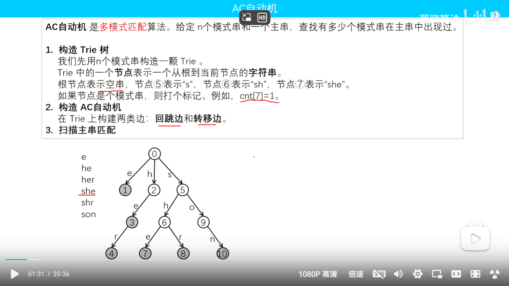

#### 2.算法流程

建ac自动机

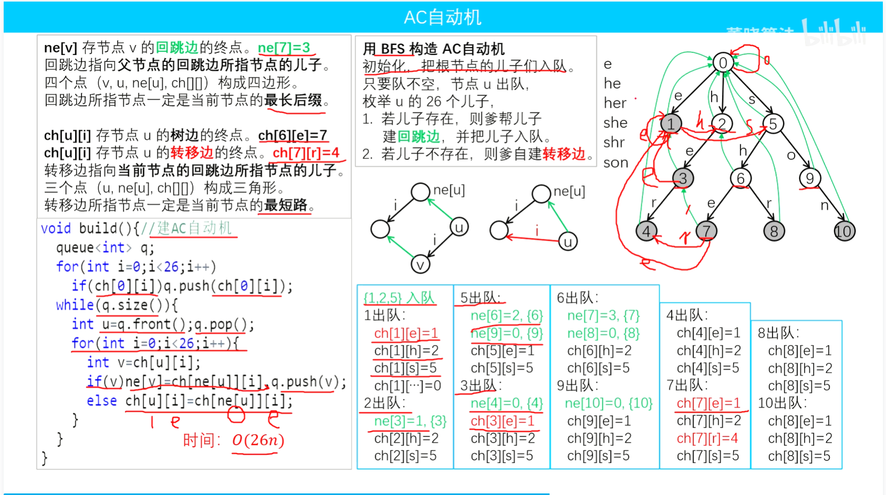

查询

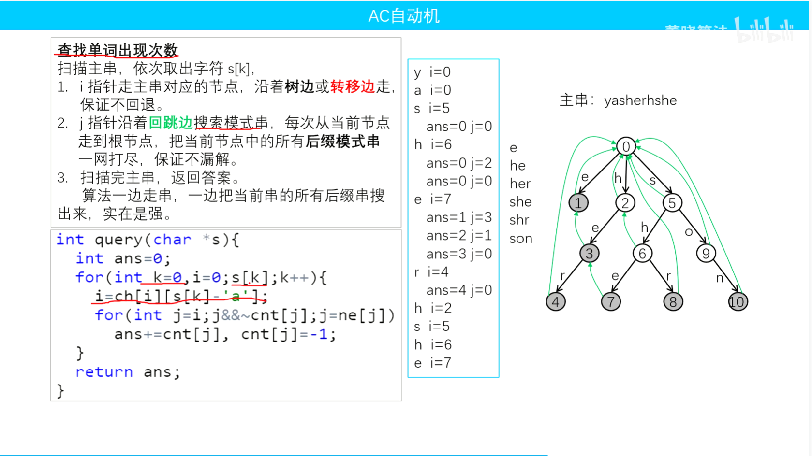

#### 3.代码

```c++
const int N = 2000005;

int ch[N][26];
int cnt[N];
int tot; 
//字典树 
void insert(string s){
	int p = 0;//0为根
	for(int i = 0; i < s.size(); i++){
		int ed = s[i] - 'a';
		if(!ch[p][ed]) ch[p][ed] = ++tot;
		p = ch[p][ed];
	}
	cnt[p]++;
}
int ne[N];
void bulid(){
	//建ac自动机 
	queue<int> q;
	for(int i = 0; i < 26; i++){
		if(ch[0][i]) q.push(ch[0][i]);
	} 
	while(!q.empty()){
		int u = q.front();q.pop();
		for(int i = 0; i < 26; i++){
			int v = ch[u][i];
			if(v) ne[v] = ch[ne[u]][i],q.push(v);
			else ch[u][i] = ch[ne[u]][i];
		}
	}
}
int query(string s){
	//查询 
	int ans = 0;
	for(int k = 0, p = 0; k < s.size();k++){
		p = ch[p][s[k] - 'a'];
		for(int j = p; j&&~cnt[j];j=ne[j]){
			ans+=cnt[j],cnt[j] = -1;
		}
	}
	return ans;
}
void solve(){
	int n;
	cin >> n;
	for(int i = 0; i < n; i++){
		string s2;
		cin >> s2;
		insert(s2);
	}
	string s;
	cin >> s;
	bulid();
	cout << query(s);

}
```

# 杂项

## 1.数位DP

```c++
typedef long long ll;
vector<int> a;
ll dp[20][state];   //不同问题数组的维度可能不同，看具体题目的条件
ll dfs(int pos,int state,bool lead,bool limit)  //这里的state可能有多个，看具体题目
{
    if(pos==n)      //n是数组的长度，从高位到地位是0-n-1
        return 1;   //返回值看具体情况
    if(!limint && !lead && dp[pos][state]!=-1)
        return dp[pos][state];
    int up = limit?a[pos]:9;    
    ll ans = 0;
    for(int i=0;i<=up;i++)
    {
        //这里还可能有一些if之类的判断语句
        ans += dfs(pos+1,state(状态转移),lead&&i==0,limit&&i==a[pos])
    }
    if(!limit && !lead)
        dp[pos][state] = ans;
    return ans;
}
ll solve(ll x)
{
    int pos = 0;
    while(x)
    {
        a[pos++] = x%10;
        x /= 10;
    }
    reverse(a.begin(),a.end());
    return dfs(0,state,true,true);
}
```

## 2.二维差分

```c++
int n,m,q;
int grid[N][N];
int pre[N][N];
int d[N][N];
void solve(){
	cin >> n >> m >> q;
	for(int i = 1; i <= n; i++){
		for(int j = 1; j <= m;j++){
			cin >> grid[i][j];
		}
	}
	//先差分
	for(int i =1;i<=n;++i){
		for(int j = 1; j<=m;++j){
			d[i][j] += grid[i][j];
			d[i + 1][j] -= grid[i][j];
			d[i][j+1]-= grid[i][j];
			d[i+1][j+1] += grid[i][j]; 
		}
	}
	//进行修改
	while(q--){
		int x1,y1,x2,y2,v;
		cin >> x1 >> y1 >> x2 >> y2 >> v;
		d[x1][y1] += v;
		d[x1][y2+1]-=v;
		d[x2+1][y1]-=v;
		d[x2+1][y2+1]+=v;
	}
	//还原
	for(int i = 1;i <= n;i++){
		for(int j = 1; j <= m; j++){
			grid[i][j] = grid[i - 1][j] + grid[i][j - 1] - grid[i - 1][j - 1] + d[i][j]; 
			cout << grid[i][j] << " ";
		}
		cout << endl;
	}
}
```

## 3.树链剖分求LCA

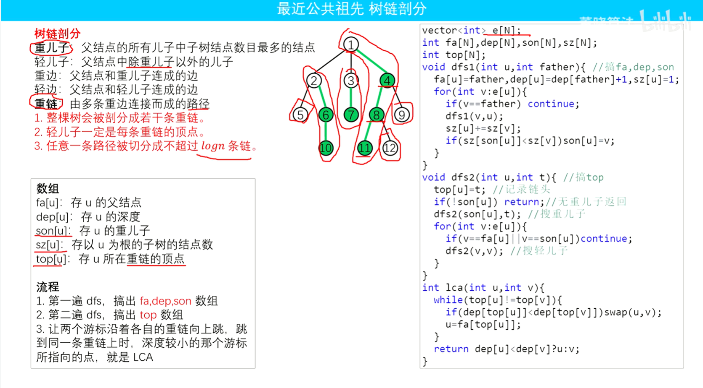

## 4.树上差分

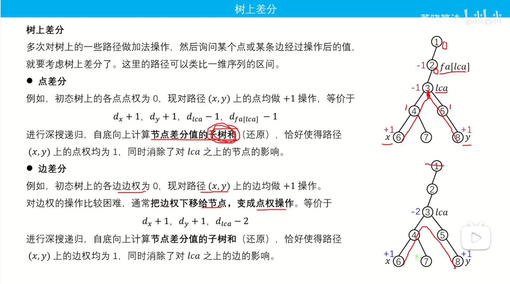

差分还原

```c++
void calcsum(int u,int fa){
  for(auto v:e[u]){
    if(v==fa) continue;
    calcsum(v,u);
    w[u]+=w[v];
  }
}
```

例题:

1.蓝桥杯14th省赛压轴

```c++
#include<bits/stdc++.h>
using namespace std;
const int N = 1e5+7;
#define pb push_back

vector<vector<int> > e(N);
long long n,m;
int sz[N],son[N],top[N],fa[N],dep[N];
void dfs1(int u,int fa1){
  fa[u] = fa1,sz[u] = 1,dep[u] = dep[fa1] + 1;
  for(auto v:e[u]){
    if(v==fa1) continue;
    dfs1(v,u);
    sz[u] += sz[v];
    if(sz[son[u]] < sz[v]) son[u] = v;
  }
}
void dfs2(int u,int t){
  top[u] = t;
  if(!son[u]) return;
  dfs2(son[u],t);
  for(auto v:e[u]){
    if(v==fa[u] || v == son[u]) continue;
    dfs2(v,v);
  }
}
int lca(int a,int b){
  while(top[a]!=top[b]){
    if(dep[top[a]] < dep[top[b]]) swap(a,b);
    a = fa[top[a]];
  }
  return dep[a] < dep[b] ? a : b;
}
long long w[N];
map<pair<int,int>,int> h;
void calcsum(int u,int fa){
  for(auto v:e[u]){
    if(v==fa) continue;
    calcsum(v,u);
    w[u]+=w[v];
  }
}

void solve(){
  cin >> n >> m;
  for(int i = 0; i < n - 1; i++){
    int u,v;
    cin >> u >> v;
    e[u].pb(v);
    e[v].pb(u);
    h[{u,v}] = i + 1;
    h[{v,u}] = i + 1;
  }
  dfs1(1,0);
  dfs2(1,1);
  for(int i = 0; i < m;i++){
    int a,b;
    cin >> a >> b;
    w[a]++;
    w[b]++;
    w[lca(a,b)]-=2;
  }
  int ans = -1;
  calcsum(1,0);
  for(int i = 1; i <= n;i++){
    if(w[i]==m){
      ans = max(ans,h[{i,fa[i]}]);
    }
  }
  cout <<ans <<endl;
}
int main(){
  ios::sync_with_stdio(0);cin.tie(0);cout.tie(0);
  solve();
}
```

## 5.logtrick

```c++
for(int i = 1; i <= n;i++){
    int x = nums[i];
    //这里可以进行一些操作比如说对单个值取值 还有
    for(int j = i - 1;j >= 1 && ((nums[j] 操作 nums[i]) != nums[j]);j--){
        nums[j] 操作= nums[i];
    }
    然后进行二分或者一些操作
}
```

## 6.枚举超集

```c++
//mask是集合最大值,g1是超集
int g1 = d;
while(g1 <= mask){
	cout << g1 << endl;
    g1 = (g1 + 1) | mask;
}
```

## 7.SOSDP

解决某个子集下的全部子集和

a[i]为单个子集和

这里的n是2进制长度,不是数组长度

```c++
//模版
for(int i=0;i<(1<<n);i++)
    f[i]=A[i];
for(int i=0;i<n;i++)
    for(int mask=0;mask<(1<<n);mask++)
        if(1 & (mask >> i)) f[mask]+=f[mask^(1<<i)];
```

例如求子集下的最大值,f[j]表示大集合,比如说 f[10001] 会包含 f[10000] 和 f[00000]

```c++
int n;
int a[N],f[(1 << 22)];
int s = (1 << 22) - 1;
void solve(){
	cin >> n;
	memset(f,-1,sizeof f);
	for(int i = 1;i <= n;i++) cin >> a[i],f[a[i]] = a[i];
	for(int i = 0;i < 22;i++){
		for(int j = 0;j <= s;j++){
			if(1 & (j >> i)) f[j] = max(f[j^(1 << i)],f[j]);
		}
	}
	for(int i = 1;i <= n;i++){
		cout << f[s & (~a[i])] << " ";
	}
}
```

下面是f[j]表示小集合 ,比如说 f[10001] 会包含 f[10011] 和 f[10111]等等

```c++
const int N = 1000005;
const int S = (1 << 20) - 1;
const int MOD = 1e9+7;
//让求有多少个非空子集 &起来 是0 方案数
//反着求 求所有方案数2^n - 1 - (所有合法状态)
//合法状态如何求呢
//求大子集下有1位都是1的个数-有2位都是1的个数+有3位都是1的个数
//这里更改sosdp f[i]代表小&的集合 比如说f[10001] 会包含 f[10011] 和 f[10111]等等
int n,a[N],f[S + 1];
int pw[S + 1],bt[S + 1];
void solve(){
	cin >> n;
	for(int i = 1;i <= n;i++){
		cin >> a[i];
		f[a[i]]++;
	}
	pw[0] = 1;
	for(int i = 1;i < N;i++) pw[i] = (pw[i - 1] * 2)%MOD;
	for(int i = 0;i < 20;i++){
		for(int j = 0;j <= S;j++){
			if(j & (1 << i)) f[j ^ (1 << i)] += f[j];
		}
	}
	int ans = pw[n] - 1; //总方案数
	int r = 0; //非法方案数
	for(int i = 1;i <= S;i++){
		bt[i] = (bt[i >> 1]) + (i&1);
		if(bt[i]&1){
			r = (r + pw[f[i]] - 1 + MOD)%MOD;
		}else{
			r = (r - pw[f[i]] + 1 + MOD)%MOD;
		}
	}
	cout << (MOD + ans-r)%MOD << endl;

}
```

求全部|起来是1只要 将上面&是0的代码抄了,然后将题目给的玩偶的状态取反就行了

```c++
const int N = 2000005;
const int MOD = 1e9+7;
int n,m;
int f[N],pw[N],bt[N*10];
void solve(){
	cin >> n >> m;
	int s = (1 << m) - 1;
	for(int i = 1;i <= n;i++){
		int p = 0;
		cin >> p;
		int mask = 0;
		for(int j = 0;j < p;j++){
			int t;
			cin >> t;
			mask |= 1 << (t - 1);
		}
		f[(~mask)&s]++;
	}
	pw[0] = 1;
	for(int i = 1;i < N;i++) pw[i] = (pw[i - 1] * 2)%MOD;
	for(int i = 0;i < 20;i++){
		for(int j = 0;j <= s;j++){
			if(j & (1 << i)) f[j ^ (1 << i)] += f[j];
		}
	}
	int ans = pw[n] - 1; //总方案数
	int r = 0; //非法方案数
	for(int i = 1;i <= s;i++){
		bt[i] = (bt[i >> 1]) + (i&1);
		if(bt[i]&1){
			r = (r + pw[f[i]] - 1 + MOD)%MOD;
		}else{
			r = (r - pw[f[i]] + 1 + MOD)%MOD;
		}
	}
	cout << (MOD + ans-r)%MOD << endl;
```

sosdp题+1

```c++
const int N = 1000005;
int f[N][2],a[N],n;
int s = (1 << 18) - 1;
//求对于每个k (1<= k <= 2^n-1)找出最大的a[i]+a[j]
//i,j要满足 (i | j) <= k,(i!=j)
//思路:i和j肯定是k以内某个数的子集 可能11011 分成 11010 和 11000 这样子的两个数
//所以我们对sosdp求某个子集下的最大值和次大值即可
void solve(){
	cin >> n;
	for(int i = 0;i < (1 << n);i++) cin >> a[i],f[i][0] = a[i];
	for(int i = 0;i < n;i++){
		for(int j = 0;j <= s;j++){
			if(j & (1 << i)){
				int b[4] = {f[j][0],f[j][1],f[j^(1<<i)][0],f[j^(1<<i)][1]};
				sort(b,b+4);
				f[j][0] = b[3];
				f[j][1] = b[2];
			}
		}
	}
	int mx = 0; //循环找最大的 <=k的
	for(int i = 1;i < (1 << n);i++){
		mx = max(mx,f[i][0] + f[i][1]);
		cout << mx << endl;
	}

}
```

## 8.根号分治

根号分治 的思想，将询问根据数据大小分成两个部分，分别用不同的方法来做。

那分界线是多少呢？

一般规定，是 $_\sqrt{n}$

# 本人常用代码模版

```c++
#include<bits/stdc++.h> 
using namespace std;
#define BUFF ios::sync_with_stdio(false); cin.tie(0); cout.tie(0);
#define int long long
typedef unsigned long long ULL;
#define endl "\n"
typedef long long ll;
il int read(){
	int x=0,f=1;char ch=getchar();
	while(ch<'0'||ch>'9'){if(ch=='-')f=-1;ch=getchar();}
	while(ch>='0'&&ch<='9')x=(x<<3)+(x<<1)+(ch^48),ch=getchar();
	return x*f;
}
int prm[N];
void getprm(){
	for(int i = 2;i<N;i++){
		if(prm[i]==0) prm[++prm[0]] = i;
		for(int j = 1;j <= prm[0] && prm[j]*i < N;j++){
			prm[i*prm[j]] = -1;
			if(i%prm[j]==0) break;
		}
	}
}
ll powerMod(ll x, ll n, ll mod){ //快速幂
    ll ans = 1;
    while (n > 0){
        if  (n & 1)
            ans = (ans * x) % mod;
        x = (x * x) % mod;
        n >>= 1;
    }
    return ans;
}
const int N = 100005;


void solve(){


}


signed main(){
	BUFF;
	int times = 1;
	//cin >> times;
	while(times--){
		solve();
	}
	return 0;
}

```

## 

# 常用函数

**next_permutation(a + 1, a + n + 1)**对一个数组进行全排列

# 对拍

```c++
#include <bits/stdc++.h>
using namespace std;
 
int main() {
	int t = 0;
    //ba为暴力,wt为测试的代码
	while (true) {
		cout << "test：" << t++ << endl;
		system("data1.exe > data1.in");
		system("ba1.exe < data1.in > ba1.out");
		system("wt1.exe < data1.in > wt1.out");
		if (system("fc ba1.out wt1.out > diff.log")) {
			cout << "WA\n";
			break;  
		}
		cout << "AC\n";
		
	}
}
```

```c++
int rng(int l, int r) { // [l, r]
    return rnd() % (r - l + 1) + l;
}
```

